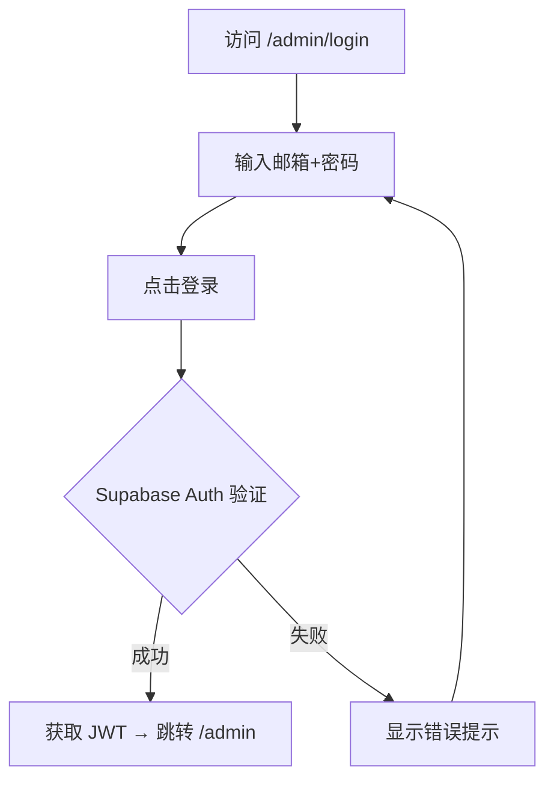
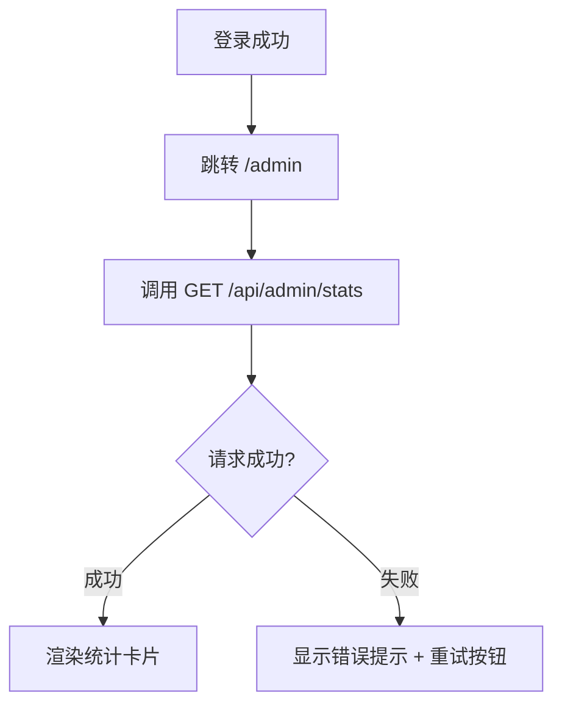
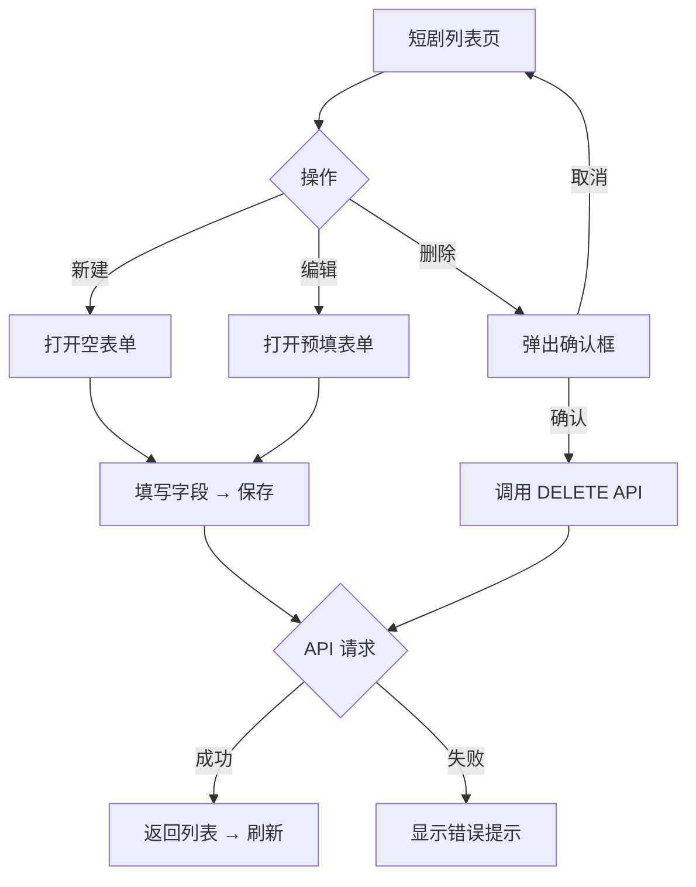
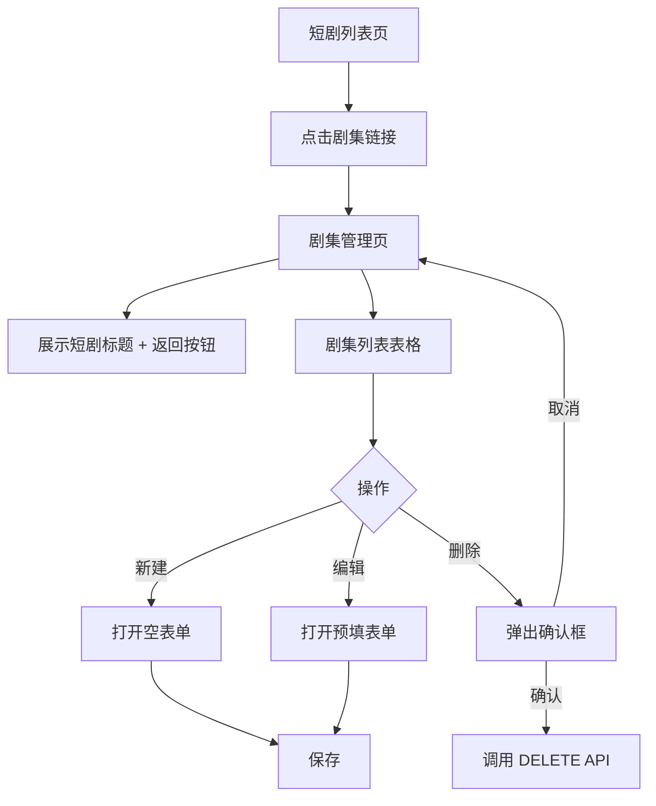
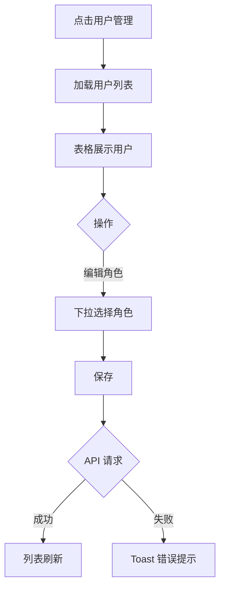

# 需求文档：管理平台（Admin Panel）

> 创建日期：2026-07-27
> 状态：草稿
> 作者：AI Agent + daniel

---

## 1. 需求背景

### 1.1 问题描述

- **现状**：项目所有资源数据（Drama、Episode、UserProfile）依赖 Backend mock repository，无任何可视化界面进行数据管理。新增/修改短剧、剧集、用户角色等操作只能通过直接修改 mock 代码或 API 脚本完成。
- **痛点**：没有管理平台意味着运营人员无法自主管理内容、管理员无法分配用户权限。随着数据量增长和协作需求增加，纯代码驱动的数据管理方式将成为瓶颈。

### 1.2 目标用户

| 用户角色 | 特征描述 | 核心需求 |
|---------|---------|---------|
| 超级管理员 | 拥有全部权限，管理所有资源和用户角色 | 管理短剧/剧集内容、管理用户、分配角色 |
| 内容编辑 | 负责内容上架和管理 | 管理短剧和剧集（CRUD），查看仪表盘 |
| 普通查看者 | 只读权限，查看数据但不可修改 | 浏览内容库，查看数据概览 |

### 1.3 预期目标

- **业务目标**：建立基于 Web 的内部管理平台，实现资源可视化管理和用户权限控制。管理员能够通过图形界面管理短剧、剧集内容，控制不同用户的操作权限。
- **成功指标**（可度量）：
  - 管理员可在 3 分钟内完成一条短剧的新建（含关联剧集）
  - 权限控制 100% 生效：viewer 无法执行任何写操作，editor 无法访问用户管理
  - 管理平台页面首屏加载 < 3 秒

### 1.4 范围定义

| 范围内 | 范围外（明确不做） | 原因 |
|--------|------------------|------|
| 管理员登录（Supabase Auth） | 移动端管理界面 | 管理平台仅 Web 端 |
| 仪表盘（资源概览统计） | 高级数据分析/图表 | 首版做简单统计卡片即可 |
| 短剧管理（CRUD） | 批量导入/导出 | 远期迭代 |
| 剧集管理（CRUD，按短剧组织） | 视频文件上传 | 已有 CDN URL 方案，首版手动填写 |
| 用户管理（列表查看、角色分配） | OAuth/SSO 登录 | 首版仅 Supabase 邮箱+密码 |
| 角色权限控制（admin/editor/viewer） | 细粒度字段级权限 | 首版做简化版 RBAC |
| — | 内容审核工作流 | 远期评估 |
| — | 操作审计日志 | 远期评估 |
| — | 移动端响应式适配 | 管理平台面向桌面端 |

> 明确「不做什么」有助于防止 scope creep，也帮助 review 阶段判断是否存在过度设计。

---

## 2. 术语表

| 术语 | 定义 | 来源 |
|------|------|------|
| Admin Panel | 基于 Web 的内部管理平台，用于管理短剧、剧集、用户和角色 | 本文档新定义 |
| RBAC | Role-Based Access Control，基于角色的访问控制 | 本文档新定义 |
| RLS | Row Level Security，Supabase 数据库行级安全策略 | wiki/decisions/2026-07-24-supabase-baas.md |
| JWT | JSON Web Token，Supabase Auth 颁发的身份令牌 | wiki/decisions/2026-07-24-supabase-baas.md |
| Drama | 短剧实体，核心数据模型 | wiki/features/data-models/index.md |
| Episode | 剧集实体，归属于 Drama | wiki/features/data-models/index.md |
| UserProfile | 用户信息实体 | wiki/features/data-models/index.md |
| Supabase | 项目选用的 BaaS 平台，提供 Auth + Database | wiki/decisions/2026-07-24-supabase-baas.md |

---

## 3. 涉及平台

| 平台 | 是否涉及 | 变更概要 |
|------|---------|---------|
| Backend | ✅ 涉及 | 新增管理 API（drama/episode CRUD、用户列表、角色管理）；Supabase RLS 策略；Auth 中间件升级为 JWT 验证 |
| Web | ✅ 涉及 | 全新管理平台 SPA（登录、布局、各资源管理页），作为 `/admin/*` 子路由 |
| iOS | ❌ 不涉及 | — |
| Android | ❌ 不涉及 | — |

---

## 4. 用户故事

| 编号 | 角色 | 需求 | 验收标准 | 涉及平台 | 优先级 |
|------|------|------|---------|---------|--------|
| US-01 | 所有管理员 | 登录管理平台 | 邮箱+密码登录（Supabase Auth）；登录失败显示错误提示；登录后进入仪表盘 | Backend/Web | P0 |
| US-02 | 所有管理员 | 查看仪表盘概览 | 首页展示总短剧数、总剧集数、用户数等统计卡片 | Backend/Web | P1 |
| US-03 | 超级管理员/编辑 | 管理短剧 | 短剧列表（表格展示）、新建短剧（表单）、编辑短剧、删除短剧（二次确认） | Backend/Web | P0 |
| US-04 | 超级管理员/编辑 | 管理剧集 | 在短剧下管理剧集列表（表格）、新建/编辑剧集（含视频URL）、删除剧集 | Backend/Web | P0 |
| US-05 | 超级管理员 | 管理用户与角色 | 查看用户列表、修改用户角色（admin/editor/viewer） | Backend/Web | P0 |
| US-06 | 所有管理员 | 角色权限生效 | editor 不可访问用户管理页；viewer 不可进行任何写操作 | Backend/Web | P0 |
| US-07 | 查看者 | 浏览内容库 | 查看短剧和剧集列表（只读），不可见编辑/删除按钮 | Web | P1 |

---

## 5. 功能详述

### 5.1 US-01：管理员登录

#### 流程描述

1. 访问 `/admin/login` → 展示登录页（居中登录卡片，邮箱 + 密码 + 登录按钮）
2. 输入邮箱和密码 → 点击「登录」
3. Backend 调用 Supabase Auth `signInWithPassword` → 成功返回 JWT
4. 前端保存 session → 跳转到 `/admin` 仪表盘
5. 登录失败 → 表单内显示错误信息（「邮箱或密码错误」）



#### 前置条件

- [ ] Supabase 项目已配置并运行
- [ ] 管理员账号已在 Supabase Dashboard 手动创建

#### 后置条件

- 用户已登录，session 存储在客户端
- 后续 API 请求携带 JWT Bearer token
- 用户角色信息可从 JWT `app_metadata.role` 中获取

#### 涉及的 UI/交互（如有）

| 页面 / 区域 | 交互描述 | 涉及端 |
|------------|---------|--------|
| `/admin/login` | 居中白色卡片 + 灰色背景，邮箱输入框、密码输入框、登录按钮；登录失败时表单内显示错误信息 | Web |
| 登录状态持久化 | 刷新页面后检查 session，已登录则直接进入仪表盘；未登录则重定向到 `/admin/login` | Web |

#### 边界与异常

**错误处理：**

| 操作步骤 | 错误类型 | 触发条件 | 系统行为 | 用户感知 |
|---------|---------|---------|---------|---------|
| 点击登录 | 认证失败 | 邮箱或密码错误 | Supabase 返回错误 | 表单内显示「邮箱或密码错误」 |
| 点击登录 | 网络异常 | 超时 / 断网 | 请求失败 | 表单内显示「网络错误，请重试」 |
| 点击登录 | 服务端错误 | Supabase Auth 服务不可用 | 500 错误 | 表单内显示「服务异常，请稍后重试」 |
| 访问管理页 | 未登录 | 无有效 session | 中间件拦截 | 重定向到 `/admin/login` |
| 访问管理页 | Token 过期 | JWT 已过期 | Supabase Auth 验证失败 | 重定向到 `/admin/login` |

**边界场景：**

| 场景 | 触发条件 | 预期行为 |
|------|---------|---------|
| 空输入 | 邮箱或密码为空 | 前端校验，按钮 disabled 或提示「请输入邮箱/密码」 |
| 重复提交 | 用户快速连续点击登录 | 按钮 disabled + loading 状态，防止重复请求 |
| 已登录访问登录页 | 已有有效 session 时访问 `/admin/login` | 重定向到 `/admin` |
| 无注册入口 | 登录页无注册按钮 | 管理员账号由超管在 Supabase Dashboard 创建 |

---

### 5.2 US-02：仪表盘概览

#### 流程描述

1. 登录后进入 `/admin` → 仪表盘页面
2. 页面加载时调用统计 API 获取数据
3. 顶部展示统计卡片：总短剧数、总剧集数、用户数



#### 前置条件

- [ ] 用户已登录
- [ ] 用户具有任意管理员角色（admin/editor/viewer）

#### 后置条件

- 仪表盘数据已加载展示

#### 涉及的 UI/交互（如有）

| 页面 / 区域 | 交互描述 | 涉及端 |
|------------|---------|--------|
| `/admin` 仪表盘 | 顶部 3 张统计卡片横排展示：总短剧数（total_dramas）、总剧集数（total_episodes）、用户数（total_users） | Web |

#### 边界与异常

**错误处理：**

| 操作步骤 | 错误类型 | 触发条件 | 系统行为 | 用户感知 |
|---------|---------|---------|---------|---------|
| 加载统计 | 网络异常 | 超时 / 断网 | 请求失败 | 卡片区域显示错误提示 + 重试按钮 |
| 加载统计 | 服务端错误 | 500 错误 | 请求失败 | 卡片区域显示错误提示 + 重试按钮 |
| 加载统计 | 权限不足 | 未登录 | 返回 401 | 重定向到登录页 |

**边界场景：**

| 场景 | 触发条件 | 预期行为 |
|------|---------|---------|
| 数据为空 | 数据库无任何数据 | 统计卡片显示 0 |
| 加载中 | 首次加载 | 卡片显示骨架屏/loading 状态 |

---

### 5.3 US-03：短剧管理

#### 流程描述

1. 点击左侧导航「短剧管理」→ 进入短剧列表页
2. 列表页展示表格：封面缩略图、标题、分类、集数、评分、操作（编辑/删除）
3. 点击「新建短剧」→ 弹出/跳转表单页：标题、描述、封面URL、分类、标签、评分
4. 点击某行「编辑」→ 表单预填现有数据 → 修改 → 保存
5. 点击「删除」→ 弹出确认对话框 → 确认后删除



#### 前置条件

- [ ] 用户已登录
- [ ] 用户角色为 admin 或 editor（viewer 不可见新建/编辑/删除按钮）

#### 后置条件

- 新建/编辑：数据已持久化，列表刷新展示最新数据
- 删除：短剧及其关联剧集已级联删除

#### 涉及的 UI/交互（如有）

| 页面 / 区域 | 交互描述 | 涉及端 |
|------------|---------|--------|
| 短剧列表页 | 表格展示：封面缩略图(40x40)、标题、分类、集数、评分、操作列（编辑/删除/剧集链接）；支持分页（默认每页 20 条，复用现有 `PaginationSchema`）；底部分页器 | Web |
| 短剧表单 | 标题(必填)、描述、封面URL、分类、标签(逗号分隔)、评分(0-10)；新建/编辑复用同一表单组件。表单字段对齐 Zod `DramaSchema`，DB 中 `status`、`play_count` 等额外字段由后端自动处理 | Web |
| 删除确认弹窗 | 「删除短剧将同时删除所有关联剧集，不可恢复」，确认/取消按钮 | Web |

#### 边界与异常

**错误处理：**

| 操作步骤 | 错误类型 | 触发条件 | 系统行为 | 用户感知 |
|---------|---------|---------|---------|---------|
| 加载列表 | 网络异常 | 超时 / 断网 | 请求失败 | 表格区域显示错误提示 + 重试按钮 |
| 加载列表 | 服务端错误 | 500 | 请求失败 | 表格区域显示错误提示 + 重试按钮 |
| 提交表单 | 数据校验失败 | 必填为空 / 格式错误 | 后端返回 400 | 表单内联提示具体错误 |
| 提交表单 | 网络异常 | 超时 | 请求失败 | Toast 提示「保存失败，请重试」 |
| 提交表单 | 权限不足 | viewer 角色 | 后端返回 403 | Toast 提示「无权操作」 |
| 删除 | 并发冲突 | 短剧已被他人删除 | 后端返回 404 | Toast 提示「该短剧不存在或已被删除」 |
| 删除 | 网络异常 | 超时 | 请求失败 | Toast 提示「删除失败，请重试」 |

**边界场景：**

| 场景 | 触发条件 | 预期行为 |
|------|---------|---------|
| 空列表 | 数据库无短剧 | 表格区域显示「暂无数据」+ 新建按钮 |
| 重复提交 | 快速连续点击保存 | 按钮 disabled + loading 状态 |
| 超长文本 | 标题/描述超过字段长度限制 | 前端校验 + 后端校验，提示具体限制 |
| 特殊字符 | 标签包含特殊字符 | 正常处理，前端做好输入过滤 |
| 恶意输入 | 标题/描述包含 HTML/script 标签 | React 默认转义，后端存储原始字符串 |
| 删除含关联剧集 | 短剧下有剧集 | 确认弹窗明确提示级联删除，确认后一并删除 |
| 封面URL无效 | 输入的URL不是有效图片 | 前端不校验图片有效性，列表中使用默认占位图 |
| 大量数据 | 短剧数量 > 1000 条 | 分页加载（默认每页 20 条），不影响性能 |

---

### 5.4 US-04：剧集管理

#### 流程描述

1. 在短剧列表页，点击某短剧的「剧集」链接 → 进入该短剧的剧集管理页
2. 页面顶部显示短剧标题 + 返回按钮
3. 剧集列表表格：序号、标题、时长、视频URL、操作
4. 新建/编辑/删除与短剧管理类似



#### 前置条件

- [ ] 用户已登录
- [ ] 用户角色为 admin 或 editor
- [ ] 父短剧存在

#### 后置条件

- 剧集已持久化，列表刷新

#### 涉及的 UI/交互（如有）

| 页面 / 区域 | 交互描述 | 涉及端 |
|------------|---------|--------|
| 剧集管理页 | 顶部：短剧标题 + 返回短剧列表按钮；表格：序号、标题、时长、视频URL、操作（编辑/删除） | Web |
| 剧集表单 | 标题(必填)、剧集号(必填)、时长(秒)、视频URL、缩略图URL、描述 | Web |

#### 边界与异常

**错误处理：**

| 操作步骤 | 错误类型 | 触发条件 | 系统行为 | 用户感知 |
|---------|---------|---------|---------|---------|
| 加载列表 | 网络异常 | 超时 / 断网 | 请求失败 | 表格区域显示错误提示 + 重试按钮 |
| 提交表单 | 数据校验失败 | 必填为空 | 后端返回 400 | 表单内联提示 |
| 提交表单 | 父短剧不存在 | drama_id 无效 | 后端返回 404 | Toast 提示「短剧不存在」 |
| 删除 | 网络异常 | 超时 | 请求失败 | Toast 提示「删除失败，请重试」 |

**边界场景：**

| 场景 | 触发条件 | 预期行为 |
|------|---------|---------|
| 空列表 | 短剧下无剧集 | 表格区域显示「暂无剧集」+ 新建按钮 |
| 父短剧被删除 | 在剧集页时短剧被他人删除 | 返回短剧列表时刷新，不显示已删除的短剧 |
| 剧集号重复 | 同一短剧下相同 episode_number | 后端校验唯一性，返回 409 Conflict |

---

### 5.5 US-05：用户与角色管理

#### 流程描述

1. 以 admin 角色登录 → 左侧导航显示「用户管理」入口
2. 点击进入用户列表页 → 表格展示用户：邮箱、显示名、角色、创建时间
3. 点击某行「编辑角色」→ 下拉选择新角色（admin/editor/viewer）→ 保存



#### 前置条件

- [ ] 用户已登录
- [ ] 用户角色为 admin

#### 后置条件

- 目标用户的角色已更新，下次登录时生效

#### 涉及的 UI/交互（如有）

| 页面 / 区域 | 交互描述 | 涉及端 |
|------------|---------|--------|
| 用户列表页 | 表格：邮箱、显示名、角色(badge)、创建时间、操作（编辑角色下拉）；支持分页（默认每页 20 条） | Web |
| 角色编辑 | 行内下拉选择 admin/editor/viewer，选择后自动保存（或点击保存按钮） | Web |

#### 边界与异常

**错误处理：**

| 操作步骤 | 错误类型 | 触发条件 | 系统行为 | 用户感知 |
|---------|---------|---------|---------|---------|
| 加载列表 | 权限不足 | editor/viewer 访问 | 后端返回 403 | 页面显示「无权访问」 |
| 修改角色 | 目标用户不存在 | 用户已被删除 | 后端返回 404 | Toast 提示「用户不存在」 |
| 修改角色 | 不可修改自己 | admin 尝试修改自己的角色 | 后端返回 400 | Toast 提示「不可修改自己的角色」 |
| 修改角色 | 网络异常 | 超时 | 请求失败 | Toast 提示「保存失败，请重试」 |

**边界场景：**

| 场景 | 触发条件 | 预期行为 |
|------|---------|---------|
| 空列表 | 无用户 | 表格显示「暂无用户」 |
| 修改自己角色 | admin 修改自己的角色 | 禁止操作，提示「不可修改自己的角色」 |
| 并发修改 | 两个 admin 同时修改同一用户角色 | 后提交的覆盖先提交的（last-write-wins） |

---

### 5.6 US-06：角色权限生效

#### 流程描述

角色权限在前后端双重实施：

- **Backend**：Supabase RLS 策略 + API 中间件校验 JWT 中的 `role` claim。`role` 存储于 `profiles` 表的 `role` 列（enum: `admin`/`editor`/`viewer`，默认 `viewer`），通过 Supabase Auth Hook（Postgres function）在用户登录时将 `profiles.role` 同步到 `auth.users.raw_app_meta_data` 的 `role` 字段，使 JWT 的 `app_metadata.role` 包含当前角色。Auth Hook 实现需新增 database migration 和 trigger。
- **Web**：根据当前用户角色条件渲染导航项和操作按钮

#### 角色定义

| 角色 | 查看内容 | 管理内容 | 管理用户 |
|------|---------|---------|---------|
| admin | ✅ | ✅ | ✅ |
| editor | ✅ | ✅ | ❌ |
| viewer | ✅ | ❌ | ❌ |

#### 权限矩阵

| 操作 | admin | editor | viewer |
|------|-------|--------|--------|
| 查看仪表盘 | ✅ | ✅ | ✅ |
| 查看短剧列表 | ✅ | ✅ | ✅ |
| 新建/编辑/删除短剧 | ✅ | ✅ | ❌ |
| 查看剧集列表 | ✅ | ✅ | ✅ |
| 新建/编辑/删除剧集 | ✅ | ✅ | ❌ |
| 查看用户列表 | ✅ | ❌ | ❌ |
| 修改用户角色 | ✅ | ❌ | ❌ |

#### 前置条件

- [ ] 用户已登录
- [ ] JWT 中包含 `app_metadata.role` claim

#### 边界与异常

**错误处理：**

| 操作步骤 | 错误类型 | 触发条件 | 系统行为 | 用户感知 |
|---------|---------|---------|---------|---------|
| 访问用户管理 | 权限不足 | editor 角色 | 导航不显示入口；直接访问 URL 时 API 返回 403 | 页面显示「无权访问」 |
| 写操作 | 权限不足 | viewer 角色 | 后端返回 403 | 操作按钮不可见；直接调用 API 返回 403 |
| 未登录访问 | 未认证 | 无 session | 中间件拦截 | 重定向到登录页 |

**边界场景：**

| 场景 | 触发条件 | 预期行为 |
|------|---------|---------|
| viewer 直接访问 URL | viewer 手动输入 `/admin/users` | API 返回 403，页面显示「无权访问」 |
| editor 直接访问 URL | editor 手动输入 `/admin/users` | API 返回 403，页面显示「无权访问」 |
| 角色变更后 | admin 将某用户角色从 editor 改为 viewer | 该用户下次请求时 JWT 中的 role 已更新，权限立即生效 |
| JWT role 缺失 | Auth Hook 未触发，JWT 无 `app_metadata.role` | 后端视为 viewer（最低权限），前端按 viewer 渲染 |
| JWT role 未知值 | JWT 中 role 不在 admin/editor/viewer 枚举中 | 后端视为 viewer + 记录服务端日志告警 |
| JWT 签名无效 | JWT 被篡改或伪造 | Supabase Auth 中间件自动拒绝，返回 401 |
| role 不一致 | `profiles.role` 与 JWT `app_metadata.role` 不一致 | 以 JWT 为准（登录时同步），下次登录时刷新 |

---

### 5.7 US-07：查看者浏览内容库

#### 流程描述

1. 以 viewer 角色登录 → 进入仪表盘
2. 左侧导航仅显示「仪表盘」「短剧管理」（无「用户管理」入口）
3. 点击「短剧管理」→ 进入短剧列表页
4. 列表表格正常展示：封面缩略图、标题、分类、集数、评分
5. 操作列仅显示「剧集」链接 → 可查看该短剧下剧集列表
6. 剧集列表页同样只读，无「新建」「编辑」「删除」按钮
7. 顶部无「新建短剧」按钮

#### 前置条件

- [ ] 用户以 viewer 角色登录

#### 后置条件

- 无数据变更

#### 涉及的 UI/交互（如有）

| 页面 / 区域 | 交互描述 | 涉及端 |
|------------|---------|--------|
| 左侧导航 | 仅显示「仪表盘」「短剧管理」，无「用户管理」 | Web |
| 短剧列表页 | 无「新建短剧」按钮，操作列仅「剧集」链接 | Web |
| 剧集列表页 | 无「新建」「编辑」「删除」按钮，仅可查看列表 | Web |

#### 边界与异常

**错误处理：**

| 操作步骤 | 错误类型 | 触发条件 | 系统行为 | 用户感知 |
|---------|---------|---------|---------|---------|
| 加载列表 | 网络异常 | 超时 / 断网 | 请求失败 | 表格区域显示错误提示 + 重试按钮 |
| 加载列表 | 服务端错误 | 500 | 请求失败 | 表格区域显示错误提示 + 重试按钮 |
| 加载列表 | Token 过期 | JWT 已过期 | 后端返回 401 | 重定向到登录页 |
| 直接调用写 API | 权限不足 | viewer 角色 | 后端返回 403 | 返回 403 JSON |

**边界场景：**

| 场景 | 触发条件 | 预期行为 |
|------|---------|---------|
| viewer 直接访问 `/admin/users` | 手动输入 URL | API 返回 403 → 页面显示「无权访问」提示 |
| viewer 直接调用写 API | 通过 curl/Postman 调用 POST/PUT/DELETE | 后端返回 403 |
| 空列表 | 无短剧数据 | 显示「暂无数据」（无新建按钮） |

---

### 5.8 全局边界场景

| 场景 | 预期行为 |
|------|---------|
| 未登录访问管理页 | 重定向到 `/admin/login` |
| editor 访问用户管理页 | 导航不显示该入口；直接访问 URL 时 API 返回 403 |
| viewer 点击编辑/删除 | 操作按钮不可见 |
| 删除短剧（含关联剧集） | 确认弹窗：「删除短剧将同时删除所有关联剧集，不可恢复」，确认后级联删除 |
| 网络异常 | 表格区域显示错误提示 + 重试按钮 |
| 空列表 | 表格区域显示「暂无数据」+ 新建按钮（viewer 除外） |
| Token 过期 | 下次 API 请求时返回 401 → 前端重定向到登录页 |

---

### 5.9 API 端点总览

管理平台所有 API 统一使用 `/api/admin/*` 前缀，需携带 Bearer JWT 进行认证和权限校验。

| 方法 | 路径 | 功能 | 所需角色 | 请求/响应 Schema |
|------|------|------|---------|-----------------|
| POST | `/api/admin/auth/login` | 管理员登录 | 无（匿名） | `{ email, password }` → `{ token, user }` |
| POST | `/api/admin/auth/logout` | 管理员登出 | 任意角色 | — |
| GET | `/api/admin/stats` | 获取仪表盘统计 | 任意角色 | — → `AdminStatsResponse` |
| GET | `/api/admin/dramas` | 获取短剧列表（分页） | 任意角色 | `?page=1&pageSize=20` → `DramaListResponse` |
| POST | `/api/admin/dramas` | 新建短剧 | admin / editor | `Drama` 字段 → `Drama` |
| GET | `/api/admin/dramas/:id` | 获取短剧详情 | 任意角色 | — → `Drama` |
| PUT | `/api/admin/dramas/:id` | 编辑短剧 | admin / editor | `Drama` 字段 → `Drama` |
| DELETE | `/api/admin/dramas/:id` | 删除短剧（级联删除剧集） | admin / editor | — → `{ deleted: true }` |
| GET | `/api/admin/dramas/:id/episodes` | 获取某短剧的剧集列表 | 任意角色 | — → `EpisodeListResponse` |
| POST | `/api/admin/dramas/:id/episodes` | 新建剧集 | admin / editor | `Episode` 字段 → `Episode` |
| PUT | `/api/admin/episodes/:id` | 编辑剧集 | admin / editor | `Episode` 字段 → `Episode` |
| DELETE | `/api/admin/episodes/:id` | 删除剧集 | admin / editor | — → `{ deleted: true }` |
| GET | `/api/admin/users` | 获取用户列表（分页） | admin | `?page=1&pageSize=20` → `UserListResponse` |
| PUT | `/api/admin/users/:id/role` | 修改用户角色 | admin | `{ role: "admin"|"editor"|"viewer" }` → `UserProfile` |

> 管理 API 与现有用户端 API（`/api/dramas` 等）使用不同的路由前缀。用户端 API 保持现有行为不变，管理 API 通过 `/api/admin/*` 前缀隔离。

---

## 6. 数据概览

### 6.1 现有实体（复用）

| 数据实体 | 说明 | 关键字段 | 来源 |
|---------|------|---------|------|
| Drama | 短剧 | id, title, description, cover_url, category, episode_count, tags, rating | 已有，wiki/features/data-models |
| Episode | 剧集 | id, drama_id, title, episode_number, duration, video_url, thumbnail_url, description | 已有，wiki/features/data-models |
| UserProfile | 用户信息 | id, email, display_name, avatar_url | 已有，需扩展 role 字段 |

### 6.2 新增/扩展实体

| 数据实体 | 说明 | 关键字段 | 来源 |
|---------|------|---------|------|
| Profile（扩展） | 用户信息扩展 role | role: enum('admin', 'editor', 'viewer') | 新增字段 |
| AdminStats | 仪表盘统计 | `total_dramas: number`, `total_episodes: number`, `total_users: number` | 新增响应（Zod: `z.object({ total_dramas: z.number().int().min(0), total_episodes: z.number().int().min(0), total_users: z.number().int().min(0) })`） |

### 6.3 数据关系

```
Profile ──1:1──▶ Supabase Auth User (auth.users)
Drama ──1:N──▶ Episode
```

### 6.4 字段名约定

Zod Schema（`backend/src/lib/schemas.ts`）中 `DramaSchema` 使用 `episode_count` 字段。Supabase 数据库表 `dramas` 创建时应使用同名 `episode_count` 列，保持与 Zod Schema 一致。

---

## 7. 现有功能影响

| 现有功能 | 影响类型 | 说明 | 是否需要迁移 |
|---------|---------|------|------------|
| Backend mock repository | 保留 | 管理 API 新增 Supabase repository 实现；现有用户端 API（`/api/dramas` 等）保持 mock repository 不变，后续单独 PRD 处理迁移；mock repository 保留作为测试/开发 fallback | 否（新增，不替换） |
| `web/src/app/` 路由 | 新增 | 新增 `/admin/*` 路由（独立于现有路由，使用独立 layout，不含主站导航/页脚） | 否 |
| Backend auth middleware | 升级 | 从骨架 token 验证升级为 Supabase JWT 验证（`backend/src/middleware/auth.ts`） | 否（向后兼容，现有用户端 API 仍使用骨架 auth） |
| UserProfile schema | 扩展 | 新增 `role` 字段（enum: `admin`/`editor`/`viewer`，默认 `viewer`） | 是（新增 migration） |
| Supabase migration | 新增 | 新增 `profiles` 表 `role` 列 + RLS 策略 + Auth Hook trigger | 是（新增 migration） |
| DB `dramas` 表 | 修正 | 现有 migration 中 `total_episodes` 列重命名为 `episode_count`，对齐 Zod Schema | 是（新增 migration） |

### 兼容性说明

- 现有 API（`/api/dramas`、`/api/dramas/search` 等）不受影响，管理 API 使用独立路由前缀 `/api/admin/*`
- 管理平台路由 `/admin/*` 独立于现有 Web 路由，不冲突。管理平台使用独立 layout（不含主站导航/页脚），复用主站基础组件和样式方案
- 管理平台短剧表单字段对齐 Zod `DramaSchema`（title, description, cover_url, category, episode_count, tags, rating）。DB 中 `status`、`play_count`、`content_type` 等额外字段不在首版表单中，由后端自动处理默认值
- 新增 Supabase repository 实现放在 `backend/src/repositories/supabase/`，与现有 mock repository 并存

### 迁移策略

1. 新增 migration：`profiles` 表添加 `role` 列（默认 `viewer`）
2. 新增 migration：`dramas` 表 `total_episodes` 重命名为 `episode_count`
3. 新增 migration：创建 Auth Hook Postgres function + trigger
4. 新增 migration：启用 RLS 策略（dramas、episodes、profiles 表）
5. 管理 API 直接使用 Supabase repository；用户端 API 保持 mock repository 不变

---

## 8. 非功能性需求

### 8.1 性能

| 指标 | 目标值 | 测量方式 |
|------|--------|---------|
| 管理平台页面首屏加载 | < 3 秒 | Lighthouse / Chrome DevTools |
| 列表 API 响应时间（P95） | < 500 ms | 服务端日志 / APM |
| 表单提交响应时间 | < 1 秒 | 服务端日志 |
| 并发管理用户数 | ≥ 10 | 压测 |

### 8.2 安全

| 关注点 | 要求 |
|--------|------|
| 认证与授权 | 所有管理 API 必须验证 JWT；按角色控制操作权限 |
| 数据校验 | 客户端 + 服务端双重校验（Zod schema）；字符串字段添加合理长度限制 |
| 敏感数据 | 密码由 Supabase Auth 托管，不自行存储；JWT 通过 HTTPS 传输 |
| 防滥用 | 管理 API 不需要对外限流（内部工具）；登录接口需防暴力破解（Supabase Auth 内置） |
| RLS | Supabase 数据库启用 RLS，按角色限制行级操作 |
| XSS 防护 | 前端渲染用户输入内容（标题、描述等）使用 React 默认转义，不使用 `dangerouslySetInnerHTML`；后端 Zod 校验对字符串字段添加长度限制；恶意输入（HTML/script 标签）后端存储原始字符串，前端渲染时自动转义 |
| SQL 注入防护 | Supabase 参数化查询（`from().select().eq()`）天然防 SQL 注入 |

### 8.3 兼容性

| 维度 | 要求 |
|------|------|
| 设备兼容 | 桌面端浏览器：Chrome 最新版、Firefox 最新版、Safari 最新版 |
| 数据兼容 | 新增 `role` 字段默认值为 `viewer`，不影响现有数据 |
| 向后兼容 | 现有 API 路径不变，admin API 使用独立路由前缀 |

### 8.4 日志与监控

| 关注点 | 要求 |
|--------|------|
| 服务错误日志 | API 异常需记录服务端日志（含错误类型、时间戳、请求路径），不记录用户敏感数据（密码、Token 等） |
| 操作审计日志 | 远期评估（1.4 节范围外），首版不实现 |
| 角色异常告警 | JWT 中 role 值为未知值或缺失时，记录服务端日志告警 |

| 维度 | 要求 |
|------|------|
| 设备兼容 | 桌面端浏览器：Chrome 最新版、Firefox 最新版、Safari 最新版 |
| 数据兼容 | 新增 `role` 字段默认值为 `viewer`，不影响现有数据 |
| 向后兼容 | 现有 API 路径不变，admin API 使用独立路由前缀 |

---

## 9. 依赖

| 依赖项 | 类型 | 说明 | 状态 | 阻塞 |
|--------|------|------|------|------|
| Supabase | 外部服务 | Auth + 数据库托管 | 📅 需确认 Supabase 项目配置 | 是 |
| `@supabase/supabase-js` / `@supabase/ssr` | 外部依赖 | Web 端 Supabase Auth 客户端 SDK。`@supabase/ssr` 是 Supabase 官方 Next.js 集成库，用于服务端 session 管理和 middleware 认证，与 `@supabase/supabase-js` 同属 Supabase 生态。`@supabase/supabase-js` 已在 backend 中使用 | 📅 需征得用户同意后安装到 `web/` | 是 |
| 现有数据模型（Drama/Episode/UserProfile） | 内部能力 | 管理 API 基于现有 Schema | ✅ 已就绪 | 否 |
| `web/` 工程 | 内部能力 | 管理平台在现有 Next.js 项目中新增路由 | ✅ 已就绪 | 否 |
| Backend Supabase infrastructure | 内部能力 | `backend/src/infrastructure/supabase.ts` 已提供双客户端 | ✅ 已就绪 | 否 |
| `backend/src/lib/schemas.ts` | 内部能力 | Zod Schema 权威来源 | ✅ 已就绪 | 否 |

---

## 10. 待澄清问题

| 编号 | 问题 | 可能的答案 | 阻塞 |
|------|------|-----------|------|
| Q-01 | Supabase 项目是否已创建？连接信息是否就绪？ | 需确认 SUPABASE_URL / SUPABASE_ANON_KEY / SUPABASE_SERVICE_ROLE_KEY | 是 |
| Q-02 | 管理员账号创建方式：Supabase Dashboard 手动创建，还是通过管理平台内的用户管理页创建？ | 首版建议 Dashboard 手动创建 | 否 |
| Q-03 | 管理平台是否需要独立部署，还是作为现有 Web 应用的子路由（`/admin`）？ | 建议子路由方式 | 否 |

---

## 11. 参考资料

### 已查阅的 wiki 文档

| 文档 | 相关章节 | 关键信息 |
|------|---------|---------|
| `wiki/features/data-models/index.md` | 全文 | Drama、Episode、UserProfile Schema 定义 |
| `wiki/architecture/overview.md` | 全文 | 技术栈总览（Next.js 16 + React 19 + TypeScript），各端承载结构 |
| `wiki/decisions/2026-07-24-supabase-baas.md` | 全文 | Supabase 选型决策，双客户端实例，migration 方式 |
| `wiki/features/index.md` | 全文 | 现有功能域列表 |

### 已查阅的代码文件

| 文件 | 关键内容 |
|------|---------|
| `backend/src/lib/schemas.ts` | DramaSchema (episode_count), EpisodeSchema, UserProfileSchema 定义 |
| `backend/src/infrastructure/supabase.ts` | Supabase 双客户端（anon + service_role） |
| `backend/src/middleware/auth.ts` | 当前骨架 token 验证（需升级为 JWT 验证） |
| `web/src/app/` | 现有 Web 路由结构，`/admin` 路由不存在 |

---

## 12. 变更历史

| 日期 | 变更内容 | 变更原因 |
|------|---------|---------|
| 2026-07-27 | 初始版本 | 基于 PRD 撰写 spec |