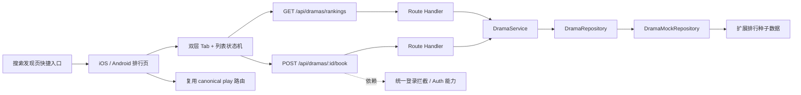

# 技术方案（共享部分）：PRD-05 排行体系

> 创建日期：2026-07-27
> 对应需求：spec.md

## 整体架构



### 架构说明

- 本期继续沿用现有四层架构：**Route → Service → Repository → Mock Data / Infrastructure**。
- 排行页不新增新的顶级导航语义，继续复用当前搜索发现页入口与现有 `ranking` 路由落点。
- 排行列表数据由 Backend 新增接口提供；客户端只维护筛选、分页、请求生命周期与展示逻辑，不在端侧自行计算榜单排序。
- 点击排行项继续复用现有 `play` canonical 路由；Android 保持 `player` 历史兼容，不因本 PRD 改名。
- 预约能力依赖登录态，但**排行浏览链路不依赖登录**；因此设计上将“浏览榜单”和“预约提交”拆成两个可独立交付的子路径。

## API 设计

### 涉及变更

| 类型 | 数量 | 说明 |
|------|------|------|
| 新增接口 | 2 | 排行列表查询、预约提交 |
| 修改接口 | 0 | 不修改现有 `/api/dramas`、`/api/dramas/search`、`/api/dramas/hot-search` |
| 废弃接口 | 0 | 无 |

> 兼容性说明：当前代码中 `GET /api/dramas`、`GET /api/dramas/search` 等成功响应使用资源体直出（如 `{ data, pagination }`），错误响应由 `withErrorHandler` 统一输出为 `{ error: { code, message } }`。本 PRD 为保持与现有客户端和测试契约一致，**沿用现有成功/错误响应风格**，不额外引入新的成功包裹层。

### 新增接口

#### `GET /api/dramas/rankings`

- **功能简介**：按内容类型与排序维度返回分页排行榜数据，用于 Android / iOS 排行页默认加载、Tab 切换和分页加载。
- **Path Parameters**：无

- **Query Parameters**：

| 字段 | 类型 | 必填 | 默认值 | 说明 |
|------|------|------|--------|------|
| `type` | `hot \| recommend \| booking` | 否 | `hot` | 榜单维度 |
| `contentType` | `all \| live_action \| ai` | 否 | `all` | 内容类型筛选 |
| `page` | number | 否 | `1` | 页码（`int >= 1`） |
| `pageSize` | number | 否 | `10` | 每页数量（`1~100`） |

- **Request Body**：无

- **Response**：

```json
{
  "data": [
    {
      "id": "550e8400-e29b-41d4-a716-446655440001",
      "title": "逆袭归来后我成了豪门团宠",
      "description": "落魄千金重回豪门，在误会与守护中逆风翻盘。",
      "cover_url": "https://example.com/dramas/001.jpg",
      "category": "都市",
      "episode_count": 68,
      "tags": ["逆袭", "豪门"],
      "rating": 8.9,
      "created_at": "2026-07-25T00:00:00Z",
      "updated_at": "2026-07-25T00:00:00Z",
      "content_type": "live_action",
      "play_count": 98210,
      "booking_count": 820,
      "recommendation_score": 58930.6,
      "is_booked": false
    }
  ],
  "pagination": {
    "page": 1,
    "page_size": 10,
    "total": 12,
    "total_pages": 2
  }
}
```

| 字段 | 类型 | 说明 |
|------|------|------|
| `data` | `RankingDrama[]` | 当前榜单页数据 |
| `data[].content_type` | `live_action \| ai` | 内容类型，用于端侧展示与调试 |
| `data[].play_count` | number | 热榜排序依据 |
| `data[].booking_count` | number | 预约榜排序依据 |
| `data[].recommendation_score` | number | 推荐榜展示值与排序依据 |
| `data[].is_booked` | boolean | 当前用户是否已预约；匿名态固定为 `false` |
| `pagination` | object | 沿用现有分页结构 |

- **Error Codes**：

| 状态码 | 错误码 | 说明 |
|--------|--------|------|
| 200 | — | 成功，含空列表与超大页码空结果 |
| 400 | `VALIDATION_ERROR` | `type` / `contentType` / 分页参数非法 |
| 500 | `INTERNAL_ERROR` | 服务内部错误 |
| 503 | `SERVICE_UNAVAILABLE` | 数据源不可用 |

#### `POST /api/dramas/:id/book`

- **功能简介**：为当前登录用户创建预约关系；首版采用幂等“预约成功即保持已预约”语义，不支持取消预约。
- **Path Parameters**：

| 字段 | 类型 | 必填 | 说明 |
|------|------|------|------|
| `id` | string | 是 | 短剧 UUID |

- **Query Parameters**：无
- **Request Body**：无

- **Response**：

```json
{
  "drama_id": "550e8400-e29b-41d4-a716-446655440001",
  "booked": true,
  "booking_count": 821
}
```

| 字段 | 类型 | 说明 |
|------|------|------|
| `drama_id` | string | 被预约的短剧 ID |
| `booked` | boolean | 是否已预约；首版成功后固定为 `true` |
| `booking_count` | number | 更新后的预约数 |

- **Error Codes**：

| 状态码 | 错误码 | 说明 |
|--------|--------|------|
| 200 | — | 预约成功；重复预约按幂等成功返回 |
| 401 | `UNAUTHORIZED` | 未登录或缺少 Bearer Token |
| 404 | `NOT_FOUND` | 短剧不存在 |
| 409 | `CONFLICT` | 资源状态冲突（仅在持久化层明确报告时使用） |
| 500 | `INTERNAL_ERROR` | 服务内部错误 |
| 503 | `SERVICE_UNAVAILABLE` | 依赖服务不可用 |

### Zod Schema 定义

```typescript
import { z } from 'zod';

export const RankingTypeSchema = z.enum(['hot', 'recommend', 'booking']);
export const RankingContentTypeSchema = z.enum(['all', 'live_action', 'ai']);

export const RankingQuerySchema = z.object({
  type: RankingTypeSchema.default('hot'),
  contentType: RankingContentTypeSchema.default('all'),
  page: z.coerce.number().int().min(1).default(1),
  pageSize: z.coerce.number().int().min(1).max(100).default(10),
});

export const RankingDramaSchema = DramaSchema.extend({
  content_type: z.enum(['live_action', 'ai']),
  play_count: z.number().int().min(0),
  booking_count: z.number().int().min(0),
  recommendation_score: z.number().min(0),
  is_booked: z.boolean().default(false),
});

export const RankingListResponseSchema = z.object({
  data: z.array(RankingDramaSchema),
  pagination: z.object({
    page: z.number().int().min(1),
    page_size: z.number().int().min(1),
    total: z.number().int().min(0),
    total_pages: z.number().int().min(0),
  }),
});

export const BookDramaResponseSchema = z.object({
  drama_id: z.string().uuid(),
  booked: z.literal(true),
  booking_count: z.number().int().min(0),
});
```

## 数据模型

### 新增/变更数据表

| 表名 | 操作 | 说明 |
|------|------|------|
| `dramas`（逻辑模型） | 修改 | 扩展排行与预约展示所需字段 |
| `bookings`（未来真实存储） | 新建 | 记录用户与短剧的预约关系；当前 mock 实现可先以内存结构模拟 |

### 共享实体设计

| 实体 | 字段 | 说明 |
|------|------|------|
| `RankingDrama` | 继承现有 `Drama` 字段 + `content_type` / `play_count` / `booking_count` / `recommendation_score` / `is_booked` | 排行页列表项数据源 |
| `RankingQuery` | `type` / `contentType` / `page` / `pageSize` | 排行查询条件 |
| `BookDramaResult` | `drama_id` / `booked` / `booking_count` | 预约提交结果 |

### 字段语义

| 字段 | 类型 | 语义 | 备注 |
|------|------|------|------|
| `content_type` | enum | 内容类型 | 首版仅 `live_action` / `ai` |
| `play_count` | int | 热榜排序统计值 | 首版由 mock 数据种子提供 |
| `booking_count` | int | 预约榜排序统计值 | 预约成功后自增 |
| `recommendation_score` | number | 推荐榜展示与排序值 | Backend 统一计算，端侧不重复计算 |
| `is_booked` | boolean | 当前用户是否已预约 | 匿名态默认 `false` |

### 真实存储演进预留

```sql
-- 未来接入 Supabase 时的目标模型（本期 coding 可先不落地真实 migration）
alter table dramas
  add column content_type text not null default 'live_action',
  add column play_count bigint not null default 0,
  add column booking_count bigint not null default 0;

create table bookings (
  id uuid primary key default gen_random_uuid(),
  user_id uuid not null,
  drama_id uuid not null references dramas(id) on delete cascade,
  created_at timestamptz not null default now(),
  unique (user_id, drama_id)
);
```

## 跨端共享逻辑

| 共享逻辑 | 说明 | 涉及端 |
|---------|------|--------|
| 默认选择 | 页面首次进入固定为 `contentType=all` + `type=hot` + `page=1` | Backend / iOS / Android |
| 双维度切换 | 切换一级 Tab 保留二级 Tab；切换二级 Tab 保留一级 Tab | iOS / Android |
| 分页重置 | 任一维度切换时清空旧列表并回到第一页 | iOS / Android |
| 请求去重 | 同一页请求在途时不重复发起；旧请求结果不得覆盖新维度状态 | iOS / Android |
| 展示指标映射 | 热榜展示 `play_count`，推荐榜展示 `recommendation_score`，预约榜展示 `booking_count` + 按钮 | Backend / iOS / Android |
| 空态策略 | 某维度无数据时返回 200 + 空数组，端侧展示空态而不是错误态 | Backend / iOS / Android |
| 预约幂等 | 重复预约同一短剧返回成功态，不重复累加预约数 | Backend / iOS / Android |
| 登录拦截 | 浏览无需登录；点击预约才检查登录并走统一拦截承接 | Backend / iOS / Android |
| 播放跳转 | 点击排行项复用现有 `play` 路由语义，不新增新的播放器路由 | iOS / Android |

### 状态机约定

```text
初始进入
→ loading(first page)
→ success(content) | empty | error(retryable)

切换 Tab
→ loading(reset page=1)
→ success(content) | empty | error(keep selection)

加载更多
→ appending(next page)
→ success(append) | append_error(keep loaded items)

预约操作
→ idle
→ booking(submitting)
→ booked(success) | booking_error(recoverable) | require_login
```

## 安全考虑

- **认证与授权**：
  - `GET /api/dramas/rankings` 为公开只读接口，不要求登录。
  - `POST /api/dramas/:id/book` 必须经过认证校验；Route 层复用现有 `requireAuth` 包装器，后续在 PRD-08 接入真实用户校验。
- **数据校验**：
  - Query / Path 参数全部使用 Zod 校验。
  - `type`、`contentType` 使用枚举白名单，避免任意字符串分支。
- **敏感数据处理**：
  - 不在客户端或文档中引入固定 token / 环境地址。
  - `is_booked` 由服务端结合用户上下文返回，端侧仅消费。
- **幂等与防滥用**：
  - 预约接口以 `(user_id, drama_id)` 为唯一关系建模，重复请求不重复创建预约。
  - 当前未新增新的第三方限流组件；若后续接入 Redis，可在预约接口上追加用户级限流。

## 边界与错误处理（⚠️ 重点，最易遗漏）

### 错误处理架构

- **全局错误处理策略**：继续使用 `withErrorHandler` 捕获 `AppError` / Zod 校验错误，输出统一错误体 `{ error: { code, message } }`。
- **错误响应格式**：成功响应沿用既有资源体结构；错误响应沿用现有 nested error contract。
- **错误日志与监控**：首版以服务端测试与控制台日志为主；如接入真实后端，可补充 requestId / userId 维度日志。

### API 错误码定义

| 业务错误码 | HTTP 状态码 | 说明 | 用户提示文案 |
|-----------|------------|------|-------------|
| `VALIDATION_ERROR` | 400 | 排行查询参数或路径参数非法 | 请求参数有误，请重试 |
| `UNAUTHORIZED` | 401 | 未登录情况下提交预约 | 请先登录后再预约 |
| `FORBIDDEN` | 403 | 鉴权通过但无操作权限（预留） | 当前不可执行该操作 |
| `NOT_FOUND` | 404 | 目标短剧不存在 | 短剧不存在或已下线 |
| `CONFLICT` | 409 | 资源状态冲突（预留） | 当前状态已变化，请刷新后重试 |
| `TOO_MANY_REQUESTS` | 429 | 请求过于频繁（预留） | 操作过于频繁，请稍后再试 |
| `INTERNAL_ERROR` | 500 | 内部错误 | 服务开小差了，请稍后重试 |
| `SERVICE_UNAVAILABLE` | 503 | 依赖服务不可用 | 服务暂不可用，请稍后重试 |

### 边界场景处理

| 场景 | 触发条件 | API 行为 | 说明 |
|------|---------|---------|------|
| 空参数/缺参数 | `type` / `contentType` / `id` 缺失或非法 | 返回 400 | 使用 Zod 枚举与 path param 校验 |
| 参数边界值 | `page=0`、`pageSize>100` | 返回 400 | 与现有 dramas 分页规则一致 |
| 超大页码 | `page` 很大但合法 | 返回 200 + `data=[]` | 与现有首页 / 搜索分页行为一致 |
| 数据不存在 | `POST /api/dramas/:id/book` 对不存在 id | 返回 404 | 不静默成功 |
| 重复提交 | 同一用户重复预约 | 返回 200，`booked=true` | 首版采用幂等成功语义 |
| 并发冲突 | 多次并发预约同一资源 | 只允许一次有效自增，其余走幂等成功 | mock 与真实持久化都需保证一致 |
| 匿名访问预约 | 无 Bearer Token | 返回 401 | 端侧映射为登录拦截 |
| 匿名访问排行 | 无登录态 | 正常返回榜单数据 | 浏览能力不依赖登录 |
| 封面为空 | `cover_url=null` | 正常返回数据 | 由端侧展示占位图 |

## 性能考虑

- **预期 QPS**：当前 harness / mock 环境下以低并发验证为主，设计上维持读接口可并发、写接口幂等。
- **缓存策略**：
  - Backend 首版不引入新缓存层，直接基于 mock repository 返回结果。
  - 端侧首版仅保留页面内存态，不做持久化榜单缓存，避免 stale data。
- **数据库优化**：
  - 若后续切到真实存储，`dramas(content_type, play_count)`、`dramas(content_type, booking_count)` 需要查询索引。
  - `bookings(user_id, drama_id)` 需要唯一约束，保证幂等预约。

## 参考资料

### 已查阅的 wiki 文档

| 文档 | 相关章节 | 关键信息 |
|------|---------|---------|
| `wiki/features/video-player/index.md` | 入口与路由、已知限制 | 播放页当前仍为占位实现，排行点击仅需保证进入链路 |
| `wiki/features/deeplink/index.md` | Deeplink 格式、核心逻辑 | `play` 为 canonical，Android 兼容 `player` |
| `wiki/architecture/overview.md` | 当前首页承载结构、已知限制 | 当前内容发现主路径仍以首页 Feed 为主 |
| `wiki/api/dramas.md` | `GET /api/dramas` 当前行为说明 | 分页 contract 与大页码空结果行为已存在，可复用 |

### 已查阅的代码文件

| 文件 | 关键内容 |
|------|---------|
| `backend/src/lib/schemas.ts` | 当前 `DramaSchema` 与分页 schema 仍未覆盖排行字段 |
| `backend/src/lib/errors.ts` | 错误码枚举与错误响应格式的现状 |
| `backend/src/app/api/dramas/route.ts` | 现有 dramas 列表接口 contract |
| `backend/src/app/api/dramas/search/route.ts` | 搜索接口沿用现有分页 + Zod 校验模式 |
| `backend/src/app/api/dramas/hot-search/route.ts` | 简单读取接口的 Route → Service → Repository 链路 |
| `backend/src/repositories/interfaces/drama.repository.interface.ts` | Repository 现有接口需扩展排行与预约能力 |
| `backend/src/repositories/mock/drama.mock.repository.ts` | 现有 mock 数据可作为排行种子基础 |
| `backend/src/services/drama/drama.service.ts` | Service 层现有列表 / 搜索 / 热搜模式可复用 |
| `backend/src/middleware/auth.ts` | 当前存在 skeleton `requireAuth` 包装器，可作为预约接口认证入口 |
| `android/app/src/main/java/.../navigation/AppDestination.kt` | Android `ranking` 与 `play` 路由已存在 |
| `ios/ShortDrama/Sources/App/AppRoute.swift` | iOS `rankingHome` 与 public route `play` 已存在 |
