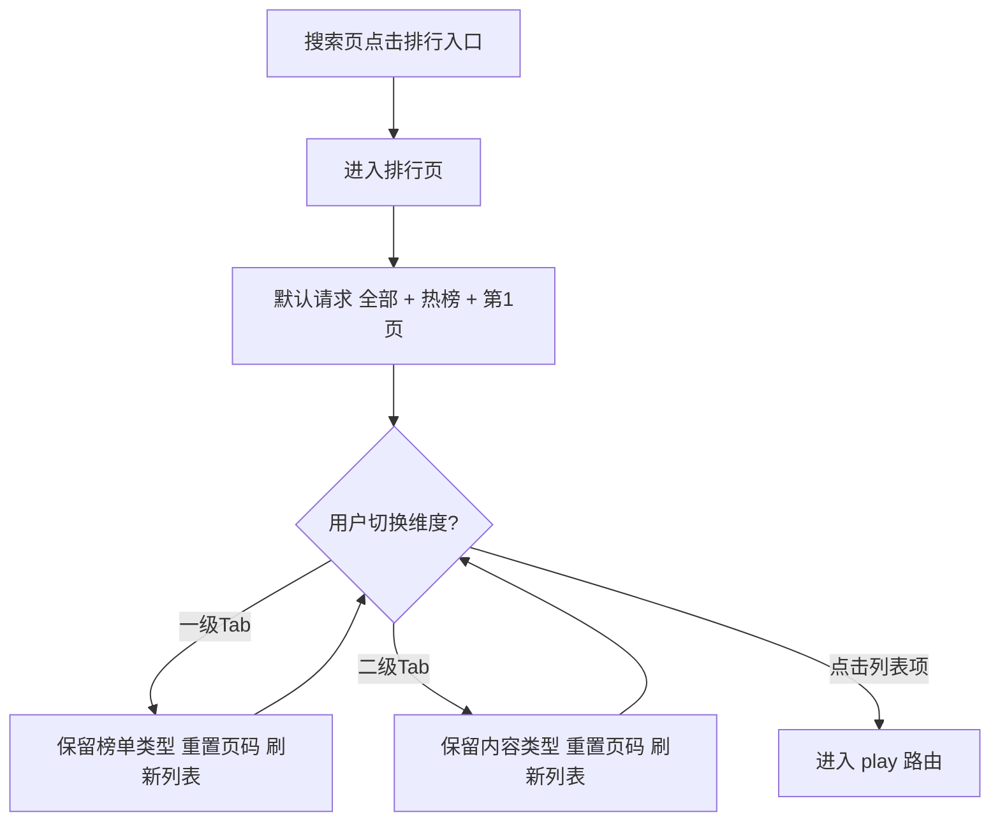
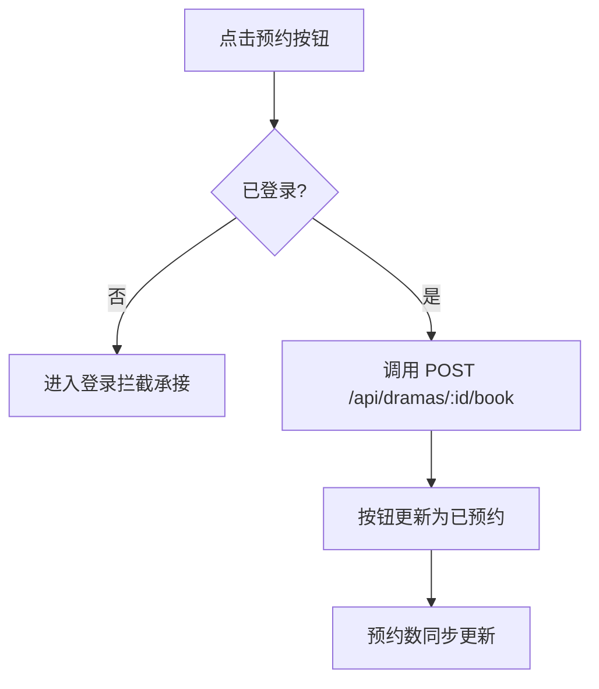

# 需求文档：PRD-05 排行体系

> 创建日期：2026-07-27
> 状态：草稿
> 作者：AI Agent + daniel

---

## 1. 需求背景

### 1.1 问题描述

- **现状**：Android 与 iOS 已在搜索发现页提供「排行」快捷入口，并分别预留 `ranking` / `rankingHome` Native 承接路由，但当前仍停留在占位页；Backend 也尚未提供排行接口，用户仍只能通过首页 Feed 浏览内容，缺少按榜单集中发现内容的路径。
- **痛点**：
  - 热门内容、推荐内容、即将上线内容缺少结构化聚合入口，探索效率低。
  - 搜索页已有「排行」快捷入口，但进入后没有真实内容，发现链路断裂。
  - 预约类内容缺少集中曝光与转化入口，不利于后续内容运营。
  - 当前仅有首页列表接口，无法支撑按热度、推荐值、预约数进行稳定排序。

### 1.2 预期目标

- **目标**：基于现有搜索发现入口和排行占位路由，落地 Android / iOS Native 排行页，并由 Backend 提供统一的排行数据接口，支持内容类型筛选、榜单维度切换、分页浏览和从排行项进入现有播放页链路。
- **成功指标**（可度量）：
  - iOS / Android 均可从搜索页快捷入口进入真实排行页，默认展示「全部 + 热榜」第一页数据。
  - 一级 Tab（全部 / 真人 / AI）与二级 Tab（热榜 / 推荐榜 / 预约榜）切换后，列表数据与展示字段正确刷新，且切换时保留另一维度选择。
  - 点击任意排行项均可复用现有 canonical `play` 路由进入播放页承接链路。
  - 预约榜可稳定展示预约数；匿名用户不会因预约入口导致页面不可用。

### 1.3 范围定义

| 范围内 | 范围外（明确不做） | 原因 |
|--------|------------------|------|
| Android / iOS Native 排行页替换现有占位页 | Web 排行页 / 独立 H5 排行页 | 根据 `PRODUCT.md`，除 mall / earn 外，其他业务页当前按 Native 实现 |
| Backend `GET /api/dramas/rankings` 排行接口 | 个性化推荐算法 | 首版使用固定 mock / 规则化排序 |
| 一级 Tab：全部 / 真人 / AI | 漫剧、演员榜、臻果榜等额外内容类型 / 榜单 | 不在当前 PRD 范围 |
| 二级 Tab：热榜 / 推荐榜 / 预约榜 | 排行页内分类筛选面板 | 分类能力由后续 PRD 单独承接 |
| 排行列表分页加载 | 下拉刷新、复杂缓存预热、离线榜单缓存 | 首版先保证首屏与加载更多 |
| 预约榜展示预约数与预约入口 | 登录能力本身、手机号登录流程实现 | 登录由 PRD-08 负责，本 PRD 只定义拦截接入点 |
| 点击排行项进入现有播放页承接链路 | 真实视频播放能力增强 | 播放器当前仍为占位页，本 PRD 不扩大其范围 |
| 推荐值、热度值、预约数等榜单展示字段 | 顶部“更新时间”文案 | 首版聚焦核心排行能力，避免新增非关键元数据字段 |

> 本 PRD 默认采用「先打通排行浏览链路，再为预约交互预留登录拦截接入点」的范围策略；若登录能力未就绪，不阻塞排行浏览能力上线。

---

## 2. 术语表

| 术语 | 定义 | 来源 |
|------|------|------|
| 排行页 | 由搜索发现页快捷入口进入的内容榜单页面，提供榜单切换与列表浏览 | 本文档新定义 |
| 内容类型 | 排行页一级 Tab 维度，对内容做大类筛选；首版固定为全部 / 真人 / AI | 本文档新定义 |
| 排序维度 | 排行页二级 Tab 维度，对同一内容集合按不同指标排序；首版固定为热榜 / 推荐榜 / 预约榜 | 本文档新定义 |
| 热榜 | 按热度值（首版以 `play_count` 代理）降序排列的榜单 | PRD / 本文档收敛 |
| 推荐榜 | 按推荐值降序排列的榜单；推荐值由 Backend 计算后返回，客户端只负责展示 | PRD / 本文档收敛 |
| 预约榜 | 按 `booking_count` 降序排列的榜单，并在列表项展示预约入口 | PRD |
| 预约拦截 | 用户点击预约时先检查登录状态；未登录时进入统一登录引导承接，而非直接提交预约 | PRD-05 / PRD-08 依赖定义 |
| `play` 路由 | 当前跨端 canonical 播放页路由语义；Android 兼容 `player` 历史别名 | `PRODUCT.md` / 现有代码 |
| Native 承接页 | 已存在于 iOS / Android 路由中的功能落点，当前从占位页演进为真实页面 | wiki / 现有代码 |

---

## 3. 涉及平台

| 平台 | 是否涉及 | 变更概要 |
|------|---------|---------|
| Backend | ✅ 涉及 | 新增排行查询接口，扩展排行所需业务字段与分页返回 |
| Web | ❌ 不涉及 | 本期不交付 Web / H5 排行页 |
| iOS | ✅ 涉及 | 用真实排行页替换 `rankingHome` 占位承接页，落地双层 Tab、列表与分页 |
| Android | ✅ 涉及 | 用真实排行页替换 `ranking` 占位承接页，落地双层 Tab、列表与分页 |

---

## 4. 用户故事

| 编号 | 角色 | 需求 | 验收标准 | 涉及平台 | 优先级 |
|------|------|------|---------|---------|--------|
| US-01 | 探索型用户 | 从搜索页进入排行页并看到默认榜单 | 从搜索页点击「排行」进入排行页；默认选中「全部 + 热榜」；列表成功展示第一页排行数据 | iOS / Android / Backend | P0 |
| US-02 | 探索型用户 | 按内容类型切换榜单 | 点击「真人」或「AI」后，保持当前排序维度不变并刷新列表；空数据时展示对应空态 | iOS / Android / Backend | P0 |
| US-03 | 探索型用户 | 按排序维度切换榜单 | 点击热榜 / 推荐榜 / 预约榜后，保持当前内容类型不变并刷新列表；不同榜单展示对应数值字段 | iOS / Android / Backend | P0 |
| US-04 | 探索型用户 | 浏览更多排行内容 | 列表支持分页加载更多；切换任一 Tab 时重置到第一页；超大页码返回空结果而非报错 | iOS / Android / Backend | P1 |
| US-05 | 预约型用户 | 在预约榜执行预约操作 | 预约榜展示预约按钮；已登录用户预约成功后按钮变为「已预约」且不可重复提交；未登录用户进入统一登录拦截承接 | iOS / Android / Backend | P1 |
| US-06 | 探索型用户 | 从排行列表进入播放页 | 点击排行项后复用现有 `play` 路由进入播放页承接链路，不新增新的播放路由语义 | iOS / Android | P0 |

---

## 5. 功能详述

### 5.1 US-01 / US-02 / US-03：进入排行页并进行双层 Tab 切换

#### 流程描述

1. 用户从搜索发现页点击快捷入口「排行」。
2. 客户端进入已存在的排行路由（Android `ranking`、iOS `rankingHome`），但页面内容从占位实现替换为真实排行页。
3. 页面首次进入时默认请求 `contentType=all&type=hot&page=1&pageSize=10`。
4. 一级 Tab 展示「全部 / 真人 / AI」，二级 Tab 展示「热榜 / 推荐榜 / 预约榜」。
5. 用户切换一级 Tab 时：保持当前二级 Tab，不变更排序维度，列表回到第一页并重新请求。
6. 用户切换二级 Tab 时：保持当前一级 Tab，不变更内容类型，列表回到第一页并重新请求。
7. 热榜展示热度值，推荐榜展示推荐值，预约榜展示预约数与预约按钮。



#### 前置条件

- [x] 搜索页已存在「排行」快捷入口。
- [x] iOS / Android 已存在排行承接路由。
- [ ] Backend 排行接口已提供可用响应。

#### 后置条件

- 当前所选内容类型与榜单维度在页面状态中可追踪。
- 列表只展示与当前维度组合一致的数据。
- 页面切换维度后不会混入上一次请求返回的数据。

#### 涉及的 UI/交互（如有）

| 页面 / 区域 | 交互描述 | 涉及端 |
|------------|---------|--------|
| 页面顶部 | 返回按钮 + 页面标题「排行」；不新增更新时间展示 | iOS / Android |
| 一级 Tab | 固定 3 项：全部 / 真人 / AI；点击即切换内容类型 | iOS / Android |
| 二级 Tab | 固定 3 项：热榜 / 推荐榜 / 预约榜；点击即切换排序维度 | iOS / Android |
| 列表项主区域 | 展示排名序号、封面、标题、分类/标签、对应榜单数值；点击进入播放页 | iOS / Android |
| 榜单数值区域 | 热榜展示热度值，推荐榜展示推荐值，预约榜展示预约数 | iOS / Android |
| 空态区域 | 当前维度无数据时展示空态文案，并保留 Tab 可切换 | iOS / Android |

#### 边界与异常

**错误处理：**

| 操作步骤 | 错误类型 | 触发条件 | 系统行为 | 用户感知 |
|---------|---------|---------|---------|---------|
| 首次进入排行页 | 网络异常 | 断网 / 超时 | 保留页面骨架，展示错误态与重试入口 | 错误提示 + 重试按钮 |
| 切换 Tab | 服务端错误 | 500 / 502 / 503 | 保持当前 Tab 选中状态，不写入脏数据 | 列表区错误态 / Toast |
| 请求排行接口 | 数据校验失败 | `type` / `contentType` 非法 | 服务端返回统一校验错误；客户端回退到上一次有效状态 | Toast / 内联错误 |
| 快速连续切换 Tab | 并发返回乱序 | 旧请求晚于新请求返回 | 仅消费最后一次有效请求结果 | 用户只看到最终所选维度的数据 |
| 列表图片加载 | 资源缺失 | `cover_url` 为空或失效 | 使用统一占位图，不阻断列表渲染 | 占位封面 |

**边界场景：**

| 场景 | 触发条件 | 预期行为 |
|------|---------|---------|
| 空数据 | 某一组合维度下无结果 | 展示空态文案「当前榜单暂无内容」，但保留 Tab 切换 |
| 极端页码 | 请求超大页码 | 返回 200 + 空数组，不视为接口错误 |
| 特殊字符标题 | 标题 / 标签含 emoji 或特殊字符 | 正常展示，不截断布局 |
| 封面缺失 | `cover_url = null` | 渲染占位图 |
| 连续切换维度 | 用户快速多次点击不同 Tab | 最新一次选择生效，旧响应不得覆盖新状态 |
| 切后台恢复 | 页面切到后台后返回前台 | 维持当前 Tab 选择；必要时可按当前维度刷新第一页 |

### 5.2 US-04：排行列表分页加载

#### 流程描述

1. 页面首次加载默认请求第一页。
2. 用户滚动到列表底部附近时，若当前仍有下一页，则发起下一页请求。
3. 新页数据追加到当前列表末尾，保留已选中的内容类型与榜单维度。
4. 当用户切换任一 Tab 时，分页状态重置为第一页，已加载的旧列表数据清空。

#### 前置条件

- [ ] 当前榜单第一页已成功加载。
- [ ] 接口响应返回 `pagination.page`、`page_size`、`total`、`total_pages`。

#### 后置条件

- 页面只追加同一维度组合下的后续页数据。
- 切换维度后不复用旧分页结果。

#### 涉及的 UI/交互（如有）

| 页面 / 区域 | 交互描述 | 涉及端 |
|------------|---------|--------|
| 列表底部 | 加载更多时展示尾部 loading 状态 | iOS / Android |
| 列表尾部 | 已加载全部数据时展示“没有更多了”或静默结束 | iOS / Android |

#### 边界与异常

**错误处理：**

| 操作步骤 | 错误类型 | 触发条件 | 系统行为 | 用户感知 |
|---------|---------|---------|---------|---------|
| 加载下一页 | 网络异常 | 超时 / 断网 | 保留已加载内容，不清空当前列表 | Toast + 可再次触发加载 |
| 加载下一页 | 服务端错误 | 5xx | 本次分页失败但不影响已加载页 | 尾部错误提示 / Toast |
| 重复触底 | 重复提交 | 连续多次触发加载更多 | 同一页只允许一个请求在途 | 尾部 loading 不重复出现 |

**边界场景：**

| 场景 | 触发条件 | 预期行为 |
|------|---------|---------|
| 最后一页不足一屏 | 数据总量较少 | 不再继续请求下一页 |
| 空榜单请求下一页 | 当前第一页即为空 | 不触发加载更多 |
| Tab 切换后回滚位置 | 切换维度时用户已滚动较深 | 列表回到顶部并从第一页重新加载 |

### 5.3 US-05：预约榜中的预约操作与登录拦截

#### 流程描述

1. 用户切换到预约榜。
2. 列表项展示预约数与预约按钮。
3. 用户点击「预约」时，客户端先检查登录状态。
4. 若未登录，则进入统一登录拦截承接，并保留返回到当前排行页的来源信息。
5. 若已登录，则调用 `POST /api/dramas/:id/book`。
6. 接口成功后，当前项按钮更新为「已预约」，并在当前页面同步更新预约状态与预约数。



#### 前置条件

- [ ] 当前处于预约榜。
- [ ] 列表项包含可展示的预约数。
- [ ] 登录能力已提供统一拦截入口；若未提供，则至少保留标准拦截占位承接。

#### 后置条件

- 已预约项在当前会话内保持“已预约”展示状态。
- 重复点击同一项不会重复提交预约请求。
- 登录后返回时，应能回到排行页当前维度组合。

#### 涉及的 UI/交互（如有）

| 页面 / 区域 | 交互描述 | 涉及端 |
|------------|---------|--------|
| 预约榜列表项 | 展示预约数和按钮；已预约状态与未预约状态区分明显 | iOS / Android |
| 登录拦截承接 | 未登录时进入统一登录引导，不直接吞掉点击 | iOS / Android |
| 成功反馈 | 预约成功后给予轻量反馈（Toast / HUD / Snackbar） | iOS / Android |

#### 边界与异常

**错误处理：**

| 操作步骤 | 错误类型 | 触发条件 | 系统行为 | 用户感知 |
|---------|---------|---------|---------|---------|
| 点击预约 | 权限不足 | 匿名用户 | 不调用预约接口，进入登录拦截承接 | 登录引导 |
| 提交预约 | 网络异常 | 超时 / 断网 | 保持原按钮状态，可重试 | Toast |
| 提交预约 | 服务端错误 | 500 / 503 | 不更新本地成功态 | Toast |
| 连续点击预约 | 重复提交 | 同一请求在途 | 按钮 disabled，忽略重复点击 | 按钮 loading / disabled |
| 重复预约 | 幂等冲突 | 已预约后再次点击 | 服务端幂等返回成功态；客户端保持“已预约” | 无额外错误提示 |

**边界场景：**

| 场景 | 触发条件 | 预期行为 |
|------|---------|---------|
| 登录能力未落地 | 当前版本没有真实登录页 | 仍需保留统一拦截占位，不让预约点击无响应 |
| 从登录页返回 | 登录成功后回跳 | 回到预约榜原维度，重新拉取第一页或刷新当前项状态 |
| 预约数为空 | 后端未返回有效值 | 以 0 展示，不导致崩溃 |

### 5.4 US-06：从排行项进入播放页

#### 流程描述

1. 用户在任一榜单中点击列表项主区域。
2. 客户端复用现有播放页路由语义：Android 导航到 `play/{videoId}`，iOS 导航到 `.player(videoId:)` 对外公开名 `play`。
3. 播放页继续沿用当前占位播放器承接逻辑，仅验证路由进入和参数透传。

#### 前置条件

- [x] 当前播放器路由已存在且 canonical 为 `play`。
- [ ] 排行列表项持有有效短剧 `id`。

#### 后置条件

- 用户成功进入播放页承接链路。
- 不新增新的播放器路由命名，也不改变 `player` 历史兼容策略。

#### 涉及的 UI/交互（如有）

| 页面 / 区域 | 交互描述 | 涉及端 |
|------------|---------|--------|
| 排行列表项 | 点击封面或主体区域进入播放页 | iOS / Android |
| 播放页 | 继续复用现有占位页，不在本 PRD 新增播放控制 | iOS / Android |

#### 边界与异常

**错误处理：**

| 操作步骤 | 错误类型 | 触发条件 | 系统行为 | 用户感知 |
|---------|---------|---------|---------|---------|
| 点击排行项 | 数据校验失败 | `dramaId` 为空 | 不执行导航 | 轻量提示或忽略点击 |
| 进入播放页 | 目标数据不存在 | 播放页后续校验失败 | 由既有播放页承接错误或空态 | 播放页提示 |

**边界场景：**

| 场景 | 触发条件 | 预期行为 |
|------|---------|---------|
| 历史 deeplink 兼容 | Android 仍兼容 `player` | 本 PRD 不改现有兼容关系 |
| 播放器仍为占位实现 | 未接入真实视频播放 | 以“成功进入播放页承接链路”为验收标准 |

---

## 6. 数据概览

| 数据实体 | 说明 | 关键字段 | 来源 |
|---------|------|---------|------|
| RankingQuery | 排行列表查询条件 | `type`、`contentType`、`page`、`pageSize` | 客户端状态 / URL 请求参数 |
| RankingDrama | 排行列表项业务实体，在现有 `Drama` 基础上补充排行统计字段 | `id`、`title`、`cover_url`、`category`、`tags`、`content_type`、`play_count`、`booking_count`、`recommendation_score`、`is_booked` | Backend 返回 |
| RankingListResponse | 排行列表响应 | `data[]`、`pagination.page`、`pagination.page_size`、`pagination.total`、`pagination.total_pages` | Backend 返回 |
| BookingAction | 预约操作结果 | `drama_id`、`booked`、`booking_count` | Backend 返回 |

### 数据关系

```text
[内容类型 content_type] 1:N ──▶ [RankingDrama]
[排序维度 type]      1:N ──▶ [RankingDrama]
[用户登录态]         1:N ──▶ [BookingAction / is_booked]
```

### 数据约束说明

- `content_type` 首版固定枚举：`live_action`、`ai`；`all` 仅作为查询条件，不作为实体存储值。
- `type` 首版固定枚举：`hot`、`recommend`、`booking`。
- 热榜排序依据 `play_count` 降序。
- 推荐榜排序依据固定推荐值，首版沿用 PRD 中的示意规则 `play_count * 0.6 + rating * 0.4`，由 Backend 计算后返回展示值，客户端不自行计算。
- 预约榜排序依据 `booking_count` 降序。
- 为避免影响现有首页 / 搜索消费方，排行新增字段需保持向后兼容：已有接口不应因为新增排行字段而破坏现有解析。

---

## 7. 现有功能影响

| 现有功能 | 影响类型 | 说明 | 是否需要迁移 |
|---------|---------|------|------------|
| 搜索发现页快捷入口 | 修改行为 | 「排行」入口从跳转占位页变为跳转真实排行页，但入口位置与路由保持不变 | 否 |
| Android `ranking` / iOS `rankingHome` 占位页 | 修改行为 | 现有占位实现被真实页面替换 | 否 |
| 播放器 | 新增关联 | 排行列表项复用现有 `play` 路由进入播放页承接链路 | 否 |
| 共享 Drama 数据模型 | 新增关联 | 需补充排行所需字段或定义兼容的新排行实体 | 可能需要代码层适配，但不涉及历史数据迁移 |
| 登录能力 | 新增关联 | 预约交互接入统一登录拦截；登录流程本身仍由 PRD-08 负责 | 否 |
| Web / H5 页面边界 | 无影响 | 本 PRD 不新增 Web 页面，不改变 mall / earn 的 H5 承载策略 | 否 |

### 兼容性说明

- 本 PRD 不新增新的顶级导航语义，继续复用现有搜索入口与 `ranking` 路由承接。
- 本 PRD 不改变 `play` 作为 canonical 播放路由的约定；Android 现有 `player` 历史兼容保持不变。
- Backend 新增排行接口时，不应破坏现有 `GET /api/dramas`、`GET /api/dramas/search` 等已存在接口的字段契约。
- 由于播放器仍是占位实现，本 PRD 对播放链路的验收标准是“可稳定进入播放页并正确透传参数”，而非真实播放完成度。

---

## 8. 非功能性需求

### 8.1 性能

| 指标 | 目标值 | 测量方式 |
|------|--------|---------|
| 排行页首屏加载 | 首次进入后在 2 秒内完成首屏可见内容渲染（基于本地开发 / mock 数据环境） | 客户端日志 / 手工验证 |
| Tab 切换响应 | 触发切换后 1 秒内进入 loading 或展示新数据 | 客户端状态流验证 |
| API 响应时间（P95） | `< 500ms`（mock / 本地开发环境） | Backend 自动化测试 / 本地日志 |
| 分页加载 | 单次加载更多不重复发起并发请求 | ViewModel / 状态机测试 |

### 8.2 安全

| 关注点 | 要求 |
|--------|------|
| 认证与授权 | 浏览排行无需登录；预约操作需登录态校验；未登录不得直接创建预约记录 |
| 数据校验 | 客户端与服务端都需校验 `type`、`contentType`、分页参数是否合法 |
| 敏感数据 | 不在客户端硬编码 token 或用户标识；登录态复用既有统一机制 |
| 防滥用 | 预约接口需具备幂等语义，避免重复点击产生重复预约 |

### 8.3 兼容性

| 维度 | 要求 |
|------|------|
| 设备兼容 | 维持当前 Android / iOS 工程既有最低版本支持范围，不因排行页新增额外第三方依赖 |
| 数据兼容 | 新增排行字段不得破坏首页 / 搜索等既有数据消费方 |
| 向后兼容 | 继续保持 `play` canonical 路由和 Android `player` 兼容别名；已有搜索入口 route 不变 |

---

## 9. 依赖

| 依赖项 | 类型 | 说明 | 状态 | 阻塞 |
|--------|------|------|------|------|
| 搜索页快捷入口 | 内部能力 | 搜索发现页已提供「排行」快捷入口，可直接承接真实排行页 | ✅ 已就绪 | 否 |
| 排行承接路由 | 内部能力 | Android `ranking` 与 iOS `rankingHome` 已存在占位页，需要替换为真实实现 | ✅ 已就绪 | 否 |
| 共享 Drama 数据模型扩展 | 内部能力 | 需要补充 `content_type`、`play_count`、`booking_count`、推荐值等排行字段 | 🚧 待开发 | 是 |
| 登录能力 / 登录拦截 | 内部能力 | 预约操作依赖统一登录校验与返回路径 | 📅 规划中 | 是（仅对预约闭环） |
| 播放页承接链路 | 内部能力 | 当前已具备 `play` 路由与页面承接 | ✅ 已就绪 | 否 |
| Backend mock 数据增强 | 内部能力 | 需要提供可覆盖全部 / 真人 / AI 与三类榜单的种子数据 | 🚧 待开发 | 是 |

---

## 10. 待澄清问题

| 编号 | 问题 | 可能的答案 | 阻塞 |
|------|------|-----------|------|
| Q-01 | 预约是否支持取消？ | A: 首版不支持取消，成功后按钮置灰；B: 支持 toggle 取消预约。**默认采用 A**，与当前 PRD 文案一致 | 否 |
| Q-02 | 排行页顶部是否展示更新时间？ | A: 首版不展示；B: Backend 新增 `generated_at` 后展示。**默认采用 A**，避免扩大接口范围 | 否 |
| Q-03 | 推荐榜展示值由谁计算？ | A: 客户端按公式计算；B: Backend 返回最终推荐值。**默认采用 B**，避免端间不一致 | 否 |

---

## 11. 参考资料

### 已查阅的 wiki 文档

| 文档 | 相关章节 | 关键信息 |
|------|---------|---------|
| `wiki/features/index.md` | 功能域索引 | 当前已有首页 Feed、播放器、deeplink 等功能域，尚未有排行功能域 |
| `wiki/features/video-player/index.md` | 入口与路由、已知限制 | 播放页当前仍为占位实现，验收应以进入链路为准 |
| `wiki/features/deeplink/index.md` | Deeplink 格式、已知限制 | `play` 为 canonical 播放语义，Android 兼容 `player` 历史别名 |
| `wiki/architecture/overview.md` | 概述、当前首页承载结构 | 当前整体仍以首页 Feed 为主要发现路径，排行榜尚未落地 |
| `wiki/api/dramas.md` | `GET /api/dramas` | 现有 dramas 接口已有统一分页约定，可供排行接口复用 |

### 已查阅的代码文件

| 文件 | 关键内容 |
|------|---------|
| `PRODUCT.md` | 明确 mall / earn 为 H5，其余业务页当前按 Native 实现 |
| `android/app/src/main/java/com/djs66256/short_drama/navigation/AppDestination.kt` | Android 已存在 `ranking` 路由，以及 canonical `play` / 兼容 `player` |
| `android/app/src/main/java/com/djs66256/short_drama/navigation/NavGraph.kt` | Android 当前将 `ranking` 注册为占位页，可直接替换真实实现 |
| `android/app/src/main/java/com/djs66256/short_drama/feature/search/model/SearchQuickEntry.kt` | 搜索页已存在「排行」快捷入口 |
| `ios/ShortDrama/Sources/App/AppRoute.swift` | iOS 已存在 `rankingHome` 路由，对外公开名为 `ranking` |
| `ios/ShortDrama/Sources/App/TabNavigationHostView.swift` | iOS 当前将排行承接到 `DiscoveryPlaceholderView(kind: .ranking)` |
| `ios/ShortDrama/Sources/Features/Search/Views/DiscoveryPlaceholderView.swift` | iOS 排行页仍为占位实现 |
| `backend/src/lib/schemas.ts` | 当前共享 `DramaSchema` 尚未包含排行所需统计字段 |
| `backend/src/app/api/dramas/route.ts` | 当前仅提供首页列表接口，没有排行接口 |
| `backend/src/repositories/mock/drama.mock.repository.ts` | 当前 mock 数据可复用为排行种子来源，但需补充内容类型与统计字段 |
| `docs/product_manager/prd/2026-07-25-ranking/prd.md` | 原始 PRD 定义了双层 Tab、三类榜单与预约场景 |
| `docs/product_manager/prd/2026-07-25-ranking/subtasks.md` | 子任务明确排行接口参数、排序规则与登录依赖 |
| `docs/product_manager/prd/2026-07-25-login/prd.md` | 登录能力当前尚未落地，但已定义统一登录拦截的未来方向 |

---

## 12. 变更历史

| 日期 | 变更内容 | 变更原因 |
|------|---------|---------|
| 2026-07-27 | 初始版本 | 启动 PRD-05 排行体系 feature workflow，基于现有代码基线收敛真实范围与依赖 |
