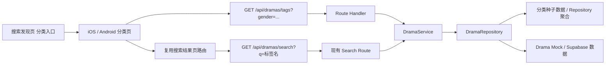

# 技术方案（共享部分）：PRD-06 分类浏览

> 创建日期：2026-07-27
> 对应需求：spec.md

## 整体架构



### 架构说明

- 本期继续沿用现有四层架构：**Route → Service → Repository → Mock Data / Infrastructure**。
- 分类页不新增新的顶级入口，继续复用 PRD-04 已落地的搜索发现页「分类」快捷入口，以及 Android `classification` / iOS `classificationHome` 承接路由。
- Backend 新增只读接口 `GET /api/dramas/tags`，负责返回分类页所需的固定三维度标签结构。
- 标签点击后**不新增分类结果页**，而是直接复用现有搜索结果页与 `GET /api/dramas/search`；为保证分类链路可用，搜索匹配范围从 PRD-04 首版的 `title + category` 扩展为 `title + category + tags`。
- 分类标签与搜索索引必须共享同一套可命中词汇：Repository 返回给分类页的标签，必须能在至少一个 Drama 的 `title`、`category` 或 `tags` 中命中，避免点击后大量落空。
- Web 不在本期交付范围；shared design 只定义 Backend 与移动端共享契约、错误语义和状态约束。

## API 设计

### 涉及变更

| 类型 | 数量 | 说明 |
|------|------|------|
| 新增接口 | 1 | 分类标签查询接口 `GET /api/dramas/tags` |
| 修改接口 | 1 | 扩展 `GET /api/dramas/search` 的匹配范围 |
| 废弃接口 | 0 | 无 |

> 兼容性说明：当前 Backend 成功响应沿用资源体直出风格（如 `{ data, pagination }`），错误响应统一为 `{ error: { code, message } }`，Zod 校验失败额外附带 `details`。本 PRD 保持这一既有 contract，不额外引入新的 `{ code, data, message }` 成功包裹层。

### 新增接口

#### `GET /api/dramas/tags`

- **功能简介**：返回分类页所需的性别维度标签集，供 iOS / Android 分类页首屏加载和顶部 Tab 切换使用。
- **Path Parameters**：无

- **Query Parameters**：

| 字段 | 类型 | 必填 | 默认值 | 说明 |
|------|------|------|--------|------|
| `gender` | `all \| male \| female` | 否 | `all` | 分类页顶部性别筛选 |

- **Request Body**：无

- **Response**：

```json
{
  "data": {
    "gender": "all",
    "dimensions": [
      {
        "key": "era_background",
        "name": "时代背景",
        "tags": ["都市", "校园", "民国", "古装"]
      },
      {
        "key": "theme_plot",
        "name": "主题情节",
        "tags": ["逆袭", "系统", "闪婚", "甜宠"]
      },
      {
        "key": "character_setting",
        "name": "角色设定",
        "tags": ["大女主", "霸总", "萌宝", "龙王"]
      }
    ]
  }
}
```

| 字段 | 类型 | 说明 |
|------|------|------|
| `data.gender` | `all \| male \| female` | 当前生效的性别筛选 |
| `data.dimensions` | `ClassificationDimension[]` | 固定三维度分组，顺序恒定 |
| `data.dimensions[].key` | string | 稳定机器键，用于锚点、状态同步与测试 |
| `data.dimensions[].name` | string | 用户可见分组名称 |
| `data.dimensions[].tags` | `string[]` | 当前维度下的标签列表；允许为空数组 |

- **Error Codes**：

| 状态码 | 错误码 | 说明 |
|--------|--------|------|
| 200 | — | 成功，允许某些维度 `tags=[]` |
| 400 | `VALIDATION_ERROR` | `gender` 非法 |
| 500 | `INTERNAL_ERROR` | 服务内部错误 |
| 503 | `SERVICE_UNAVAILABLE` | 数据源不可用 |

### 修改接口

#### `GET /api/dramas/search`

- **变更说明**：扩展分类标签点击后的搜索命中能力，保证分类标签链路可用。
- **变更前**：Repository 搜索仅匹配 `title + category`。
- **变更后**：Repository 搜索匹配 `title + category + tags`，其余 query 参数、分页行为、响应结构和错误语义保持不变。
- **向后兼容性**：兼容。已有搜索词行为不受破坏，仅增加标签命中范围。

### Zod Schema 定义

```typescript
import { z } from 'zod';

export const ClassificationGenderSchema = z.enum(['all', 'male', 'female']);

export const ClassificationTagsQuerySchema = z.object({
  gender: ClassificationGenderSchema.default('all'),
});

export const ClassificationDimensionSchema = z.object({
  key: z.enum(['era_background', 'theme_plot', 'character_setting']),
  name: z.string().min(1),
  tags: z.array(z.string().trim().min(1)).default([]),
});

export const ClassificationTagsResponseSchema = z.object({
  data: z.object({
    gender: ClassificationGenderSchema,
    dimensions: z.array(ClassificationDimensionSchema).length(3),
  }),
});

export const SearchDramaQuerySchema = z.object({
  q: z.string().trim().min(1).max(50),
  page: z.coerce.number().int().min(1).default(1),
  pageSize: z.coerce.number().int().min(1).max(100).default(10),
});
```

## 数据模型

### 新增/变更数据表

| 表名 | 操作 | 说明 |
|------|------|------|
| `classification tag seed`（逻辑模型） | 新建 | 分类页的固定三维度标签种子；首版允许以内存 / 常量形式存在于 Repository 层 |
| `dramas`（逻辑搜索索引） | 修改 | 搜索匹配逻辑从 `title + category` 扩展到 `title + category + tags` |

> 本期不要求新增真实数据库表或 migration。若后续接入真实配置化后台，可将分类标签种子迁移到表结构或 CMS，但对客户端保持同一 response contract。

### 共享实体设计

| 实体 | 字段 | 说明 |
|------|------|------|
| `ClassificationTagsQuery` | `gender` | 分类接口查询条件 |
| `ClassificationDimension` | `key` / `name` / `tags[]` | 单个维度分组 |
| `ClassificationTagsResponse` | `data.gender` / `data.dimensions[]` | 分类页完整数据集 |
| `SearchIndexInput` | `title` / `category` / `tags[]` | 搜索匹配使用的标准化输入 |

### 数据约束

| 约束 | 说明 |
|------|------|
| 固定三维度 | 后端成功响应始终返回 `时代背景 / 主题情节 / 角色设定` 三个分组，顺序固定 |
| 空维度允许 | 某维度可以 `tags=[]`，但不能省略该维度对象 |
| `all` 合并规则 | `all` 由男频、女频标签按固定产品顺序去重合并，保留首次出现顺序 |
| 搜索可命中性 | 返回给分类页的每个标签，必须能命中至少一个 Drama 的 `title`、`category` 或 `tags` |
| 路由语义稳定 | 分类标签点击只复用现有搜索结果页，不新增 `search?q=` 风格新路由 |

## 跨端共享逻辑

| 共享逻辑 | 说明 | 涉及端 |
|---------|------|--------|
| 默认加载 | 页面首次进入固定请求 `gender=all` | Backend / iOS / Android |
| Tab 切换重置 | 顶部性别 Tab 切换成功后，左侧默认选中重置为第一个维度 | iOS / Android |
| 固定三维度 | 左右两侧始终使用相同的三个维度顺序和 `key` | Backend / iOS / Android |
| 空维度展示 | `tags=[]` 时左侧仍展示该维度，右侧展示空态，不隐藏锚点 | Backend / iOS / Android |
| 并发保护 | 快速切换 Tab 时，仅最后一次请求结果可提交到 UI | iOS / Android |
| 标签点击跳转 | 复用现有搜索结果页路由与 query 规范化规则 | iOS / Android |
| 搜索命中扩展 | 搜索结果页继续调用 `GET /api/dramas/search`，但匹配范围扩展到 `tags` | Backend / iOS / Android |
| 空结果承接 | 标签无结果时停留在搜索结果页空态，不回退分类页 | iOS / Android |

### 状态机约定

```text
初始进入分类页
→ loading(gender=all)
→ success(content) | error(retryable)

切换性别 Tab
→ loading(keep current page shell)
→ success(content + selectedDimension=first)
→ error(keep previous successful content)

点击左侧维度
→ scroll_to_anchor
→ selectedDimension 更新

点击标签
→ normalize query
→ navigate search result
→ search loading
→ search success(content) | empty | error
```

## 安全考虑

- **认证与授权**：
  - `GET /api/dramas/tags` 与 `GET /api/dramas/search` 均为公开只读接口，不要求登录。
  - 分类浏览不引入新的用户态或敏感权限判断。
- **数据校验**：
  - `gender`、`q`、分页参数全部使用 Zod 校验。
  - 标签字符串在服务端返回前应做 `trim` 与空值过滤，避免客户端出现无效点击。
- **敏感数据处理**：
  - 不引入 token、环境地址、用户隐私字段。
  - 分类标签种子只包含公开内容标签，不携带运营后台元数据。
- **输入安全**：
  - 搜索 query 继续沿用现有特殊字符安全处理策略；Supabase / Mock Repository 均需避免将原始 query 直接拼接为不安全条件。

## 边界与错误处理（⚠️ 重点，最易遗漏）

### 错误处理架构

- **全局错误处理策略**：继续使用 `withErrorHandler` 捕获 `AppError` / `ZodError`，输出统一错误体。
- **错误响应格式**：
  - 成功：沿用现有资源体直出结构。
  - 失败：`{ error: { code, message } }`；Zod 校验失败可带 `details`。
- **错误日志与监控**：首版以自动化测试与本地日志为主；后续若接入真实内容源，可补充 query / gender 维度的请求日志。

### API 错误码定义

| 业务错误码 | HTTP 状态码 | 说明 | 用户提示文案 |
|-----------|------------|------|-------------|
| `VALIDATION_ERROR` | 400 | `gender` / `q` / 分页参数非法 | 请求参数有误，请重试 |
| `UNAUTHORIZED` | 401 | 预留，当前两个接口均无需登录 | 请先登录 |
| `FORBIDDEN` | 403 | 预留 | 当前不可访问 |
| `NOT_FOUND` | 404 | 预留，当前列表查询不使用 | 资源不存在 |
| `CONFLICT` | 409 | 预留，当前只读接口不使用 | 当前状态冲突 |
| `TOO_MANY_REQUESTS` | 429 | 预留 | 请求过于频繁，请稍后再试 |
| `INTERNAL_ERROR` | 500 | 服务内部错误 | 服务开小差了，请稍后重试 |
| `SERVICE_UNAVAILABLE` | 503 | 分类数据源或搜索数据源不可用 | 服务暂不可用，请稍后重试 |

### 边界场景处理

| 场景 | 触发条件 | API 行为 | 说明 |
|------|---------|---------|------|
| `gender` 非法 | `gender=unknown` | 返回 400 | 使用枚举白名单校验 |
| 缺省 `gender` | 不传 `gender` | 等价 `all` | 减少端侧分支 |
| 空维度 | 某维度暂无标签 | 返回该维度对象且 `tags=[]` | 保证左右锚点稳定 |
| 空标签集 | 当前性别没有可展示标签 | 仍返回固定三维度，三组 `tags=[]` | 不返回结构不完整的成功响应 |
| 标签词无结果 | 标签未命中任何 Drama | 搜索接口返回 200 + `data=[]` | 由搜索结果页空态承接 |
| 搜索词特殊字符 | emoji / 全角空格 / 特殊符号 | 视为普通文本处理或清洗 | 不得导致 500 |
| 快速切换 Tab | 旧请求晚于新请求返回 | 后端正常响应；端侧只消费最后一次结果 | 由端侧状态机保证 |
| 超大页码搜索 | `page` 合法但过大 | 返回 200 + `data=[]` | 与现有分页语义一致 |

## 性能考虑

- **预期 QPS**：当前 harness / mock 环境以低并发验证为主，分类接口和搜索接口均按只读轻量请求设计。
- **缓存策略**：
  - Backend 首版不引入额外缓存层，优先使用内存种子 / Repository 直接返回。
  - 移动端以页面内存态为主，不新增持久化缓存，避免分类数据与搜索索引不一致。
- **搜索优化**：
  - Mock Repository 在内存中过滤 `title + category + tags`；若切换到 Supabase，需为 `tags` 搜索准备对应列或可查询结构。
  - 分类种子规模很小，服务端应以 O(维度数 + 标签数) 组装响应，避免按请求动态扫描全部内容库。
- **一致性优先**：分类种子与搜索索引之间的词汇一致性，比过早做复杂排序或个性化更重要。

## 参考资料

### 已查阅的 wiki 文档

| 文档 | 相关章节 | 关键信息 |
|------|---------|---------|
| `wiki/architecture/overview.md` | 概述 / 当前首页与排行承载结构 / 已知限制 | 搜索发现是首页子链路，分类仍属 Native 承接范围 |

### 已查阅的代码文件

| 文件 | 关键内容 |
|------|---------|
| `backend/src/lib/schemas.ts` | 当前已有 `Drama` / `Search` / `Ranking` schema，但没有分类标签 schema |
| `backend/src/app/api/dramas/search/route.ts` | 搜索接口当前使用 `SearchDramaQuerySchema` 并直连 `DramaService.searchDramas` |
| `backend/src/services/drama/drama.service.ts` | Service 层已具备列表 / 搜索 / 排行 / 热搜统一封装，可增量扩展分类接口 |
| `backend/src/repositories/interfaces/drama.repository.interface.ts` | Repository 当前已有 `search` 接口，可继续扩展分类标签查询能力 |
| `backend/src/repositories/mock/drama.mock.repository.ts` | 当前搜索仅匹配 `title + category`，需要扩展到 `tags`；同时可承载分类种子数据 |
| `backend/src/app/api/dramas/rankings/route.ts` | 排行接口沿用现有 Route → Service → Repository 模式，可作为分类接口新增样板 |
| `backend/src/app/api/dramas/hot-search/route.ts` | 只读轻量接口的最小实现参考 |
| `backend/src/middleware/error-handler.ts` | 确认错误响应为 `{ error: { code, message } }`，Zod 错误包含 `details` |
| `android/app/src/main/java/com/djs66256/short_drama/navigation/AppDestination.kt` | Android 已存在 `classification` 与 `search/result?query=...` 路由 |
| `ios/ShortDrama/Sources/App/AppRoute.swift` | iOS 已存在 `classificationHome` 与 `.searchResult(query:)` 路由 |
