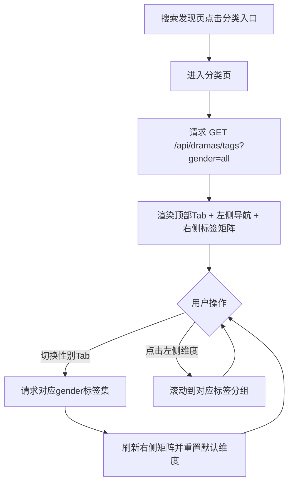
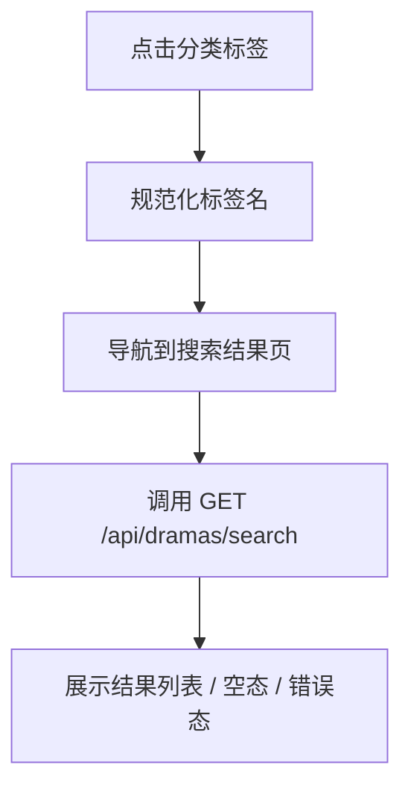

# 需求文档：PRD-06 分类浏览

> 创建日期：2026-07-27
> 状态：草稿
> 作者：AI Agent + daniel

---

## 1. 需求背景

### 1.1 问题描述

- **现状**：PRD-04 已完成搜索发现页与搜索结果页，Android / iOS 均已在搜索发现页提供「分类」快捷入口，并分别预留 `classification` / `classificationHome` Native 承接路由；但当前两端进入后仍是 placeholder 页面，Backend 也还没有可供分类页消费的标签分类 API。用户虽然已经能搜索和看排行，但还无法按题材、时代、角色设定等标签维度主动浏览内容。
- **痛点**：
  - 搜索发现链路仍偏“已知词搜索”与“榜单浏览”，缺少按兴趣标签探索内容的中间层。
  - 搜索页里的「分类」入口已有路径但无真实页面，导致发现路径断裂。
  - 首页 / 搜索 / 排行现有卡片都包含 `tags` 字段，但没有统一的“标签维度浏览”承接方式。
  - 后续剧场、内容运营、标签配置等能力缺少一套稳定的分类 contract 可复用。
- **竞品参考**：竞品分类页位于搜索发现页下，采用三层结构：顶部性别 Tab（全部 / 男频 / 女频）、左侧维度导航（时代背景 / 主题情节 / 角色设定）、右侧标签矩阵（3 列胶囊标签），点击标签后直接进入搜索结果页继续消费内容。

### 1.2 预期目标

- **目标**：基于现有搜索发现入口与占位承接路由，落地 Android / iOS Native 分类页，并由 Backend 提供统一的标签分类接口，使用户能够通过性别 Tab + 三个分类维度浏览标签，并在点击标签后复用现有搜索结果页承接内容发现。
- **成功指标**（可度量）：
  - iOS / Android 均可从搜索发现页点击「分类」进入真实分类页，默认展示「全部」标签集与三个维度分组。
  - 顶部性别 Tab 切换后，页面在 1 秒内完成标签集刷新，左侧维度与右侧标签矩阵保持同步。
  - 点击任意标签后，均可复用现有搜索结果页，以标签名作为 `query` 进入搜索结果链路；后端搜索能力需覆盖 `title + category + tags` 匹配，保证分类标签链路可用。
  - Backend `GET /api/dramas/tags` 具备自动化测试，覆盖合法 `gender`、空数据和非法参数等核心边界。

### 1.3 范围定义

| 范围内 | 范围外（明确不做） | 原因 |
|--------|------------------|------|
| Android / iOS Native 分类页替换现有 placeholder 承接页 | Web 分类页真实实现 | 当前策略仍是除 mall / earn 外业务页优先按 Native 承接 |
| Backend `GET /api/dramas/tags?gender=...` | 标签管理后台 | 首版先由 Backend 提供静态 / mock 标签集 |
| 顶部性别 Tab：全部 / 男频 / 女频 | 多标签组合筛选 | 首版只支持单标签点击搜索 |
| 左侧维度导航：时代背景 / 主题情节 / 角色设定 | 维度增删的运营配置能力 | 首版固定三维度，更利于稳定交付 |
| 右侧标签矩阵分组展示与锚点滚动 | 标签“展开更多”、复杂折叠交互 | 首版直接展示全部标签 |
| 标签点击后进入现有搜索结果页 | 独立的分类结果页 / 专属筛选页 | 复用 PRD-04 搜索结果链路，降低范围和实现成本 |
| 基于 `gender` 切换不同标签集 | 个性化标签排序 | 首版使用固定顺序的种子数据 |

> 本期重点是把「搜索发现页 → 分类页 → 标签搜索结果页」主链路打通，而不是一次性做成完整多筛选体系。

---

## 2. 术语表

| 术语 | 定义 | 来源 |
|------|------|------|
| 分类页 | 从搜索发现页快捷入口进入的标签浏览页面，承载性别 Tab、维度导航和标签矩阵 | 本文档新定义 |
| 性别 Tab | 分类页顶部的内容偏好维度；首版固定为全部 / 男频 / 女频 | 本文档新定义 |
| 维度导航 | 分类页左侧的标签分组导航；首版固定为时代背景 / 主题情节 / 角色设定 | PRD / 本文档收敛 |
| 标签矩阵 | 分类页右侧 3 列胶囊标签区，按维度分组展示 | 本文档新定义 |
| 标签搜索跳转 | 用户点击标签后，复用现有搜索结果页，以标签名作为搜索词继续检索内容；搜索匹配范围需覆盖 `title + category + tags` | 基于 PRD-04 搜索结果页承接能力 + PRD-06 对搜索匹配能力的扩展 |
| 分类标签集 | Backend 返回的某个 `gender` 维度下的全部维度分组与标签数据 | 本文档新定义 |
| Native 承接页 | 由 iOS / Android 客户端本地 UI 实现的页面 | `PRODUCT.md` / 现有实现 |

---

## 3. 涉及平台

| 平台 | 是否涉及 | 变更概要 |
|------|---------|---------|
| Backend | ✅ 涉及 | 新增标签分类 API 与响应 schema，提供按 `gender` 返回的分类标签集 |
| Web | ❌ 不涉及 | 本期不交付 Web 分类页 |
| iOS | ✅ 涉及 | 将 `classificationHome` 从 placeholder 替换为真实分类页，支持锚点滚动与标签搜索跳转 |
| Android | ✅ 涉及 | 将 `classification` 从 placeholder 替换为真实分类页，支持锚点滚动与标签搜索跳转 |

---

## 4. 用户故事

| 编号 | 角色 | 需求 | 验收标准 | 涉及平台 | 优先级 |
|------|------|------|---------|---------|--------|
| US-01 | 探索型用户 | 我希望从搜索页进入分类页，浏览完整标签结构 | 从搜索发现页点击「分类」进入分类页；默认展示全部标签集和三个维度分组 | iOS / Android / Backend | P0 |
| US-02 | 偏好明确用户 | 我希望按男频 / 女频切换标签集 | 点击顶部性别 Tab 后，右侧标签矩阵刷新为对应标签集；左侧导航仍保持三维度结构 | iOS / Android / Backend | P0 |
| US-03 | 探索型用户 | 我希望通过左侧维度快速定位右侧标签区域 | 点击左侧维度后，右侧滚动到对应分组并保持选中高亮 | iOS / Android | P0 |
| US-04 | 偏好明确用户 | 我希望点击标签后直接查看相关短剧 | 点击任意标签后，复用现有搜索结果页，以标签名作为查询词进入结果页 | iOS / Android | P0 |
| US-05 | 内容运营 / 后续开发者 | 我希望分类页消费稳定的数据契约，便于扩展 | Backend 提供统一的 `dimensions[]` 结构，合法 `gender` 为 `all / male / female`，非法参数返回统一校验错误 | Backend | P1 |
| US-06 | 异常场景用户 | 我希望切换 Tab、空数据或加载失败时得到明确反馈 | 分类页覆盖 loading / empty / error / retry 状态；快速切换只展示最后一次有效结果 | iOS / Android / Backend | P1 |

---

## 5. 功能详述

### 5.1 US-01 / US-02 / US-03：进入分类页并浏览标签结构

#### 流程描述

1. 用户从搜索发现页点击快捷入口「分类」。
2. 客户端进入已存在的分类路由（Android `classification`、iOS `classificationHome`），但页面内容从 placeholder 替换为真实分类页。
3. 页面首次进入时默认请求 `GET /api/dramas/tags?gender=all`。
4. Backend 返回固定结构：`dimensions[]`，每个维度包含 `key`、`name` 和 `tags[]`。
5. 首版固定渲染三个维度分组：时代背景、主题情节、角色设定；即使某个维度 `tags=[]`，左右两侧仍保留该维度，仅在右侧展示空态占位，避免左右锚点与默认选中规则漂移。
6. 客户端按三层布局渲染页面：
   - 顶部：返回 + 性别 Tab（全部 / 男频 / 女频）
   - 左侧：维度导航（时代背景 / 主题情节 / 角色设定）
   - 右侧：按维度分组的标签矩阵（3 列胶囊）
7. 用户点击顶部性别 Tab 时：
   - 保持当前页面和固定三维度结构不变；
   - 发起新的 `gender` 请求；
   - 数据返回后刷新右侧标签矩阵，并默认将左侧选中维度重置为第一个分组。
8. 用户点击左侧维度时：
   - 右侧滚动到对应维度分组锚点；
   - 左侧高亮同步更新。



#### 前置条件

- [x] PRD-04 已提供搜索发现页与「分类」快捷入口。
- [x] Android / iOS 已存在分类 Native 路由承接点。
- [ ] Backend 已提供 `GET /api/dramas/tags`。

#### 后置条件

- 当前所选 `gender`、当前选中的维度分组在页面状态中可追踪。
- 右侧标签矩阵只展示与当前 `gender` 匹配的标签集。
- 左侧维度导航与右侧滚动位置保持同步。

#### 涉及的 UI/交互（如有）

| 页面 / 区域 | 交互描述 | 涉及端 |
|------------|---------|--------|
| 页面顶部 | 返回按钮 + 标题「分类」 + 性别 Tab | iOS / Android |
| 左侧维度导航 | 纵向列表，当前维度高亮 | iOS / Android |
| 右侧维度标题 | 每个分组展示维度标题 | iOS / Android |
| 右侧标签矩阵 | 3 列胶囊标签，支持滚动 | iOS / Android |
| 页面级状态 | loading / empty / error / retry | iOS / Android |

#### 边界与异常

**错误处理：**

| 操作步骤 | 错误类型 | 触发条件 | 系统行为 | 用户感知 |
|---------|---------|---------|---------|---------|
| 首次进入分类页 | 网络异常 | 断网 / 超时 | 页面进入错误态并提供重试 | 错误提示 + 重试按钮 |
| 切换性别 Tab | 服务端错误 | 500 / 502 / 503 | 保持当前 Tab 选中，不写入脏数据 | 局部错误态 / Toast |
| 请求标签接口 | 数据校验失败 | `gender` 非法 | 服务端返回 400；客户端保持上一次有效状态 | 轻提示 / 错误态 |
| 快速连续切换 Tab | 并发返回乱序 | 旧请求晚于新请求返回 | 仅消费最后一次有效响应 | 用户只看到最终选择的标签集 |

**边界场景：**

| 场景 | 触发条件 | 预期行为 |
|------|---------|---------|
| 某个性别无标签数据 | 三个维度的标签均为空 | Backend 仍返回固定三维度结构，客户端按固定三维度渲染空态分组，并保留 Tab 可切换 |
| 某个维度无标签 | 单个维度 `tags=[]` | 左侧仍显示该维度，右侧对应分组展示空态文案，不隐藏锚点 |
| 维度结构相同但标签不同 | 不同性别下维度名称相同 | 左侧维度结构不变，右侧标签内容刷新 |
| 标签数量过多 | 单维度下标签较多 | 右侧区域可滚动，布局不溢出 |
| 切后台再回来 | 请求过程中切后台 | 返回后保持可理解状态；必要时允许重试 |

### 5.2 US-04：点击标签并复用搜索结果页

#### 流程描述

1. 用户在分类页点击某个标签。
2. 客户端先对标签名做与搜索页一致的 query 规范化（去首尾空格、保持原文本语义）。
3. Android 复用 `search/result?query=...` 路由；iOS 复用 `.searchResult(query:)` 路由；不新增 `search?q=` 或独立分类结果页路由。
4. 搜索结果页沿用 PRD-04 既有能力，请求 `GET /api/dramas/search?q=标签名&page=1&pageSize=10`。
5. 为保证分类标签链路可命中，Backend 搜索匹配范围从 PRD-04 首版的 `title + category` 扩展为 `title + category + tags`，并保持原分页与响应结构不变。
6. 用户在搜索结果页继续使用既有结果浏览、播放跳转、详情跳转等链路。



#### 前置条件

- [x] PRD-04 搜索结果页已具备可复用的 query 导航能力。
- [ ] Backend `GET /api/dramas/search` 需扩展为支持 `title + category + tags` 匹配，以承接分类标签搜索。

#### 后置条件

- 当前标签名成为搜索结果页的 query。
- 搜索结果链路继续复用 PRD-04 的 loading / content / empty / error 状态机。

#### 涉及的 UI/交互（如有）

| 页面 / 区域 | 交互描述 | 涉及端 |
|------------|---------|--------|
| 标签胶囊 | 点击后跳转到搜索结果页 | iOS / Android |
| 搜索结果页顶部 | 展示标签名作为当前 query | iOS / Android |

#### 边界与异常

**错误处理：**

| 操作步骤 | 错误类型 | 触发条件 | 系统行为 | 用户感知 |
|---------|---------|---------|---------|---------|
| 点击标签 | 状态不一致 | 标签名为空或清洗后为空 | 阻止跳转 | 无效点击或轻提示 |
| 跳转后搜索 | 网络异常 | 搜索请求失败 | 由搜索结果页承接错误态 | 与 PRD-04 一致 |

**边界场景：**

| 场景 | 触发条件 | 预期行为 |
|------|---------|---------|
| 标签词与历史搜索重复 | 用户此前已搜过同名词 | 继续按既有搜索结果页逻辑处理历史去重 |
| 标签词无结果 | 某标签暂无对应短剧 | 进入搜索结果空态，不回退分类页 |
| 特殊字符标签 | 标签含空格、emoji 或特殊字符 | 按现有搜索 query 编码规则安全跳转 |

### 5.3 US-05 / US-06：Backend 标签分类 API 契约

#### 流程描述

1. 客户端请求 `GET /api/dramas/tags?gender=all|male|female`。
2. Route 层校验 query 参数，仅允许 `all / male / female`，缺省值为 `all`。
3. Service 层根据 `gender` 返回对应的维度分组数据。
4. 首版数据来源允许使用 mock / 种子数据，不要求真实数据库配置化。
5. Response 结构固定为：

```json
{
  "data": {
    "gender": "all",
    "dimensions": [
      {
        "key": "era_background",
        "name": "时代背景",
        "tags": ["都市", "职场", "民国", "校园", "古装"]
      },
      {
        "key": "theme_plot",
        "name": "主题情节",
        "tags": ["逆袭", "系统", "战神", "闪婚", "甜宠"]
      },
      {
        "key": "character_setting",
        "name": "角色设定",
        "tags": ["大女主", "萌宝", "霸总", "龙王"]
      }
    ]
  }
}
```

6. `all` 返回男频 + 女频标签的去重并集；`male` 和 `female` 返回各自专属标签集。

#### 前置条件

- [ ] Backend 已扩展 schema、service 和 mock repository。

#### 后置条件

- 客户端能基于统一 contract 渲染分类页，不需要再做本地硬编码标签分组。
- 非法 `gender` 请求会返回统一校验错误，而不是隐式降级。

#### 涉及的 UI/交互（如有）

| 页面 / 区域 | 交互描述 | 涉及端 |
|------------|---------|--------|
| N/A | Backend 数据契约，无直接 UI | Backend |

#### 边界与异常

**错误处理：**

| 操作步骤 | 错误类型 | 触发条件 | 系统行为 | 用户感知 |
|---------|---------|---------|---------|---------|
| 请求分类标签 | 参数非法 | `gender=unknown` | 返回 400 校验错误 | 客户端错误态 |
| 获取标签数据 | 服务内部错误 | mock/service 异常 | 返回 500 统一错误结构 | 客户端错误态 |

**边界场景：**

| 场景 | 触发条件 | 预期行为 |
|------|---------|---------|
| `all` 去重后标签顺序 | 男/女频存在同名标签 | 首次出现顺序保留，避免随机排序 |
| 空标签维度 | 某维度暂无标签 | 允许返回空数组；客户端固定保留该维度并展示空态，不隐藏锚点 |
| 数据源升级 | 未来从 mock 切换到真实存储 | 对客户端 contract 保持兼容 |

---

## 6. 数据概览

| 数据实体 | 说明 | 关键字段 | 来源 |
|---------|------|---------|------|
| ClassificationTagResponse | 分类标签接口响应 | `data.gender`, `data.dimensions[]` | Backend API |
| ClassificationDimension | 单个维度分组 | `key`, `name`, `tags[]` | Backend API |
| GenderFilter | 分类页顶部性别选择 | `all`, `male`, `female` | 客户端状态 / API query |
| Search Query | 标签点击后复用的搜索词 | `query` | 客户端导航参数 / Backend `GET /api/dramas/search` |

### 数据关系

```text
[GenderFilter] ──1:1──▶ [ClassificationTagResponse]
[ClassificationTagResponse] ──1:N──▶ [ClassificationDimension]
[ClassificationDimension] ──1:N──▶ [Tag String]
[Tag String] ──1:1──▶ [Search Query]
```

---

## 7. 现有功能影响

| 现有功能 | 影响类型 | 说明 | 是否需要迁移 |
|---------|---------|------|------------|
| 搜索发现页快捷入口 | 修改行为 | 「分类」入口从 placeholder 承接切换为真实分类页 | 否 |
| 搜索结果页 | 新增关联 | 标签点击后复用既有搜索结果页 query 导航与结果状态机 | 否 |
| 排行页 | 无影响 | 继续作为搜索发现的另一条子链路 | 否 |
| `Drama.tags` 字段 | 新增关联 | 可作为标签语义参考，但分类页不直接依赖当前 Drama 列表 tags 拼装 | 否 |
| Deeplink / 路由语义 | 修改行为 | `classification` 从 placeholder 语义变为真实页面语义，但路由名保持不变 | 否 |

### 兼容性说明

- 现有搜索发现快捷入口、deeplink `classification` 与路由名称全部保持不变，仅替换页面内容。
- 标签点击后的结果页复用 PRD-04 既有 contract，因此不引入新的搜索结果路由，也不回退到早期 `search?q=` 语义。
- Backend 新增 `GET /api/dramas/tags`，并对既有 `GET /api/dramas/search` 做增量扩展：保持响应结构不变，但匹配范围扩展到 `title + category + tags`。

---

## 8. 非功能性需求

### 8.1 性能

| 指标 | 目标值 | 测量方式 |
|------|--------|---------|
| 分类页首屏标签加载 | < 2 秒 | 本地开发环境下手动 / 自动化验证 |
| 性别 Tab 切换刷新 | < 1 秒 | 客户端状态更新时间观测 |
| 标签接口响应时间（P95） | < 300 ms | Backend 测试 / 本地日志 |
| 分类页滚动 | ≥ 55 fps | 移动端手动体验 + 组件复杂度控制 |

### 8.2 安全

| 关注点 | 要求 |
|--------|------|
| 认证与授权 | 分类浏览无需登录 |
| 数据校验 | 客户端与服务端都要校验 `gender` / query 合法性 |
| 敏感数据 | 不涉及用户隐私数据 |
| 防滥用 | 首版无需额外限流，但接口需具备基础参数校验 |

### 8.3 兼容性

| 维度 | 要求 |
|------|------|
| 设备兼容 | 继续遵循当前 Android / iOS 最低支持版本 |
| 数据兼容 | 保持搜索页、搜索结果页既有 query / route contract 兼容 |
| 向后兼容 | 老版本未进入分类页不受影响；新接口为增量扩展 |

---

## 9. 依赖

| 依赖项 | 类型 | 说明 | 状态 | 阻塞 |
|--------|------|------|------|------|
| 搜索发现页快捷入口 | 内部能力 | PRD-04 已完成，提供分类入口 | ✅ 已就绪 | 否 |
| 搜索结果页 | 内部能力 | PRD-04 已完成，提供标签点击后的承接页 | ✅ 已就绪 | 否 |
| 分类 Native 路由 | 内部能力 | Android / iOS 已有 placeholder 路由 | ✅ 已就绪 | 否 |
| 标签分类 API | 内部能力 | 本 PRD 新增 Backend 能力 | 🚧 待开发 | 是 |

---

## 10. 待澄清问题

| 编号 | 问题 | 可能的答案 | 阻塞 |
|------|------|-----------|------|
| Q-01 | 首版标签集是否必须与真实内容库严格一一对应？ | A: 严格对应；B: 允许先用产品定义的种子标签集，但必须保证每个标签可被当前搜索能力命中（推荐） | 否 |
| Q-02 | `all` 标签集的排序规则如何定义？ | A: 男频优先；B: 按固定产品顺序去重合并（推荐） | 否 |

---

## 11. 参考资料

### 已查阅的 wiki 文档

| 文档 | 相关章节 | 关键信息 |
|------|---------|---------|
| `wiki/architecture/overview.md` | 概述 / 当前首页与排行承载结构 / 设计决策 | 确认搜索发现为首页子链路，分类页属于 Native 承接范围 |

### 已查阅的代码文件

| 文件 | 关键内容 |
|------|---------|
| `android/app/src/main/java/com/djs66256/short_drama/feature/search/model/SearchQuickEntry.kt` | 已存在分类快捷入口，route 为 `AppDestination.classification()` |
| `android/app/src/main/java/com/djs66256/short_drama/navigation/AppDestination.kt` | 已存在 `classification` canonical route 与 pending route |
| `android/app/src/main/java/com/djs66256/short_drama/navigation/NavGraph.kt` | 当前分类页仍为 `PlaceholderScreen` |
| `ios/ShortDrama/Sources/Features/Search/ViewModels/SearchHomeViewModel.swift` | 分类快捷入口已映射到 `.classificationHome` |
| `ios/ShortDrama/Sources/App/AppRoute.swift` | 已存在 `classificationHome` 公共路由名 |
| `backend/src/lib/schemas.ts` | 当前已有 Drama / Search / Ranking schema，但没有 classification tags schema |
| `docs/specs/2026-07-26-prd-04-search-discovery/spec.md` | 搜索发现与搜索结果页 contract，可被分类页复用 |
| `docs/specs/2026-07-27-prd-05-ranking/spec.md` | 排行页在搜索发现中的承接方式，可作为分类页并列参考 |

---

## 12. 变更历史

| 日期 | 变更内容 | 变更原因 |
|------|---------|---------|
| 2026-07-27 | 初始版本 | PRD-06 分类浏览进入 feature-workflow |
