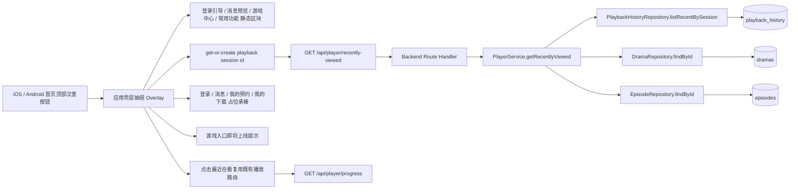

# 技术方案（共享部分）：PRD-07 菜单面板

> 创建日期：2026-07-27
> 对应需求：spec.md

## 整体架构



### 架构说明

- 本期不新增新的一级频道，也不把“我的”Tab 改造成真实个人中心；菜单面板是首页上的一个**应用壳层级**抽屉 Overlay。
- 抽屉状态必须提升到移动端壳层：
  - Android 至少位于 `NavGraph.kt` 所在的外层 `Scaffold` / Drawer 容器；
  - iOS 至少位于 `AppShellView.swift` / `TabNavigationHostView.swift` 可控层；
  - 不允许只把状态放在 `HomeScreen` / `HomeView` 内部。
- 面板内容分为两类：
  1. **静态首版区块**：登录引导、消息预览、游戏中心、常用功能；
  2. **动态区块**：最近在看，依赖 Backend 新增 `GET /api/player/recently-viewed`。
- 最近在看复用当前播放器匿名会话体系：客户端在请求前先通过现有 `PlaybackSessionStore` 执行 get-or-create session id，再携带 `X-Playback-Session-Id` 调用接口。
- 最近在看卡片点击后不新增新路由，继续复用当前播放器入口：
  - Android：`AppDestination.play(dramaId)`；
  - iOS：`.player(videoId: dramaId)`。
- 登录、消息、我的预约、我的下载本期只提供占位承接，不读取后续 PRD 的真实数据；游戏中心 4 个图标只做“即将上线”反馈。
- Web 不在本期设计范围内，不新增 `design-web.md`。

## API 设计

### 涉及变更

| 类型 | 数量 | 说明 |
|------|------|------|
| 新增接口 | 1 | `GET /api/player/recently-viewed` |
| 修改接口 | 0 | 无 |
| 废弃接口 | 0 | 无 |

> 兼容性说明：当前 `player` 域成功响应已采用 `{ code, data, message }` 结构（如 `progress` / `start` / `stop`），本期最近在看接口沿用同一成功包裹层；错误响应继续统一为 `{ error: { code, message } }`。

### 新增接口

#### `GET /api/player/recently-viewed`

- **功能简介**：返回当前匿名播放会话最近 3 条续播摘要，供菜单面板的“最近在看”区块使用。
- **Path Parameters**：无
- **Query Parameters**：无
- **Request Headers**：

| 字段 | 类型 | 必填 | 说明 |
|------|------|------|------|
| `X-Playback-Session-Id` | UUID string | 是 | 现有播放器与菜单面板共用的匿名播放会话 ID |

- **Request Body**：无

- **Response**：

```json
{
  "code": 0,
  "data": {
    "items": [
      {
        "drama_id": "550e8400-e29b-41d4-a716-446655440001",
        "title": "逆袭归来后我成了豪门团宠",
        "cover_url": "https://example.com/dramas/001.jpg",
        "episode_number": 12,
        "progress": 128.5,
        "updated_at": "2026-07-27T15:20:00.000Z"
      }
    ]
  },
  "message": "ok"
}
```

| 字段 | 类型 | 说明 |
|------|------|------|
| `code` | `0` | 成功标识，保持与现有 player 接口一致 |
| `data.items` | `RecentlyViewedItem[]` | 最近在看列表，最多 3 项 |
| `data.items[].drama_id` | UUID string | 当前短剧 ID，同时作为客户端现有 player route 的入参 |
| `data.items[].title` | string | 短剧标题 |
| `data.items[].cover_url` | URL string \| `null` | 封面地址；允许为空，客户端需展示占位图 |
| `data.items[].episode_number` | integer | 最近一次观看的集数 |
| `data.items[].progress` | number | 最近一次保存的播放进度（秒） |
| `data.items[].updated_at` | ISO datetime string | 最近一次续播记录更新时间 |
| `message` | string | 固定 `ok` |

- **Error Codes**：

| 状态码 | 错误码 | 说明 |
|--------|--------|------|
| 200 | — | 成功，允许 `items=[]` |
| 400 | `INVALID_PLAYBACK_SESSION` | header 缺失或非 UUID |
| 500 | `INTERNAL_ERROR` | 聚合或数据映射失败 |
| 503 | `SERVICE_UNAVAILABLE` | 数据源暂时不可用（预留） |

### 复用接口

| 接口 | 作用 | 本期变化 |
|------|------|---------|
| `GET /api/player/progress` | 最近在看卡片进入播放器后恢复续播点 | 无 |
| `POST /api/player/start` | 播放开始确认 | 无 |
| `POST /api/player/stop` | 播放停止后写入 / 更新 `playback_history` | 无 |

### Zod Schema 定义

```typescript
import { z } from 'zod';

export const RecentlyViewedItemSchema = z.object({
  drama_id: z.string().uuid(),
  title: z.string().min(1),
  cover_url: z.string().url().nullable().default(null),
  episode_number: z.number().int().min(1),
  progress: z.number().min(0),
  updated_at: z.string(),
});

export const RecentlyViewedResponseSchema = z.object({
  code: z.literal(0),
  data: z.object({
    items: z.array(RecentlyViewedItemSchema).max(3),
  }),
  message: z.string(),
});
```

## 数据模型

### 新增/变更数据表

| 表名 | 操作 | 说明 |
|------|------|------|
| `playback_history` | 不变 | 继续作为最近在看数据来源；依赖现有 `playback_session_id + drama_id` 唯一最新记录语义 |
| `dramas` | 不变 | 为最近在看补充 `title`、`cover_url` |
| `episodes` | 不变 | 为最近在看补充 `episode_number` |
| `RecentlyViewedItem`（逻辑模型） | 新增 | 提供给移动端消费的聚合响应实体 |

> 本期不新增数据库 migration。最近在看列表来自现有 `playback_history`、`dramas`、`episodes` 三表 / 仓储聚合。

### 共享实体设计

| 实体 | 字段 | 说明 |
|------|------|------|
| `RecentlyViewedItem` | `drama_id` / `title` / `cover_url` / `episode_number` / `progress` / `updated_at` | 最近在看卡片展示与跳转所需最小闭环数据 |
| `RecentlyViewedResponse` | `code` / `data.items[]` / `message` | `player` 域统一成功响应结构 |
| `MenuPanelStaticEntry` | `login` / `messages` / `booking` / `download` / `games[]` | 端侧静态菜单入口模型 |
| `MenuPanelPresentationState` | `closed` / `opening` / `open` / `closing` | 壳层抽屉状态机 |

### 数据约束

| 约束 | 说明 |
|------|------|
| 列表上限 | `items.length <= 3` |
| 排序规则 | `updated_at` 倒序 |
| 去重语义 | 依赖现有 `playback_session_id + drama_id` 唯一 upsert 语义，同一 drama 仅保留一条最新记录 |
| 失效记录过滤 | 若 history 指向的 drama / episode 已不存在，则服务端过滤该项，不下发脏数据 |
| 封面兜底 | `cover_url` 可为空，客户端展示占位封面，不报错 |
| 首版无账号聚合 | 仅按当前设备匿名会话返回，不承诺跨设备同步 |

## 跨端共享逻辑

| 共享逻辑 | 说明 | 涉及端 |
|---------|------|--------|
| 抽屉由壳层承载 | 抽屉打开后覆盖首页内容与底部 Tab 的交互层，背景不可点击 | iOS / Android |
| 会话准备时机 | 菜单面板请求最近在看前先执行 get-or-create playback session id | Backend / iOS / Android |
| 面板内静动态解耦 | 静态区块立即可见；最近在看区独立 loading / empty / error | iOS / Android |
| 最近在看列表上限 | 固定最多 3 条，按最近观看时间倒序 | Backend / iOS / Android |
| 卡片点击复用播放路由 | `drama_id` 直接映射现有 player route，不新增新路由 | iOS / Android |
| 占位承接关闭时机 | 点击登录 / 消息 / 预约 / 下载先关闭抽屉，再导航 | iOS / Android |
| 占位返回语义 | 从占位页返回后落到首页常态，菜单保持关闭 | iOS / Android |
| 游戏中心行为 | 点击任一游戏图标不导航，只提示“即将上线” | iOS / Android |
| 错误文案策略 | 只展示通用用户文案，不展示状态码 / header / 技术细节 | iOS / Android |

### 抽屉状态机约定

```text
首页常态(closed)
-> 点击汉堡按钮
-> opening
-> open

open
-> 点击蒙层 / 返回 / 关闭按钮
-> closing
-> closed

open
-> 点击登录/消息/预约/下载
-> closing
-> navigate placeholder route
-> placeholder screen
-> back
-> home closed
```

### 最近在看状态机约定

```text
menu open
-> prepare playback session id
-> recentlyViewed.loading
-> recentlyViewed.success(items)
   | recentlyViewed.empty
   | recentlyViewed.error(retryable)

retry
-> recentlyViewed.loading
-> success | empty | error
```

## 安全考虑

- **认证与授权**：
  - 最近在看接口首版不要求登录，但强制校验 `X-Playback-Session-Id`。
  - 静态入口不展示任何真实账号态敏感信息。
- **数据校验**：
  - 服务端校验 header 为 UUID；
  - 服务端对聚合结果执行 schema 校验；
  - 客户端在导航前校验 `drama_id` 非空。
- **敏感数据处理**：
  - 本期不返回手机号、昵称、头像真实地址、消息正文详情、预约列表、下载列表。
  - 登录头部仅为匿名引导态。
- **资源边界**：
  - 最近在看归属 `player` 域，避免在账号体系未落地前引入 `/api/user/*` 的误导性资源语义。

## 边界与错误处理（⚠️ 重点，最易遗漏）

### 错误处理架构

- **全局错误处理策略**：Backend 继续使用 `withErrorHandler`；移动端继续使用页面 / 区块级状态机处理，不新增全局异常框架。
- **错误响应格式**：
  - 成功：`{ code, data, message }`
  - 失败：`{ error: { code, message } }`
- **错误日志与监控**：首版依赖自动化测试与本地日志，不新增新的监控依赖。

### API 错误码定义

| 业务错误码 | HTTP 状态码 | 说明 | 用户提示文案 |
|-----------|------------|------|-------------|
| `INVALID_PLAYBACK_SESSION` | 400 | 缺失或非法 `X-Playback-Session-Id` | 加载失败，请稍后重试 |
| `INTERNAL_ERROR` | 500 | 服务内部聚合失败 | 加载失败，请稍后重试 |
| `SERVICE_UNAVAILABLE` | 503 | 数据源不可用（预留） | 服务暂不可用，请稍后重试 |
| `NETWORK_ERROR` | 客户端归一 | 断网 / DNS / TLS / 超时 | 网络异常，请检查后重试 |
| `ROUTE_NOT_READY` | 客户端归一 | 壳层尚未 ready，无法导航占位页 | 功能建设中，请稍后再试 |

### 边界场景处理

| 场景 | 触发条件 | API / 端侧行为 | 说明 |
|------|---------|----------------|------|
| 无历史 | 新用户或从未播放 | 返回 `200 + items=[]` | 最近在看区展示空态 |
| 历史不足 3 条 | 只有 1~2 条记录 | 返回现有条数 | 不补空卡 |
| header 缺失 | 客户端实现异常 | 400 + `INVALID_PLAYBACK_SESSION` | 用户只看到通用错误文案 |
| 断网 / DNS / 超时 | 最近在看请求失败 | 区块级 error + retry | 静态区块保持可用 |
| 500 / 503 | 服务端失败 | 区块级 error + retry | 不阻塞抽屉打开 |
| 快速重复开关抽屉 | opening / closing 中再次点击 | 只保留最后一次显式开关结果 | 不出现抖动或残留半开状态 |
| 抽屉关闭时请求尚未返回 | 用户快速关闭抽屉 | 允许取消或忽略返回结果 | 不在关闭后的首页闪动最近在看状态 |
| 重复点击入口 | 连续点击登录 / 消息 / 常用功能 | 只执行一次导航 | 避免压栈两次 |
| 路由未注册 / 容器未 ready | 占位页跳转失败 | 降级为“功能建设中”提示 | 不 crash |
| 失效历史记录 | drama / episode 已删除 | 服务端过滤无效项 | 客户端只看到有效条目 |
| `cover_url=null` | 短剧无封面 | 客户端用占位图渲染 | 不算错误 |

## 性能考虑

- 最近在看接口固定最多返回 3 条有效摘要；服务端应在约定的候选历史范围内按 `updated_at desc` 过滤失效记录后返回有效项，若过滤后有效项不足 3 条，允许直接返回更少数据。
- 客户端打开抽屉时仅新增一个最近在看请求；静态区块不依赖网络。
- 不新增持久化缓存，避免历史数据与真实 `playback_history` 脱节；允许单次抽屉会话内做内存级 in-flight 去重。
- 抽屉动画与最近在看数据加载解耦，动画不等待接口返回。
- 所有“先关闭菜单再导航”的入口都必须落实为**动画完成后再执行导航**的可验证时序机制，而不只是函数调用顺序；closing 态期间需防重入，避免抽屉残影与重复压栈。
- 不新增新依赖与复杂图片管线，沿用当前端侧图片加载与占位策略。

## 参考资料

### 已查阅的 wiki 文档

| 文档 | 相关章节 | 关键信息 |
|------|---------|---------|
| `wiki/features/app-shell/index.md` | 容器结构 / 已知限制 | 移动端当前是 5 Tab 壳层，菜单需挂在更高层而非首页内容内部 |
| `wiki/features/homepage-feed/index.md` | 首页顶部结构 | 当前首页顶部只有标题与搜索入口，是菜单按钮接入点 |
| `wiki/features/video-player/index.md` | 播放链路 | 最近在看点击后应复用现有播放器主链路 |
| `wiki/architecture/overview.md` | Native / Web 承载策略 | Web 不在本期范围，菜单面板为 Native 能力 |

### 已查阅的代码文件

| 文件 | 关键内容 |
|------|---------|
| `backend/src/app/api/player/progress/route.ts` | 当前 `player` 域 route 的 header 校验与 route 组织样式 |
| `backend/src/services/player/player.service.ts` | 当前播放器 service 聚合层，可继续承载最近在看逻辑 |
| `backend/src/repositories/interfaces/playback-history.repository.interface.ts` | 当前缺少按 session 列表查询能力，需要扩展 |
| `backend/src/repositories/mock/playback-history.mock.repository.ts` | mock 仓储当前仅支持 `findLatest` / `upsert` |
| `backend/src/repositories/supabase/playback-history.supabase.repository.ts` | Supabase 仓储当前仅支持单条查找与 upsert |
| `backend/src/lib/schemas.ts` | 当前已有 playback session / player response schema，可扩展 recently-viewed schema |
| `backend/src/lib/errors.ts` | 当前错误码枚举包含 `INVALID_PLAYBACK_SESSION` / `INTERNAL_ERROR` / `SERVICE_UNAVAILABLE` |
| `ios/ShortDrama/Sources/App/AppShellView.swift` | iOS 壳层 TabView 是抽屉 overlay 承载候选层 |
| `ios/ShortDrama/Sources/App/TabNavigationHostView.swift` | iOS 首页与 home 子路由由同一导航栈承接 |
| `ios/ShortDrama/Sources/Core/Storage/PlaybackSessionStore.swift` | iOS 已具备 get-or-create playback session id 能力 |
| `ios/ShortDrama/Sources/Data/DataSources/PlayerRemoteDataSource.swift` | iOS 当前 player 域请求已通过 header 传递 session id |
| `android/app/src/main/java/com/djs66256/short_drama/navigation/NavGraph.kt` | Android 底部栏在外层 Scaffold，抽屉需提升到该层 |
| `android/app/src/main/java/com/djs66256/short_drama/core/storage/PlaybackSessionStore.kt` | Android 已具备 get-or-create playback session id 能力 |
| `android/app/src/main/java/com/djs66256/short_drama/core/network/ApiService.kt` | Android 当前已声明 player 域接口，可扩展 recently-viewed endpoint |
| `android/app/src/main/java/com/djs66256/short_drama/feature/common/ui/PlaceholderScreen.kt` | Android 现有占位页可复用为登录 / 消息 / 预约 / 下载承接 |
| `ios/ShortDrama/Sources/Features/Home/Views/HomeView.swift` | iOS 首页 toolbar 是汉堡按钮接入点 |
| `android/app/src/main/java/com/djs66256/short_drama/feature/home/ui/HomeScreen.kt` | Android 首页 top bar 是汉堡按钮接入点 |
