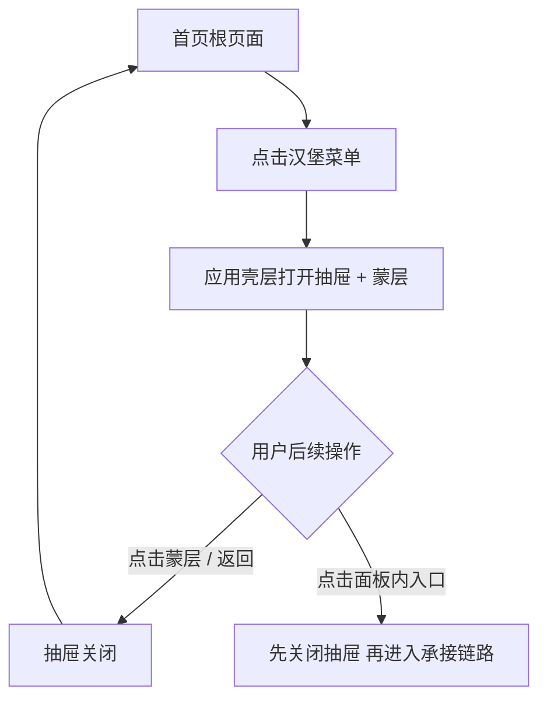
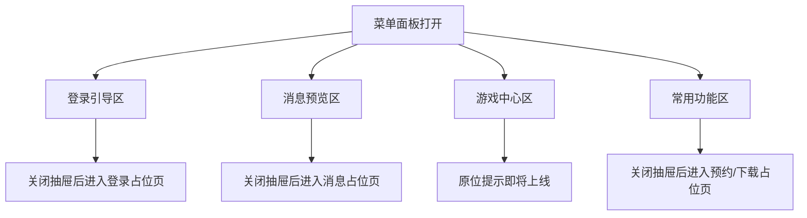
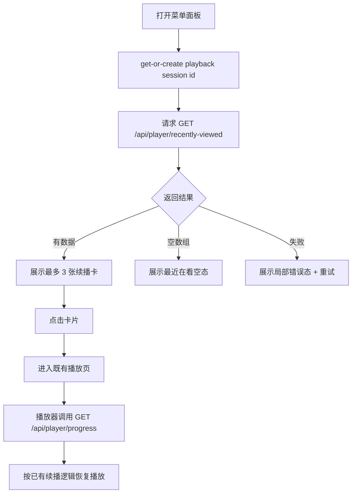

# 需求文档：PRD-07 菜单面板

> 创建日期：2026-07-27
> 状态：草稿
> 作者：AI Agent + daniel

---

## 1. 需求背景

### 1.1 问题描述

- **现状**：PRD-02 已让 Android / iOS 首页进入真实 Feed 首屏，PRD-04 ~ PRD-06 又在首页频道内补齐了搜索发现、排行和分类等内容发现链路，但首页顶部当前仍只有标题与搜索入口，缺少一个稳定的个人工具聚合入口。用户无法从首页快速查看最近观看记录、进入登录引导、触达消息预览，也没有统一入口承接“我的预约”“我的下载”等后续个人能力。
- **痛点**：
  - 用户从首页无法一跳回到最近观看内容，续播链路只能在再次命中内容卡片后重新进入播放页。
  - “我的”频道当前仍是占位页，但菜单面板要解决的是“首页上的快捷个人工具入口”，而不是把 Profile Tab 直接替换成真实个人中心。
  - Backend 虽已具备播放进度读写能力（`GET /api/player/progress`、`POST /api/player/start`、`POST /api/player/stop`），但还没有供菜单面板直接消费的“最近在看列表”接口。
  - 登录、消息、预约、下载等能力分属后续 PRD，当前既不能直接交付真实功能，也不能继续让菜单入口缺失。
- **竞品参考**：红果首页左上角汉堡菜单会打开左侧抽屉，顶部是登录 CTA，下方依次为消息预览、最近在看、游戏中心和常用功能。该抽屉定位是“个人中心式工具面板”，不是新的一级频道。

### 1.2 预期目标

- **目标**：在 Android / iOS 首页顶部新增汉堡菜单入口，点击后以 Native 左侧抽屉形式打开菜单面板；面板内承载登录引导、消息预览、最近在看、游戏中心和常用功能入口，同时由 Backend 新增最近在看列表接口，为移动端提供最多 3 条续播摘要数据。
- **成功指标**（可度量）：
  - Android / iOS 首页左上角均可打开菜单面板，抽屉开合动画完成时间小于 300 ms，点击蒙层或系统返回可关闭。
  - 菜单面板必须由应用壳层承载，而不是只挂在首页内容组件内部；打开后需覆盖首页内容区与底部 Tab 容器的可交互层，背景可见但不可点击。
  - Backend `GET /api/player/recently-viewed` 在携带有效 `X-Playback-Session-Id` 时可返回最多 3 条按最近观看时间倒序排列的续播摘要；无历史或脏数据过滤后不足 3 条时允许返回更少数据，而不是报错。
  - Android / iOS 菜单面板均能展示固定信息架构：登录引导区、消息预览区、最近在看区、游戏中心区、常用功能区。
  - 点击最近在看卡片后可复用既有播放页主链路继续播放；登录、消息、预约、下载等未完成能力有明确、可测试的占位承接，不出现无响应点击。

### 1.3 范围定义

| 范围内 | 范围外（明确不做） | 原因 |
|--------|------------------|------|
| Android / iOS 首页左上角汉堡菜单入口 | Web 端菜单面板 | 当前产品承载策略下，个人工具入口优先按 Native 规划 |
| Android / iOS Native 左侧抽屉 UI、开合动画、蒙层与返回关闭逻辑 | 将“我的”频道替换为真实个人中心 | 本 PRD 是首页工具面板，不重构一级频道结构 |
| 菜单面板由应用壳层承载，覆盖首页内容区和底部 Tab 的交互层 | 仅在 `HomeScreen` / `HomeView` 内部局部实现一个小侧栏 | 需要保证蒙层、底部 Tab 不可交互、返回关闭和跨路由行为一致 |
| 登录引导区、消息预览区、最近在看区、游戏中心区、常用功能区的首版面板布局 | C 端真实登录能力 | 登录真实能力由 PRD-08 负责 |
| Backend `GET /api/player/recently-viewed` | 跨设备同步、账号态历史聚合 | 当前仓库尚无 C 端用户体系，首版复用匿名播放会话能力 |
| 最近在看卡片点击复用既有播放链路 | 独立“观看历史页” | 首版只交付摘要续播能力 |
| 登录 / 消息 / 我的预约 / 我的下载的占位承接页或占位反馈 | 消息中心、预约管理、下载管理的真实业务实现 | 分别由后续 PRD 负责 |
| 游戏中心 4 个静态入口与“即将上线”反馈 | 游戏中心真实 H5 / 小程序分发能力 | 属于远期扩展 |
| “我的预约”入口的静态占位承接 | 接入现有排行预约数据并形成预约资产列表 | 真实预约资产管理由后续 PRD 负责，本期不消费 `POST /api/dramas/:id/book` 产生的数据 |

> 本期重点是把“首页 → 菜单面板 → 续播 / 工具入口”主链路打通，而不是一次性完成完整个人中心体系。

---

## 2. 术语表

| 术语 | 定义 | 来源 |
|------|------|------|
| 菜单面板 | 从首页左上角汉堡菜单唤起的左侧抽屉式个人工具面板 | PRD / 本文档收敛 |
| 汉堡菜单入口 | 首页顶部栏左上角的菜单按钮，用于打开菜单面板 | 本文档新定义 |
| 应用壳层承载 | 指菜单面板状态由 Android `NavGraph` / iOS `AppShellView` 或等价的顶层导航容器管理，而不是由首页内容组件单独管理 | 本文档新定义 |
| 最近在看 | 菜单面板中的续播摘要区，展示最近 3 条播放历史对应的短剧卡片 | PRD / 竞品研究 |
| 播放会话 ID | 通过 `X-Playback-Session-Id` 传递的匿名播放会话标识；Android / iOS 当前都已有本地 get-or-create 存储能力 | 当前代码 / 本文档收敛 |
| 占位承接页 | 在真实业务能力尚未完成前，用于接住点击动作的 Native 占位页面或明确占位反馈 | 本文档新定义 |
| 常用功能 | 菜单面板中承接“我的预约”“我的下载”的工具区 | 竞品研究 / PRD |
| 消息预览 | 菜单面板中位于顶部的单条消息摘要区域，首版不接真实消息服务 | PRD / 本文档收敛 |

---

## 3. 涉及平台

| 平台 | 是否涉及 | 变更概要 |
|------|---------|---------|
| Backend | ✅ 涉及 | 新增最近在看列表接口；复用现有播放历史、剧集与短剧仓储聚合最近 3 条摘要 |
| Web | ❌ 不涉及 | Web 首页仍维持应用壳与代表性路由，不交付菜单面板 |
| iOS | ✅ 涉及 | 首页顶部增加左侧菜单按钮；由应用壳层承载左侧抽屉、最近在看列表、工具入口与占位承接 |
| Android | ✅ 涉及 | 首页顶部增加左侧菜单按钮；由应用壳层承载左侧抽屉、最近在看列表、工具入口与占位承接 |

---

## 4. 用户故事

| 编号 | 角色 | 需求 | 验收标准 | 涉及平台 | 优先级 |
|------|------|------|---------|---------|--------|
| US-01 | 所有用户 | 我希望从首页快速打开个人工具菜单 | 首页左上角出现汉堡菜单；点击后从左侧拉出菜单面板，点击蒙层或返回后关闭 | iOS / Android | P0 |
| US-02 | 匿名用户 | 我希望在菜单中看到明确的登录引导 | 菜单顶部展示头像占位、登录提示文案和“立即登录”入口；点击后进入登录占位承接页 | iOS / Android | P0 |
| US-03 | 有播放历史的用户 | 我希望在菜单中直接回到最近观看内容 | 菜单中展示最近 3 条观看摘要；点击卡片后复用既有播放链路继续播放 | Backend / iOS / Android | P0 |
| US-04 | 所有用户 | 我希望在菜单中看到消息和常用工具入口 | 菜单中展示 1 条消息预览、“我的预约”“我的下载”入口及点击承接 | iOS / Android | P1 |
| US-05 | 所有用户 | 我希望游戏中心入口有统一反馈 | 菜单中展示 4 个游戏入口图标，点击反馈“即将上线” | iOS / Android | P1 |
| US-06 | 研发与后续 PRD | 我希望最近在看数据契约稳定可复用 | Backend 提供统一的最近在看响应结构，空数据、非法 header、剧集缺失等情况有可预测行为 | Backend | P1 |
| US-07 | 异常场景用户 | 我希望加载失败或无历史时也能理解当前状态 | 最近在看区域覆盖 loading / empty / error 三态；其它静态区块不受影响 | Backend / iOS / Android | P1 |

---

## 5. 功能详述

### 5.1 US-01：从首页打开 / 关闭菜单面板

#### 流程描述

1. 用户位于首页根页面时，首页顶部栏左侧展示汉堡菜单按钮，右侧继续保留搜索入口。
2. 用户点击汉堡菜单按钮。
3. 菜单面板状态由应用壳层统一管理：
   - Android 至少提升到 `NavGraph` / 外层 `Scaffold` 可控层；
   - iOS 至少提升到 `AppShellView` / `TabNavigationHostView` 可控层；
   - 不允许只把面板状态放在 `HomeScreen` / `HomeView` 内部。
4. 当前页面上方出现半透明蒙层，菜单面板从左侧滑入，覆盖屏幕约 75% ~ 80% 宽度；首页内容区与底部 Tab 作为背景保留但不可交互。
5. 菜单面板从上到下依次展示：登录引导区、消息预览区、最近在看区、游戏中心区、常用功能区。
6. 用户可通过以下任一方式关闭面板：
   - 点击右侧蒙层；
   - 触发系统返回（Android）/ 关闭动作（iOS）；
   - 再次点击菜单按钮（若当前平台实现支持）。
7. 关闭后回到原首页状态，不刷新首页 Feed，不丢失首页当前滚动位置。



#### 前置条件

- [x] Android / iOS 已有首页根页面。
- [x] 首页已有顶部栏与搜索入口。
- [ ] 首页顶部栏需要新增左侧菜单按钮。
- [ ] 应用壳层需要新增菜单面板状态管理与 overlay 承载。

#### 后置条件

- 菜单面板开闭状态在应用壳层可追踪。
- 首页 Feed 数据与滚动状态在面板关闭后保持。
- 面板打开期间背景区域不可误触。

#### 涉及的 UI/交互（如有）

| 页面 / 区域 | 交互描述 | 涉及端 |
|------------|---------|--------|
| 首页顶部栏左侧 | 新增汉堡菜单按钮 | iOS / Android |
| 菜单面板容器 | 左侧滑入、覆盖 75% ~ 80% 宽度、整屏高度 | iOS / Android |
| 蒙层 | 半透明遮罩，点击关闭 | iOS / Android |
| 背景首页与底部 Tab | 保留视觉上下文但不响应点击 | iOS / Android |

#### 边界与异常

**错误处理：**

| 操作步骤 | 错误类型 | 触发条件 | 系统行为 | 用户感知 |
|---------|---------|---------|---------|---------|
| 打开菜单面板 | 状态异常 | 动画状态与点击状态重复触发 | 忽略重复打开请求，仅保留一个打开态 | 无明显抖动 / 无重复开启动画 |
| 关闭菜单面板 | 并发冲突 | 打开 / 关闭快速连续触发 | 以最后一次显式操作为准 | 面板稳定落在打开或关闭其中一种状态 |
| 打开菜单面板 | 路由容器未 ready | 应用壳层尚未完成首屏承载 | 延迟到容器 ready 后再显示，不允许 crash | 首次点击可能轻微延迟，但无错误弹窗 |

**边界场景：**

| 场景 | 触发条件 | 预期行为 |
|------|---------|---------|
| 首页首次加载中 | Feed 仍在 loading 时打开面板 | 允许打开菜单面板；静态区可直接展示，最近在看区独立加载 |
| 首页错误态 | 首页加载失败时打开面板 | 允许打开菜单面板；关闭后仍回到首页错误态 |
| 滚动后打开面板 | 首页列表已滚动 | 关闭后保留原滚动位置 |
| 非首页根路由 | 已进入搜索 / 排行 / 分类 / 播放等子路由 | 首版仅要求首页根页面展示汉堡按钮；其它子路由不强制显示 |

### 5.2 US-02 / US-04 / US-05：菜单面板信息架构与入口承接

#### 流程描述

1. 菜单面板打开后展示固定区块顺序：
   - 登录引导区
   - 消息预览区
   - 最近在看区
   - 游戏中心区
   - 常用功能区
2. 登录引导区展示头像占位、引导文案和“立即登录”按钮。由于真实登录能力属于 PRD-08，首版点击进入登录占位承接页，而不是无响应。
3. 消息预览区展示 1 条静态系统通知摘要与未读标记，点击进入消息占位承接页。
4. 游戏中心区展示 4 个静态图标入口。点击任意图标时，不离开当前页面，直接反馈“即将上线”。
5. 常用功能区展示“我的预约”“我的下载”两项列表入口，点击进入对应占位承接页。
6. “我的预约”首版只提供静态入口与占位承接，不读取排行页已有预约能力、也不展示预约资产列表；“我的下载”同理仅做入口与占位承接。
7. 所有需要跳转的入口都遵循同一规则：
   - 先关闭菜单面板；
   - 再进入对应占位承接页；
   - 从占位承接页返回时，回到首页常态（菜单关闭），而不是回到“菜单仍打开”的中间态。
8. 占位承接页统一要求：
   - 标题与入口语义一致；
   - 文案明确说明真实能力将在后续 PRD 接入；
   - 支持正常返回。



#### 前置条件

- [ ] Android / iOS 已提供菜单面板静态布局。
- [ ] Android / iOS 已补齐必要的占位承接页或等效占位反馈。

#### 后置条件

- 面板内所有可点击项都有明确承接，不出现点击无响应。
- 未完成能力不会被误解为已上线真实功能。
- 占位承接页的进入 / 返回行为在 Android / iOS 保持一致。

#### 涉及的 UI/交互（如有）

| 页面 / 区域 | 交互描述 | 涉及端 |
|------------|---------|--------|
| 登录引导区 | 头像占位 + 提示文案 + “立即登录”按钮 | iOS / Android |
| 消息预览区 | 单条通知摘要 + 未读点 + 进入消息页入口 | iOS / Android |
| 游戏中心区 | 4 个图标入口，点击后原位提示“即将上线” | iOS / Android |
| 常用功能区 | “我的预约”“我的下载”列表项，带箭头 | iOS / Android |
| 占位承接页 | 统一的 Native 占位页面或路由承接 | iOS / Android |

#### 边界与异常

**错误处理：**

| 操作步骤 | 错误类型 | 触发条件 | 系统行为 | 用户感知 |
|---------|---------|---------|---------|---------|
| 点击登录 / 消息 / 常用功能入口 | 路由未注册 | 实现遗漏或配置错误 | 阻止崩溃，回退为明确的“功能建设中”提示或安全占位页 | 不显示原始错误码 / 不暴露技术细节 |
| 点击登录 / 消息 / 常用功能入口 | 重复点击 | 快速连击 | 只处理一次有效跳转，后续点击忽略 | 最多进入一次承接页 |
| 点击游戏入口 | 交互误导 | 真实能力未实现 | 不导航，原位反馈“即将上线” | Toast / HUD / Alert |
| 关闭抽屉并跳转 | 状态不同步 | 抽屉动画未结束即发起导航 | 先完成关闭态，再执行导航 | 页面转场稳定，不出现抽屉残留 |

**边界场景：**

| 场景 | 触发条件 | 预期行为 |
|------|---------|---------|
| 面板内容超出一屏 | 小屏设备 / 字体放大 | 菜单内容整体可滚动，不遮挡底部区块 |
| 返回链路 | 从占位承接页返回 | 回到首页常态，菜单保持关闭 |
| 承接页打开失败 | 路由容器尚未就绪 | 不 crash，降级为“功能建设中”提示 | 用户能理解当前功能未就绪 |

### 5.3 US-03 / US-06 / US-07：最近在看列表与续播链路

#### 流程描述

1. 菜单面板打开后，最近在看区准备请求 `GET /api/player/recently-viewed`。
2. 客户端在发起请求前，先与当前播放器共用同一套 playback session store，执行 get-or-create session id。
3. 客户端带上 `X-Playback-Session-Id` 请求最近在看接口；首版不要求用户登录。
4. Backend 基于 `playback_session_id` 从播放历史中取最近更新的 3 条记录，并聚合短剧与剧集信息，返回最近在看摘要列表。
5. 客户端展示最多 3 张横向卡片，每张卡片至少包含：封面、标题、`已看到第 N 集` 文案。
6. 用户点击最近在看卡片时：
   - Android 复用既有 `play/{videoId}` 路由；
   - iOS 复用既有 `.player(videoId:)` 路由；
   - 不新增独立“继续观看”播放路由。
7. 播放页进入后继续复用现有播放器进度链路：客户端会按 `dramaId + X-Playback-Session-Id` 调用 `GET /api/player/progress` 拉取续播点，再进入既有播放启动流程。
8. 若当前没有最近在看数据，则最近在看区展示空态文案，如“暂无最近在看，去首页看看吧”。
9. 若最近在看请求失败，则仅该区展示局部错误态与重试按钮，不影响面板内其它静态区块。



#### 前置条件

- [x] Backend 已有播放历史读写能力与 `playback_history` 数据来源。
- [x] Android / iOS 已具备 playback session store，且支持 get-or-create 会话 ID。
- [x] Android / iOS 既有播放页已支持按 `dramaId + X-Playback-Session-Id` 恢复续播点。
- [ ] Backend 需新增最近在看列表聚合接口。

#### 后置条件

- 菜单面板中的最近在看区可独立于首页 Feed 展示最近 3 条续播摘要。
- 点击最近在看卡片后进入统一播放主链路，而不是另起一套续播承接页。
- 无历史和请求失败都能在最近在看区内部被解释清楚。

#### 涉及的 UI/交互（如有）

| 页面 / 区域 | 交互描述 | 涉及端 |
|------------|---------|--------|
| 最近在看区标题 | 展示“最近在看” | iOS / Android |
| 最近在看卡片 | 横向 3 卡以内，展示封面、标题、续播提示 | iOS / Android |
| 最近在看空态 | 当列表为空时展示引导文案 | iOS / Android |
| 最近在看错误态 | 展示错误文案与重试按钮 | iOS / Android |
| 最近在看接口 | 返回最近 3 条观看摘要 | Backend |

#### 边界与异常

**错误处理：**

| 操作步骤 | 错误类型 | 触发条件 | 系统行为 | 用户感知 |
|---------|---------|---------|---------|---------|
| 准备最近在看请求 | 会话初始化失败 | 本地 session store 异常 | 不 crash；最近在看区降级为空态或局部错误态 | 仅看到该区不可用，不显示技术细节 |
| 请求最近在看 | 网络异常 | 断网 / DNS 失败 / TLS 失败 | 仅最近在看区进入错误态，允许重试 | 区域级错误文案 + 重试按钮 |
| 请求最近在看 | 请求超时 | 网络慢或服务处理超时 | 终止当前请求并显示局部错误态 | “加载失败，请重试” |
| 请求最近在看 | 服务端错误 | 500 / 502 / 503 | 仅最近在看区进入错误态 | 不展示原始状态码，给出通用错误提示 |
| 请求最近在看 | Header 非法 | `X-Playback-Session-Id` 为空或非 UUID | 返回 400 校验错误；客户端视作实现异常并进入局部错误态 | 用户只看到“加载失败”，不暴露协议细节 |
| 渲染最近在看 | 关联短剧已不存在 | 历史记录指向无效 drama | 服务端过滤无效项，不让脏数据泄漏到客户端 | 用户只看到有效条目 |
| 点击最近在看卡片 | 路由参数异常 | `dramaId` 为空 | 阻止跳转并提示错误 | 轻提示 / 不崩溃 |
| 最近在看区重试 | 重复点击 | 用户快速连续点击重试 | 仅保留一个 in-flight 请求 | 按钮进入 loading 态，不重复报错 |

**边界场景：**

| 场景 | 触发条件 | 预期行为 |
|------|---------|---------|
| 无观看历史 | 新用户或从未播放过 | 返回 `data=[]`，最近在看区展示空态 |
| 历史条数不足 3 条 | 仅有 1 ~ 2 条记录 | 展示现有条数，不补空卡 |
| 同一短剧多次停止播放 | 用户多次续播同一 drama | 最近在看只保留该 drama 最新记录 |
| 多端匿名会话不一致 | 更换设备 / 清空本地会话 | 首版不要求跨设备同步，按当前设备会话历史返回 |
| 快速重复打开面板 | 面板反复开关 | 最近在看可按页面级缓存策略避免无意义重复请求，但最终展示结果必须与当前最新历史一致 |
| 面板关闭时请求仍在进行 | 用户刚打开即关闭 | 允许取消或忽略返回结果，不得在关闭后的页面上错误闪动 |

### 5.4 US-06：最近在看接口契约

#### 流程描述

1. 客户端请求 `GET /api/player/recently-viewed`。
2. Route 层校验 `X-Playback-Session-Id`，首版该 header 为必填，因为当前 C 端登录尚未上线。
3. Service 层执行聚合流程：
   - 从播放历史仓储中按 `playback_session_id` 读取最近更新的候选历史记录，按 `updated_at` 倒序取固定窗口；
   - 利用当前“每个 `playback_session_id + drama_id` 只保留一条最新历史”的存储语义，保证同一 drama 不重复返回；
   - 按 `drama_id` 读取短剧基础信息；
   - 按 `episode_id` 读取剧集信息，获取 `episode_number`；
   - 过滤掉剧集或短剧缺失的脏记录；
   - 返回过滤后最多 3 条有效摘要；若有效项不足 3 条，可直接返回实际条数。
   - 组装响应。
4. Response 结构首版定义如下，并沿用当前 `player` 域已有的成功包裹风格：

```json
{
  "code": 0,
  "data": {
    "items": [
      {
        "drama_id": "550e8400-e29b-41d4-a716-446655440001",
        "title": "逆袭归来后我成了豪门团宠",
        "cover_url": "https://example.com/dramas/001.jpg",
        "episode_number": 12,
        "progress": 128.5,
        "updated_at": "2026-07-27T15:20:00.000Z"
      }
    ]
  },
  "message": "ok"
}
```

5. 该接口不要求登录，不返回分页信息，固定最多返回 3 条。
6. 当无历史时返回 `200 + { code: 0, data: { items: [] }, message: "ok" }`。
7. 该接口归属 player / playback-history 领域，而不是 user 领域；未来若接入账号态聚合，可在保持响应结构兼容的前提下增强实现。

#### 前置条件

- [ ] Backend 新增最近在看 response schema、route、service 聚合逻辑。
- [ ] 播放历史仓储需补充“按播放会话列出最近记录”的读取能力。

#### 后置条件

- Android / iOS 可不读取整套播放历史表，直接消费统一的最近在看摘要契约。
- 未来即使切换到账号态历史，只要保持响应结构不变，客户端可继续兼容。

#### 涉及的 UI/交互（如有）

| 页面 / 区域 | 交互描述 | 涉及端 |
|------------|---------|--------|
| N/A | Backend 数据契约，无直接 UI | Backend |

#### 边界与异常

**错误处理：**

| 操作步骤 | 错误类型 | 触发条件 | 系统行为 | 用户感知 |
|---------|---------|---------|---------|---------|
| 请求最近在看 | Header 非法 | `X-Playback-Session-Id` 为空或非 UUID | 返回 400 校验错误 | 客户端最近在看区错误态 |
| 聚合最近在看 | 数据缺失 | `drama_id` 或 `episode_id` 对应实体缺失 | 过滤失效记录并继续返回其它有效项 | 用户只看到可续播内容 |
| 聚合最近在看 | 服务内部错误 | 仓储异常 | 返回 500 统一错误结构 | 客户端最近在看区错误态 |

**边界场景：**

| 场景 | 触发条件 | 预期行为 |
|------|---------|---------|
| 超过 3 条历史 | 播放记录较多 | 仅返回最近 3 条 |
| 同一 drama 有多条历史 | 多次 stop 产生更新 | 以历史表中的最新记录为准 |
| 最近候选记录中存在脏数据 | `drama` / `episode` 已删除或不匹配 | 过滤无效项后返回剩余有效摘要；不足 3 条时允许返回实际条数 |
| 进度字段很小 | 刚进入播放就退出 | 仍返回该记录，由客户端决定是否展示为可续播 |
| 后续引入登录态 | PRD-08 之后接入账号体系 | 首版接口仍兼容 `X-Playback-Session-Id`，账号聚合作为后续增强 |

---

## 6. 数据概览

| 数据实体 | 说明 | 关键字段 | 来源 |
|---------|------|---------|------|
| MenuPanelSection | 菜单面板中的固定区块 | `login`, `messagePreview`, `recentlyViewed`, `gameCenter`, `commonFunctions` | 客户端静态定义 |
| RecentlyViewedItem | 最近在看摘要项 | `drama_id`, `title`, `cover_url`, `episode_number`, `progress`, `updated_at` | Backend `GET /api/player/recently-viewed` |
| PlaybackSessionId | 当前设备的匿名播放会话标识 | `X-Playback-Session-Id` | 客户端本地 session store / 请求头 |
| MessagePreviewItem | 菜单中的单条消息预览 | `title`, `summary`, `isUnread` | 客户端静态占位数据 |
| CommonFunctionEntry | 常用功能入口 | `booking`, `download` | 客户端静态定义 |

### 数据关系

```text
[PlaybackSessionId] ──1:N──▶ [PlaybackHistory]
[PlaybackHistory] ──N:1──▶ [Drama]
[PlaybackHistory] ──N:1──▶ [Episode]
[PlaybackHistory + Drama + Episode] ──聚合──▶ [RecentlyViewedItem]
[MenuPanel] ──1:N──▶ [MenuPanelSection]
[CommonFunctionEntry] ──1:1──▶ [占位承接页]
```

---

## 7. 现有功能影响

| 现有功能 | 影响类型 | 说明 | 是否需要迁移 |
|---------|---------|------|------------|
| 首页顶部栏 | 修改行为 | 从“标题 + 搜索”调整为“菜单按钮 + 标题 / 品牌语义 + 搜索” | 否 |
| 首页 Feed | 新增关联 | 菜单面板覆盖在首页之上打开，但不改动 Feed 数据 contract | 否 |
| 播放器进度链路 | 新增关联 | 菜单面板最近在看复用现有 `player/progress/start/stop` 与播放会话能力 | 否 |
| “我的”频道占位页 | 无直接影响 | 一级频道结构不变，菜单面板不是 Profile Tab 替代品 | 否 |
| 排行预约能力 | 边界澄清 | 本期“我的预约”只提供静态入口与占位承接，不读取 `POST /api/dramas/:id/book` 形成的预约数据 | 否 |
| 后续登录 / 消息 / 资产管理 PRD | 新增关联 | 本期先提供入口和占位承接，后续 PRD 在对应入口上替换真实内容 | 否 |
| Web 首页 | 无影响 | Web 保持现有应用壳与代表性链接 | 否 |

### 兼容性说明

- 本期不调整现有 5 个一级频道，菜单面板属于首页频道上的附加交互层。
- 最近在看卡片继续复用既有播放路由，不新增新的播放器页面语义。
- Backend 最近在看接口首版依赖 `X-Playback-Session-Id`，与当前播放器匿名会话设计保持兼容。
- 登录、消息、预约、下载等真实业务尚未交付，但所有入口都必须有明确占位承接，避免未来替换真实页面时再改导航语义。
- 最近在看接口归属 player 域，避免在账号体系未落地前引入含混的 `/api/user/*` 语义。

---

## 8. 非功能性需求

### 8.1 性能

| 指标 | 目标值 | 测量方式 |
|------|--------|---------|
| 菜单面板开 / 关动画时长 | < 300 ms | 本地设备 / 模拟器录屏观测 |
| 最近在看接口响应时间（P95） | < 300 ms | Backend 测试与本地日志 |
| 面板首屏可交互时间 | < 500 ms | 手动验证面板打开与区域渲染时间 |
| 面板滚动帧率 | ≥ 55 fps | 移动端手动体验与列表复杂度控制 |

### 8.2 安全

| 关注点 | 要求 |
|--------|------|
| 认证与授权 | 首版最近在看接口不要求登录，但必须校验 `X-Playback-Session-Id` 合法性 |
| 数据校验 | 服务端需校验 header；客户端需处理空列表、错误态与无效点击 |
| 敏感数据 | 首版不展示手机号、昵称、账号信息等用户隐私数据 |
| 防滥用 | 首版无需额外登录态限流，但接口需具备基础参数与 header 校验 |

### 8.3 兼容性

| 维度 | 要求 |
|------|------|
| 设备兼容 | 继续遵循当前 Android / iOS 最低支持版本 |
| 数据兼容 | 最近在看响应结构未来演进时应保持字段向后兼容 |
| 向后兼容 | 旧版本没有菜单面板不受影响；新接口为增量新增 |

---

## 9. 依赖

| 依赖项 | 类型 | 说明 | 状态 | 阻塞 |
|--------|------|------|------|------|
| 首页 Feed 与首页顶部栏 | 内部能力 | 菜单面板入口挂载在首页根页面 | ✅ 已就绪 | 否 |
| 应用壳层导航容器 | 内部能力 | 需承载抽屉 overlay、蒙层与返回关闭行为 | ✅ 已就绪（需扩展） | 否 |
| 播放页路由 | 内部能力 | 最近在看卡片点击后复用播放页 | ✅ 已就绪 | 否 |
| playback session store | 内部能力 | Android / iOS 已有匿名播放会话存储与 get-or-create 能力 | ✅ 已就绪 | 否 |
| `GET /api/player/progress` / `POST /api/player/start` / `POST /api/player/stop` | 内部能力 | 最近在看续播依赖既有播放器进度主链路 | ✅ 已就绪 | 否 |
| 最近在看列表聚合接口 | 内部能力 | 本 PRD 新增 Backend 能力 | 🚧 待开发 | 是 |
| 登录能力 | 内部能力 | 真实登录流程由 PRD-08 提供，本期只做占位承接 | 📅 规划中 | 否 |
| 消息能力 | 内部能力 | 真实消息中心由 PRD-10 提供，本期只做静态预览 + 占位承接 | 📅 规划中 | 否 |
| 我的预约 / 我的下载 | 内部能力 | 真实内容管理功能由 PRD-11 提供，本期只做入口 + 占位承接 | 📅 规划中 | 否 |

---

## 10. 待澄清问题

当前无阻塞推进的待澄清问题。

首版默认决策如下：

- 最近在看卡片首版只展示“已看到第 N 集”，不展示进度百分比或播放时长。
- 消息预览区首版使用静态系统文案，不引入后端动态配置能力。
- 登录引导区未来在 PRD-08 接入真实账号体系后，再从匿名 CTA 头部演进为用户信息头部；本 PRD 不阻塞于该未来态设计。

---

## 11. 参考资料

### 已查阅的 wiki 文档

| 文档 | 相关章节 | 关键信息 |
|------|---------|---------|
| `wiki/features/app-shell/index.md` | 功能概述 / 入口与路由 / 已知限制 | 确认移动端当前为 5 Tab 容器，首页是内容发现承载点，“我的”频道仍为占位页 |
| `wiki/features/homepage-feed/index.md` | 入口与路由 / 核心逻辑 | 确认首页顶部当前只有标题与搜索入口，菜单面板需挂在首页根页面 |
| `wiki/features/video-player/index.md` | 入口与路由 / 状态管理 | 确认最近在看点击后应复用既有播放主链路 |
| `wiki/features/data-models/index.md` | Drama 数据模型 / 已知限制 | 确认 `Drama.id / title / cover_url / episode_count` 等字段是客户端已有基础卡片字段 |
| `wiki/architecture/overview.md` | 当前首页与发现链路承载结构 / 已知限制 | 确认 Web 不在本期范围内，移动端首页频道是 Native 功能挂载点 |

### 已查阅的产品 / 竞品文档

| 文档 | 关键内容 |
|------|---------|
| `docs/product_manager/prd/2026-07-25-menu-panel/prd.md` | 菜单面板需求背景、范围边界和目标模块 |
| `docs/product_manager/prd/2026-07-25-menu-panel/subtasks.md` | Backend 最近在看 API、iOS / Android 抽屉 UI 和首页入口拆分 |
| `docs/product_research/mobile/homepage-feed/menu-panel/menu-panel.md` | 红果菜单抽屉的整体信息架构 |
| `docs/product_research/mobile/homepage-feed/menu-panel/recently-viewed/recently-viewed.md` | 最近在看模块的展示方式与续播定位 |
| `docs/product_research/mobile/homepage-feed/menu-panel/common-functions/common-functions.md` | 常用功能区“我的预约 / 我的下载”的结构 |

### 已查阅的代码文件

| 文件 | 关键内容 |
|------|---------|
| `android/app/src/main/java/com/djs66256/short_drama/feature/home/ui/HomeScreen.kt` | 首页顶部当前仅有标题与搜索入口，适合作为菜单按钮接入点 |
| `android/app/src/main/java/com/djs66256/short_drama/navigation/NavGraph.kt` | 当前外层 `Scaffold` 承载底部栏，菜单面板需提升到该层或等价壳层管理 |
| `android/app/src/main/java/com/djs66256/short_drama/feature/common/ui/PlaceholderScreen.kt` | 已有通用占位页，可复用为登录 / 消息 / 预约 / 下载承接 |
| `android/app/src/main/java/com/djs66256/short_drama/core/storage/PlaybackSessionStore.kt` | Android 已具备 playback session get-or-create 能力 |
| `ios/ShortDrama/Sources/Features/Home/Views/HomeView.swift` | 首页顶部当前仅有搜索 ToolbarItem，需补左侧菜单入口 |
| `ios/ShortDrama/Sources/App/AppShellView.swift` | iOS `TabView` 是抽屉 overlay 的候选承载层 |
| `ios/ShortDrama/Sources/App/TabNavigationHostView.swift` | home Tab 当前承载首页与子路由，其余 tab 仍是占位页 |
| `ios/ShortDrama/Sources/Features/Shell/Views/PlaceholderTabView.swift` | 现有占位页模式可扩展为菜单入口承接 |
| `ios/ShortDrama/Sources/App/AppRoute.swift` | 当前 home tab 子路由集中管理，可扩展菜单相关承接路由 |
| `ios/ShortDrama/Sources/Core/Storage/PlaybackSessionStore.swift` | iOS 已具备 playback session get-or-create 能力 |
| `backend/src/app/api/player/progress/route.ts` | 当前已存在按 `dramaId + X-Playback-Session-Id` 查询续播点的接口 |
| `backend/src/app/api/player/start/route.ts` | 当前已存在播放开始接口，可确认播放器主链路已落地 |
| `backend/src/app/api/player/stop/route.ts` | 当前已存在播放停止并写入历史的接口 |
| `backend/src/repositories/interfaces/playback-history.repository.interface.ts` | 当前播放历史仓储只有单条查询与 upsert，需要补充最近列表查询能力 |
| `backend/src/lib/schemas.ts` | 当前已有播放器请求/响应与播放历史 schema，可扩展最近在看 schema |
| `web/src/features/home/HomeScreen.tsx` | 确认 Web 首页仍为代表性链接壳，不纳入本 PRD |

---

## 12. 变更历史

| 日期 | 变更内容 | 变更原因 |
|------|---------|---------|
| 2026-07-27 | 初始版本 | PRD-07 菜单面板进入 feature-workflow |
| 2026-07-27 | 修订接口命名、抽屉承载层、会话来源与错误矩阵 | 根据第 1 轮 spec review 修复问题 |
