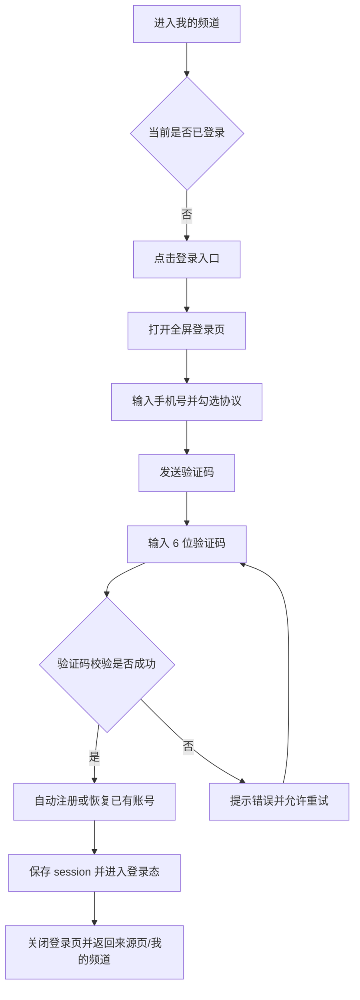
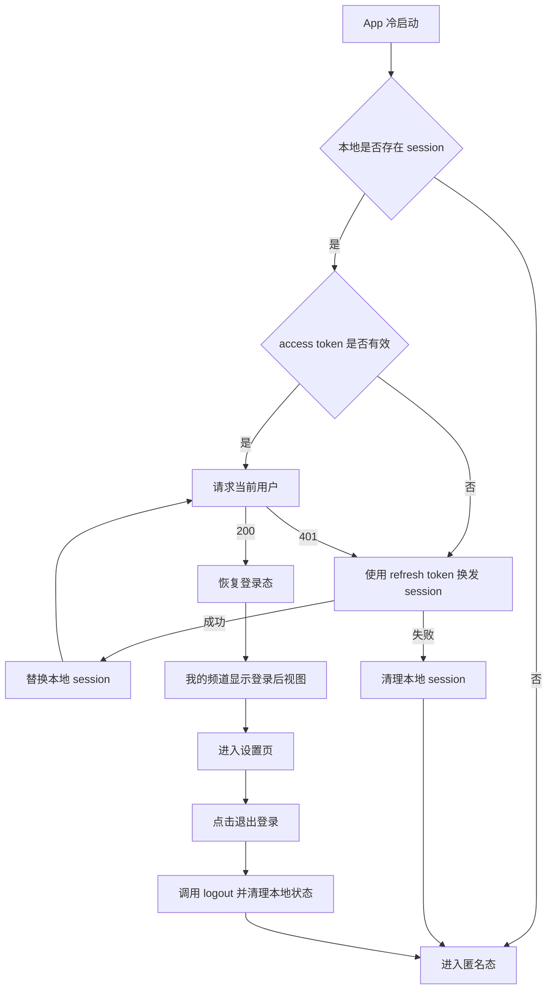
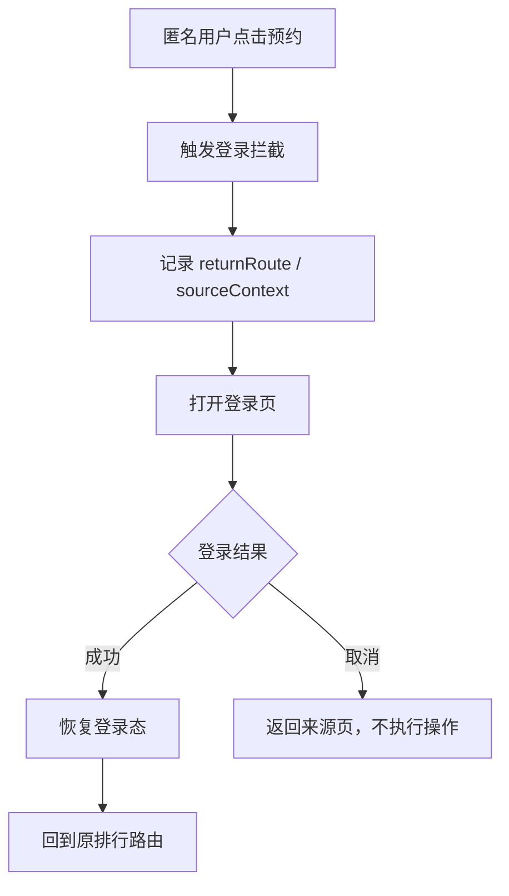
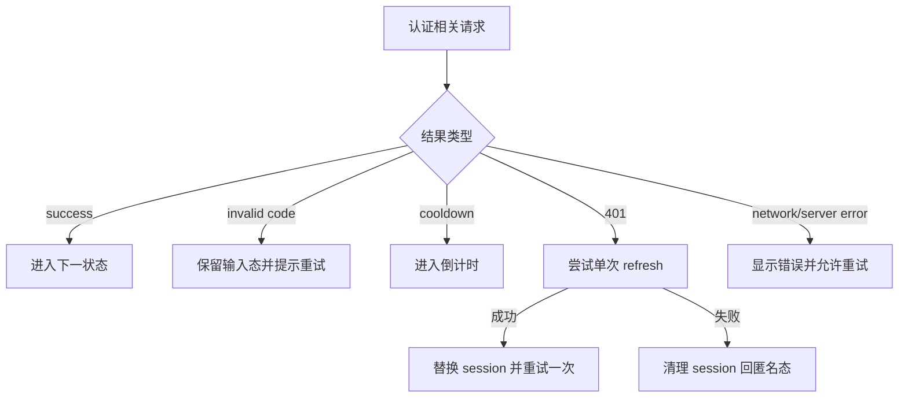

# 需求文档：PRD-08 用户登录与注册

> 创建日期：2026-07-28
> 状态：草稿
> 作者：AI Agent + daniel

---

## 1. 需求背景

### 1.1 问题描述

- **现状**：
  - Backend 已具备 Supabase 基础设施与 admin 登录能力，但面向移动端用户的手机号验证码登录、当前用户查询、会话刷新、登出、session 恢复与统一认证链路尚未落地。
  - iOS / Android 已有 5 个一级频道容器与“我的”Tab，但“我的”频道当前仍是 placeholder 页面，没有登录入口、用户态展示、设置页或退出登录能力。
  - 排行页的“预约”交互已经预留登录拦截语义：Android 会发出 `RequireLogin(returnRoute)`，iOS 会发出 `.requireLogin(RankingLoginContext)`，但两端都还没有真实登录页与登录后回跳流程。
  - Backend 现有用户态接口主要依赖骨架式 `x-user-id` 或将 `Bearer token` 直接当作 userId 的过渡实现，尚未形成真实的移动端认证闭环。
- **痛点**：
  - 用户无法建立可持续的身份，后续评论、预约、消息、资产、播放历史等个性化能力都无法稳定承接。
  - 当前“我的”频道是死路，用户无法主动登录，也无法查看或退出当前账号。
  - 已有“需要登录”的业务入口无法真正把用户带到登录流程，导致交互链路中断。
  - 若继续沿用骨架态认证，会造成客户端、后端、后续 PRD（评论/消息/资产）之间的用户身份语义不一致。
  - 标题中的“登录与注册”如果不定义清楚，会导致 Backend 用户创建时机、QA 测试口径以及后续资料补全流程出现歧义。
- **竞品参考**：竞品登录页为全屏页面，主流程为手机号 + 验证码登录，包含标题文案、手机号输入、验证码发送、协议勾选与登录后返回来源页的链路。首版不追求一键登录或第三方 OAuth，而是先完成基础手机号登录闭环。

### 1.2 预期目标

- **目标**：为 Android / iOS 建立可复用的手机号验证码登录体系，完成“主动登录 + 登录拦截 + 登录态恢复 + 会话刷新 + 退出登录”的基础用户体系闭环，并由 Backend 提供统一认证 API。
- **成功指标**（可度量）：
  - Android / iOS 用户均可从“我的”频道进入真实登录页，完成“输入手机号 → 获取验证码 → 输入验证码 → 登录成功 → 返回来源页/登录入口页”的闭环。
  - 首次使用某手机号完成验证码校验时，系统自动创建用户并直接进入登录态；同一手机号再次校验时走登录成功链路，不存在独立注册页。
  - 用户在登录成功后重启 App，能够自动恢复登录态；当 access token 过期时，客户端可按统一 contract 使用 refresh token 完成刷新，失败后再回到匿名态。
  - 排行页“预约”场景的登录拦截在 Android / iOS 都能跳转到登录页；登录成功后能够回到原来源路由继续操作。
  - Backend 提供规范化的认证 REST API，并通过自动化测试覆盖参数校验、未登录、验证码错误、限流/冷却、refresh 失败、异常场景等核心路径。
  - 骨架态 `x-user-id` / “Bearer 即 userId” 不再作为移动端正式认证方案；受保护接口统一收敛到真实登录态校验语义。

### 1.3 范围定义

| 范围内 | 范围外（明确不做） | 原因 |
|--------|------------------|------|
| Backend 认证 API：发送验证码、校验验证码创建/恢复会话、刷新会话、获取当前用户、登出 | 第三方登录（微信 / Apple / 抖音等） | 首版先建立基础手机号登录闭环 |
| Android / iOS 全屏登录页（手机号、验证码、协议勾选、发送冷却、错误提示） | 密码登录 | 首版仅支持验证码登录 |
| Android / iOS 登录态持久化、自动恢复、过期失效后回到匿名态 | 独立“注册页”或独立注册步骤 | 本期定义为“登录注册一体化”，首次验证码通过即自动注册 |
| Android / iOS “我的”频道最小登录入口与设置/退出登录入口 | 完整菜单面板 PRD-07 的全部信息架构 | 当前代码里“我的”仍是 placeholder，本期只补齐登录相关最小闭环 |
| 排行预约场景的真实登录拦截与登录成功回跳 | 评论页真实拦截接入 | 评论功能在 PRD-09 落地时复用本期拦截能力 |
| 基于 Supabase Auth 的手机号 OTP 登录能力 | 生产环境短信供应商的商务配置细节 | 首版实现按 Supabase Auth contract 开发，生产短信配置由环境接入解决 |
| 开发 / CI 基于本地 Supabase 栈或可替换测试 OTP fixture 的验证能力 | 多国家区号选择与国际手机号支持 | 首版按当前产品默认市场收敛为 +86 |

> 本期重点是把“我的频道登录入口 / 业务拦截登录 / 用户态恢复 / 刷新 / 登出”主链路打通，而不是一次性做成完整个人中心或多登录方式体系。

---

## 2. 术语表

| 术语 | 定义 | 来源 |
|------|------|------|
| 匿名态 | 未登录用户的默认状态，可浏览内容但不能执行需要身份的操作 | 本文档新定义 |
| 登录态 | 用户已通过手机号验证码完成认证，并持有可恢复的有效 session | 本文档新定义 |
| OTP | One-Time Password，一次性验证码；本期指手机号短信验证码 | 本文档新定义 |
| 登录拦截 | 用户在匿名态执行需要登录的操作时，被引导进入登录页的机制 | PRD / 本文档收敛 |
| 返回路由 | 登录拦截发生时记录的来源页面或来源操作上下文，登录成功后用于回跳 | 本文档新定义 |
| 设置页 | “我的”频道中承载退出登录等账号管理动作的最小页面 | 本文档新定义 |
| Supabase Auth | 项目采用的基础认证能力，负责手机号验证码发送、session 与用户身份校验 | `wiki/decisions/2026-07-24-supabase-baas.md` |
| Native 承接页 | Android / iOS 客户端本地实现的页面，而非独立 H5 页面 | `PRODUCT.md` |
| Access Token | 用于访问受保护业务接口的短期凭证，由 Backend 基于 Supabase session 返回给客户端 | 本文档新定义 |
| Refresh Token | 用于换发新 access token 的长期凭证，仅保存在移动端安全存储，不用于普通业务接口请求 | 本文档新定义 |
| 自动注册 | 首次使用某手机号验证码校验成功时，系统自动创建用户记录并返回登录 session；不提供独立注册页 | 本文档新定义 |

---

## 3. 涉及平台

| 平台 | 是否涉及 | 变更概要 |
|------|---------|---------|
| Backend | ✅ 涉及 | 新增移动端认证 API、补齐刷新与当前用户 contract、升级真实 JWT / session 校验语义 |
| Web | ❌ 不涉及 | 当前产品策略下登录页不作为独立 Web 交付范围 |
| iOS | ✅ 涉及 | “我的”频道最小登录入口、登录页、session 恢复与刷新、排行预约登录拦截回跳、设置/退出登录 |
| Android | ✅ 涉及 | “我的”频道最小登录入口、登录页、session 恢复与刷新、排行预约登录拦截回跳、设置/退出登录 |

---

## 4. 用户故事

| 编号 | 角色 | 需求 | 验收标准 | 涉及平台 | 优先级 |
|------|------|------|---------|---------|--------|
| US-01 | 匿名用户 | 我希望能主动进入登录页并用手机号验证码登录 | 从“我的”频道点击登录入口后，完成手机号输入、验证码发送、验证码校验并成功进入登录态；首次登录手机号自动创建账号 | Backend / iOS / Android | P0 |
| US-02 | 匿名用户 | 我希望只有在同意协议后才能登录 | 未勾选协议时，发送验证码和确认登录操作均不可提交；勾选后按钮才可用 | iOS / Android | P0 |
| US-03 | 已登录用户 | 我希望关闭 App 后再次打开时保持登录状态 | App 冷启动后可恢复当前账号；若 access token 过期则尝试 refresh；若 refresh 失败则自动退回匿名态并给出可理解提示 | Backend / iOS / Android | P0 |
| US-04 | 已登录用户 | 我希望能在“我的”频道退出登录 | 进入设置页后可执行退出登录；退出后本地 session 被清空，页面回到匿名态 | Backend / iOS / Android | P1 |
| US-05 | 匿名用户 | 我希望在执行需要登录的操作时被正确拦截，并在登录后回到原页面 | 排行预约场景下，匿名用户点击预约会进入登录页；登录成功后回到原排行路由并可继续操作 | iOS / Android | P1 |
| US-06 | 异常场景用户 | 我希望在验证码错误、网络失败、发送频繁或 session 失效时得到明确反馈 | 登录页和业务拦截链路覆盖 loading / error / cooldown / refresh / session-expired 等状态 | Backend / iOS / Android | P1 |

---

## 5. 功能详述

### 5.1 US-01 / US-02：从“我的”频道主动进入登录页并完成手机号验证码登录

#### 流程描述

1. 用户进入“我的”频道。
2. 若当前为匿名态，则页面展示最小登录入口（如“立即登录 / 登录后同步你的记录”等 CTA），不再使用纯 placeholder 文案。
3. 用户点击登录入口，进入全屏 Native 登录页。
4. 登录页展示：
   - 顶部关闭 / 返回；
   - 标题与价值文案；
   - 固定 `+86` 区号展示；
   - 手机号输入框；
   - 验证码输入框；
   - “获取验证码”按钮；
   - 协议勾选框与协议链接；
   - “登录 / 确认”主按钮。
5. 用户输入合法手机号并勾选协议后，可点击“获取验证码”。
6. Backend 创建一次 OTP 请求并发送验证码成功后，客户端进入验证码输入态，并开始 60 秒冷却倒计时。
7. 用户输入 6 位验证码后点击确认登录。
8. Backend 校验成功后：
   - 若手机号对应用户不存在，则自动创建用户；
   - 若已存在，则直接恢复该用户登录；
   - 两种情况都返回统一的 `AuthSession` 与 `AuthUser` 数据结构。
9. 客户端保存 session、切换为登录态并关闭登录页。
10. 若本次是主动从“我的”频道进入登录页，则登录成功后回到“我的”频道登录后视图；若本次来自拦截场景，则按返回路由回到来源页。



#### 前置条件

- [x] Android / iOS 已具备“我的”频道入口。
- [ ] Backend 已提供统一认证 API。
- [ ] 移动端已具备本地 session 存储能力。

#### 后置条件

- 用户处于登录态。
- 客户端已持久化可恢复的 session 信息。
- 首次登录手机号已具备明确的自动注册语义。
- “我的”频道切换为登录后视图，不再展示匿名 CTA。

#### 涉及的 UI/交互（如有）

| 页面 / 区域 | 交互描述 | 涉及端 |
|------------|---------|--------|
| 我的频道匿名态 | 展示登录 CTA 与登录收益文案 | iOS / Android |
| 登录页顶部 | 返回 / 关闭登录页 | iOS / Android |
| 手机号输入区 | 固定展示 `+86`，支持 11 位手机号输入与格式校验 | iOS / Android |
| 验证码输入区 | 支持 6 位数字输入、聚焦与删除 | iOS / Android |
| 协议区 | 复选框 + 用户协议 / 隐私政策链接 | iOS / Android |
| 获取验证码按钮 | 根据手机号合法性、协议勾选、冷却状态切换可用性 | iOS / Android |
| 登录确认按钮 | 根据验证码输入完整性与提交状态切换可用性 | iOS / Android |

#### 边界与异常

**错误处理：**

| 操作步骤 | 错误类型 | 触发条件 | 系统行为 | 用户感知 |
|---------|---------|---------|---------|---------|
| 输入手机号 | 数据校验失败 | 为空、非 11 位、非数字、非 `1` 开头 | 阻止发送验证码 | 输入框下方提示 |
| 点击获取验证码 | 权限不足 | 未勾选协议 | 阻止提交 | 按钮不可用或轻提示 |
| 点击获取验证码 | 网络异常 | 断网 / 超时 / DNS 失败 | 保持输入态，允许重试 | Toast / 内联错误 |
| 点击获取验证码 | 服务端错误 | 500 / 502 / 503 | 不进入倒计时 | Toast / 内联错误 |
| 点击获取验证码 | 防滥用限制 | 发送过于频繁 | 返回剩余冷却秒数并保持倒计时 | “请 N 秒后重试” |
| 点击确认登录 | 数据校验失败 | 验证码为空、长度不足、含非法字符 | 阻止提交 | 输入框下方提示 |
| 点击确认登录 | 验证码错误 | 验证码与服务端不匹配 | 保持验证码输入态 | “验证码错误，请重新输入” |
| 点击确认登录 | 验证码过期 | 超过有效期 | 清理当前验证码态，允许重新获取 | “验证码已过期，请重新获取” |
| 登录成功落盘 | 本地存储异常 | Keychain / DataStore / SharedPreferences 写入失败 | 不进入伪登录态，保留登录页 | 错误提示并允许重试 |

**边界场景：**

| 场景 | 触发条件 | 预期行为 |
|------|---------|---------|
| 重复点击发送验证码 | 用户短时间连续点击 | 客户端只提交一次；按钮进入 loading / cooldown，避免重复请求 |
| 重复点击确认登录 | 用户在网络慢时连续点击 | 仅允许一次请求在 flight，避免重复提交 |
| 切后台后返回登录页 | 验证码倒计时过程中切后台 | 返回后倒计时保持准确，不重置为初始值 |
| 登录页关闭再重进 | 用户发送验证码后退出登录页再回来 | 重新进入时不强制保留旧验证码输入，但冷却状态可按当前 session 恢复或重新获取 |
| 粘贴验证码 | 用户一次性粘贴 6 位验证码 | 正常识别与提交 |
| 本地已有旧 session | 匿名态下又主动进入登录页 | 若本地 session 已失效，应先清理旧状态再开始新登录 |
| 协议链接打开后返回 | 用户查看协议后回到登录页 | 已输入的手机号 / 验证码 / 勾选状态应尽量保留 |

### 5.2 US-03 / US-04：恢复登录态、刷新会话并支持退出登录

#### 流程描述

1. App 冷启动时，客户端读取本地保存的 `AuthSession`。
2. 若本地不存在 session，则直接进入匿名态。
3. 若本地存在 session，则按以下统一 contract 恢复：
   - access token 未过期：优先调用“查询当前用户”接口校验当前用户；
   - access token 已过期，或请求 `GET /api/users/me` 返回 401：改用 refresh token 调用刷新接口换发新 session；
   - refresh 成功：原子替换本地 `accessToken`、`refreshToken`、`expiresAt`，然后重新拉取当前用户；
   - refresh 失败：清理本地 session，退回匿名态。
4. 用户进入“我的”频道时：
   - 匿名态展示登录入口；
   - 登录态展示当前账号摘要（至少包含手机号脱敏展示或用户标识）与设置入口。
5. 用户进入设置页并点击“退出登录”。
6. 客户端调用 Backend 登出接口，并无论接口结果是否成功，都清理本地 session。
7. 退出成功后返回匿名态；若当前页面依赖登录，则退回到可访问的匿名页面。



#### 前置条件

- [ ] 移动端本地已具备 session 安全存储能力。
- [ ] Backend 已提供当前用户、刷新会话与登出接口。

#### 后置条件

- App 冷启动后具备明确的匿名态 / 登录态判定结果。
- 退出登录后，客户端本地不再残留可恢复的登录 session。
- access token 过期时具备可执行的统一 refresh 路径，而不是让每端各自定义临时逻辑。
- 依赖登录的业务入口重新进入拦截态。

#### 涉及的 UI/交互（如有）

| 页面 / 区域 | 交互描述 | 涉及端 |
|------------|---------|--------|
| App 启动阶段 | 恢复登录态时可展示轻量 loading / skeleton，避免闪烁 | iOS / Android |
| 我的频道登录后态 | 展示手机号脱敏摘要、设置入口 | iOS / Android |
| 设置页 | 包含退出登录按钮与二次确认 | iOS / Android |
| 退出确认 | 避免误触登出 | iOS / Android |

#### 边界与异常

**错误处理：**

| 操作步骤 | 错误类型 | 触发条件 | 系统行为 | 用户感知 |
|---------|---------|---------|---------|---------|
| 启动恢复 session | 网络异常 | 校验当前用户失败 | 不进入脏登录态；若已有 refresh token，则允许按 contract 再尝试一次 refresh；仍失败则回匿名态 | 轻提示或静默回退 |
| 启动恢复 session | 权限不足 | token 过期 / refresh 失败 | 清理本地状态 | 回到匿名态 |
| 受保护请求触发刷新 | 并发冲突 | 多个请求同时发现 token 失效 | 仅允许一次 single-flight refresh，其他请求等待结果 | 无重复弹窗 |
| 点击退出登录 | 网络异常 | logout 请求失败 | 本地仍应清理 session，避免“假登录” | 轻提示“已退出，本地状态已清除” |
| 点击退出登录 | 服务端错误 | 500 / 503 | 以本地登出为准，服务端异常不阻止用户退出 | 轻提示 |

**边界场景：**

| 场景 | 触发条件 | 预期行为 |
|------|---------|---------|
| 本地 session 存在但格式损坏 | 存储内容不完整 / 反序列化失败 | 清理损坏数据并回匿名态 |
| 用户在多个设备登录 | 当前设备 session 被其他设备影响 | 以服务端当前有效 session 结果为准；失效则回匿名态 |
| 退出登录后返回上一页 | 历史栈中仍保留需要登录的页面 | 页面重新校验登录态，不继续显示受保护操作 |
| 启动过程很慢 | `GET /api/users/me` 校验较慢 | 启动态要可理解，不出现先显示已登录再瞬间退匿名的闪烁 |
| App 长时间后台后回前台 | access token 在后台期间过期 | 前台恢复时先 refresh，再决定是否维持登录态 |

### 5.3 US-05：业务登录拦截、登录成功回跳与后续复用

#### 流程描述

1. 匿名用户在需要登录的业务入口执行操作。
2. 本期至少覆盖已存在的排行预约场景：
   - Android 排行页已具备 `RequireLogin(returnRoute)` effect；
   - iOS 排行页已具备 `RankingLoginContext` route effect。
3. 客户端统一进入登录页，并记录返回路由 / 来源上下文。
4. 用户完成登录后：
   - 若存在返回路由，则优先回到该路由；
   - 若来源操作是“预约”，则回到原排行页面，并保留原榜单类型与内容类型上下文；
   - 后续 PRD（评论、消息、资产）复用同一拦截与回跳机制，不重新定义一套新流程。
5. 用户取消登录时，回到来源页且不执行受保护操作。



#### 前置条件

- [x] 排行页已有拦截语义占位。
- [ ] 登录页与 session 管理已落地。

#### 后置条件

- 匿名用户不会直接触发需要登录的受保护操作请求。
- 登录成功后可恢复来源页上下文，而不是把用户丢回首页。
- 登录拦截能力可被 PRD-09 / PRD-10 / PRD-11 复用。

#### 涉及的 UI/交互（如有）

| 页面 / 区域 | 交互描述 | 涉及端 |
|------------|---------|--------|
| 排行预约按钮 | 匿名态点击后进入登录页，而不是直接报错 | iOS / Android |
| 登录页标题 / 提示 | 可根据来源场景展示“登录后可继续预约”等弱上下文提示 | iOS / Android |
| 登录取消返回 | 回到来源页，不触发预约成功假象 | iOS / Android |

#### 边界与异常

**错误处理：**

| 操作步骤 | 错误类型 | 触发条件 | 系统行为 | 用户感知 |
|---------|---------|---------|---------|---------|
| 触发拦截 | 状态不一致 | returnRoute 为空或非法 | 回退到安全默认页（我的频道或当前频道根页） | 不崩溃，提示可理解 |
| 登录成功回跳 | 路由失效 | 来源页已不可访问 | 回到对应频道根页 | 轻提示 |
| 取消登录 | 用户主动关闭登录页 | 不执行受保护操作 | 返回来源页 |

**边界场景：**

| 场景 | 触发条件 | 预期行为 |
|------|---------|---------|
| 多次触发登录拦截 | 用户短时间内多次点击预约 | 只打开一个登录页实例 |
| 登录页期间来源页被销毁 | 导航栈变化或 App 回收 | 登录成功后使用可恢复的 returnRoute 或安全默认页 |
| 登录成功后来源数据已变化 | 排行榜单内容刷新 | 回到原路由并重新拉取页面数据 |

### 5.4 US-06：认证异常、验证码错误、冷却与 session 失效处理

#### 流程描述

1. 用户在登录页或受保护业务入口触发认证相关请求。
2. 系统统一处理以下状态：
   - 发送验证码 loading / 成功 / cooldown / error；
   - 验证码校验 loading / success / invalid / expired / error；
   - session 恢复 loading / authenticated / anonymous / expired；
   - refresh loading / success / failed；
   - 受保护接口返回 401 时的统一退匿名与重新登录引导。
3. 若服务端返回 401 / session expired：
   - 客户端先检查当前是否已有 refresh 在 flight；
   - 若无，则发起一次 refresh，并对当前失败请求执行最多一次重试；
   - 若 refresh 仍失败，清空本地 session；
   - 当前页面退回匿名态；
   - 若当前动作必须登录，则重新触发登录拦截。
4. 错误文案面向用户可理解，不暴露底层 Supabase 错误原文、token、内部错误码或堆栈。



#### 前置条件

- [ ] 客户端与 Backend 已统一错误结构与认证状态语义。

#### 后置条件

- 认证相关错误具备统一的用户可理解反馈。
- session 失效时不会继续以假登录态访问受保护接口。
- 后续依赖登录的 PRD 可以直接复用同一套状态机。

#### 涉及的 UI/交互（如有）

| 页面 / 区域 | 交互描述 | 涉及端 |
|------------|---------|--------|
| 登录页按钮状态 | loading / disabled / cooldown / retry | iOS / Android |
| 登录页错误反馈 | 手机号校验错误、验证码错误、网络错误 | iOS / Android |
| 受保护页面 | session 失效后退匿名并提示重新登录 | iOS / Android |
| Backend 错误响应 | 对移动端返回统一错误格式与明确 message | Backend |

#### 边界与异常

**错误处理：**

| 操作步骤 | 错误类型 | 触发条件 | 系统行为 | 用户感知 |
|---------|---------|---------|---------|---------|
| 任意受保护请求 | 权限不足 | 未携带 token / token 无效 | 返回 401，客户端触发单次 refresh 或清理状态 | “登录已失效，请重新登录” |
| 认证接口 | 服务端错误 | 上游 Auth 服务不可用 | 返回统一错误响应 | “暂时无法登录，请稍后重试” |
| 认证接口 | 超时 | 网络慢或服务阻塞 | 允许重试，不进入错误登录态 | Toast / 按钮恢复 |
| 客户端恢复 session | 数据不一致 | 本地有 token，但 `GET /api/users/me` 返回不存在用户 | 清理本地状态 | 回到匿名态 |
| refresh 请求 | refresh token 无效 | token 被吊销 / 已过期 | 清理本地状态且不重试 refresh | 回到匿名态 |

**边界场景：**

| 场景 | 触发条件 | 预期行为 |
|------|---------|---------|
| App 长时间后台后回前台 | session 已过期 | 前台恢复时重新校验，必要时 refresh，失败后回匿名态 |
| 多请求并发返回 401 | 多个页面同时触发受保护请求 | 只执行一次全局 refresh / 退登录流程，避免重复弹窗 |
| 开发 / 测试环境无真实短信通道 | 本地环境不具备真实短信下发能力 | 通过本地 Supabase 栈、测试 OTP fixture 或可替换 auth mock 保证开发与自动化验证，不让 UI 进入死链路 |

---

## 6. 数据概览与认证契约

| 数据实体 | 说明 | 关键字段 | 来源 |
|---------|------|---------|------|
| AuthSession | 客户端持久化的登录 session | `accessToken`, `refreshToken`, `expiresAt`, `user` | Backend Auth API / Supabase Auth |
| AuthUser | 当前登录用户的基础信息 | `id`, `phone`, `displayName?`, `role?`, `isNewUser` | Backend `GET /api/users/me` / 创建会话接口 |
| SendCodeRequest | 发送验证码请求体 | `phone`, `countryCode`, `scene` | 用户输入 / 客户端提交 |
| VerifyCodeRequest | 校验验证码并创建会话请求体 | `phone`, `code`, `countryCode` | 用户输入 / 客户端提交 |
| RefreshSessionRequest | 刷新会话请求体 | `refreshToken` | 客户端安全存储 |
| LoginInterceptionContext | 登录拦截来源上下文 | `source`, `returnRoute`, `pendingAction?` | 客户端状态 |
| AuthStatus | 全局认证状态 | `anonymous`, `restoring`, `authenticated`, `refreshing`, `expired` | 客户端状态机 |
| ApiEnvelope | Backend 统一响应包裹 | `code`, `data`, `message` | Backend 通用响应规范 |

### 6.1 登录与注册语义

- 本期不提供独立“注册页”或单独注册步骤。
- 本期“注册”定义为：**某手机号首次完成验证码校验成功时，Backend 自动创建用户记录，并与登录成功返回共用同一条会话创建链路。**
- 同一手机号后续再次完成验证码校验时，不再创建新用户，而是直接创建新 session。
- `AuthUser.isNewUser` 用于告知客户端本次是否属于首登用户，仅用于埋点、欢迎态或后续资料补全引导；本期不要求强制补齐资料。
- QA 与埋点口径统一为：
  - “首登成功” = 首次验证码通过且 `isNewUser=true`；
  - “登录成功” = 已存在用户验证码通过且 `isNewUser=false`。

### 6.2 会话生命周期契约

#### 6.2.1 归属原则

- 移动端 **不直接接入 Supabase Auth SDK 与 Supabase 接口**，而是统一通过 Backend 暴露的 REST API 完成验证码、会话创建、刷新、当前用户查询与登出。
- Backend 负责：
  - 与 Supabase Auth 交互；
  - 把 Supabase 返回收敛为项目统一的 API envelope 与错误语义；
  - 决定 `AuthSession` 返回结构；
  - 在受保护接口上执行真实 JWT / session 校验。
- iOS / Android 负责：
  - 安全持久化 `AuthSession`；
  - 在请求受保护接口时附带 `Authorization: Bearer <accessToken>`；
  - 执行统一的恢复、refresh、登出、本地清理与登录拦截状态机。

#### 6.2.2 会话字段与持久化规则

| 字段 | 含义 | 客户端要求 |
|------|------|-----------|
| `accessToken` | 访问受保护接口的短期凭证 | 放入 Authorization header，不写日志 |
| `refreshToken` | 换发新 session 的凭证 | 仅保存在安全存储，不用于普通业务请求 |
| `expiresAt` | access token 过期时间（ISO 8601 时间戳） | 用于冷启动恢复、前后台切换和预刷新判断 |
| `user` | 当前 session 对应用户摘要 | 用于“我的”频道登录后态展示与状态同步 |

- iOS 使用 Keychain 或等价安全存储封装；Android 使用安全存储封装保存敏感 session，推荐以 `EncryptedSharedPreferences` 保存 `AuthSession`，并仅将 DataStore 用于 OTP cooldown 等非敏感辅助状态；不得明文打印 token。
- 本地存储必须支持“原子替换整个 session”，避免只更新了 access token 而 refresh token 未同步导致的脏状态。

#### 6.2.3 启动恢复与前后台切换

| 场景 | 触发条件 | 处理规则 |
|------|---------|---------|
| 冷启动恢复 | App 启动发现本地存在 session | 进入 `restoring`，先尝试 `GET /api/users/me`；若 401 或 access token 已过期，则改走 refresh |
| 前台恢复 | App 从后台回前台且本地存在 session | 若 access token 已过期或接近过期，先 refresh；否则允许正常访问并在首个受保护请求失败时兜底 refresh |
| 无本地 session | 首次安装、手动退出或清理数据后 | 直接进入 `anonymous` |

#### 6.2.4 401、refresh 与回退规则

- 仅对“明确因 access token 失效导致的 401”触发 refresh。
- refresh 必须为 single-flight：同一时刻只允许一个 refresh 请求，其他待重试请求等待同一结果。
- refresh 成功后：
  1. 原子替换本地 `AuthSession`；
  2. 最多重试一次当前失败请求；
  3. 更新全局认证状态为 `authenticated`。
- refresh 失败后：
  1. 清空本地 session；
  2. 更新状态为 `anonymous` / `expired`；
  3. 若当前动作要求登录，则触发登录拦截；
  4. 不做无限重试。

#### 6.2.5 `me`、refresh、logout 的职责边界

| 能力 | 职责 | 不负责 |
|------|------|--------|
| `GET /api/users/me` | 校验 access token 当前是否仍有效，并返回用户摘要 | 不换发 token |
| `POST /api/auth/session-refreshes` | 使用 refresh token 换发新的 access/refresh token 与过期时间 | 不承接首次登录，不查询业务资料 |
| `DELETE /api/auth/session` | 使当前客户端会话退出，并允许客户端清理本地状态 | 不负责决定回跳页面 |

### 6.3 认证 API 概览

> Backend 统一采用 `{ code, data, message }` 响应包裹格式；`code=0` 表示成功，非 0 表示业务失败。HTTP status 用于区分成功 / 客户端错误 / 鉴权失败 / 服务错误，客户端优先依据 HTTP status + `code` 联合判断。

#### 6.3.1 API 列表

| 能力名 | Method | Path | 是否鉴权 | 用途 |
|------|--------|------|---------|------|
| 发送验证码 | `POST` | `/api/auth/otp-requests` | 否 | 创建一次 OTP 请求并触发短信发送 |
| 验证码创建会话 | `POST` | `/api/auth/sessions` | 否 | 校验验证码，自动注册或登录，并返回 `AuthSession` |
| 刷新会话 | `POST` | `/api/auth/session-refreshes` | 否 | 使用 refresh token 换发新的 `AuthSession` |
| 获取当前用户 | `GET` | `/api/users/me` | 是 | 校验 access token 并返回当前用户摘要 |
| 退出登录 | `DELETE` | `/api/auth/session` | 是 | 使当前客户端会话退出 |

#### 6.3.2 请求与响应约定

##### 1）发送验证码

**Request**

```json
{
  "phone": "13800138000",
  "countryCode": "+86",
  "scene": "login"
}
```

**Success Response**

```json
{
  "code": 0,
  "data": {
    "requestId": "otp_req_xxx",
    "cooldownSeconds": 60,
    "expiresInSeconds": 300
  },
  "message": "ok"
}
```

##### 2）验证码创建会话（登录/自动注册一体化）

**Request**

```json
{
  "phone": "13800138000",
  "countryCode": "+86",
  "code": "123456"
}
```

**Success Response**

```json
{
  "code": 0,
  "data": {
    "accessToken": "<jwt>",
    "refreshToken": "<refresh-token>",
    "expiresAt": "2026-07-28T12:34:56Z",
    "user": {
      "id": "user_xxx",
      "phone": "138****8000",
      "displayName": null,
      "role": "viewer",
      "isNewUser": true
    }
  },
  "message": "ok"
}
```

##### 3）刷新会话

**Request**

```json
{
  "refreshToken": "<refresh-token>"
}
```

**Success Response**

```json
{
  "code": 0,
  "data": {
    "accessToken": "<new-jwt>",
    "refreshToken": "<new-refresh-token>",
    "expiresAt": "2026-07-28T13:34:56Z",
    "user": {
      "id": "user_xxx",
      "phone": "138****8000",
      "displayName": null,
      "role": "viewer",
      "isNewUser": false
    }
  },
  "message": "ok"
}
```

##### 4）获取当前用户

**Request Header**

```text
Authorization: Bearer <accessToken>
```

**Success Response**

```json
{
  "code": 0,
  "data": {
    "id": "user_xxx",
    "phone": "138****8000",
    "displayName": null,
    "role": "viewer",
    "isNewUser": false
  },
  "message": "ok"
}
```

##### 5）退出登录

**Request Header**

```text
Authorization: Bearer <accessToken>
```

**Success Response**

```json
{
  "code": 0,
  "data": null,
  "message": "ok"
}
```

#### 6.3.3 错误约定

| HTTP Status | `code` 示例 | 场景 | 客户端处理 |
|------------|------------|------|-----------|
| `400` | `AUTH_INVALID_PHONE` | 手机号格式非法 | 表单校验错误，不重试 |
| `400` | `AUTH_INVALID_CODE` | 验证码错误或非法 | 保留验证码输入态 |
| `401` | `AUTH_UNAUTHORIZED` | access token 无效或缺失 | 触发 refresh 或登录拦截 |
| `401` | `AUTH_REFRESH_EXPIRED` | refresh token 无效 / 过期 | 清理本地 session |
| `409` | `AUTH_CODE_COOLDOWN` | 发送过于频繁 | 进入倒计时 |
| `410` | `AUTH_CODE_EXPIRED` | 验证码过期 | 清理当前验证码态并允许重发 |
| `429` | `AUTH_RATE_LIMITED` | 达到限流阈值 | 提示稍后重试 |
| `500` / `503` | `SERVICE_UNAVAILABLE` | Auth 上游异常 | 提示暂时不可用 |

#### 6.3.4 Authorization 与 token 传递规则

- 仅受保护接口（如 `GET /api/users/me`、`DELETE /api/auth/session`、后续评论/资产等业务接口）携带 `Authorization: Bearer <accessToken>`。
- `POST /api/auth/session-refreshes` 不依赖 access token，使用 body 中的 `refreshToken` 即可。
- 客户端不得把 refresh token 放入 query string、日志、埋点或普通业务请求 header。
- Backend 不再支持移动端通过 `x-user-id` 或把 `Bearer token` 当 userId 的正式接入方式；该路径仅可在改造期内部过渡，完成本期后应停止作为移动端 contract 对外暴露。

### 6.4 数据关系

```text
[SendCodeRequest] ──create──▶ [OTP Request]
[VerifyCodeRequest] ──success──▶ [AuthSession]
[RefreshSessionRequest] ──success──▶ [AuthSession]
[AuthSession] ──contains──▶ [AuthUser]
[LoginInterceptionContext] ──optional──▶ [AuthSession]
[AuthSession] ──drives──▶ [AuthStatus]
```

---

## 7. 现有功能影响

| 现有功能 | 影响类型 | 说明 | 是否需要迁移 |
|---------|---------|------|------------|
| 我的频道 placeholder | 修改行为 | 由纯占位页改为匿名态 / 登录态双态入口页，并新增最小设置页 | 否 |
| 排行预约登录拦截 | 新增关联 | 从“提示需登录”升级为真实登录跳转与回跳 | 否 |
| Backend 认证中间件 | 修改行为 | 从骨架态 `x-user-id` / `Bearer=userId` 过渡到真实 access token / refresh token 语义 | 否 |
| 后续评论 / 消息 / 资产功能 | 新增关联 | 复用本期 session、refresh、登录拦截与当前用户能力 | 否 |
| Supabase 基础设施 | 新增关联 | 从仅基础设施与 admin auth 扩展到移动端用户认证闭环 | 否 |

### 兼容性说明

- 现有 Android / iOS 路由容器、首页、排行、分类等能力不需要改动一级频道结构，只是在“我的”频道与登录拦截点新增真实页面和认证状态管理。
- Web 端本期不交付真实登录页，不引入新的 Web 登录 contract。
- 对已经存在的排行预约接口，受保护语义将由骨架态认证升级为正式认证；客户端如果未完成登录接入，将不再能依赖 `x-user-id` 或伪 token 调用。
- 不要求迁移历史匿名数据；匿名态下产生的未持久化行为不做自动合并。

---

## 8. 非功能性需求

### 8.1 性能

| 指标 | 目标值 | 测量方式 |
|------|--------|---------|
| 登录页打开到首帧可交互 | < 1 秒 | 本地设备 / 模拟器手动验证 |
| 发送验证码接口响应（P95） | < 500 ms（不含短信到达时间） | Backend 自动化测试 / 本地日志 |
| 校验验证码接口响应（P95） | < 500 ms | Backend 自动化测试 / 本地日志 |
| refresh 接口响应（P95） | < 500 ms | Backend 自动化测试 / 本地日志 |
| App 冷启动登录态恢复 | < 1.5 秒内得出明确认证状态 | 启动日志 / 手动验证 |

### 8.2 安全

| 关注点 | 要求 |
|--------|------|
| 认证与授权 | 受保护接口必须依赖真实登录态，不再把客户端伪造 userId 当正式认证依据 |
| 数据校验 | 手机号、验证码、国家区号、返回路由、refresh token 等参数在客户端与服务端都要校验 |
| 敏感数据 | token / refresh token 不写入日志，不明文暴露在 UI；移动端持久化需使用平台安全存储能力 |
| 防滥用 | 发送验证码要有限流 / 冷却；验证码错误尝试次数需受控；避免短信刷量 |
| 错误信息 | 对用户展示可理解消息，不暴露底层供应商返回体、内部错误码、堆栈或密钥信息 |

### 8.3 兼容性

| 维度 | 要求 |
|------|------|
| 设备兼容 | 继续遵循当前 Android / iOS 最低支持版本 |
| 数据兼容 | 老版本匿名态仍可浏览内容；新版本登录态通过增量能力接入 |
| 向后兼容 | 认证接口采用新增 REST API；不破坏首页、排行、分类既有只读链路 |

---

## 9. 依赖

### 9.1 开发 / CI 阻塞依赖

| 依赖项 | 类型 | 说明 | 状态 | 是否阻塞本期开发 |
|--------|------|------|------|----------------|
| Supabase Auth 接入能力 | 外部服务 / 内部封装 | Backend 需完成对 Supabase OTP、session、refresh 的接入与错误语义封装 | 🚧 待接入 | 是 |
| 本地 Supabase 栈或测试 OTP fixture | 开发验证能力 | 本地开发、CI 与自动化测试可在无真实短信情况下验证 send-code / verify / refresh 主链路 | 🚧 待接入到本期认证链路 | 是 |
| “我的”频道容器 | 内部能力 | 当前已有一级频道入口，但内容仍是 placeholder | ✅ 已就绪 | 否 |
| 排行预约拦截语义 | 内部能力 | 当前已有 effect / context 占位，可作为首个登录拦截落点 | ✅ 已就绪 | 否 |
| 移动端安全存储 | 内部能力 | iOS Keychain / Android 安全存储或 DataStore 封装 | 🚧 待开发 | 是 |

### 9.2 生产 / 上线依赖

| 依赖项 | 类型 | 说明 | 状态 | 是否阻塞本期开发 |
|--------|------|------|------|----------------|
| 生产短信通道配置 | 外部服务 | 生产环境短信供应商签名、模板与额度 | 📅 规划中 | 否 |
| 生产环境风控 / 限流策略 | 外部服务 / 运维配置 | 上线前需确认短信频控、告警与额度监控 | 📅 规划中 | 否 |

> 口径统一：**本期开发与 CI 验证不依赖真实生产短信通道 ready；真实短信供应商配置属于上线前依赖，而不是本期开发阻塞项。**

---

## 10. 待澄清问题

| 编号 | 问题 | 可能的答案 | 阻塞 |
|------|------|-----------|------|
| Q-01 | 生产环境短信通道最终采用哪种 Supabase Auth 供应商配置？ | A: 直接使用当前 Supabase Auth 可接入的短信供应商；B: 在 Backend 外包一层自定义短信服务（推荐 A，首版成本更低） | 否 |
| Q-02 | 首版区号是否开放选择？ | A: 固定展示 `+86`，不提供切换（推荐）；B: 提供区号选择器但仍只支持极少数国家 | 否 |
| Q-03 | 首次登录后是否强制补齐资料（昵称 / 头像）？ | A: 不强制，直接进入登录态（推荐）；B: 登录成功后弹引导但允许跳过 | 否 |

---

## 11. 参考资料

### 已查阅的 wiki 文档

| 文档 | 相关章节 | 关键信息 |
|------|---------|---------|
| `wiki/architecture/overview.md` | 概述 / 当前首页与发现链路承载结构 | 确认当前移动端已有 5 Tab 容器、首页发现链路已落地，但“我的”频道仍未承载真实业务 |
| `wiki/features/app-shell/index.md` | 入口与路由 / 已知限制 | 确认 Android / iOS “我的”频道当前都是 placeholder，适合作为本期最小登录入口承接点 |
| `wiki/features/ranking/index.md` | 预约与登录拦截 | 确认排行预约已存在登录拦截占位，是本期首个正式登录拦截落点 |
| `wiki/decisions/2026-07-24-supabase-baas.md` | 决策 / 影响 | 确认项目已选用 Supabase 作为 Auth 基础设施 |

### 已查阅的代码文件

| 文件 | 关键内容 |
|------|---------|
| `backend/src/middleware/auth.ts` | 当前移动端认证仍包含骨架态 `x-user-id` / `Bearer token` 过渡逻辑，需升级为真实认证语义 |
| `backend/src/app/api/admin/auth/login/route.ts` | 当前仓库已存在 admin 登录样板，可复用统一响应格式与 Supabase 接入方式 |
| `backend/src/app/api/admin/auth/logout/route.ts` | 当前已有 admin 登出样板，可作为移动端 logout 接口的形式参考 |
| `backend/src/infrastructure/supabase.ts` | 已有 Supabase client / admin client 双实例能力 |
| `backend/src/lib/schemas.ts` | 已有多类 Zod schema，可继续扩展 auth 相关请求 / 响应 schema |
| `ios/ShortDrama/Sources/App/AppRoute.swift` | iOS 当前已具备 home tab 子路由体系，适合新增 login / settings 等承接页 |
| `ios/ShortDrama/Sources/App/NavigationRouter.swift` | iOS 路由容器支持按 tab 维护 path，适合承接登录成功回跳 |
| `ios/ShortDrama/Sources/Features/Ranking/ViewModels/RankingViewModel.swift` | iOS 排行预约已具备 `requireLogin` route effect 与 return context 占位 |
| `ios/ShortDrama/Sources/Data/DataSources/DramaRemoteDataSource.swift` | iOS 网络层已有 endpoint / remote data source 模式，可扩展 auth API |
| `ios/ShortDrama/Sources/Core/Network/APIClient.swift` | iOS APIClient 已支持 headers 注入，但尚无统一 auth token 机制 |
| `android/app/src/main/java/com/djs66256/short_drama/navigation/NavGraph.kt` | Android “我的”频道当前仍是 placeholder，排行页 `onRequireLogin` 尚未实现真实登录流程 |
| `android/app/src/main/java/com/djs66256/short_drama/feature/ranking/viewmodel/RankingViewModel.kt` | Android 排行预约已具备 `RequireLogin(returnRoute)` effect |
| `android/app/src/main/java/com/djs66256/short_drama/core/network/AuthInterceptor.kt` | Android 已预留 token 注入点，但尚未实现 |
| `android/app/src/main/java/com/djs66256/short_drama/domain/repository/AuthSessionProvider.kt` | Android 已有登录态抽象接口，可扩展为正式 session provider |
| `android/app/src/main/java/com/djs66256/short_drama/core/di/AppModule.kt` | Android 当前 `AuthSessionProvider` 是永远 false 的占位实现 |
| `docs/product_manager/prd/2026-07-25-login/prd.md` | 产品经理阶段已明确手机号验证码登录、协议勾选、自动登录、退出登录与登录拦截范围 |
| `docs/product_manager/prd/2026-07-25-login/subtasks.md` | 确认本期分端子任务为 Backend auth、iOS / Android 登录页与拦截集成 |
| `docs/product_manager/revisions/revisions.md` | 确认 PRD-08 已在 PM 阶段修正 Auth 中间件、登出 API、Token 刷新、协议细节等问题 |

---

## 12. 变更历史

| 日期 | 变更内容 | 变更原因 |
|------|---------|---------|
| 2026-07-28 | 初始版本 | PRD-08 用户登录与注册进入 feature-workflow |
| 2026-07-28 | 补齐会话生命周期、认证 API contract、开发/生产依赖分层与自动注册语义 | 修复 spec-review 第 1 轮发现的 4 个问题 |
