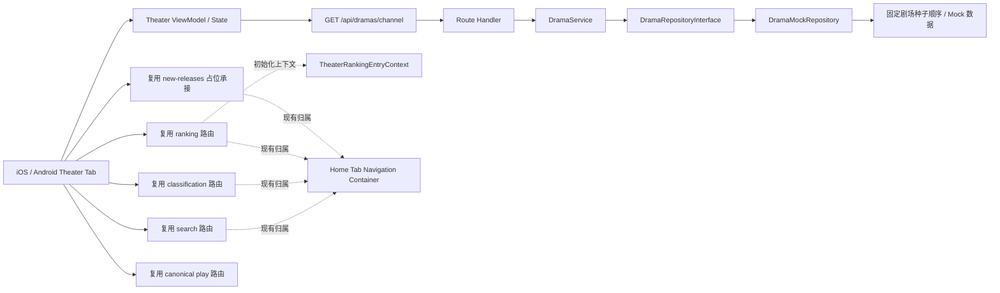

# 技术方案（共享部分）：PRD-12 剧场频道

> 创建日期：2026-07-28
> 对应需求：spec.md

## 整体架构



### 架构说明

- 本期继续沿用现有四层架构：**Route → Service → Repository → Mock Data / Infrastructure**。
- 剧场频道只在 **Android / iOS** 落地；**Web 不在本期范围内**。
- 剧场页本身归属 `theater` 一级 Tab，但搜索、分类、排行、预约榜、新剧占位承接继续复用现有 **home-owned** 路由；因此从剧场进入这些能力时，允许切换到底部 `home` Tab。
- 剧场 Feed 由 Backend 新增只读接口 `GET /api/dramas/channel` 提供；客户端只负责频道切换、分页状态机、错误态与展示格式化，不在端侧计算服务端排序。
- 点击剧场卡片继续复用既有 `play` canonical 路由语义，不新增新的播放器页面或 deeplink 语义；若现有播放器承接归属于 `home` 导航容器，则从剧场进入时允许切换到底部 `home` Tab / home graph，不要求在 `theater` Tab 内维持独立播放器副本。
- 预约快捷入口不新增专属页面，而是复用排行页，并通过统一初始化上下文 `TheaterRankingEntryContext` 让页面首屏直接进入 `all + booking`。

## API 设计

### 涉及变更

| 类型 | 数量 | 说明 |
|------|------|------|
| 新增接口 | 1 | 新增剧场频道 Feed 接口 `GET /api/dramas/channel` |
| 修改接口 | 0 | 不修改既有 `/api/dramas`、`/api/dramas/search`、`/api/dramas/rankings`、`/api/dramas/tags` 契约 |
| 废弃接口 | 0 | 无 |

> 兼容性说明：当前 Backend 成功响应对 dramas/rankings/tags 相关查询接口均沿用**资源体直出**风格（如 `{ data, pagination }` 或 `{ data }`），错误响应统一由 `withErrorHandler` 输出 `{ error: { code, message } }`，Zod 校验失败时可带 `details`。本期保持这一既有 contract，不额外引入新的成功包裹层。

### 新增接口

#### `GET /api/dramas/channel`

- **功能简介**：按剧场子频道返回分页 Feed 数据，供 Android / iOS 剧场页默认加载、子频道切换与加载更多使用。
- **Path Parameters**：无
- **认证要求**：公开只读接口，不要求登录。

- **Query Parameters**：

| 字段 | 类型 | 必填 | 默认值 | 说明 |
|------|------|------|--------|------|
| `channel` | `all \| real \| anime \| movie \| audio \| novel \| comic \| bigscreen` | 否 | `all` | 剧场子频道枚举 |
| `page` | number | 否 | `1` | 页码（`int >= 1`） |
| `pageSize` | number | 否 | `20` | 每页数量（`1~100`） |

- **Request Body**：无

- **Response**：

```json
{
  "data": [
    {
      "id": "550e8400-e29b-41d4-a716-446655440001",
      "title": "逆袭归来后我成了豪门团宠",
      "description": "落魄千金重回豪门，在误会与守护中逆风翻盘。",
      "cover_url": "https://example.com/dramas/001.jpg",
      "category": "都市",
      "episode_count": 68,
      "tags": ["逆袭", "豪门"],
      "rating": 8.9,
      "created_at": "2026-07-25T00:00:00Z",
      "updated_at": "2026-07-25T00:00:00Z",
      "heat": 98210
    }
  ],
  "pagination": {
    "page": 1,
    "page_size": 20,
    "total": 12,
    "total_pages": 1
  }
}
```

| 字段 | 类型 | 说明 |
|------|------|------|
| `data` | `TheaterDrama[]` | 当前频道页数据 |
| `data[].heat` | number | 原始热度数值，客户端负责格式化展示 |
| `pagination` | object | 沿用现有分页结构 |
| `pagination.page` | number | 当前页码 |
| `pagination.page_size` | number | 当前页大小 |
| `pagination.total` | number | 当前频道总条数 |
| `pagination.total_pages` | number | 当前频道总页数 |

- **Error Codes**：

| 状态码 | 错误码 | 说明 |
|--------|--------|------|
| 200 | — | 成功；允许返回空列表 |
| 400 | `VALIDATION_ERROR` | `channel` / `page` / `pageSize` 非法 |
| 500 | `INTERNAL_ERROR` | 服务内部错误 |
| 503 | `SERVICE_UNAVAILABLE` | 数据源不可用 |

### Zod Schema 定义

```typescript
import { z } from 'zod';

export const TheaterChannelSchema = z.enum([
  'all',
  'real',
  'anime',
  'movie',
  'audio',
  'novel',
  'comic',
  'bigscreen',
]);

export type TheaterChannel = z.infer<typeof TheaterChannelSchema>;

export const TheaterFeedQuerySchema = z.object({
  channel: TheaterChannelSchema.default('all'),
  page: z.coerce.number().int().min(1).default(1),
  pageSize: z.coerce.number().int().min(1).max(100).default(20),
});

export type TheaterFeedQuery = z.infer<typeof TheaterFeedQuerySchema>;

export const TheaterDramaSchema = DramaSchema.extend({
  heat: z.number().int().min(0),
});

export type TheaterDrama = z.infer<typeof TheaterDramaSchema>;

export const TheaterFeedResponseSchema = z.object({
  data: z.array(TheaterDramaSchema),
  pagination: PaginationSchema,
});

export type TheaterFeedResponse = z.infer<typeof TheaterFeedResponseSchema>;
```

### 契约补充

- `channel=all` 必须使用**固定确定性顺序**分页；首版建议以 Repository 内预先固定的种子顺序作为唯一排序依据，不在每次请求时临时重新排序。
- `heat` 为**服务端权威原始数值字段**；Android / iOS 自行格式化为 `2.3万` 等展示文案。
- `DramaSchema.category` 继续保持既有“内容分类/题材展示文案”语义（如 `都市`、`校园`），**不复用为频道枚举字段**，避免与 `channel` query 的业务含义混淆。
- 非 `all` 频道首版统一返回 `200 + data=[] + 合法 pagination`，由客户端展示空态而不是错误态。

## 数据模型

### 新增/变更数据表

| 表名 | 操作 | 说明 |
|------|------|------|
| `theater feed seed`（逻辑模型） | 新建 | 剧场 `all` 频道的固定种子顺序与热度数据；首版允许以内存常量存在于 Repository 层 |
| `dramas`（逻辑复用） | 不变 | 继续复用既有 Drama 基础字段，不新增真实表结构 |

> 本期不要求新增真实数据库表或 migration。剧场频道先基于 `DramaMockRepository` 与固定种子数据完成交付；未来若接入 Supabase，可将种子迁移为真实查询或运营配置，但客户端 contract 保持不变。

### 共享实体设计

| 实体 | 字段 | 说明 |
|------|------|------|
| `TheaterChannel` | `all / real / anime / movie / audio / novel / comic / bigscreen` | 剧场子频道枚举 |
| `TheaterFeedQuery` | `channel` / `page` / `pageSize` | 剧场 Feed 查询条件 |
| `TheaterDrama` | `Drama` 基础字段 + `heat` | 剧场卡片数据源 |
| `TheaterFeedResponse` | `data[]` / `pagination` | 剧场分页响应 |
| `TheaterRankingEntryContext` | `contentType` / `rankingType` | 从剧场页进入排行页时的初始化上下文；本期固定为 `all + hot` 或 `all + booking` |
| `TheaterShortcut` | `type` / `title` / `targetBehavior` | 剧场快捷入口静态配置 |

### 字段语义

| 字段 | 类型 | 语义 | 备注 |
|------|------|------|------|
| `heat` | int | 剧场卡片热度展示值 | 服务端下发原始值，客户端格式化 |
| `category` | string | 剧集题材/分类展示文案 | 沿用现有 Drama 语义，不表示子频道 |
| `tags` | string[] | 卡片辅助标签 | 最多展示前若干项由客户端控制 |
| `cover_url` | `string \| null` | 封面图地址 | 缺失时客户端展示占位图 |
| `TheaterRankingEntryContext.rankingType` | `hot \| booking` | 快捷入口初始榜单类型 | 筛选入口不使用；预约固定 `booking` |

### 数据来源策略

| 场景 | 数据来源 | 说明 |
|------|---------|------|
| `channel=all` | 现有 mock drama / ranking seed 派生 | 可直接复用已有种子中的基础字段，并映射 `play_count -> heat` |
| 非 `all` 频道 | Repository 内固定空结果 | 首版不做伪造内容，统一交给空态承接 |
| 预约入口初始化 | 客户端路由参数或页面初始化上下文 | 不新增后端接口 |

## 跨端共享逻辑

| 共享逻辑 | 说明 | 涉及端 |
|---------|------|--------|
| 默认子频道 | 页面首次进入固定为 `channel=all` | Backend / iOS / Android |
| 默认分页 | 首次请求固定 `page=1&pageSize=20` | Backend / iOS / Android |
| 子频道切换重置 | 任一子频道切换时，清空旧列表、回到第一页、滚动位置重置 | iOS / Android |
| 请求防乱序 | 旧请求晚于新请求返回时，旧结果不得覆盖当前频道状态 | iOS / Android |
| 加载更多约束 | 仅 `hasNextPage=true` 且当前无分页请求在途时允许继续拉下一页 | iOS / Android |
| 空态策略 | 非 `all` 频道返回空数组时展示频道空态，而不是错误态 | Backend / iOS / Android |
| 热度格式化 | 服务端返回原始 `heat`，客户端本地格式化为中文短数字文案 | Backend / iOS / Android |
| 搜索入口承接 | 点击顶部搜索框复用现有搜索发现页；由于搜索页归属于 home 链路，允许切换到底部 `home` Tab | iOS / Android |
| 快捷入口承接 | 筛选 / 排行 / 预约 / 新剧均复用既有 Native 路由；必要时切换到底部 `home` Tab | iOS / Android |
| 预约榜直达 | 预约入口必须一步进入 `all + booking`，不得要求用户二次切换 | iOS / Android |
| 播放跳转 | 点击卡片复用 canonical `play` 路由 | iOS / Android |
| 识图入口 | 首版仅本地占位反馈，不触发上传、拍照、权限或网络请求 | iOS / Android |

### 状态机约定

```text
首次进入剧场页
→ loading(first page, channel=all)
→ success(content) | empty | error(retryable)

切换子频道
→ loading(reset page=1, clear items)
→ success(content) | empty | error(keep selectedChannel)

触底加载更多
→ appending(next page)
→ success(append items) | appendError(keep current items)

点击搜索 / 快捷入口
→ route transition
→ 若目标路由归属 home，则允许 selectedTab/home graph 切换
→ 不新增 theater-owned 副本页面
```

### 快捷入口映射

| 入口 | 目标能力 | 共享约束 |
|------|---------|---------|
| 筛选 | 现有分类页 | 直接进入 `classification` |
| 排行 | 现有排行页默认榜单 | 首屏 `all + hot` |
| 预约 | 现有排行页预约榜 | 首屏 `all + booking` |
| 新剧 | 现有 `new-releases` 占位承接 | 不拉取真实新剧数据 |

## 安全考虑

- **认证与授权**：
  - `GET /api/dramas/channel` 为公开只读接口，不要求登录。
  - 剧场浏览、搜索入口、快捷入口浏览态均不新增登录约束。
  - 预约入口只是跳转到排行页预约榜；真正预约写操作仍沿用既有 `/api/dramas/:id/book` 的登录检查。

- **数据校验**：
  - 后端使用 `TheaterFeedQuerySchema` 校验 `channel/page/pageSize`。
  - 客户端需把子频道选择限制在固定枚举内，不允许任意字符串直接进入请求层。
  - `heat`、`tags`、`cover_url` 等展示字段在服务端通过 schema 验证后再下发。

- **敏感数据处理**：
  - 本期不新增 token、密钥、环境地址等敏感字段。
  - 识图入口首版不请求相机/相册权限，也不上传用户图片。
  - 剧场卡片只承载公开内容字段，不返回用户画像或隐私数据。

- **输入/内容安全**：
  - `cover_url` 为空或无效时由客户端回退占位图，避免因资源异常导致界面崩溃。
  - 所有错误继续走 `withErrorHandler` 或客户端统一错误映射，不泄露内部栈信息给终端用户。

## 边界与错误处理（⚠️ 重点，最易遗漏）

### 错误处理架构

- **全局错误处理策略**：Backend 继续使用 `withErrorHandler` 捕获 `AppError` / `ZodError`；移动端继续使用既有 ViewModel 状态机区分首屏错误、空态与分页追加错误。
- **错误响应格式**：
  - 成功：沿用现有资源体直出结构（`{ data, pagination }`）。
  - 失败：`{ error: { code, message } }`；Zod 校验失败可附带 `details`。
- **日志与监控**：首版以本地日志和自动化测试验证为主；后续接入真实数据源时，再按 `channel` / `page` 维度补充请求日志与告警。

### API 错误码定义

| 业务错误码 | HTTP 状态码 | 说明 | 用户提示文案 |
|-----------|------------|------|-------------|
| `VALIDATION_ERROR` | 400 | `channel` / `page` / `pageSize` 非法 | 请求参数有误，请稍后重试 |
| `UNAUTHORIZED` | 401 | 预留，当前只读接口不使用 | 请先登录 |
| `FORBIDDEN` | 403 | 预留 | 当前不可访问 |
| `NOT_FOUND` | 404 | 预留，当前列表查询不使用 | 资源不存在 |
| `CONFLICT` | 409 | 预留，当前只读接口不使用 | 当前状态冲突 |
| `TOO_MANY_REQUESTS` | 429 | 预留 | 请求过于频繁，请稍后重试 |
| `INTERNAL_ERROR` | 500 | 服务内部错误 | 服务开小差了，请稍后重试 |
| `SERVICE_UNAVAILABLE` | 503 | 数据源不可用 | 服务暂不可用，请稍后重试 |

### 边界场景处理

| 场景 | 触发条件 | API / 客户端行为 | 说明 |
|------|---------|------------------|------|
| 非法频道值 | `channel=unknown` | 返回 400 + `VALIDATION_ERROR` | 不隐式降级到 `all` |
| 缺省频道 | 不传 `channel` | 等价 `all` | 减少端侧分支 |
| 非 `all` 频道首版无数据 | `real/anime/...` | 返回 200 + 空数组 + 合法 pagination | 客户端展示空态 |
| 超大页码 | `page` 合法但超出总页数 | 返回 200 + 空数组 | 与现有分页语义一致 |
| 快速切换频道 | 多次点击不同 Tab | 仅最后一次请求结果可提交到 UI | 防止数据串频 |
| 首屏失败后重试 | 断网 / 5xx 恢复 | 重新请求当前频道第一页 | 不强制回到 `all` |
| 分页失败 | 加载下一页超时 / 5xx | 保留已加载内容，仅展示尾部错误 | 不清空现有列表 |
| 封面缺失 | `cover_url=null` 或资源失效 | 客户端展示统一占位图 | 不视为接口失败 |
| 预约入口路由能力不一致 | Android 有参数路由，iOS 无显式参数路由 | 通过统一初始化上下文保证首屏直达 booking | 不允许二次点击补偿 |
| 搜索/排行/分类归属 home | 从剧场进入时触发 | 允许切换到底部 `home` Tab | 本期不维护 theater 内副本 |

## 性能考虑

- **预期 QPS**：首版主要为本地 / mock 环境与轻量只读访问，远低于现有 dramas 列表能力上限。
- **排序策略**：`channel=all` 使用一次性固定顺序切片，避免每次请求临时排序带来的重复计算和分页不稳定。
- **分页大小**：默认 `pageSize=20`，兼顾双列 Feed 首屏密度与移动端渲染成本。
- **缓存策略**：
  - Backend 首版不新增 Redis 缓存；数据源来自内存 mock seed，读取成本可忽略。
  - 客户端仅保留页面内存态，不新增持久化缓存或离线同步。
- **渲染策略**：
  - Android / iOS 均使用懒加载列表容器承接双列卡片。
  - 热度格式化在端侧本地完成，避免额外接口字段和重复传输。

## 参考资料

### 已查阅的 wiki 文档

| 文档 | 相关章节 | 关键信息 |
|------|---------|---------|
| `wiki/features/app-shell/index.md` | Tab 与导航壳 | 确认 theater 是既有一级频道承接点 |
| `wiki/features/search-discovery/index.md` | 搜索发现、快捷入口 | 确认 search / classification / new-releases 现有承接能力 |
| `wiki/features/ranking/index.md` | 排行与预约 | 确认排行页默认榜单、预约榜与现有路由能力 |
| `wiki/features/classification/index.md` | 分类页承接 | 确认筛选入口可复用分类页 |
| `wiki/features/video-player/index.md` | `play` 路由 | 确认播放器主路径与多入口复用约束 |

### 已查阅的代码文件

| 文件 | 关键内容 |
|------|---------|
| `backend/src/lib/schemas.ts` | 现有 Drama / Ranking / Pagination 的 Zod schema 风格 |
| `backend/src/app/api/dramas/rankings/route.ts` | query schema + service + JSON 返回的现有 route 模式 |
| `backend/src/services/drama/drama.service.ts` | service 层 parse / error handling 模式 |
| `backend/src/repositories/interfaces/drama.repository.interface.ts` | repository 现有接口与分页抽象 |
| `backend/src/repositories/mock/drama.mock.repository.ts` | 现有 mock drama / ranking seed，可复用为剧场种子来源 |
| `backend/src/middleware/error-handler.ts` | 统一错误响应形态 |
| `android/app/src/main/java/com/djs66256/short_drama/navigation/NavGraph.kt` | theater 仍为占位页，search/ranking/classification/new-releases 均归属 HOME graph |
| `android/app/src/main/java/com/djs66256/short_drama/navigation/AppDestination.kt` | Android 已支持 ranking 路由参数化 |
| `android/app/src/main/java/com/djs66256/short_drama/feature/ranking/viewmodel/RankingViewModel.kt` | Android 可用 `SavedStateHandle` 初始化排行页榜单上下文 |
| `ios/ShortDrama/Sources/App/AppRoute.swift` | iOS search/ranking/classification/new-releases 现归属 `.home` |
| `ios/ShortDrama/Sources/App/NavigationRouter.swift` | iOS 导航到 home-owned route 时会切换 `selectedTab` |
| `ios/ShortDrama/Sources/App/TabNavigationHostView.swift` | iOS theater 仍为 `PlaceholderTabView`，需要替换为真实页面 |
| `ios/ShortDrama/Sources/Features/Ranking/ViewModels/RankingViewModel.swift` | iOS 当前默认榜单为 `.hot`，需补齐剧场预约榜初始化能力 |

---
