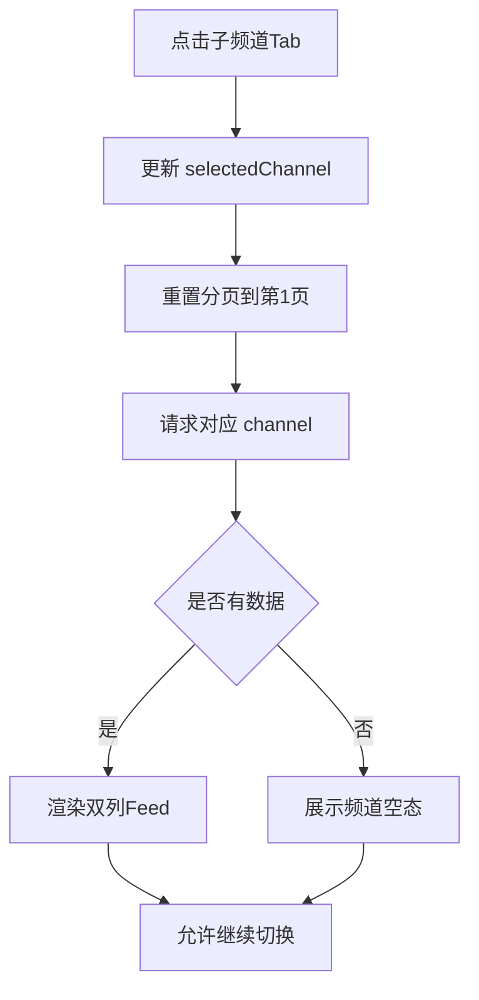
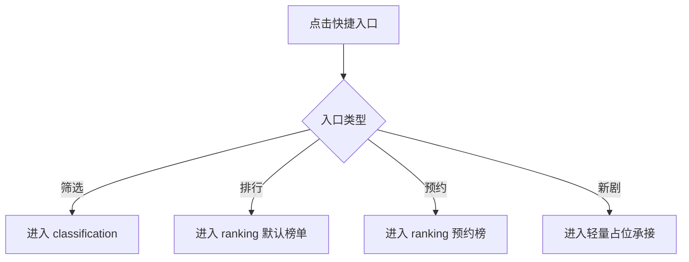
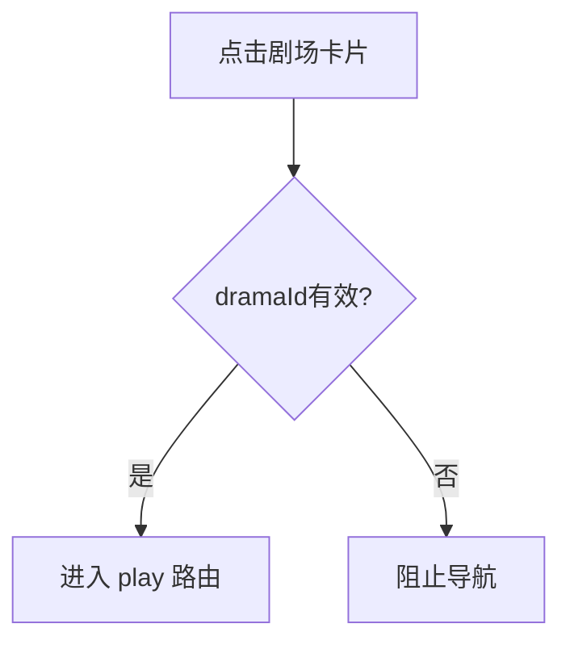

# 需求文档：PRD-12 剧场频道

> 创建日期：2026-07-28
> 状态：草稿
> 作者：AI Agent + daniel

---

## 1. 需求背景

### 1.1 问题描述

- **现状**：移动端底部导航已经具备 `home / theater / mall / earn / profile` 五个一级频道，但当前 Android 与 iOS 的「剧场」频道仍是占位页，尚未承接真实内容分发；Web 端也没有剧场频道的真实业务范围。
- **痛点**：
  - 剧场频道是产品核心内容分发入口之一，但当前用户进入后只能看到占位说明，无法继续找剧、切频道或直达播放。
  - 搜索发现链路已具备排行、分类、搜索结果等能力，但缺少一个面向剧场场景的常驻内容分发页，用户仍需依赖首页或搜索入口才能继续探索内容。
  - 竞品剧场频道的「找剧 + 子频道 Tab + 快捷入口 + 双列 Feed」组合已经是高频使用路径；当前产品在该路径上存在明显缺口。
  - PRD-05 排行、PRD-06 分类、PRD-03 播放主链路都已具备可复用能力，但还没有一个统一的剧场频道页把这些能力串起来。

### 1.2 预期目标

- **目标**：将移动端一级频道中的「剧场」Tab 从占位页演进为真实 Native 剧场频道，提供顶部搜索、8 个子频道 Tab、4 个快捷入口和双列内容 Feed；由 Backend 提供统一的频道内容接口，并复用现有搜索、分类、排行和播放链路。
- **成功指标**（可度量）：
  - Android / iOS 进入剧场频道后，默认可看到完整页面骨架，并成功加载 `找剧` 子频道第一页数据。
  - 8 个子频道 Tab 全部可见且可点击，切换后只刷新当前频道数据；首版仅 `找剧`（`channel=all`）返回真实内容，其余频道展示空态而非报错。
  - 4 个快捷入口均能落到预期承接能力：筛选 → 分类页、排行 → 排行页默认榜单、预约 → 排行页预约榜、新剧 → 现有轻量占位承接；上述承接页复用现有 home 链路时，允许切换到底部 `home` Tab，返回行为遵循承接页所在 Tab 的现有导航栈。
  - 点击任意剧场卡片都复用现有 canonical `play` 路由进入播放承接页，不新增新的播放路由语义。
  - Web 不新增真实剧场频道实现，继续保持范围外。

### 1.3 范围定义

| 范围内 | 范围外（明确不做） | 原因 |
|--------|------------------|------|
| Android / iOS 一级「剧场」频道占位页替换为真实 Native 页面 | Web 剧场频道真实实现 | `PRODUCT.md` 明确除 mall / earn 外，其他业务页当前只要求 Native 实现 |
| Backend 新增 `GET /api/dramas/channel` 频道内容接口 | 复用或改造 Web `/theater` / H5 剧场页 | 本期不交付独立 H5 |
| 顶部搜索入口与识图占位入口 | 真实识图能力、上传图片识别流程 | 首版只保留轻量占位反馈 |
| 8 个子频道 Tab：找剧 / 真人 / 动漫 / 电影 / 有声书 / 小说 / 漫画 / 大屏 | 非找剧子频道的真实内容运营和独立业务逻辑 | 首版仅 `找剧` 子频道返回真实内容，其余频道返回空态 |
| 快捷入口：筛选 / 排行 / 新剧 / 预约 | 新剧真实列表、新剧专属接口 | 首版仅复用现有轻量占位承接 |
| 双列卡片 Feed + 分页加载 | 瀑布流复杂高度优化、离线缓存、下拉刷新 | 首版先保证稳定展示与加载更多 |
| 点击卡片进入现有播放页链路 | 播放器真实能力增强 | 继续复用既有 `play` 路由语义 |
| 频道 API 参数与错误校验 | 配置后台、动态 Tab 运营配置 | 首版使用固定频道枚举与 mock / 种子数据 |

> 本期重点是先打通「剧场一级频道 → 子频道浏览 → 快捷入口 / 播放承接」主链路，而不是一次性做完整剧场生态。

---

## 2. 术语表

| 术语 | 定义 | 来源 |
|------|------|------|
| 剧场频道 | 底部导航中的一级频道 `theater`，承载剧场内容分发页 | `PRODUCT.md` / 本文档收敛 |
| 找剧子频道 | 剧场频道默认选中的第一个子频道，对应 API `channel=all` | PRD / 本文档收敛 |
| 剧场子频道 | 顶部横向 8 个子频道 Tab：找剧 / 真人 / 动漫 / 电影 / 有声书 / 小说 / 漫画 / 大屏 | PRD |
| 频道枚举 | Backend `GET /api/dramas/channel` 的 `channel` 参数，首版固定为 `all / real / anime / movie / audio / novel / comic / bigscreen` | 子任务文档 |
| 快捷入口 | 剧场频道中位于子频道 Tab 下方的 4 个动作入口：筛选 / 排行 / 新剧 / 预约 | PRD |
| 轻量占位承接 | 不实现真实业务数据，仅通过现有 placeholder route 或本地提示向用户表达“功能开发中 / 即将上线” | 本文档新定义 |
| 双列 Feed | 剧场频道内容列表，以两列卡片形式展示封面、热度、标题与标签 | PRD |
| `play` 路由 | 当前跨端统一使用的播放器 canonical 路由语义；Android 兼容历史 `player` 别名，iOS 对外公开名为 `play` | `PRODUCT.md` / wiki |
| 空态子频道 | 首版可点击但暂无真实内容的子频道；接口返回 200 + 空数组，客户端展示空态文案 | 本文档新定义 |

### 2.1 子频道与 API 枚举映射

| UI 文案 | API `channel` | 首版数据策略 |
|--------|---------------|-------------|
| 找剧 | `all` | 返回真实第一页/后续页数据 |
| 真人 | `real` | 返回空数组 |
| 动漫 | `anime` | 返回空数组 |
| 电影 | `movie` | 返回空数组 |
| 有声书 | `audio` | 返回空数组 |
| 小说 | `novel` | 返回空数组 |
| 漫画 | `comic` | 返回空数组 |
| 大屏 | `bigscreen` | 返回空数组 |

---

## 3. 涉及平台

| 平台 | 是否涉及 | 变更概要 |
|------|---------|---------|
| Backend | ✅ 涉及 | 新增剧场频道内容接口与 query/response schema，提供按子频道查询的双列 Feed 数据 |
| Web | ❌ 不涉及 | 本期不交付 Web / H5 剧场频道真实页面 |
| iOS | ✅ 涉及 | 将 theater tab 从 `PlaceholderTabView` 替换为真实剧场频道页面，承接搜索、快捷入口与双列 Feed |
| Android | ✅ 涉及 | 将 theater graph 的占位页替换为真实剧场频道页面，承接搜索、快捷入口与双列 Feed |

---

## 4. 用户故事

| 编号 | 角色 | 需求 | 验收标准 | 涉及平台 | 优先级 |
|------|------|------|---------|---------|--------|
| US-01 | 探索型用户 | 我希望进入剧场频道后立即浏览找剧内容 | 进入 theater tab 默认选中「找剧」并成功加载第一页双列 Feed | Backend / iOS / Android | P0 |
| US-02 | 探索型用户 | 我希望切换不同剧场子频道 | 8 个子频道 Tab 全部可点击；切换时刷新频道数据；非找剧频道展示空态而非报错 | Backend / iOS / Android | P0 |
| US-03 | 主动探索用户 | 我希望通过快捷入口快速到达相关能力 | 筛选、排行、预约、新剧入口均按约定承接：分类页 / 排行页 / 预约榜 / 轻量占位承接 | iOS / Android | P0 |
| US-04 | 浏览型用户 | 我希望持续滚动查看更多内容 | `找剧` 子频道支持分页加载更多；切换子频道时重置到第一页 | Backend / iOS / Android | P1 |
| US-05 | 消费型用户 | 我希望从剧场卡片直接进入播放 | 点击卡片后复用现有 `play` 路由进入播放承接页 | iOS / Android | P0 |
| US-06 | 探索型用户 | 我希望使用顶部搜索继续找剧 | 点击搜索框可进入既有搜索发现页；点击识图入口得到明确占位反馈 | iOS / Android | P1 |

---

## 5. 功能详述

### 5.1 US-01：进入剧场频道并加载默认页面

#### 流程描述

1. 用户点击底部导航中的「剧场」Tab。
2. 客户端进入现有一级频道 `theater` 容器；页面内容从占位实现替换为真实剧场频道页。
3. 页面首次进入时默认选中「找剧」子频道，并请求：`GET /api/dramas/channel?channel=all&page=1&pageSize=20`。
4. 页面固定展示以下区块：
   - 顶部搜索框
   - 识图占位入口
   - 8 个横向可滚动子频道 Tab
   - 4 个快捷入口
   - 双列内容 Feed
5. Backend 返回第一页内容后，客户端渲染双列卡片；若无数据则展示空态。
6. 搜索框点击时复用现有搜索发现页承接；由于现有搜索页归属于 home 链路，从剧场进入时允许切换到底部 `home` Tab，返回行为遵循该承接页所属导航栈，而不要求“原地覆盖在 theater Tab 内打开”。
7. 识图入口点击时仅展示轻量占位反馈，不发起真实识图流程。

```mermaid
flowchart TD
    A[点击底部剧场Tab] --> B[进入剧场频道页]
    B --> C[默认选中找剧]
    C --> D[请求 channel=all 第1页]
    D --> E{请求结果}
    E -->|有数据| F[渲染双列Feed]
    E -->|空数据| G[展示空态]
    B --> H[点击搜索框进入搜索页]
    B --> I[点击识图入口显示占位反馈]
```



#### 前置条件

- [x] 移动端已有底部导航和 `theater` 一级频道。
- [x] 搜索发现页已存在可复用的 Native 搜索承接。
- [ ] Backend 已提供 `GET /api/dramas/channel`。

#### 后置条件

- 当前所选子频道保存在页面状态中，默认值为 `all`。
- 页面区块顺序固定，不因频道切换而重排。
- 首屏成功后可继续分页或使用快捷入口/搜索入口。

#### 涉及的 UI/交互（如有）

| 页面 / 区域 | 交互描述 | 涉及端 |
|------------|---------|--------|
| 页面顶部搜索框 | 外观为可点击搜索输入框；点击后进入搜索发现页，而不是在剧场页内直接编辑 | iOS / Android |
| 识图入口 | 以图标按钮形式展示；点击后给出轻量占位反馈（如 Toast / Snackbar / Alert / 占位承接） | iOS / Android |
| 子频道 Tab 条 | 横向滚动展示 8 个子频道；当前子频道高亮 | iOS / Android |
| 快捷入口区 | 固定展示 4 个入口：筛选、排行、新剧、预约 | iOS / Android |
| 双列 Feed 区 | 展示封面、热度、标题、标签；支持滚动浏览 | iOS / Android |

#### 边界与异常

**错误处理：**

| 操作步骤 | 错误类型 | 触发条件 | 系统行为 | 用户感知 |
|---------|---------|---------|---------|---------|
| 首次进入剧场页 | 网络异常 | 断网 / 超时 | 保留页面骨架，列表区进入错误态 | 错误提示 + 重试入口 |
| 请求频道接口 | 服务端错误 | 500 / 502 / 503 | 不渲染脏数据，保留当前子频道选中态 | 列表区错误态 / 轻提示 |
| 请求频道接口 | 数据校验失败 | `channel/page/pageSize` 非法 | 服务端返回统一校验错误；客户端回退到上一次有效状态 | 轻提示 / 错误态 |
| 点击识图入口 | 功能未实现 | 首版未接入识图 | 不发起网络请求 | 轻量提示“功能开发中 / 即将上线” |
| 图片加载 | 资源缺失 | `cover_url` 为空或失效 | 使用统一占位图 | 占位封面 |

**边界场景：**

| 场景 | 触发条件 | 预期行为 |
|------|---------|---------|
| 默认页无数据 | `channel=all` 暂无数据 | 仍展示页面骨架和快捷入口，Feed 区展示空态 |
| 搜索入口快速重复点击 | 用户连续点击搜索框 | 只进入一次搜索页，不重复 push 多层相同路由 |
| 识图入口快速重复点击 | 用户连续多次点击 | 合并为有限次本地提示，不触发崩溃或重复网络请求 |
| 页面切后台恢复 | 请求过程中切后台 | 返回后保持可理解状态；必要时允许重试 |

### 5.2 US-02：切换剧场子频道并处理空态

#### 流程描述

1. 用户在剧场页点击任一子频道 Tab。
2. 客户端将当前选中频道切换为对应 `channel` 枚举，并重置分页状态到第一页。
3. 页面重新请求：`GET /api/dramas/channel?channel=<selected>&page=1&pageSize=20`。
4. 若当前频道为 `all`，返回真实内容并渲染双列 Feed。
5. 若当前频道为其他 7 个枚举，首版由 Backend 返回 200 + 空数组，客户端展示对应空态文案。
6. 用户可继续切回其他子频道，无需离开剧场频道页。



#### 前置条件

- [x] 剧场页已经打开。
- [x] 8 个子频道 Tab 已渲染。
- [ ] Backend 已支持全部 `channel` 枚举值。

#### 后置条件

- 页面状态始终与当前子频道一一对应，不混入上一次频道的数据。
- 切换频道后，列表滚动位置与分页状态重置。
- 非找剧频道的空态不阻断继续切换到其他频道。

#### 涉及的 UI/交互（如有）

| 页面 / 区域 | 交互描述 | 涉及端 |
|------------|---------|--------|
| 子频道 Tab | 8 项横向滚动；当前项高亮，切换时即时反馈 | iOS / Android |
| 空态区 | 非找剧频道首版无数据时展示统一空态文案，如“当前频道内容筹备中” | iOS / Android |
| Feed 区 | 切换频道后先进入 loading，再进入 content / empty / error 之一 | iOS / Android |

#### 边界与异常

**错误处理：**

| 操作步骤 | 错误类型 | 触发条件 | 系统行为 | 用户感知 |
|---------|---------|---------|---------|---------|
| 切换频道 | 网络异常 | 超时 / 断网 | 保持当前频道选中态，不展示脏数据 | 局部错误态 / 轻提示 |
| 切换频道 | 并发返回乱序 | 旧请求晚于新请求返回 | 仅消费最后一次有效请求结果 | 用户只看到最后选择的频道数据 |
| 请求频道接口 | 非法频道值 | 客户端或 deeplink 传入未知枚举 | 服务端返回 400；客户端回退到默认 `all` 或上一有效状态 | 轻提示 |

**边界场景：**

| 场景 | 触发条件 | 预期行为 |
|------|---------|---------|
| 连续快速切换多个频道 | 多次点击不同 Tab | 仅最新频道生效，旧请求结果不得覆盖新状态 |
| 非找剧频道始终为空 | 首版后端未配置数据 | 展示统一空态，不视为故障 |
| 横向 Tab 较多 | 小屏设备可视宽度不足 | Tab 条可横向滚动，所有频道可访问 |
| 切回找剧频道 | 从空态频道切回 `all` | 正常重新加载第一页真实数据 |

### 5.3 US-03：使用快捷入口跳转既有能力

#### 流程描述

1. 用户在剧场页点击快捷入口之一。
2. 客户端按以下映射执行承接：
   - 筛选 → 进入现有分类页 `classification`
   - 排行 → 进入现有排行页默认榜单（`all + hot`）
   - 预约 → 进入现有排行页，并在页面初始化时直接落到预约榜（`all + booking`）；若现有路由层不支持显式榜单参数，则由页面初始化上下文或首屏自动切换逻辑保证用户一步进入预约榜，而不是要求用户二次点击
   - 新剧 → 进入现有轻量占位承接，不加载真实新剧数据
3. 以上跳转均复用现有 Native 路由，不新增新的一级频道或 H5 页面；由于现有筛选 / 排行 / 预约 / 新剧承接能力归属于 home 链路，从剧场进入这些能力时允许切换到底部 `home` Tab。
4. 用户返回后，遵循目标承接页所在导航容器的既有返回行为；本期不要求这些承接页在 `theater` Tab 内维持独立副本。



#### 前置条件

- [x] 分类页、排行页与其路由已存在。
- [x] 搜索发现链路已提供 `new-releases` 轻量承接语义。
- [ ] 剧场页快捷入口区已渲染完成。

#### 后置条件

- 快捷入口不会修改剧场页当前子频道状态；但若目标能力归属于 home 链路，允许切换底部 `home` Tab 后再展示对应页面。
- 返回行为遵循目标承接页所在导航容器的既有规则，不强制要求回退后自动恢复到 theater tab 的中间页面状态。
- 新剧入口不会误导为真实可浏览的新剧列表。

#### 涉及的 UI/交互（如有）

| 页面 / 区域 | 交互描述 | 涉及端 |
|------------|---------|--------|
| 筛选入口 | 点击后进入现有分类页 | iOS / Android |
| 排行入口 | 点击后进入现有排行页默认榜单 | iOS / Android |
| 预约入口 | 点击后进入现有排行页预约榜维度 | iOS / Android |
| 新剧入口 | 点击后进入现有轻量占位承接，文案表达“功能开发中 / 即将上线” | iOS / Android |

#### 边界与异常

**错误处理：**

| 操作步骤 | 错误类型 | 触发条件 | 系统行为 | 用户感知 |
|---------|---------|---------|---------|---------|
| 点击筛选/排行/预约 | 路由不可用 | 本地路由未注册或参数不合法 | 阻止崩溃，保留当前页 | 本地错误提示 |
| 点击新剧 | 功能未实现 | 首版无真实新剧能力 | 进入轻量占位承接，不发起无意义请求 | 明确占位提示 |

**边界场景：**

| 场景 | 触发条件 | 预期行为 |
|------|---------|---------|
| 排行页从剧场进入 | 点击排行入口 | 默认进入排行默认榜单，而不是停留在此前其它榜单状态 |
| 预约入口直达预约榜 | 点击预约入口 | 进入排行预约榜，不要求中间再手动切换 |
| 新剧尚未落地 | 点击新剧入口 | 用户可感知为占位能力，但不出现空白页或死链 |

### 5.4 US-04：剧场 Feed 分页加载

#### 流程描述

1. `找剧` 子频道第一页成功返回后，用户可向下滚动列表。
2. 当滚动到列表底部附近且当前 `pagination` 仍有下一页时，客户端发起下一页请求。
3. 新页数据追加到当前双列 Feed 末尾。
4. 若切换到其他子频道，分页状态重置为第一页，旧分页数据被清空。
5. 对于首版无数据的子频道，不触发加载更多。

#### 前置条件

- [ ] `channel=all` 第一页已成功加载。
- [ ] Backend 响应中包含 `page / page_size / total / total_pages`。

#### 后置条件

- 追加的数据与当前子频道严格一致。
- `channel=all` 首版按服务端固定的确定性顺序返回内容（后续页沿同一排序规则继续分页），以避免翻页重复或顺序抖动。
- 切换频道后不会复用旧分页结果。
- 已到最后一页时不再重复发起下一页请求。

#### 涉及的 UI/交互（如有）

| 页面 / 区域 | 交互描述 | 涉及端 |
|------------|---------|--------|
| Feed 底部 | 加载更多时展示尾部 loading 状态 | iOS / Android |
| Feed 尾部 | 没有更多时展示“没有更多了”或静默结束 | iOS / Android |

#### 边界与异常

**错误处理：**

| 操作步骤 | 错误类型 | 触发条件 | 系统行为 | 用户感知 |
|---------|---------|---------|---------|---------|
| 加载下一页 | 网络异常 | 超时 / 断网 | 保留已加载数据，不清空已有列表 | 轻提示，可再次触发 |
| 加载下一页 | 服务端错误 | 5xx | 本次分页失败但不影响已加载结果 | 尾部错误提示 / 轻提示 |
| 重复触底 | 重复提交 | 同一页多次触发加载 | 同一页只允许一个请求在途 | 不出现重复 loading |

**边界场景：**

| 场景 | 触发条件 | 预期行为 |
|------|---------|---------|
| 第一页不足一屏 | 数据量较少 | 不额外触发分页请求 |
| 超大页码 | 请求超出总页数 | 服务端返回 200 + 空数组，客户端静默停止追加 |
| 子频道为空 | 当前频道第一页即为空 | 不触发加载更多 |
| 切换频道后快速触底 | 页面刚重置到第一页 | 仅按新频道的分页状态加载，不消费旧频道翻页结果 |

### 5.5 US-05：点击剧场卡片进入播放页

#### 流程描述

1. 用户点击任一剧场卡片。
2. 客户端读取卡片 `id`，复用现有播放路由语义进入播放器承接页。
3. Android 继续使用 canonical `play/{videoId}`（并保持历史 `player/{videoId}` 兼容仅限既有 deeplink/alias）；iOS 继续使用公开路由名 `play` 对应的 `.player(videoId:)`。
4. 剧场频道不新增新的播放页入口类型或中间页；继续复用既有 home-owned canonical `play` 承接语义。若现有播放器承接归属于 `home` 容器，则允许切换到底部 `home` Tab / home graph，不要求在 `theater` Tab 内维持独立播放器副本。



#### 前置条件

- [x] 播放页路由已存在。
- [ ] 卡片数据中包含有效 `id`。

#### 后置条件

- 点击卡片后进入既有播放承接页。
- 剧场页不持有新的播放器状态或独立播放契约。

#### 涉及的 UI/交互（如有）

| 页面 / 区域 | 交互描述 | 涉及端 |
|------------|---------|--------|
| 剧场卡片 | 点击整卡进入播放承接页 | iOS / Android |

#### 边界与异常

**错误处理：**

| 操作步骤 | 错误类型 | 触发条件 | 系统行为 | 用户感知 |
|---------|---------|---------|---------|---------|
| 点击卡片 | 状态不一致 | `id` 为空或非法 | 阻止导航 | 无效点击 / 轻提示 |
| 进入播放页 | 路由异常 | 参数编码错误 | 不允许崩溃，回退到当前页 | 本地错误提示 |

**边界场景：**

| 场景 | 触发条件 | 预期行为 |
|------|---------|---------|
| 连续快速点卡片 | 用户重复点击同一卡片 | 只触发一次有效导航 |
| 从空态频道切回再点卡片 | 切回找剧后加载数据 | 导航仍按当前卡片 `id` 正常进行 |

### 5.6 US-06：顶部搜索与识图占位入口

#### 流程描述

1. 用户点击顶部搜索框。
2. 客户端进入既有搜索发现页，而不是在剧场页内实现新的搜索编辑状态。
3. 用户点击识图入口时，首版仅展示轻量占位反馈，不接入上传、拍照、权限请求或服务端识别。
4. 搜索与识图入口都不改变当前剧场子频道的业务数据契约。

#### 前置条件

- [x] 搜索发现页已存在。
- [ ] 剧场页顶部栏已渲染完成。

#### 后置条件

- 搜索能力继续复用现有搜索发现链路，并允许因此切换到底部 `home` Tab。
- 识图入口在首版不引入新的权限依赖或接口。

#### 涉及的 UI/交互（如有）

| 页面 / 区域 | 交互描述 | 涉及端 |
|------------|---------|--------|
| 搜索框 | 点击后进入搜索发现页 | iOS / Android |
| 识图入口 | 点击后展示轻量占位反馈 | iOS / Android |

#### 边界与异常

**错误处理：**

| 操作步骤 | 错误类型 | 触发条件 | 系统行为 | 用户感知 |
|---------|---------|---------|---------|---------|
| 点击搜索框 | 路由异常 | 搜索页未注册 | 保留当前页，不崩溃 | 本地错误提示 |
| 点击识图入口 | 功能未实现 | 首版占位 | 只做本地反馈，不请求权限 | “功能开发中 / 即将上线” |

**边界场景：**

| 场景 | 触发条件 | 预期行为 |
|------|---------|---------|
| 从搜索页返回 | 用户从 home-owned 搜索页返回 | 遵循搜索页所在导航容器的既有返回行为；不额外要求回到 theater 内副本 |
| 连续点击识图入口 | 短时间多次点击 | 反馈可合并，不出现多层异常弹窗 |

---

## 6. 数据概览

| 数据实体 | 说明 | 关键字段 | 来源 |
|---------|------|---------|------|
| TheaterChannel | 当前选中的剧场子频道 | `key`、`title`、`apiChannel` | 系统固定枚举 |
| TheaterDramaCard | 剧场 Feed 卡片数据 | `id`、`title`、`cover_url`、`heat`、`tags[]`、`category` | Backend `GET /api/dramas/channel` |
| TheaterRankingEntryContext | 从剧场页进入排行页的初始化上下文 | `contentType`、`rankingType` | 客户端路由参数或页面初始化上下文 |
| TheaterFeedPage | 某个频道的一页列表结果 | `data[]`、`pagination.page`、`pagination.page_size`、`pagination.total`、`pagination.total_pages` | Backend `GET /api/dramas/channel` |
| TheaterShortcut | 快捷入口配置 | `type`、`title`、`targetRoute/targetBehavior` | 客户端静态配置 |
| TheaterPageState | 页面展示状态 | `selectedChannel`、`items`、`loading`、`empty`、`error`、`appending` | 客户端状态机 |

### 数据关系

```text
[TheaterChannel] ──1:N──▶ [TheaterDramaCard]
      │
      └──1:1──▶ [TheaterFeedPage]

[TheaterPageState] ──1:1──▶ [TheaterChannel]
[TheaterPageState] ──1:N──▶ [TheaterDramaCard]
```

### 6.1 Backend 接口数据约定（需求层）

> 本节描述业务契约，不限定最终代码实现细节；字段命名和 schema 以 design 阶段收敛后的方案为准。

- 接口：`GET /api/dramas/channel`
- Query：
  - `channel`: `all | real | anime | movie | audio | novel | comic | bigscreen`
  - `page`: `>= 1`，缺省 `1`
  - `pageSize`: `>= 1` 且 `<= 100`，缺省 `20`
- 响应结构：

```json
{
  "data": [
    {
      "id": "drama_id",
      "title": "剧名",
      "cover_url": "https://...",
      "heat": 23000,
      "tags": ["爆剧", "都市"],
      "category": "都市"
    }
  ],
  "pagination": {
    "page": 1,
    "page_size": 20,
    "total": 150,
    "total_pages": 8
  }
}
```

- 契约补充：
  - `channel=all` 首版使用服务端固定的确定性排序规则（例如按种子数据既定顺序或统一数值字段降序），所有分页都沿同一顺序切片，避免翻页重复或顺序漂移。
  - `heat` 为服务端返回的原始数值字段（整数），客户端负责格式化为 `2.3万` 等展示文案；不要把已格式化文案作为接口权威字段。
  - Theater Feed 数据契约复用现有 dramas 基础字段风格，在其上增加剧场卡片展示所需字段，不引入仅供单端使用的歧义字段命名。
  - 若从剧场快捷入口进入排行预约榜，需要提供统一初始化上下文，使页面首屏直接进入 `all + booking`，而不是依赖用户手动切换。
- 首版数据策略：
  - `channel=all`：返回真实 mock / 种子数据
  - 其他 channel：返回 `200 + data=[] + 合法 pagination`
- 非法 `channel`：返回统一校验错误，而不是隐式降级。

---

## 7. 现有功能影响

| 现有功能 | 影响类型 | 说明 | 是否需要迁移 |
|---------|---------|------|------------|
| 应用壳 / 一级频道 | 修改行为 | Android / iOS 的 theater tab 将从 placeholder 演进为真实页面 | 否 |
| 搜索发现 | 新增关联 | 剧场顶部搜索框复用既有搜索发现页；新剧入口复用现有轻量占位承接语义；上述承接能力仍归属于 home 链路 | 否 |
| 排行体系 | 新增关联 | 快捷入口中的排行、预约分别复用排行默认榜单与预约榜，并需要支持从剧场入口传入初始化上下文 | 否 |
| 分类浏览 | 新增关联 | 快捷入口中的筛选复用现有分类页；承接页仍归属于 home 链路 | 否 |
| 播放器 | 新增关联 | 剧场卡片点击复用现有 `play` 路由 | 否 |
| Backend dramas 相关接口 | 新增接口 | 新增频道接口，不改动既有 `GET /api/dramas`、`/search`、`/rankings` 契约 | 否 |
| Web 路由骨架 | 无影响 | 本期不交付 Web 剧场页 | 否 |

### 兼容性说明

- 本期新增的是独立频道接口与移动端页面承接，不要求迁移既有数据。
- 已存在的搜索、排行、分类、播放链路继续复用，不改变其 canonical route 语义；其中搜索 / 分类 / 排行 / 新剧的既有承接页仍归属于 home 链路，本期允许从剧场入口切换到底部 `home` Tab 后承接。
- 非 mall / earn 页面继续遵循 Native 优先策略，不引入新的 H5 容器依赖。

---

## 8. 非功能性需求

### 8.1 性能

| 指标 | 目标值 | 测量方式 |
|------|--------|---------|
| 剧场页首屏内容可见 | Mock / 本地环境下进入后 1 秒内出现首屏骨架，接口成功后尽快渲染第一页 | 页面加载与本地验证 |
| API 响应时间（P95） | 本地 / mock 环境下 < 300 ms | Backend 接口测试 / 日志观察 |
| 列表滚动体验 | 双列 Feed 常规滚动保持流畅，无明显卡顿 | 模拟器 / 本地验证 |
| 分页追加 | 不出现重复请求与重复数据 | ViewModel / service 测试 |

### 8.2 安全

| 关注点 | 要求 |
|--------|------|
| 认证与授权 | 剧场频道浏览、搜索入口、快捷入口浏览态均不要求登录 |
| 数据校验 | 服务端必须校验 `channel/page/pageSize`，客户端也应限制非法枚举进入请求层 |
| 敏感数据 | 不涉及用户隐私数据上传；首版识图入口不请求相机/相册权限 |
| 防滥用 | 首版以只读内容接口为主，不新增高风险写接口；保留基础校验与错误处理 |

### 8.3 兼容性

| 维度 | 要求 |
|------|------|
| 设备兼容 | 沿用当前项目既有 iOS / Android 最低支持策略，不因本 PRD 单独抬升版本要求 |
| 数据兼容 | 新增频道接口不破坏既有首页、搜索、排行、分类接口结构 |
| 向后兼容 | 旧客户端未接入剧场频道真实页时仍可继续使用其他已上线能力 |

---

## 9. 依赖

| 依赖项 | 类型 | 说明 | 状态 | 阻塞 |
|--------|------|------|------|------|
| 应用壳 theater tab | 内部能力 | 提供一级频道容器与底部导航承接点 | ✅ 已就绪 | 是 |
| 搜索发现 | 内部能力 | 顶部搜索框与新剧轻量承接复用既有搜索相关路由 | ✅ 已就绪 | 是 |
| 排行体系 | 内部能力 | 排行 / 预约快捷入口复用既有排行页与预约榜能力 | ✅ 已就绪 | 是 |
| 分类浏览 | 内部能力 | 筛选入口复用既有分类页 | ✅ 已就绪 | 是 |
| 播放器 | 内部能力 | 卡片点击复用 `play` 路由 | ✅ 已就绪 | 是 |
| Backend mock / seed 数据 | 内部能力 | 为 `channel=all` 提供剧场 Feed 数据 | 🚧 待开发 | 是 |
| 识图能力 | 外部能力 | 首版不接入真实识图服务，仅保留占位反馈 | 📅 规划中 | 否 |

---

## 10. 待澄清问题

| 编号 | 问题 | 可能的答案 | 阻塞 |
|------|------|-----------|------|
| Q-01 | 当前是否存在阻塞本期交付的未决产品问题？ | 当前无阻塞性待澄清问题；实现细节在 design 阶段继续收敛 | 否 |

---

## 11. 参考资料

### 已查阅的 wiki 文档

| 文档 | 相关章节 | 关键信息 |
|------|---------|---------|
| `wiki/features/app-shell/index.md` | 入口与路由、Android/iOS 端现状 | 确认 theater tab 当前仍为占位页，且 app shell 已有五个一级频道 |
| `wiki/features/search-discovery/index.md` | 入口与路由、快捷入口 | 确认搜索页、分类页、排行页、新剧占位承接等发现能力已存在 |
| `wiki/features/ranking/index.md` | 入口与路由、预约榜流程 | 确认排行页默认榜单、预约榜和 `play` 路由复用逻辑已落地 |
| `wiki/features/classification/index.md` | 分类承接能力 | 确认筛选入口可复用分类页 |
| `wiki/features/video-player/index.md` | 入口与路由、播放承接 | 确认移动端已存在统一 `play` 路由语义 |

### 已查阅的代码文件

| 文件 | 关键内容 |
|------|---------|
| `android/app/src/main/java/com/djs66256/short_drama/navigation/NavGraph.kt` | 确认 theater graph 当前仍是 `PlaceholderScreen`，需要替换为真实剧场页 |
| `android/app/src/main/java/com/djs66256/short_drama/navigation/AppDestination.kt` | 确认 Android 已存在 `theater`、`ranking`、`classification`、`new-releases`、`play` 等路由常量 |
| `android/app/src/main/java/com/djs66256/short_drama/feature/search/model/SearchQuickEntry.kt` | 确认现有搜索发现页已存在排行 / 新剧 / 分类等快捷入口映射 |
| `ios/ShortDrama/Sources/App/AppTab.swift` | 确认 iOS 已定义 `theater` 一级频道 |
| `ios/ShortDrama/Sources/App/TabNavigationHostView.swift` | 确认 iOS 当前 theater tab 仍使用 `PlaceholderTabView` |
| `ios/ShortDrama/Sources/App/AppRoute.swift` | 确认 iOS 既有 `ranking`、`classification`、`play` 等公开路由名 |
| `backend/src/lib/schemas.ts` | 确认现有分页 schema、排行/分类 query 校验模式可复用到新频道接口 |
| `backend/src/app/api/dramas/route.ts` | 确认现有 dramas 列表接口结构与 route handler 组织方式 |
| `backend/src/app/api/dramas/rankings/route.ts` | 确认排行接口 query 校验、service 调用和 JSON 返回模式 |
| `backend/src/app/api/dramas/tags/route.ts` | 确认分类接口使用 Zod schema + service 的现有实现习惯 |

---

## 12. 变更历史

| 日期 | 变更内容 | 变更原因 |
|------|---------|---------|
| 2026-07-28 | 初始版本 | 基于 PRD-12、子任务拆分、现有 wiki 与代码现状，收敛剧场频道首版需求范围 |
