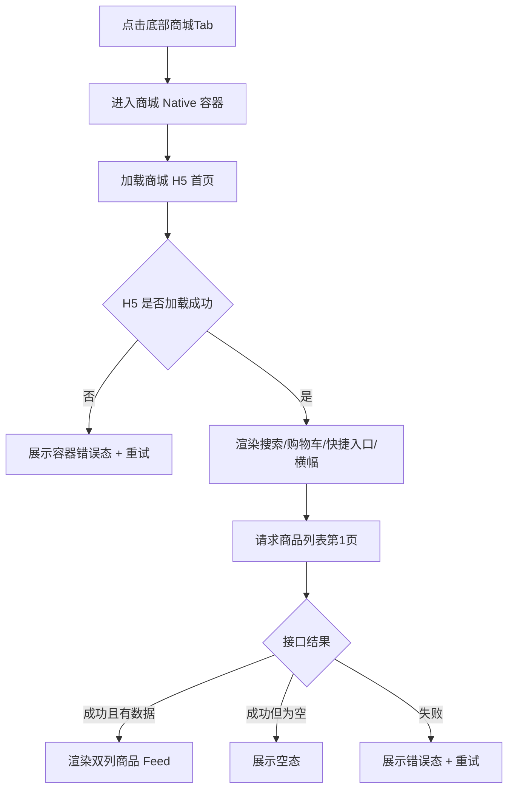
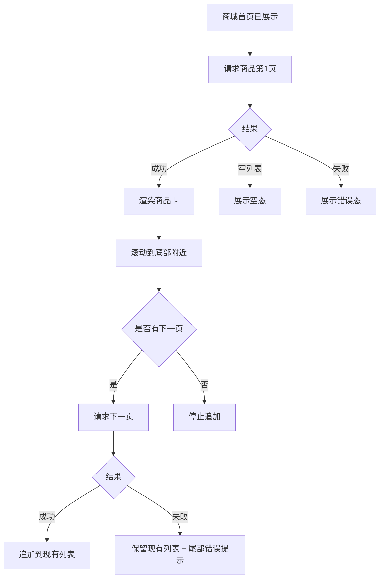
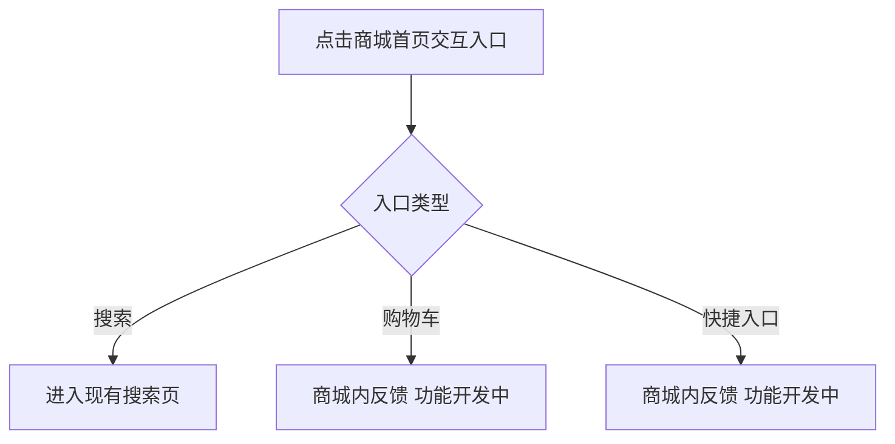
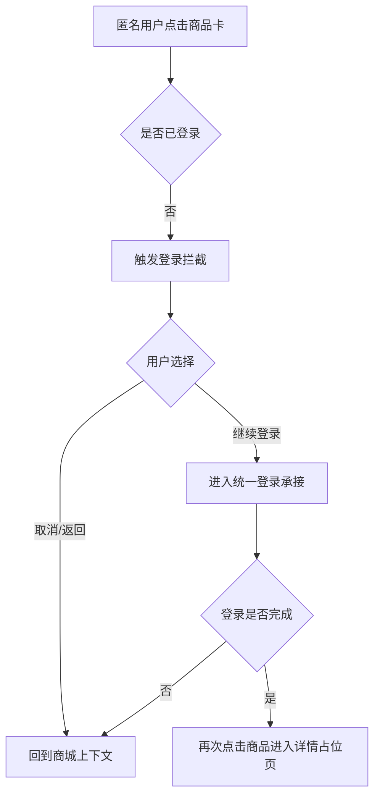
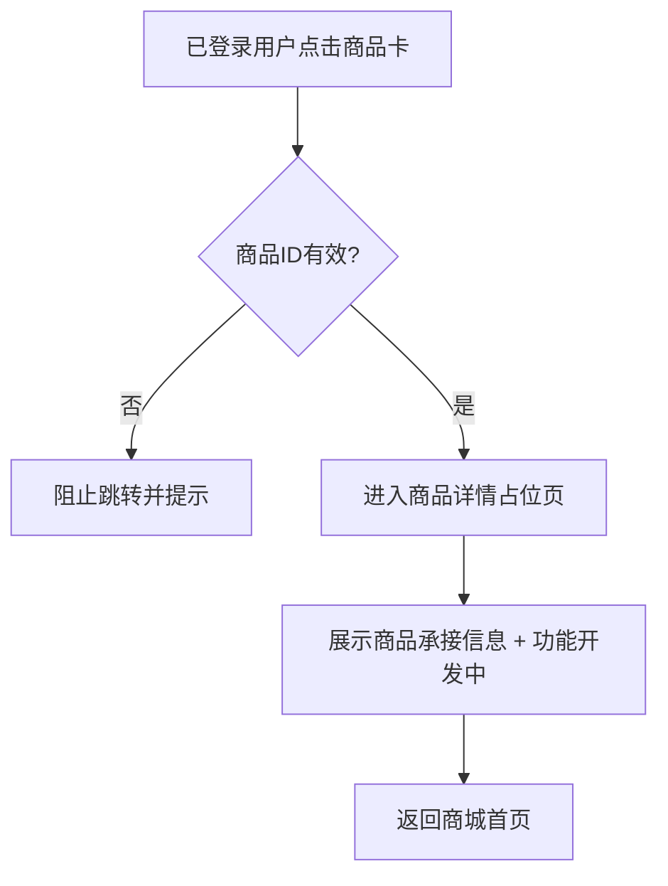

# 需求文档：PRD-13 商城

> 创建日期：2026-07-28
> 状态：草稿
> 作者：AI Agent + daniel

---

## 1. 需求背景

### 1.1 问题描述

- **现状**：移动端底部导航已经具备 `home / theater / mall / earn / profile` 五个一级频道，但当前 Android 的 `mall` graph 仍展示 `PlaceholderScreen`，iOS 的 `mall` tab 仍复用 `PlaceholderTabView`，Web `/mall` 也只是占位路由；用户点击「商城」后无法浏览商品、进入活动入口或继续完成商业化转化链路。
- **痛点**：
  - 商城是内容平台的重要商业化入口，但当前只有占位说明，无法承接商品分发与活动运营。
  - `PRODUCT.md` 已明确商城（mall）与赚钱（earn）应走 **H5 页面承载 + Native 容器接入**，但当前移动端尚未接入真实 H5 容器，产品策略与代码现状之间存在明显缺口。
  - 竞品商城首屏已经形成「搜索 / 购物车 / 快捷入口 / 活动横幅 / 双列商品流」的稳定浏览路径；当前产品在该路径上没有任何真实内容承接。
  - 商品点击的关键行为不只是“跳详情”，而是需要区分匿名与登录态：匿名用户应先触发登录拦截，并在返回后恢复商城上下文；当前代码中尚不存在商城域内的这一交互闭环。
  - Backend 尚未提供商城商品列表接口，H5 页面即使接入容器，也缺少稳定的数据来源。

### 1.2 预期目标

- **目标**：将移动端一级频道中的「商城」Tab 从占位页演进为真实商城入口，并遵循 `PRODUCT.md` 的页面承载策略：**商城首页及其商品详情占位页由 H5 页面承载，Android / iOS 负责 Native 容器接入与跨端桥接，Backend 提供首版商品列表接口**。
- **成功指标**（可度量）：
  - Android / iOS 点击底部「商城」Tab 后，默认进入商城 H5 首页，底部商城 tab 保持高亮，不再展示占位说明。
  - 商城首页首版完整展示以下结构：顶部搜索入口 + 购物车入口、5 个快捷入口、活动横幅、双列商品 Feed。
  - Backend 提供 `GET /api/mall/products`，首页默认成功加载第一页商品数据；空列表展示空态，错误场景展示错误态与重试入口。
  - 匿名用户点击商品卡时，先在商城 H5 页内看到登录拦截覆盖层；点击“继续登录”后再通过 bridge 打开统一 Native 全屏登录承接页。从拦截层取消或从登录承接返回后，商城页面状态与底部商城 tab 高亮继续保留。
  - 已登录用户点击商品卡后进入商品详情占位页；详情页继续由商城 H5 承载，不新增独立 Native 商品详情页面。
  - Web 端不要求交付桌面站商城运营能力，但需要提供可被 Native 容器加载的商城 H5 页面资产与本地开发承接路由。

### 1.3 范围定义

| 范围内 | 范围外（明确不做） | 原因 |
|--------|------------------|------|
| Android / iOS 将 `mall` 一级频道从 placeholder 替换为商城 H5 容器页 | 继续用 Native 重写商城首页 UI | `PRODUCT.md` 已明确 mall 应由 H5 承载 |
| Web 提供商城 H5 首页与商品详情占位页，用于 Native 容器接入 | 桌面站独立商城导航壳、PC 端专属布局适配 | 本期目标是移动端 H5 承载，不是独立 Web 商城站点 |
| Backend 新增 `GET /api/mall/products` 商品列表接口 | 下单 / 支付 / 物流 / 售后等完整交易链路 | 远期迭代 |
| 商城首页结构：搜索、购物车、5 个快捷入口、活动横幅、双列商品 Feed | 购物车真实列表、订单页、钱包页、券包页、国补专区真实内容 | 首版只做入口占位或反馈 |
| 匿名点击商品卡触发登录拦截，并保持商城上下文 | 真正的账号登录 / 注册 / 找回密码完整能力 | 依赖 PRD-08，商城本期只负责“页内拦截 + 打开统一登录承接 + 返回恢复语义” |
| 已登录点击商品卡进入商品详情占位页 | 真实商品详情、SKU、库存、规格、加购、下单 | 远期迭代 |
| 活动横幅首版使用受控 seed/config 数据，默认由 Web H5 集中配置模块单点管理 | 运营后台动态配置 banner | 首版先以单点配置验证页面结构，避免在 Native 或页面组件内散落硬编码 |
| 商品 Feed 分页加载、空态、错误态、追加失败处理 | 客户端排序、筛选、瀑布流复杂异步高度优化、离线缓存 | 首版优先打通主链路与稳定状态机 |

> 本期重点是先打通「商城一级频道 → H5 首页 → 商品浏览 / 登录拦截 / 详情占位」主链路，而不是一次性补齐完整电商闭环。

---

## 2. 术语表

| 术语 | 定义 | 来源 |
|------|------|------|
| 商城频道 | 底部导航中的一级频道 `mall`，是商城业务的唯一一级入口 | `PRODUCT.md` / 本文档收敛 |
| 商城 H5 首页 | 由 Web 提供、在 Native 容器内加载的商城首页，包含搜索、购物车、快捷入口、横幅与商品 Feed | `PRODUCT.md` / 本文档收敛 |
| 商城 Native 容器 | Android / iOS 中承载商城 H5 页面的 WebView/WKWebView 容器页，负责加载、错误恢复与桥接 | 本文档新定义 |
| 商品卡 | 商城首页商品 Feed 中的单个商品单元，展示商品图、标题、价格、标签 | PRD / 竞品研究 |
| 登录拦截 | 匿名用户点击商品卡后，不直接进入详情，而是在商城上下文内先展示 H5 页内拦截覆盖层，并可继续打开统一 Native 登录承接页 | 竞品研究 / 本文档收敛 |
| 商城上下文 | 指商城 tab 选中态、商城首页滚动位置、已加载 Feed 数据与当前 H5 页面状态 | 本文档新定义 |
| 快捷入口 | 商城首页固定展示的 5 个入口：我的订单、优惠券红包、我的钱包、短剧同款、国补专区 | PRD |
| 活动横幅 | 商城首页快捷入口下方的轮播 banner 区域，首版使用受控 seed/config 数据 | PRD / 本文档收敛 |
| 商品详情占位页 | 已登录用户点击商品卡后进入的 H5 占位页，仅表达“功能开发中”，不承载真实交易能力 | PRD / 本文档收敛 |
| MallLoginContext | 商城登录拦截与登录承接之间传递的最小上下文字段集合，至少包含 `source`、`productId`、`returnTarget` | 本文档新定义 |
| 受控 seed/config 数据 | 首版为保证演示与测试稳定而提供的固定配置数据，但必须集中在服务端或 H5 配置层管理，不在 Native 客户端或页面组件内硬编码图片 URL | 根目录 `CLAUDE.md` / 本文档收敛 |

### 2.1 快捷入口清单

| UI 文案 | 首版行为 | 说明 |
|--------|---------|------|
| 我的订单 | 留在商城上下文内给出“功能开发中”反馈 | 不跳真实订单页 |
| 优惠券红包 | 留在商城上下文内给出“功能开发中”反馈 | 不跳真实券包页 |
| 我的钱包 | 留在商城上下文内给出“功能开发中”反馈 | 不跳真实钱包页 |
| 短剧同款 | 留在商城上下文内给出“功能开发中”反馈 | 不跳真实同款页 |
| 国补专区 | 留在商城上下文内给出“功能开发中”反馈 | 不跳真实国补专区 |

---

## 3. 涉及平台

| 平台 | 是否涉及 | 变更概要 |
|------|---------|---------|
| Backend | ✅ 涉及 | 新增商城商品列表接口 `GET /api/mall/products`，为 H5 首页商品 Feed 提供数据来源 |
| Web | ✅ 涉及 | 将 `/mall` 从占位路由演进为可供 Native 容器加载的商城 H5 首页，并补齐商品详情占位页等商城 H5 内部承接 |
| iOS | ✅ 涉及 | 将 `mall` tab 从 `PlaceholderTabView` 替换为商城 Native 容器，负责 H5 加载、错误态、桥接与上下文保留 |
| Android | ✅ 涉及 | 将 `mall` graph 从 `PlaceholderScreen` 替换为商城 Native 容器，负责 H5 加载、错误态、桥接与上下文保留 |

---

## 4. 用户故事

| 编号 | 角色 | 需求 | 验收标准 | 涉及平台 | 优先级 |
|------|------|------|---------|---------|--------|
| US-01 | 浏览型用户 | 我希望点击商城 tab 后立即看到真实商城首页，而不是占位页 | Android / iOS 进入 `mall` tab 后加载商城 H5 首页；页面完整展示搜索、购物车、快捷入口、横幅、商品 Feed | Web / iOS / Android | P0 |
| US-02 | 浏览型用户 | 我希望在商城首页浏览商品并继续向下滚动查看更多内容 | 商品 Feed 默认加载第一页，支持分页加载更多；空态、错误态、追加失败均有清晰反馈 | Backend / Web / iOS / Android | P0 |
| US-03 | 所有用户 | 我希望点击搜索、购物车和快捷入口时得到明确承接 | 搜索入口复用现有搜索页；购物车和 5 个快捷入口给出“功能开发中”反馈且不离开商城上下文 | Web / iOS / Android | P1 |
| US-04 | 匿名用户 | 我点击商品卡时应先被登录拦截，而不是直接进入详情 | 匿名点击商品卡时，在商城上下文内触发登录拦截；返回后商城 tab 继续高亮，商城页面状态不丢失 | Web / iOS / Android | P0 |
| US-05 | 已登录用户 | 我点击商品卡后希望进入商品详情承接页 | 已登录点击商品卡后进入商品详情占位页；详情页继续由商城 H5 承载，不新增 Native 商品详情路由 | Web / iOS / Android | P1 |

---

## 5. 功能详述

### 5.1 US-01：进入商城频道并加载 H5 首页

#### 流程描述

1. 用户点击底部导航中的「商城」Tab。
2. Android / iOS 不再展示 placeholder，而是进入商城 Native 容器页。
3. Native 容器读取统一配置的商城 H5 首页地址并开始加载。
4. H5 首页成功加载后，按固定顺序展示以下区块：
   - 顶部搜索入口
   - 购物车入口
   - 5 个快捷入口
   - 活动横幅轮播
   - 双列商品 Feed
5. 商品 Feed 首次进入时请求：`GET /api/mall/products?page=1&pageSize=20`。
6. 接口成功返回后，H5 渲染第一页商品卡；若为空则展示空态；若失败则展示错误态与重试入口。
7. 底部商城 tab 在整个商城首页浏览过程中保持高亮。



#### 前置条件

- [x] 移动端已存在 `mall` 一级频道入口。
- [ ] Android / iOS 已具备商城 Native 容器接入能力。
- [ ] Web 已提供可加载的商城 H5 首页路由。
- [ ] Backend 已提供 `GET /api/mall/products`。

#### 后置条件

- 用户位于商城首页上下文中，底部商城 tab 保持高亮。
- 首屏成功后可继续触发搜索、快捷入口反馈、商品点击与分页加载。
- H5 页面与 Native 容器均处于可重试状态，失败不会退回占位页。

#### 涉及的 UI/交互（如有）

| 页面 / 区域 | 交互描述 | 涉及端 |
|------------|---------|--------|
| 底部商城 Tab | 点击后进入商城容器，而不是展示占位说明 | iOS / Android |
| Native 容器 loading 态 | H5 首次加载期间展示骨架或 loading 占位 | iOS / Android |
| Native 容器错误态 | H5 首页加载失败时展示错误说明与重试按钮 | iOS / Android |
| 商城 H5 首页 | 按固定区块顺序渲染，不因数据状态打乱结构 | Web |
| 商品 Feed 首屏 | 双列商品卡默认展示第一页数据 | Web |

#### 边界与异常

**错误处理：**

| 操作步骤 | 错误类型 | 触发条件 | 系统行为 | 用户感知 |
|---------|---------|---------|---------|---------|
| 加载商城首页 | H5 加载失败 | URL 不可达 / 网络异常 / 页面崩溃 | Native 容器展示错误态，可重试 | 错误说明 + 重试按钮 |
| 拉取商品列表 | 网络异常 | 超时 / 断网 | H5 保留页面骨架，Feed 区进入错误态 | 错误态 + 重试 |
| 拉取商品列表 | 服务端错误 | 500 / 502 / 503 | 不渲染脏数据，不回退到 placeholder | 错误态 + 重试 |
| 拉取商品列表 | 数据校验失败 | 字段缺失 / 类型错误 | 丢弃非法结果，展示错误态 | 错误提示 |
| 容器反复加载失败 | 多次重试仍失败 | 页面地址错误或持续网络异常 | 保持统一错误态，不死循环刷新 | 明确失败反馈 |

**边界场景：**

| 场景 | 触发条件 | 预期行为 |
|------|---------|---------|
| 首屏无商品 | 接口返回空列表 | 展示空态，但搜索 / 快捷入口 / 横幅区块仍保留 |
| 横幅配置为空 | 首版 seed/config 暂无 banner | 横幅区块允许隐藏或展示空占位，不影响其他内容 |
| 用户切后台再返回 | 首页已加载或加载中 | 尽量保留商城上下文；必要时可局部重试，但不退回 placeholder |
| 反复切换 tab | 用户在多个一级 tab 间来回切换 | 返回商城时尽量复用已有容器与页面状态，避免每次冷启动 |

### 5.2 US-02：浏览商品 Feed 并支持分页加载

#### 流程描述

1. 商城首页初次加载完成后，H5 默认请求商品列表第一页。
2. 商品 Feed 以双列卡片形式展示商品图、标题、价格与标签。
3. 用户向下滚动到列表底部附近时，若仍有下一页，则继续请求下一页：`GET /api/mall/products?page=<n>&pageSize=20`。
4. 新页商品追加到当前列表末尾，不清空已加载内容。
5. 若追加请求失败，保留当前已渲染商品，并在列表尾部提示可重试。
6. 若已到最后一页，则停止继续请求，并展示“没有更多了”或静默结束。



#### 前置条件

- [x] 商城 H5 首页已成功加载。
- [ ] `GET /api/mall/products` 已可用。
- [ ] 商品 Feed 组件已支持双列布局与尾部加载状态。

#### 后置条件

- 商品列表与分页状态保持一致，不重复、不丢失、不乱序。
- 追加失败不会清空已有商品内容。
- 最后一页后不再发送冗余请求。

#### 涉及的 UI/交互（如有）

| 页面 / 区域 | 交互描述 | 涉及端 |
|------------|---------|--------|
| 商品卡列表 | 双列卡片展示商品信息 | Web |
| 列表尾部 loading | 正在追加下一页时展示尾部 loading | Web |
| 列表尾部错误 | 追加失败时允许重试，不清空已加载内容 | Web |
| 空态区 | 无商品时展示空态插画/文案 | Web |

#### 边界与异常

**错误处理：**

| 操作步骤 | 错误类型 | 触发条件 | 系统行为 | 用户感知 |
|---------|---------|---------|---------|---------|
| 加载第一页 | 网络异常 | 断网 / 超时 | 不展示脏数据，进入错误态 | 错误态 + 重试 |
| 加载下一页 | 网络异常 | 断网 / 超时 | 保留现有列表，记录尾部错误 | 尾部错误提示 |
| 加载下一页 | 服务端错误 | 5xx | 不清空已有列表，可再次触发加载 | 尾部错误提示 |
| 加载任一页 | 数据校验失败 | `price` / `image_url` 等字段非法 | 当前页视为失败，不混入异常数据 | 错误提示 |
| 高频触底 | 重复触发分页 | 同一页多次请求并发 | 同一页只允许一个请求在途 | 不出现重复商品 |

**边界场景：**

| 场景 | 触发条件 | 预期行为 |
|------|---------|---------|
| 第一页不足一屏 | 商品较少 | 不强制连续补页，允许静态展示 |
| 超大页码 | 超出 `total_pages` | 服务端返回空数组，前端停止追加 |
| 旧请求晚于新请求返回 | 网络乱序 | 仅消费最后一次有效分页结果，不允许乱序覆盖 |
| 图片加载失败 | 商品图 URL 失效 | 使用统一占位图，不影响卡片点击 |

### 5.3 US-03：使用搜索、购物车与快捷入口

#### 流程描述

1. 用户在商城首页点击顶部搜索入口。
2. 在 **Native 容器模式** 下，商城 H5 通过 bridge 请求宿主打开现有 Native 搜索页（复用 PRD-04 搜索能力），而不是在商城首页内临时拼接新的搜索逻辑；是否临时切到 home-owned 搜索页由容器实现决定，但最低要求是用户返回后仍可重新回到商城首页，且商城 tab 高亮正确。
3. 在 **浏览器 / 本地开发模式** 下，若商城 H5 直接运行在 Web 路由中，则搜索入口默认跳转现有 `/search` 路由；若该路由在当前阶段仍为占位页，也视为合法承接，不额外新增商城域内搜索实现。
4. 用户点击购物车入口时，首版留在商城上下文内给出“功能开发中”反馈。
5. 用户点击任一快捷入口时，首版同样留在商城上下文内给出“功能开发中”反馈。
6. 上述反馈或跳转不应导致页面整页白屏；对于 Native 容器模式，若无法完整恢复滚动位置，首版至少保证用户能回到商城首页且底部商城 tab 高亮正确。



#### 前置条件

- [x] 商城首页已成功加载。
- [x] 现有搜索页已存在。
- [ ] 商城 H5 与 Native 容器之间已约定搜索跳转桥接。

#### 后置条件

- 搜索入口进入统一搜索承接能力：Native 容器模式下走 bridge + Native 搜索页，浏览器 / 本地开发模式下默认跳转 `/search`。
- 购物车与快捷入口的首版反馈不离开商城上下文。
- 用户从搜索承接返回后，首版最低保证是可重新回到商城首页且商城 tab 高亮正确；完整滚动位置恢复作为增强项。

#### 涉及的 UI/交互（如有）

| 页面 / 区域 | 交互描述 | 涉及端 |
|------------|---------|--------|
| 顶部搜索入口 | Native 容器模式下通过 bridge 打开现有 Native 搜索页；浏览器 / 本地开发模式下跳转 `/search` | Web / iOS / Android |
| 购物车入口 | 点击后给出“功能开发中”反馈 | Web |
| 快捷入口网格 | 5 项固定入口，点击后给出“功能开发中”反馈 | Web |

#### 边界与异常

**错误处理：**

| 操作步骤 | 错误类型 | 触发条件 | 系统行为 | 用户感知 |
|---------|---------|---------|---------|---------|
| 点击搜索 | 跳转桥接失败 | Native 容器未注册能力 / 参数错误 | 保留商城页，不崩溃 | 本地错误提示 |
| 点击购物车/快捷入口 | 功能未实现 | 首版没有真实目标页 | 仅反馈，不发起无意义跳转 | 轻提示 |
| 点击反馈类入口 | 重复点击 | 用户快速多次点击 | 合并或节流反馈 | 不出现多层弹窗 |

**边界场景：**

| 场景 | 触发条件 | 预期行为 |
|------|---------|---------|
| 搜索后返回 | 用户从搜索页回退 | 可返回商城上下文；若技术实现做不到完整恢复，至少保证底部商城 tab 可重新进入商城首页 |
| 快捷入口配置固定 | 首版只支持 5 个入口 | 顺序与文案固定，不支持动态增删 |
| 购物车入口无后续页面 | 首版未建设真实购物车 | 不跳空白页，不新增 placeholder 路由 |

### 5.4 US-04：匿名点击商品卡触发登录拦截并保留商城上下文

#### 流程描述

1. 匿名用户在商城首页点击任一商品卡。
2. 系统先判断当前登录态。
3. 若用户未登录，**首版统一默认方案** 为：先在商城 H5 页内展示登录拦截覆盖层，而不是直接跳商品详情。
4. 登录拦截覆盖层需明确表达“登录后可继续查看/购买商品”等意图，并给出“继续登录”和“取消”两个动作。
5. 用户点击“继续登录”后，商城 H5 通过 bridge 把 `MallLoginContext` 传给 Native 容器；`MallLoginContext` 至少包含 `source=mall`、`productId`、`returnTarget=/mall`。Native 容器随后打开统一 **全屏登录承接页**。若 PRD-08 真实登录尚未就绪，首版允许该全屏页先承接到统一登录占位页，但不得直接复用 home 菜单里的 `menu/login` 语义来替代“商城内登录拦截”。
6. 用户点击“取消”时，关闭 H5 页内拦截覆盖层，停留在当前商城页面。
7. 用户从全屏登录承接页返回时，无论是取消、失败还是关闭，Native 容器都必须回到 `returnTarget` 指定的商城页；底部商城 tab 继续高亮。若容器未被系统回收，则尽量恢复原有滚动位置与已加载商品；若容器已重建，首版最低保证恢复到商城首页首屏。
8. 用户登录成功后，再次点击商品卡时进入商品详情占位页。



#### 前置条件

- [x] 商城首页已成功渲染商品卡。
- [ ] 系统能够判断当前登录态。
- [ ] 商城已具备登录拦截 UI/桥接承接能力。

#### 后置条件

- 匿名点击商品卡不会直接进入详情页，而是先看到商城 H5 页内拦截覆盖层。
- 点击“继续登录”后，系统使用 `MallLoginContext` 打开统一全屏登录承接页；取消、失败、关闭三种返回路径都必须回到商城页。
- 登录拦截发生后，商城上下文不应整体丢失；首版最低保证是返回商城首页且商城 tab 高亮正确。
- 登录完成后，用户可继续进入商品详情占位页。

#### 涉及的 UI/交互（如有）

| 页面 / 区域 | 交互描述 | 涉及端 |
|------------|---------|--------|
| 商品卡 | 匿名点击时不直接打开详情 | Web |
| 登录拦截层 | 首版固定为商城 H5 页内覆盖层，展示拦截信息与“继续登录 / 取消”动作 | Web |
| 登录承接 | 点击“继续登录”后由 Native 容器打开统一全屏登录承接页；若真实登录尚未落地，可暂接统一登录占位页，但必须保留商城返回语义 | iOS / Android |

#### 边界与异常

**错误处理：**

| 操作步骤 | 错误类型 | 触发条件 | 系统行为 | 用户感知 |
|---------|---------|---------|---------|---------|
| 点击商品卡 | 登录态判断失败 | 本地状态缺失 / bridge 异常 | 默认走登录拦截而不是直接放行 | 登录提示 |
| 打开登录拦截 | UI 展示失败 | H5 层异常 | Native 容器兜底提示，不允许直接进详情 | 错误提示 |
| 打开登录承接页 | bridge 失败 | `MallLoginContext` 缺失 / 容器未注册登录能力 | 停留在商城页内拦截层，不直接跳空白页 | 本地错误提示 |
| 登录完成返回 | 上下文恢复失败 | 容器重建 / 页面刷新 | 至少恢复到商城首页，tab 高亮不丢失 | 返回商城首页 |
| 快速重复点击商品卡 | 重复点击 | 短时间多次触发 | 只展示一次登录拦截 | 无重复弹层 |

**边界场景：**

| 场景 | 触发条件 | 预期行为 |
|------|---------|---------|
| 匿名用户反复取消登录 | 多次点击商品后取消 | 每次都停留在商城上下文，不直接进入详情 |
| 登录中断 | 登录页返回 / 关闭 | 回到商城上下文，底部商城 tab 继续高亮 |
| 商城处于分页后深滚动位置 | 匿名点击商品发生在列表深处 | 返回后尽量回到原位置，不强制滚回顶部 |

### 5.5 US-05：已登录点击商品卡进入商品详情占位页

#### 流程描述

1. 已登录用户在商城首页点击商品卡。
2. 系统校验商品 `id` 合法后，进入商品详情占位页。
3. 商品详情占位页继续由商城 H5 承载，可以是 H5 内子路由或同一容器内页面切换，但不新增独立 Native 商品详情页面。
4. 占位页需要展示商品基础信息承接和“功能开发中”说明，让用户明确当前尚未开放真实交易能力。
5. 用户返回后回到商城首页，并尽量保留先前浏览上下文。



#### 前置条件

- [x] 用户已处于登录态。
- [x] 商城首页已渲染商品卡。
- [ ] 商品详情占位页已在商城 H5 中提供承接。

#### 后置条件

- 已登录点击商品卡后进入详情占位页。
- 不新增 Native 详情路由，不影响现有 `detail/:id` 短剧详情语义。
- 返回商城后尽量恢复原有页面状态。

#### 涉及的 UI/交互（如有）

| 页面 / 区域 | 交互描述 | 涉及端 |
|------------|---------|--------|
| 商品卡 | 已登录点击后进入详情占位页 | Web |
| 商品详情占位页 | 展示商品承接信息与“功能开发中”说明 | Web |
| 返回行为 | 返回商城首页并尽量恢复先前状态 | Web / iOS / Android |

#### 边界与异常

**错误处理：**

| 操作步骤 | 错误类型 | 触发条件 | 系统行为 | 用户感知 |
|---------|---------|---------|---------|---------|
| 点击商品卡 | 商品 ID 非法 | `id` 为空或格式异常 | 阻止跳转 | 轻提示 |
| 进入详情占位页 | H5 子路由加载失败 | 页面资源异常 | 显示错误说明，可返回商城首页 | 错误提示 + 返回 |
| 返回商城 | 页面状态丢失 | 容器重建 | 至少恢复商城首页首屏 | 回到商城首页 |

**边界场景：**

| 场景 | 触发条件 | 预期行为 |
|------|---------|---------|
| 从分页深处进入详情再返回 | 已加载多页商品 | 尽量回到进入前列表位置 |
| 商品标签过多 | `tags` 数量较大 | 列表和详情占位页都应做展示截断，不撑破布局 |
| 价格为边界值 | `0`、超大金额、小数价格 | 按统一价格格式展示，不出现 NaN/错位 |

---

## 6. 数据概览

| 数据实体 | 说明 | 关键字段 | 来源 |
|---------|------|---------|------|
| MallProduct | 商城商品卡业务实体 | `id`、`title`、`image_url`、`price`、`tags[]` | Backend `GET /api/mall/products` |
| MallProductPage | 商品分页结果 | `data[]`、`pagination.page`、`pagination.page_size`、`pagination.total`、`pagination.total_pages` | Backend `GET /api/mall/products` |
| MallBanner | 商城活动横幅配置 | `id`、`image_url`、`target_type`、`target_value`、`sort_order` | Web H5 集中配置模块 |
| MallShortcut | 商城快捷入口配置 | `key`、`title`、`icon`、`behavior` | H5 固定配置 |
| MallContainerState | Native 容器承载状态 | `loading`、`success`、`error`、`lastLoadedUrl` | iOS / Android 容器状态 |
| MallPageState | 商城首页状态机 | `items`、`page`、`hasNextPage`、`isLoading`、`isAppending`、`appendError`、`loginInterceptVisible` | Web |
| MallLoginContext | 商品点击触发登录拦截时的上下文 | `source=mall`、`productId`、`returnTarget` | Web / Native bridge |

### 数据关系

```text
[MallContainerState] ──1:1──▶ [MallPageState]
[MallPageState] ──1:N──▶ [MallProduct]
[MallPageState] ──1:N──▶ [MallBanner]
[MallPageState] ──1:N──▶ [MallShortcut]
[MallLoginContext] ──1:1──▶ [MallProduct]
```

### 6.1 Backend 接口数据约定（需求层）

> 本节描述业务契约，不限定最终代码实现细节；字段命名与 schema 在 design 阶段继续收敛，但必须满足首版需求范围。

- 接口：`GET /api/mall/products`
- Query：
  - `page`: `>= 1`，缺省 `1`
  - `pageSize`: `>= 1` 且 `<= 100`，缺省 `20`
- 响应结构：

```json
{
  "data": [
    {
      "id": "uuid",
      "title": "商品标题",
      "image_url": "https://...",
      "price": 9.9,
      "tags": ["热卖"]
    }
  ],
  "pagination": {
    "page": 1,
    "page_size": 20,
    "total": 20,
    "total_pages": 1
  }
}
```

- 契约补充：
  - 首版按服务端固定稳定顺序返回商品，不支持客户端传排序/筛选条件。
  - `price` 为服务端返回的原始数值字段，前端负责格式化展示文案；不返回仅供展示的拼接字符串字段作为权威值。
  - `image_url` 必须是可直接加载的合法 URL；前端仍需对失效资源做兜底占位。
  - 空列表返回 `200 + data=[] + 合法 pagination`，前端展示空态而不是错误态。
  - 非法 `page/pageSize` 返回统一校验错误，而不是静默兜底到异常值。
- 首版数据策略：
  - 商品列表：由 Backend seed/mock 数据提供 20+ 条商品，支持分页切片。
  - 活动横幅：首版默认由 **Web H5 的集中配置模块** 单点持有 seed/config，至少统一 `id / image_url / target_type / target_value / sort_order` 字段；**不在 iOS / Android 客户端或页面组件内硬编码图片 URL**。如后续需要改为 Backend 只读配置接口，应在 design 阶段作为增强项评估，而不是回退到多处散落硬编码。

---

## 7. 现有功能影响

| 现有功能 | 影响类型 | 说明 | 是否需要迁移 |
|---------|---------|------|------------|
| 应用壳 / 一级频道 | 修改行为 | Android / iOS 的 `mall` tab 将从 placeholder 演进为真实商城容器 | 否 |
| Web `/mall` 路由 | 修改行为 | 从占位页演进为商城 H5 首页承接路由 | 否 |
| 搜索发现 | 新增关联 | 商城顶部搜索入口复用现有搜索页能力 | 否 |
| 登录能力 | 新增关联 | 匿名点击商品卡时需要登录拦截；拦截承接复用 PRD-08 登录能力或其过渡占位承接 | 否 |
| 短剧详情 / 播放路由 | 无影响 | 商城商品详情不复用 `detail` / `play` 语义，不修改短剧业务路由 | 否 |
| Backend API | 新增接口 | 新增 `GET /api/mall/products`，不改动现有首页、排行、分类、剧场接口 | 否 |
| 活动运营配置 | 新增关联 | 首版 banner 需要受控 seed/config 数据来源 | 否 |

### 兼容性说明

- 本期新增的是商城 H5 首页、Native 容器接入与商品列表接口，不要求迁移既有用户数据。
- 旧客户端若未接入商城容器，仍会看到 placeholder；新客户端接入后不影响首页、剧场、排行、分类、播放等已上线能力。
- 商城商品详情继续限定在 mall 业务域内，不复用短剧 `detail/:id` 或 `play/:id` 语义，避免污染既有路由契约。
- 搜索入口虽然复用现有搜索能力，但不改变搜索页本身的数据契约与路由语义。

---

## 8. 非功能性需求

### 8.1 性能

| 指标 | 目标值 | 测量方式 |
|------|--------|---------|
| 商城 Tab 首屏可见 | 点击商城 tab 后 1 秒内出现容器骨架或首屏 loading | 本地 / 模拟器观察 |
| 商城首页可交互 | H5 首页成功加载后尽快展示首屏主要区块 | 本地联调验证 |
| 商品列表接口 P95 | 本地 / mock 环境下 < 300 ms | 接口测试 / 日志观察 |
| 商品列表滚动体验 | 常规滚动流畅，无明显卡顿或重复渲染 | 模拟器 / 本地验证 |
| 分页追加稳定性 | 不出现重复页、重复卡片、错序覆盖 | 单测 + 手动验证 |

### 8.2 安全

| 关注点 | 要求 |
|--------|------|
| 认证与授权 | 商城首页浏览不要求登录；商品详情查看前的关键分流由统一登录拦截控制 |
| 数据校验 | 商品列表 query 与 response 均需做结构校验；H5 与 Native 的桥接入参也需校验 |
| 敏感数据 | 不在客户端硬编码 token、环境地址或登录态开关；商城地址与 API 基址走统一配置 |
| 防滥用 | 首版以只读接口为主，可保留基础限流与错误处理；不新增高风险交易写接口 |

### 8.3 兼容性

| 维度 | 要求 |
|------|------|
| 设备兼容 | 沿用当前项目既有 iOS / Android 最低支持策略，不因本 PRD 单独抬升版本要求 |
| 数据兼容 | `GET /api/mall/products` 为新增接口，不破坏既有 dramas / rankings / tags / channel 等接口结构 |
| 向后兼容 | 未升级客户端仍可看到商城占位页；已升级客户端可正常消费商城新接口和 H5 页面 |

---

## 9. 依赖

| 依赖项 | 类型 | 说明 | 状态 | 阻塞 |
|--------|------|------|------|------|
| 应用壳 mall tab | 内部能力 | 提供商城一级频道入口与底部 tab 高亮承接点 | ✅ 已就绪 | 是 |
| Web H5 页面能力 | 内部能力 | 承载商城首页与商品详情占位页 | 🚧 待开发 | 是 |
| Native H5 容器能力 | 内部能力 | Android / iOS 加载商城 H5、处理错误态与桥接 | 🚧 待开发 | 是 |
| 搜索发现 | 内部能力 | 商城顶部搜索复用既有搜索页能力 | ✅ 已就绪 | 否 |
| 登录能力 / 登录占位承接 | 内部能力 | 匿名商品点击后由商城 H5 页内拦截层 + Native 全屏登录承接页组成统一闭环 | 🚧 待开发 | 是 |
| Backend 商品列表接口 | 内部能力 | 为商城商品 Feed 提供分页数据 | 🚧 待开发 | 是 |
| 活动横幅 seed/config | 内部能力 | 首版默认由 Web H5 集中配置模块提供 banner 展示数据，不能在 Native 客户端或页面组件内硬编码 | 🚧 待开发 | 否 |

---

## 10. 待澄清问题

| 编号 | 问题 | 可能的答案 | 阻塞 |
|------|------|-----------|------|
| Q-01 | 搜索入口返回商城时是否要求恢复完整滚动位置？ | A：要求完整恢复；B：首版只要求可返回商城首页且 tab 高亮正确，滚动位置恢复作为增强项 | 否 |

---

## 11. 参考资料

### 已查阅的 wiki 文档

| 文档 | 相关章节 | 关键信息 |
|------|---------|---------|
| `wiki/features/app-shell/index.md` | 功能概述、入口与路由、已知限制 | 确认 mall / earn 当前仍为 placeholder，且 mall / earn 按产品策略应为 H5 承载 |
| `wiki/index.md` | 功能索引 | 确认当前项目 wiki 已覆盖 app shell、搜索、排行、分类、剧场等上下文 |

### 已查阅的产品 / 调研文档

| 文档 | 关键内容 |
|------|---------|
| `PRODUCT.md` | 明确商城（mall）与赚钱（earn）频道使用 H5 页面承载，由 Native 容器接入 |
| `docs/product_manager/prd/2026-07-25-mall/prd.md` | 原始商城 PRD，确认搜索、购物车、快捷入口、横幅、商品 Feed 与登录拦截等首版目标 |
| `docs/product_manager/prd/2026-07-25-mall/subtasks.md` | 原始子任务与 `GET /api/mall/products` 基础 contract |
| `docs/product_research/mobile/mall/mall.md` | 商城首屏结构与竞品布局依据 |
| `docs/product_research/mobile/mall/product-card/product-card.md` | 匿名点击商品卡时触发登录拦截并保持商城上下文的竞品依据 |

### 已查阅的代码文件

| 文件 | 关键内容 |
|------|---------|
| `android/app/src/main/java/com/djs66256/short_drama/navigation/NavGraph.kt` | 确认 Android `mall` 当前仍是 `PlaceholderScreen` |
| `android/app/src/main/java/com/djs66256/short_drama/navigation/AppDestination.kt` | 确认 Android 已存在 `mall` 一级频道 route 常量 |
| `android/app/src/main/java/com/djs66256/short_drama/domain/repository/AuthSessionProvider.kt` | 确认 Android 当前已有登录态读取抽象，可作为商城登录拦截前置能力 |
| `ios/ShortDrama/Sources/App/TabNavigationHostView.swift` | 确认 iOS `mall` 当前仍复用 `PlaceholderTabView` |
| `ios/ShortDrama/Sources/App/NavigationRouter.swift` | 确认 iOS 当前尚无 mall 容器专属路由与状态管理 |
| `ios/ShortDrama/Sources/App/AppRoute.swift` | 确认 iOS 现有公开路由主要归属 home 链路 |
| `ios/ShortDrama/Sources/Features/Ranking/Views/RankingHomeView.swift` | 确认 iOS 已存在登录拦截提示语义，可为商城登录拦截提供交互参考 |
| `ios/ShortDrama/Sources/Features/Ranking/RankingRouteBuilder.swift` | 确认 iOS 当前路由构建仍围绕短剧业务，不适合直接复用为商品详情 |
| `web/src/app/mall/page.tsx` | 确认 Web `/mall` 目前仍为 `PlaceholderRouteScreen` |

---

## 12. 变更历史

| 日期 | 变更内容 | 变更原因 |
|------|---------|---------|
| 2026-07-28 | 初始版本 | 基于 PRD-13、竞品调研、`PRODUCT.md` 的 H5 承载策略、现有 wiki 与代码现状，收敛商城首版需求范围 |
