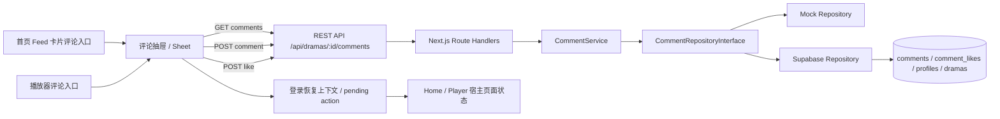

# 技术方案（共享部分）：PRD-09 评论系统

> 创建日期：2026-07-29
> 对应需求：spec.md

## 整体架构

本期评论能力按现有代码基线拆成四层：移动端页面内评论抽屉、Backend Route/Service/Repository、Supabase 数据表、以及跨端共享的登录拦截与评论状态机约束。评论不新增独立页面路由，首页 Feed 与播放器都在当前页面内以半屏抽屉 / sheet 承载。



### 方案总览

- Backend 新增独立 comments 模块，不继续把评论能力塞进 `DramaRepositoryInterface`
- 评论列表允许匿名读取；列表中的 `liked` 字段通过可选用户态计算
- 写接口首版继续对齐当前 skeleton auth：服务端通过 `getAuthenticatedUserId()` 读取 `x-user-id` 或 `Authorization: Bearer <user-id>`
- 移动端评论入口全部做成页面内抽屉，不新增 comments route
- 首页与播放器共享同一套评论状态机：`loading / content / empty / error / submitting / liking`
- 登录拦截只负责恢复评论抽屉上下文，不自动重放“发送评论 / 点赞评论”写操作
- `sort=hot` 首版保留 contract，但实现上允许先回退为与 `latest` 相同的排序结果；客户端与 QA 只校验参数和响应可用，不校验真实热度算法

## API 设计

### 涉及变更

| 类型 | 数量 | 说明 |
|------|------|------|
| 新增接口 | 3 | 评论列表、发表评论、点赞/取消点赞 |
| 修改接口 | 0 | 不改动现有 dramas / player / rankings 契约 |
| 废弃接口 | 0 | 无 |

### 设计原则

1. **遵循现有 Backend 真实基线，而不是模板默认值**：
   - 成功响应沿用当前业务接口已有风格：列表接口直接返回 `{ data, pagination }`，写接口直接返回业务对象
   - 错误响应继续由 `withErrorHandler` 输出 `{ error: { code, message } }`，Zod 校验失败带 `details`
2. **Query 参数命名对齐现有移动端基线**：客户端请求使用 camelCase（`pageSize`），服务端返回分页字段仍为 snake_case（`page_size`）
3. **列表接口支持可选用户态**：匿名读取时 `liked=false`；登录态下根据当前用户的点赞关系返回真实 `liked`
4. **写接口不返回整页列表**：发表评论返回完整新评论对象；点赞切换返回目标评论的局部更新结果

### 新增接口

#### `GET /api/dramas/{id}/comments`

- **功能简介**：获取某个 drama 的一级评论列表
- **Path Parameters**：

| 字段 | 类型 | 必填 | 说明 |
|------|------|------|------|
| `id` | UUID string | 是 | dramaId |

- **Query Parameters**：

| 字段 | 类型 | 必填 | 默认值 | 说明 |
|------|------|------|--------|------|
| `page` | number | 否 | `1` | 页码，从 1 开始 |
| `pageSize` | number | 否 | `20` | 每页条数，范围 1~50 |
| `sort` | `latest \| hot` | 否 | `latest` | 首版保留 `hot` contract |

- **Request Body**：无

- **Response**：

```json
{
  "data": [
    {
      "id": "comment_uuid",
      "drama_id": "drama_uuid",
      "content": "评论正文",
      "like_count": 12,
      "liked": false,
      "created_at": "2026-07-29T09:30:00.000Z",
      "updated_at": "2026-07-29T09:30:00.000Z",
      "user": {
        "id": "user_uuid",
        "display_name": "用户昵称",
        "avatar_url": null
      }
    }
  ],
  "pagination": {
    "page": 1,
    "page_size": 20,
    "total": 36,
    "total_pages": 2
  }
}
```

- **Error Codes**：

| HTTP 状态码 | 错误码 | 说明 |
|-------------|--------|------|
| 400 | `VALIDATION_ERROR` / `INVALID_PARAMS` | path/query 非法 |
| 404 | `DRAMA_NOT_FOUND` | drama 不存在 |
| 500 | `INTERNAL_ERROR` | 结果映射或仓储异常 |
| 503 | `SERVICE_UNAVAILABLE` | Supabase 不可用时可返回 |

#### `POST /api/dramas/{id}/comments`

- **功能简介**：为某个 drama 发表评论
- **Path Parameters**：

| 字段 | 类型 | 必填 | 说明 |
|------|------|------|------|
| `id` | UUID string | 是 | dramaId |

- **Request Body**：

```json
{
  "content": "评论正文"
}
```

| 字段 | 类型 | 必填 | 说明 |
|------|------|------|------|
| `content` | string | 是 | `trim()` 后长度 1~500 |

- **Response**：

```json
{
  "id": "comment_uuid",
  "drama_id": "drama_uuid",
  "content": "评论正文",
  "like_count": 0,
  "liked": false,
  "created_at": "2026-07-29T09:30:00.000Z",
  "updated_at": "2026-07-29T09:30:00.000Z",
  "user": {
    "id": "user_uuid",
    "display_name": "用户昵称",
    "avatar_url": null
  }
}
```

- **Error Codes**：

| HTTP 状态码 | 错误码 | 说明 |
|-------------|--------|------|
| 400 | `VALIDATION_ERROR` / `INVALID_PARAMS` | 内容为空、超长、path 非法 |
| 401 | `UNAUTHORIZED` | 未登录 |
| 404 | `DRAMA_NOT_FOUND` | drama 不存在 |
| 500 | `INTERNAL_ERROR` | 创建后映射失败等内部异常 |
| 503 | `SERVICE_UNAVAILABLE` | 数据存储不可用 |

#### `POST /api/dramas/{id}/comments/{commentId}/like`

- **功能简介**：点赞或取消点赞评论（toggle）
- **Path Parameters**：

| 字段 | 类型 | 必填 | 说明 |
|------|------|------|------|
| `id` | UUID string | 是 | dramaId |
| `commentId` | UUID string | 是 | 目标评论 ID |

- **Request Body**：无

- **Response**：

```json
{
  "comment_id": "comment_uuid",
  "liked": true,
  "like_count": 13
}
```

- **Error Codes**：

| HTTP 状态码 | 错误码 | 说明 |
|-------------|--------|------|
| 400 | `VALIDATION_ERROR` / `INVALID_PARAMS` | path 非法 |
| 401 | `UNAUTHORIZED` | 未登录 |
| 404 | `DRAMA_NOT_FOUND` | drama 不存在 |
| 404 | `COMMENT_NOT_FOUND` | comment 不存在或不属于该 drama |
| 500 | `INTERNAL_ERROR` | toggle 内部异常 |
| 503 | `SERVICE_UNAVAILABLE` | 数据存储不可用 |

### 共享 Zod Schema 草案

```ts
const CommentUserSummarySchema = z.object({
  id: z.string().uuid(),
  display_name: z.string().min(1),
  avatar_url: z.string().url().nullable().default(null),
});

const CommentSchema = z.object({
  id: z.string().uuid(),
  drama_id: z.string().uuid(),
  content: z.string().min(1).max(500),
  like_count: z.number().int().min(0),
  liked: z.boolean(),
  created_at: z.string(),
  updated_at: z.string(),
  user: CommentUserSummarySchema,
});

const CommentListQuerySchema = z.object({
  page: z.coerce.number().int().min(1).default(1),
  pageSize: z.coerce.number().int().min(1).max(50).default(20),
  sort: z.enum(['latest', 'hot']).default('latest'),
});

const CreateCommentBodySchema = z.object({
  content: z.string().trim().min(1).max(500),
});

const CommentListResponseSchema = z.object({
  data: z.array(CommentSchema),
  pagination: PaginationSchema,
});

const ToggleCommentLikeResponseSchema = z.object({
  comment_id: z.string().uuid(),
  liked: z.boolean(),
  like_count: z.number().int().min(0),
});
```

## 数据模型

### 新增/变更数据表

| 表名 | 操作 | 说明 |
|------|------|------|
| `comments` | 新建 | drama 一级评论表，存储内容、作者、聚合点赞数 |
| `comment_likes` | 新建 | 用户与评论点赞关系表，用于 `liked` 计算与 toggle |
| `profiles` | 不变 | 继续提供 `display_name` / `avatar_url` 用户摘要 |
| `dramas` | 不变 | 继续作为 comments 的父资源 |

### 表结构草案

#### `comments`

| 字段 | 类型 | 约束 | 说明 |
|------|------|------|------|
| `id` | UUID | PK, default `gen_random_uuid()` | 评论 ID |
| `drama_id` | UUID | FK -> `dramas(id)` | 所属 drama |
| `user_id` | UUID | FK -> `profiles(id)` | 评论作者 |
| `content` | TEXT | `char_length(btrim(content)) BETWEEN 1 AND 500` | 评论正文 |
| `like_count` | INTEGER | `>= 0`, default 0 | 聚合点赞数 |
| `created_at` | TIMESTAMPTZ | not null, default now() | 创建时间 |
| `updated_at` | TIMESTAMPTZ | not null, default now() | 更新时间 |

#### `comment_likes`

| 字段 | 类型 | 约束 | 说明 |
|------|------|------|------|
| `comment_id` | UUID | FK -> `comments(id)` ON DELETE CASCADE | 目标评论 |
| `user_id` | UUID | FK -> `profiles(id)` ON DELETE CASCADE | 点赞用户 |
| `created_at` | TIMESTAMPTZ | not null, default now() | 点赞时间 |
| 复合唯一键 | — | `UNIQUE(comment_id, user_id)` | 防重复点赞 |

### Repository 切换策略

沿用当前 Backend 已有的 registry 思路，但为 comments 新增独立 registry：

- `CommentRepositoryInterface`
- `CommentMockRepository`
- `CommentSupabaseRepository`
- `getCommentRepository()` / `setCommentRepository()` / `resetRepositoryRegistry()`
- 配置项建议新增：`COMMENTS_REPOSITORY=mock|supabase`，默认 `mock`

这样做可以避免把 comments 继续堆进 `DramaRepositoryInterface`，也便于测试阶段先走 mock、后续切到 Supabase。

## 跨端共享逻辑

| 共享逻辑 | 说明 | 涉及端 |
|---------|------|--------|
| 评论承载方式 | 评论能力始终作为当前页面内的半屏抽屉 / sheet，不新增独立 route | Android / iOS |
| 抽屉上下文唯一性 | 同一时刻只允许一个活动中的 `dramaId` 评论上下文；切换 drama 时重置列表与输入状态 | Android / iOS |
| 首屏请求参数 | 默认 `page=1&pageSize=20&sort=latest` | Android / iOS / Backend |
| 热评参数兼容 | `sort=hot` 首版可回退为与 `latest` 相同的服务端排序，但接口、DTO、状态机必须完整支持该值 | Android / iOS / Backend |
| 评论总数来源 | 抽屉标题与空态转内容态计数统一使用 `pagination.total` | Android / iOS |
| 发表评论成功处理 | 不整页重刷；将返回的新评论插入顶部，输入框清空，`total + 1` | Android / iOS |
| 点赞成功处理 | 仅局部更新目标评论项的 `liked` 与 `like_count` | Android / iOS |
| 匿名可读、登录可写 | 列表匿名可读；发送评论与点赞必须已登录 | Android / iOS / Backend |
| 登录恢复策略 | 登录拦截时保存 `PendingCommentAction`；登录成功后只恢复来源页与评论抽屉打开状态，不自动重放写操作 | Android / iOS |
| 错误隔离 | 评论抽屉错误态不影响首页 Feed / 播放器主内容 | Android / iOS |

### 共享状态机

```text
Closed
  └─ open(dramaId, source) -> Loading
Loading
  ├─ success(data>0) -> Content
  ├─ success(data=0) -> Empty
  └─ failure -> Error
Content / Empty / Error
  ├─ retry -> Loading
  ├─ submit -> Submitting (成功后回到 Content，失败后回原状态并保留输入)
  ├─ like(commentId) -> Liking(commentId) (成功后局部更新，失败后回滚)
  ├─ changeSort -> Loading
  ├─ loadNextPage -> Appending
  └─ close -> Closed
```

### PendingCommentAction 共享模型

```ts
interface PendingCommentAction {
  source: 'home' | 'player';
  dramaId: string;
  action: 'create_comment' | 'toggle_like';
  commentId?: string;
}
```

## 安全考虑

- **认证与授权**：
  - 列表接口只读取公开评论与用户摘要，允许匿名访问
  - 写接口使用当前 skeleton auth helper；必须能从 header 中解析出用户身份
  - 服务端在点赞接口中校验 `commentId` 与 `dramaId` 的归属关系，避免跨 drama 操作
- **数据校验**：
  - 客户端与服务端双重校验 `content.trim().length in 1..500`
  - path/query/body 统一使用 Zod 校验
- **敏感数据处理**：
  - 评论列表只返回 `id / display_name / avatar_url`
  - 不回传邮箱、手机号、token、角色等额外字段
- **内容安全**：
  - 首版只处理纯文本评论，不支持 HTML / 富文本
  - Native 端按纯文本展示，不执行富文本解析

## 边界与错误处理（⚠️ 重点，最易遗漏）

### 错误处理架构

- **全局错误处理策略**：继续沿用 `withErrorHandler`
- **错误响应格式**：
  - `AppError` → `{ "error": { "code": string, "message": string } }`
  - `ZodError` → `{ "error": { "code": "VALIDATION_ERROR", "message": "Validation failed", "details": [...] } }`
- **错误日志与监控**：
  - Backend 记录 route / service / repository 异常
  - 移动端记录局部请求失败，但不让页面主内容进入全屏错误态

### API 错误码定义

| 业务错误码 | HTTP 状态码 | 说明 | 用户提示文案 |
|-----------|------------|------|-------------|
| `VALIDATION_ERROR` | 400 | path/query/body 校验失败 | 参数异常，请稍后重试 |
| `UNAUTHORIZED` | 401 | 未登录执行写操作 | 请先登录后再操作 |
| `DRAMA_NOT_FOUND` | 404 | drama 不存在 | 当前短剧不存在 |
| `COMMENT_NOT_FOUND` | 404 | comment 不存在或不属于该 drama | 评论不存在或已失效 |
| `TOO_MANY_REQUESTS` | 429 | 预留限流能力 | 操作过于频繁，请稍后重试 |
| `INTERNAL_ERROR` | 500 | 服务内部错误 | 加载失败，请稍后重试 |
| `SERVICE_UNAVAILABLE` | 503 | Supabase / 存储不可用 | 服务暂不可用，请稍后重试 |

### 边界场景处理

| 场景 | 触发条件 | API 行为 | 说明 |
|------|---------|---------|------|
| drama 无评论 | 评论数为 0 | 返回 200 + 空数组 + 正确 pagination | 客户端进入空态，不是错误态 |
| drama 不存在 | `dramaId` 无效或不存在 | 返回 404 `DRAMA_NOT_FOUND` | 客户端进入错误态 |
| 评论内容仅空白 | `trim()` 后为空 | 返回 400 `VALIDATION_ERROR` | 客户端本地先拦截，服务端兜底 |
| 评论内容超长 | > 500 字 | 返回 400 `VALIDATION_ERROR` | 双端双重校验 |
| 点赞目标不存在 | comment 被删或 drama/comment 不匹配 | 返回 404 `COMMENT_NOT_FOUND` | 客户端不更新 UI 或回滚 |
| 匿名点赞/评论 | 无 userId header | 返回 401 `UNAUTHORIZED` | 端上统一触发登录拦截 |
| 重复快速点赞 | 同一评论多个 in-flight 请求 | 服务端按最终 toggle 返回，客户端单项加锁 | 防止乱序覆盖 |
| 切换 drama | 抽屉已开又点另一入口 | 重置列表与输入状态，按新 drama 重载 | 防止串数据 |

## 性能考虑

- **预期 QPS**：本期主要面向本地开发与单用户移动端链路，首版按低并发设计，但保留 `comment_likes` / 索引优化空间
- **缓存策略**：
  - Backend 不做跨请求缓存，保持实现简单
  - 移动端仅做页面内内存状态缓存，不落本地数据库
- **数据库优化**：
  - `comments(drama_id, created_at DESC)` 支撑 latest 排序
  - `comments(drama_id, like_count DESC, created_at DESC)` 支撑后续 hot 排序
  - `comment_likes(comment_id, user_id)` 唯一索引支撑 toggle 去重
  - `like_count` 放在 `comments` 表做反规范化，避免列表查询时反复 count

## 参考资料

### 已查阅的 wiki 文档

| 文档 | 相关章节 | 关键信息 |
|------|---------|---------|
| `wiki/features/video-player/index.md` | 入口与路由、状态管理 | Android / iOS 播放器都已有评论视觉位，但仍是占位 |
| `wiki/features/homepage-feed/index.md` | 入口与路由、多端实现 | 首页 Feed 卡片当前只有观看 / 详情动作 |
| `wiki/features/ranking/index.md` | 登录拦截语义 | Android / iOS 已有“需要登录操作先拦截”的页面级模式 |
| `wiki/features/comments/index.md` | 当前评论能力现状 | 当前 worktree 还没有真正的 comments API 或页面状态机 |
| `wiki/architecture/overview.md` | 系统总览 | 评论应作为现有首页 / 播放器链路上的增量能力接入 |

### 已查阅的代码文件

| 文件 | 关键内容 |
|------|---------|
| `backend/src/lib/schemas.ts` | 现有分页 schema、drama / player / rankings 契约基线 |
| `backend/src/lib/config.ts` | repository 切换配置当前仅覆盖 player history，可扩展 comments.repository |
| `backend/src/middleware/auth.ts` | `getOptionalUserId()` / `getAuthenticatedUserId()` 是评论读写接口的认证基线 |
| `backend/src/middleware/error-handler.ts` | 真实错误 envelope 为 `{ error: { code, message } }` |
| `backend/src/repositories/repository-registry.ts` | 当前 registry 模式可扩展到 comments repository |
| `backend/supabase/migrations/00000000000001_init_tables.sql` | 当前只有 dramas / episodes / profiles，没有 comments 表 |
| `android/.../feature/home/ui/HomeScreen.kt` | 首页卡片当前只有观看 / 详情按钮 |
| `android/.../feature/player/ui/components/PlayerComponents.kt` | Android 评论按钮仍是 `AssistChip(onClick = {})` |
| `android/.../feature/player/ui/PlayerScreen.kt` | Android 已有 `ModalBottomSheet` 模式可复用 |
| `ios/ShortDrama/Sources/Core/Network/APIClient.swift` | iOS 统一 URLSession 客户端，已支持 snake_case 解码与错误映射 |
| `ios/.../Features/Home/Views/Components/HomeDramaCardView.swift` | iOS 首页卡片当前只有观看 / 详情按钮 |
| `ios/.../Features/Player/Views/Components/PlayerRightActionBar.swift` | iOS 评论入口当前是静态视图 |
| `ios/.../Features/Player/Views/PlayerView.swift` | iOS 已有 `.sheet(.medium, .large)` 模式可复用 |
