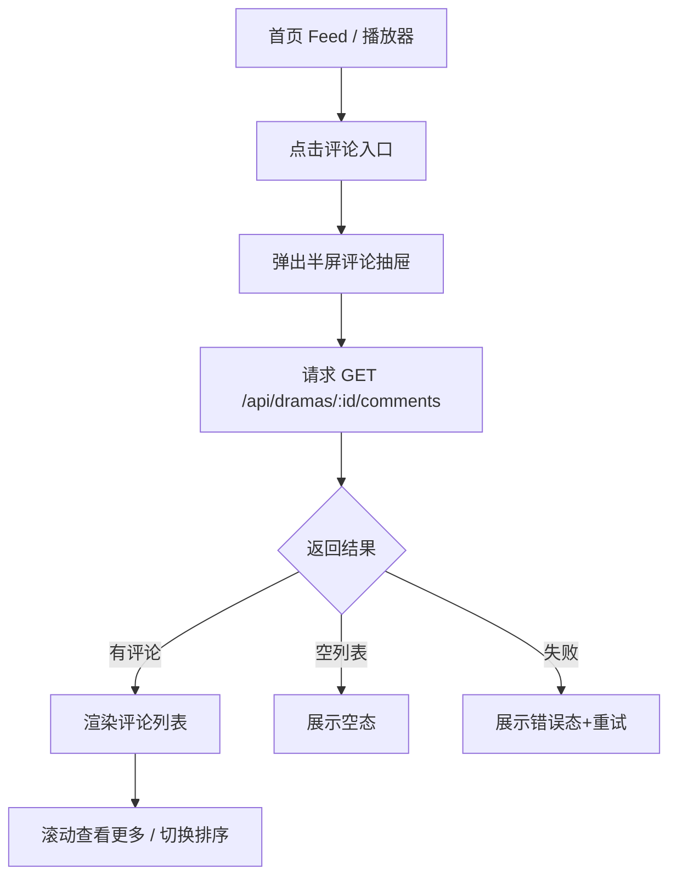
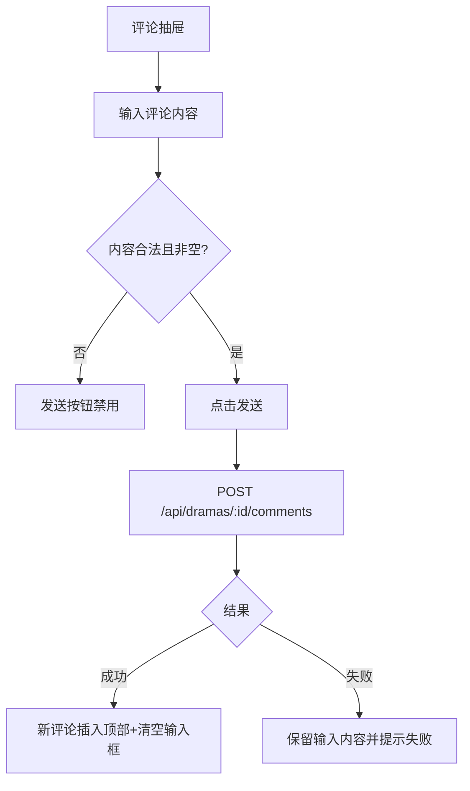
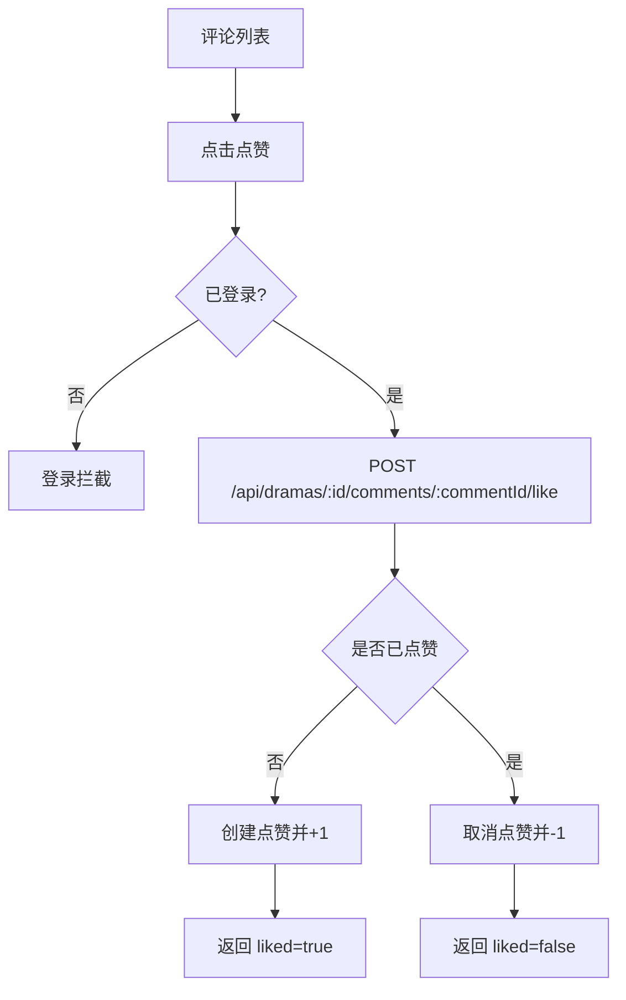
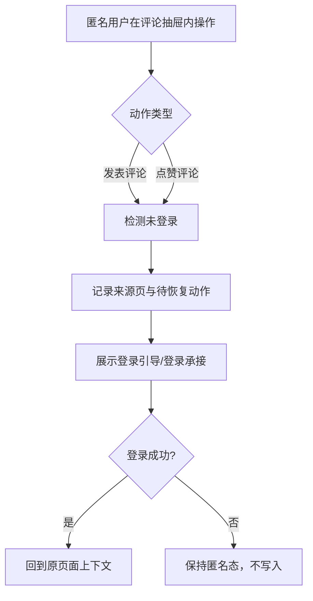

# 需求文档：PRD-09 评论系统

> 创建日期：2026-07-29
> 状态：草稿
> 作者：AI Agent + daniel

---

## 1. 需求背景

### 1.1 问题描述

- **现状**：当前移动端首页 Feed 与播放器都没有真实评论浏览、发表评论与评论点赞能力。Android 播放器右侧互动栏和 iOS 播放器右侧互动栏虽然已经预留“评论”视觉位，但都还是空实现；首页 Feed 卡片也尚未接入评论入口。Backend 侧也还没有 `GET /api/dramas/:id/comments`、`POST /api/dramas/:id/comments`、`POST /api/dramas/:id/comments/:commentId/like` 这三条评论契约。
- **痛点**：用户在浏览首页 Feed 或观看短剧时无法围观评论、参与讨论或对评论反馈，内容互动链路被截断；同时，PRD-08 已经把“需要登录的操作应触发统一登录拦截”定义为产品基础能力，但评论相关操作还未接入这一能力。

### 1.2 预期目标

- **目标**：为 Android / iOS 的首页 Feed 与播放器补齐评论抽屉能力，用户可在不离开当前浏览/观看上下文的情况下查看评论、发表评论、点赞评论；Backend 提供与之匹配的 RESTful 评论接口与数据模型。
- **成功指标**（可度量）：
  - 评论入口点击后可在 1 次交互内打开半屏评论抽屉；
  - 已登录用户可成功发表 1~500 字文字评论，并在成功后立即看到评论出现在列表顶部；
  - 已登录用户可对评论执行点赞 / 取消点赞，点赞态和点赞数在一次接口往返后与服务端一致；
  - 未登录用户执行“发表评论”或“点赞评论”时，100% 触发登录拦截，不允许匿名写操作直接落库；
  - 评论列表接口支持 `latest` / `hot` 两种排序参数，并返回统一分页信息。

### 1.3 范围定义

| 范围内 | 范围外（明确不做） | 原因 |
|--------|------------------|------|
| 评论列表半屏抽屉（首页 Feed / 播放器） | 楼中楼 / 回复评论 | PRD 首版只做一级评论 |
| 文字发表评论 | 图片评论 / 表情包 / 富文本 | 需求文档明确为首版范围外 |
| 评论点赞与取消点赞 | 评论举报 / 删除 / 审核后台 | 当前 PRD 不涉及社区治理 |
| 登录拦截接入评论写操作 | 新建独立评论登录页流程 | 复用 PRD-08 登录拦截语义 |
| Backend 评论与点赞 RESTful API | Web 端评论页 / Web 评论抽屉 | 当前产品范围是 Native 优先 |

> 评论首版默认展示“最新”排序，同时在接口层保留 `sort=latest|hot`，为后续热评能力预留契约。

---

## 2. 术语表

| 术语 | 定义 | 来源 |
|------|------|------|
| 评论抽屉 | 在当前页面上方以底部半屏浮层展示的评论容器，不离开当前页面路由 | 本文档新定义，参考竞品研究与 PRD |
| 评论列表 | 某个 drama 下的一级评论集合，支持分页与排序 | PRD / 本文档 |
| 评论点赞 | 用户对单条评论进行点赞或取消点赞的动作，返回当前用户点赞态与最新点赞数 | PRD / 本文档 |
| 登录拦截 | 匿名用户执行需要登录的写操作时，被阻止继续提交并转入登录引导或登录承接 | PRD-08 登录需求 |
| 登录恢复上下文 | 业务侧记录的登录完成后回到来源页面并恢复评论抽屉所需的上下文；Android 当前可映射到 `returnRoute`，iOS 当前更接近结构化 `Context` | PRD-08 / 现有代码 |
| pending action | 登录拦截时暂存的评论动作上下文，例如来源页面、`dramaId`、动作类型与可选 `commentId`；首版只用于恢复来源页与评论抽屉，不自动重放写操作 | 本文档新定义 |

---

## 3. 涉及平台

| 平台 | 是否涉及 | 变更概要 |
|------|---------|---------|
| Backend | ✅ 涉及 | 新增评论列表 / 发评论 / 点赞切换接口、评论数据模型、migration、repository、测试 |
| Web | ❌ 不涉及 | 本期不实现 Web 评论能力，保持现状 |
| iOS | ✅ 涉及 | 在首页 Feed 与播放器接入评论入口和半屏抽屉，接入登录拦截与评论状态机 |
| Android | ✅ 涉及 | 在首页 Feed 与播放器接入评论入口和 `ModalBottomSheet` 评论抽屉，接入登录拦截与评论状态机 |

---

## 4. 用户故事

| 编号 | 角色 | 需求 | 验收标准 | 涉及平台 | 优先级 |
|------|------|------|---------|---------|--------|
| US-01 | 围观用户 | 查看短剧评论 | 点击首页 Feed 或播放器中的评论入口后，底部弹出半屏抽屉，展示评论列表、排序维度与分页状态 | Backend/iOS/Android | P0 |
| US-02 | 已登录互动用户 | 发表评论 | 在评论抽屉底部输入 1~500 字内容并发送成功后，新评论出现在列表顶部，输入框清空 | Backend/iOS/Android | P0 |
| US-03 | 已登录互动用户 | 点赞或取消点赞评论 | 点击评论项点赞按钮后，接口返回最新 `liked` 与 `like_count`，UI 同步更新 | Backend/iOS/Android | P0 |
| US-04 | 匿名用户 | 写评论或点赞时被拦截 | 未登录用户点击发送评论或点赞评论时，不落库、不更新服务端状态，并进入登录引导 / 登录承接 | iOS/Android | P0 |
| US-05 | 围观用户 | 在评论为空或失败时获得明确反馈 | 空列表展示空态；加载失败展示错误态和重试入口；不因评论抽屉异常影响首页 Feed 或播放器主内容 | Backend/iOS/Android | P1 |
| US-06 | 产品与后续端能力 | 预留热评排序契约 | 接口支持 `sort=latest|hot`，即便首版默认走 `latest`，客户端可切换或保留二次扩展入口 | Backend/iOS/Android | P1 |

---

## 5. 功能详述

### 5.1 US-01：查看短剧评论

#### 流程描述

1. 用户位于首页 Feed 卡片或播放器页面。
2. 用户点击评论入口。
3. 当前页面底部弹出半屏评论抽屉，不触发全屏路由跳转。
4. 客户端发起 `GET /api/dramas/:id/comments?page=1&pageSize=20&sort=latest`。
5. Backend 返回评论列表与分页信息，响应契约为：
   ```json
   {
     "data": [
       {
         "id": "comment_uuid",
         "drama_id": "drama_uuid",
         "content": "评论正文",
         "like_count": 12,
         "liked": false,
         "created_at": "2026-07-29T09:30:00.000Z",
         "updated_at": "2026-07-29T09:30:00.000Z",
         "user": {
           "id": "user_uuid",
           "display_name": "用户昵称",
           "avatar_url": null
         }
       }
     ],
     "pagination": {
       "page": 1,
       "page_size": 20,
       "total": 36,
       "total_pages": 2
     }
   }
   ```
6. 页面根据结果展示内容态、空态或错误态；抽屉标题默认使用 `pagination.total` 展示评论总数，不额外要求独立 `comment_count` 字段。
7. 用户可继续滚动评论列表，并在后续需要时触发加载更多或切换排序。



#### 前置条件

- [ ] 当前页面持有合法 `dramaId`
- [ ] 用户已进入首页 Feed 或播放器
- [ ] 网络可用；若不可用需展示错误态

#### 后置条件

- 评论抽屉处于可交互状态；
- 当前页面主内容仍保留，用户可关闭抽屉后继续浏览 / 观看；
- 首次成功请求的评论列表数据已写入页面状态。

#### 涉及的 UI/交互（如有）

| 页面 / 区域 | 交互描述 | 涉及端 |
|------------|---------|--------|
| 首页 Feed 卡片评论入口 | 点击后在当前 Feed 页面上方拉起评论抽屉，不进入新路由 | iOS / Android |
| 播放器右侧互动栏评论按钮 | 点击后在播放器内拉起评论抽屉，不打断当前播放上下文 | iOS / Android |
| 评论抽屉头部 | 展示标题、评论总数（若可得）、排序入口、关闭手势 / 关闭按钮 | iOS / Android |
| 评论列表 | 评论项至少包含头像、昵称、正文、点赞数、相对时间、点赞按钮 | iOS / Android |

#### 边界与异常

**错误处理：**

| 操作步骤 | 错误类型 | 触发条件 | 系统行为 | 用户感知 |
|---------|---------|---------|---------|---------|
| 打开评论抽屉后首屏加载 | 网络异常 | 断网 / DNS 失败 / 超时 | 不关闭抽屉，进入错误态并提供重试 | 看到错误文案与重试按钮 |
| 获取评论列表 | 服务端错误 | 500 / 502 / 503 | 保留抽屉壳，显示错误态 | 看到“加载失败，请重试” |
| 获取评论列表 | 参数校验失败 | `dramaId` 非法、query 非法 | route 返回 400；客户端视为错误态 | 无评论内容，展示错误提示 |
| 获取评论列表 | 资源不存在 | `dramaId` 不存在 | route 返回 404；客户端进入错误态而不是空态 | 无法查看评论 |
| 切换排序 / 翻页 | 操作超时 | 请求长时间未返回 | 当前列表保持旧数据，局部提示失败 | 不会整页白屏 |
| 重复打开抽屉 | 状态冲突 | 抽屉已打开时再次点击入口 | 忽略重复打开或聚焦当前抽屉 | 不发生叠层弹窗 |

**边界场景：**

| 场景 | 触发条件 | 预期行为 |
|------|---------|---------|
| 空数据 | 评论总数为 0 | 展示“暂无评论，快来抢沙发”空态，不显示列表骨架错误信息 |
| 极端数据量 | 某 drama 评论很多 | 首屏只拉取第一页，后续按分页加载，避免一次性拉全量 |
| 特殊字符评论展示 | 评论正文含 emoji、换行、空格 | 正常展示文本；列表项最多展示约定行数，超出可截断或完整展示，以设计稿为准 |
| 网络切换 | 打开抽屉后切换 Wi‑Fi / 蜂窝 | 可重试；不应导致抽屉自动关闭 |
| App 后台恢复 | 抽屉打开时 App 进入后台后恢复 | 页面可继续显示已加载列表；必要时允许手动重试刷新 |
| 首页 Feed 列表复用 | 同一页面多张卡片都能打开评论 | 一次只允许一个评论抽屉上下文，切到新 drama 时重置列表状态 |

### 5.2 US-02：发表评论

#### 流程描述

1. 已登录用户打开评论抽屉。
2. 用户在底部输入栏输入 1~500 字评论内容。
3. 当输入内容去除首尾空白后非空，发送按钮变为可点击。
4. 用户点击发送。
5. 客户端发起 `POST /api/dramas/:id/comments`，body 为 `{ "content": "..." }`。
6. Backend 校验登录态、drama 是否存在、内容长度是否合法，并创建评论。
7. 成功响应返回完整新评论对象，结构与评论列表项一致：
   ```json
   {
     "id": "comment_uuid",
     "drama_id": "drama_uuid",
     "content": "评论正文",
     "like_count": 0,
     "liked": false,
     "created_at": "2026-07-29T09:30:00.000Z",
     "updated_at": "2026-07-29T09:30:00.000Z",
     "user": {
       "id": "user_uuid",
       "display_name": "用户昵称",
       "avatar_url": null
     }
   }
   ```
8. 客户端收到成功响应后，直接把该评论插入当前列表顶部、清空输入框，并同步将 `pagination.total + 1`；不要求额外整页重刷。



#### 前置条件

- [ ] 评论抽屉已打开
- [ ] 用户处于登录态
- [ ] 当前 `dramaId` 合法
- [ ] 输入内容长度在 1~500 字之间

#### 后置条件

- 成功时新评论已持久化到服务端；
- 列表顶部展示新评论；
- 输入框被清空，但抽屉不关闭；
- 失败时输入内容保留，用户可再次发送。

#### 涉及的 UI/交互（如有）

| 页面 / 区域 | 交互描述 | 涉及端 |
|------------|---------|--------|
| 评论抽屉底部输入栏 | 固定在底部，包含头像、输入框、发送按钮 | iOS / Android |
| 发送按钮 | 内容为空、仅空格、超长或发送中时不可点击 | iOS / Android |
| 发送成功反馈 | 评论进入列表顶部，可辅以轻提示 | iOS / Android |

#### 边界与异常

**错误处理：**

| 操作步骤 | 错误类型 | 触发条件 | 系统行为 | 用户感知 |
|---------|---------|---------|---------|---------|
| 点击发送 | 权限不足 | 用户未登录 / token 无效 | 不提交评论，走登录拦截 | 看到登录提示或进入登录承接 |
| 点击发送 | 数据校验失败 | 内容为空、超长、只有空白字符 | 本地直接阻止提交；服务端兜底返回 400 | 输入框附近提示或 Toast |
| 创建评论 | 服务端错误 | 500 / 503 | 保留输入内容，不清空列表 | Toast / Snackbar “发表失败，请重试” |
| 创建评论 | 资源不存在 | `dramaId` 不存在 | 不插入评论，提示失败 | 用户知道提交未成功 |
| 创建评论 | 重复提交 | 用户连续多次点击发送 | 发送中按钮 disabled，只允许一次 in-flight 请求 | 不产生重复评论 |
| 创建评论 | 操作超时 | 网络慢或服务端未响应 | 视为失败并允许重试 | 输入内容仍在，可再次提交 |

**边界场景：**

| 场景 | 触发条件 | 预期行为 |
|------|---------|---------|
| 空字符串 | 用户未输入内容或只输入空格 | 发送按钮禁用；服务端也不能接受 |
| 超长文本 | 输入超过 500 字 | 客户端限制继续输入或即时提示；服务端兜底拒绝 |
| 特殊字符 | emoji、换行、全角空格 | 允许正常提交，只要满足长度和非空规则 |
| App 后台恢复 | 发送过程中切后台 | 页面返回前台后不应出现重复评论；若发送失败，保留输入 |
| 抽屉关闭后再打开 | 成功发表后关闭并重开抽屉 | 新评论仍应出现在列表中，至少在本次会话内可见 |

### 5.3 US-03：点赞或取消点赞评论

#### 流程描述

1. 用户打开评论抽屉并看到评论列表。
2. 用户点击某条评论右侧点赞按钮。
3. 客户端校验登录态；未登录则走登录拦截。
4. 已登录时发起 `POST /api/dramas/:id/comments/:commentId/like`。
5. Backend 根据当前用户是否已点赞执行 toggle：未点赞则新增点赞并 `like_count +1`；已点赞则取消点赞并 `like_count -1`。
6. 成功响应固定返回：
   ```json
   {
     "comment_id": "comment_uuid",
     "liked": true,
     "like_count": 13
   }
   ```
7. 客户端收到响应后仅更新目标评论项的 `liked` 与 `like_count`，不整页重刷。



#### 前置条件

- [ ] 评论抽屉已加载出评论列表
- [ ] 当前评论项存在合法 `commentId`
- [ ] 用户为登录态，或可被登录拦截承接

#### 后置条件

- 成功时目标评论项的点赞态与点赞数与服务端返回保持一致；
- 失败时原 UI 状态恢复或保持不变；
- 不影响其它评论项状态。

#### 涉及的 UI/交互（如有）

| 页面 / 区域 | 交互描述 | 涉及端 |
|------------|---------|--------|
| 评论列表项点赞按钮 | 支持已点赞 / 未点赞两态，显示当前点赞数 | iOS / Android |
| 点赞反馈 | 成功后立即更新图标和数字；失败后提示并回滚 | iOS / Android |

#### 边界与异常

**错误处理：**

| 操作步骤 | 错误类型 | 触发条件 | 系统行为 | 用户感知 |
|---------|---------|---------|---------|---------|
| 点击点赞 | 权限不足 | 匿名用户 / token 失效 | 阻止写入，走登录拦截 | 提示登录 |
| 点赞请求 | 资源不存在 | 评论不存在 / drama 与 comment 不匹配 | 不更新 UI 或回滚 UI | 提示操作失败 |
| 点赞请求 | 服务端错误 | 500 / 503 | 恢复原点赞态 | Toast / Snackbar “操作失败，请重试” |
| 连续点击点赞 | 并发冲突 | 用户快速多次点击 | 针对单评论项进行 in-flight 锁定，避免乱序覆盖 | 最终 UI 状态稳定 |
| 点赞取消 | 数据不一致 | 服务端返回计数异常 | 以服务端返回值为准并记录错误日志 | 用户看到最新值 |

**边界场景：**

| 场景 | 触发条件 | 预期行为 |
|------|---------|---------|
| 重复点击 | 同一评论快速连点 | 只消费最后一次合法结果或在请求中禁用按钮 |
| 分页列表中点赞 | 点赞非首屏评论 | 仅更新目标项，不重刷整页 |
| 列表刷新后恢复 | 切换排序或重新加载评论 | 若服务端支持个性化 `liked` 字段，评论项点赞态仍正确 |
| 已点过赞再进入页面 | 用户之前点过赞 | 列表响应中应能体现 `liked = true` |

### 5.4 US-04：匿名用户写操作登录拦截

#### 流程描述

1. 匿名用户打开评论抽屉。
2. 用户尝试发送评论或点击评论点赞。
3. 客户端发现用户未登录，不发起真正写请求，或在收到 401 时转入登录拦截。
4. 系统展示登录引导 / 登录承接，并记录来源页面与待恢复动作上下文。
5. 登录成功后返回原上下文，并恢复到对应 drama 的评论抽屉打开状态；首版**不自动重放**“发送评论/点赞评论”写操作，用户需自行再次点击发送或点赞。
6. 若用户取消登录，则保持匿名态，不产生评论或点赞写入。



#### 前置条件

- [ ] 用户未登录
- [ ] 评论抽屉已打开或准备执行评论动作

#### 后置条件

- 匿名写操作不会写入服务端；
- 登录引导能够知道来源自 Feed 还是播放器，以及是“发评论”还是“点赞评论”；
- 登录后返回原上下文并恢复评论抽屉打开状态，但首版不自动重放原写操作。

#### 涉及的 UI/交互（如有）

| 页面 / 区域 | 交互描述 | 涉及端 |
|------------|---------|--------|
| 评论抽屉发送按钮 | 匿名点击后不直接提交，触发登录引导 | iOS / Android |
| 评论项点赞按钮 | 匿名点击后不直接点赞，触发登录引导 | iOS / Android |
| 登录引导提示 | 文案需明确“登录后即可发表评论 / 点赞评论” | iOS / Android |

#### 边界与异常

**错误处理：**

| 操作步骤 | 错误类型 | 触发条件 | 系统行为 | 用户感知 |
|---------|---------|---------|---------|---------|
| 匿名点击发送 / 点赞 | 状态不一致 | 客户端误判已登录但接口返回 401 | 统一进入登录拦截，不直接报服务端错误 | 感知为需登录 |
| 登录承接中断 | 用户取消登录 | 清空或保留待恢复动作（按设计），但不得伪造成功 | 返回原页面继续匿名浏览 |
| 登录成功后恢复 | 上下文丢失 | 页面被销毁或 router 状态重置 | 至少返回来源页，不自动重复提交原动作 | 用户需再次操作 |

**边界场景：**

| 场景 | 触发条件 | 预期行为 |
|------|---------|---------|
| 从播放器进入登录 | 播放器中点赞评论 | 登录返回后仍回到播放器语境，不误跳别的页面 |
| 从首页 Feed 进入登录 | 首页评论发送 | 登录返回后仍能识别当前 drama 评论上下文 |
| 登录成功但未自动恢复原动作 | 现有登录链路尚未完全落地 | 至少回到来源页并保留评论抽屉可再次打开的路径，避免错误提交 |
| 多次触发登录拦截 | 用户重复点击发送 / 点赞 | 同一时刻只展示一个登录引导 |

### 5.5 US-05：评论空态与失败态反馈

#### 流程描述

1. 用户打开评论抽屉。
2. 如果接口返回空列表，则展示空态文案与引导。
3. 如果接口失败，则展示错误态与重试按钮。
4. 用户点击重试后重新请求。
5. 无论空态还是错误态，都不影响首页 Feed 或播放器主内容。

#### 前置条件

- [ ] 评论抽屉已打开

#### 后置条件

- 页面能够稳定呈现空态 / 错误态；
- 用户可以手动重试；
- 不产生白屏或崩溃。

#### 涉及的 UI/交互（如有）

| 页面 / 区域 | 交互描述 | 涉及端 |
|------------|---------|--------|
| 评论抽屉空态 | 展示“暂无评论，快来抢沙发”及简单引导 | iOS / Android |
| 评论抽屉错误态 | 展示错误文案与重试按钮 | iOS / Android |

#### 边界与异常

**错误处理：**

| 操作步骤 | 错误类型 | 触发条件 | 系统行为 | 用户感知 |
|---------|---------|---------|---------|---------|
| 首屏请求失败 | 网络异常 / 5xx | 进入错误态 | 看到错误提示 |
| 点击重试 | 仍失败 | 保持错误态 | 可继续重试 |
| 空态下发表评论 | 匿名或已登录用户在空态直接评论 | 继续走正常“发送评论”流程 | 空态可被首条评论替换 |

**边界场景：**

| 场景 | 触发条件 | 预期行为 |
|------|---------|---------|
| 空态转内容态 | 首次评论成功 | 列表从空态切为内容态，首条评论出现 |
| 错误态转内容态 | 重试成功 | 错误态消失，展示评论列表 |
| 页面切换 | 关闭抽屉再重新打开 | 应重新尝试请求首屏数据或按缓存策略展示 |

---

## 6. 数据概览

| 数据实体 | 说明 | 关键字段 | 来源 |
|---------|------|---------|------|
| Comment | 一级评论实体 / 评论列表项 | `id`, `drama_id`, `content`, `like_count`, `liked`, `created_at`, `updated_at`, `user` | 系统生成 + 用户输入 + 当前用户态 |
| CommentUserSummary | 评论展示所需的用户摘要 | `id`, `display_name`, `avatar_url` | 用户资料 / profiles |
| CommentLike | 用户与评论的点赞关系 | `user_id`, `comment_id`, `created_at` | 系统生成 |
| CommentListQuery | 评论列表查询参数 | `page`, `pageSize`, `sort` | 客户端请求参数 |
| PendingCommentAction | 登录拦截后待恢复的动作上下文 | `source`, `dramaId`, `action`, `commentId?` | 客户端状态 |
| CreateCommentResponse | 发表评论成功响应 | 完整 `Comment` 对象，供客户端直接插入列表顶部 | Backend 返回 |
| ToggleCommentLikeResponse | 点赞切换成功响应 | `comment_id`, `liked`, `like_count` | Backend 返回 |

### 数据关系

```text
[Drama] ──1:N──▶ [Comment]
  │                 │
  │                 └── N:1 ──▶ [User/Profile]
  │
  └── 1:N ──▶ [PendingCommentAction]（客户端暂存，不持久化）

[Comment] ──1:N──▶ [CommentLike]
[User/Profile] ──1:N──▶ [CommentLike]
```

---

## 7. 现有功能影响

| 现有功能 | 影响类型 | 说明 | 是否需要迁移 |
|---------|---------|------|------------|
| 首页 Feed | 新增关联 | Feed 卡片需要新增评论入口与抽屉承载状态 | 否 |
| 播放器 | 新增关联 | 右侧互动栏“评论”按钮从占位变为真实入口 | 否 |
| 排行 / 菜单已有登录拦截模式 | 新增关联 | 评论写操作复用类似的登录拦截语义与回跳上下文 | 否 |
| Backend drama / player service | 新增模块关系 | 需要引入 comments repository/service 契约，避免继续把评论逻辑塞进无关模块 | 否 |
| Wiki 文档 | 新增 / 修正 | 需补齐评论功能文档，并同步认证/排行榜文档对现状的描述 | 否 |

### 兼容性说明

- Web 端本期不实现评论，不影响现有 Web 路由和页面骨架。
- 移动端已有首页 Feed、播放器、排行、菜单逻辑仍需保持可用；评论抽屉不能破坏既有播放、路由、菜单关闭后导航等行为。
- Backend 新增接口不应改变现有 `/api/dramas`、`/api/player/*`、`/api/dramas/rankings` 的响应契约。
- 当前 worktree 中部分 wiki 对认证与排行的描述落后于代码，spec/design 阶段必须以代码为准。

---

## 8. 非功能性需求

### 8.1 性能

| 指标 | 目标值 | 测量方式 |
|------|--------|---------|
| 评论抽屉首屏请求 | P95 < 800ms（本地开发 / mock 基线） | route/service 自动化测试 + 本地验证 |
| 评论列表滚动体验 | 主列表滚动不出现明显卡顿 | iOS / Android 本地构建与 QA 文档验证 |
| 发评论响应时间 | P95 < 1000ms（本地开发 / mock 基线） | 接口测试 |
| 点赞切换响应时间 | P95 < 600ms（本地开发 / mock 基线） | 接口测试 |

### 8.2 安全

| 关注点 | 要求 |
|--------|------|
| 认证与授权 | 发表评论、点赞评论必须要求登录；评论列表可匿名读取 |
| 数据校验 | 客户端和服务端都要校验评论内容非空、长度 ≤ 500 |
| 敏感数据 | 评论列表仅返回展示所需用户摘要，不泄露多余用户敏感字段 |
| 防滥用 | 需要至少为服务端保留限流 / 防刷扩展位；首版可不实现完整风控，但不能放任匿名写入 |

### 8.3 兼容性

| 维度 | 要求 |
|------|------|
| 设备兼容 | 保持现有 Android / iOS 最低支持范围，不额外引入新的系统级依赖 |
| 数据兼容 | 新增 comments / comment_likes 数据模型不能破坏现有 drama / bookings / playback history 表 |
| 向后兼容 | 新增 API 为增量能力，不破坏已有客户端；排序参数默认值需保证老调用方可直接工作 |

---

## 9. 依赖

| 依赖项 | 类型 | 说明 | 状态 | 阻塞 |
|--------|------|------|------|------|
| PRD-08 登录拦截语义 | 内部能力 | 评论写操作需复用“需要登录的动作被拦截”的产品语义 | ✅ 已就绪（语义层） / 🚧 部分端实现待补齐 | 是 |
| 首页 Feed | 内部能力 | 首页评论入口挂载在 Feed 现有卡片 action 区上下文中，不新增独立互动栏 | ✅ 已就绪 | 否 |
| 播放器 | 内部能力 | 播放器评论入口挂载在右侧互动栏 | ✅ 已就绪 | 否 |
| Backend repository 基线 | 内部能力 | 需为 comments 建立 interface + mock + supabase 双实现策略 | 🚧 待开发 | 是 |
| 用户资料摘要 | 内部能力 | 评论展示需要昵称 / 头像摘要；首版以 `profiles.display_name`、`profiles.avatar_url` 为主，缺失时展示默认昵称“用户” | ✅ 已有可落地兜底 | 否 |
| llm-wiki | 内部能力 | 需求完成后需更新播放器、首页 Feed、认证、排行、系统总览与评论文档 | ✅ 已就绪 | 否 |

---

## 10. 待澄清问题

| 编号 | 问题 | 可能的答案 | 阻塞 |
|------|------|-----------|------|
| Q-03 | 登录成功后是否必须自动恢复“发送评论/点赞评论”动作？ | 已定：首版只回到来源页并恢复评论抽屉上下文，不自动重放原写操作 | 否 |
| Q-06 | Backend 用户写接口是否必须直接切到真实 JWT 校验，还是暂时对齐当前 booking 的骨架态 auth helper？ | 已定：本期与 booking 一致，先对齐当前 skeleton auth helper，后续统一升级真实 JWT | 否 |

---

## 11. 参考资料

### 已查阅的 wiki 文档

| 文档 | 相关章节 | 关键信息 |
|------|---------|---------|
| `wiki/features/video-player/index.md` | 入口与路由、状态管理 | 播放器已统一承载首页 Feed、排行、菜单最近在看、剧场入口；Android/iOS 播放器都已有本地页面状态机，但尚无评论能力 |
| `wiki/features/homepage-feed/index.md` | 首页首屏加载、多端实现 | 首页 Feed 已真实落地，当前只提供观看/详情主路径，评论能力未实现 |
| `wiki/features/ranking/index.md` | 登录拦截与预约流程 | 排行页已有评论可复用的登录拦截建模思路，但 wiki 中部分认证描述落后于代码 |
| `wiki/architecture/overview.md` | 当前系统架构、移动端首页与菜单承载结构 | 移动端已形成首页/剧场/菜单/排行/分类/播放器主链路，评论应作为页面内增强能力接入 |
| `wiki/features/auth/index.md` | 当前 worktree 中缺失 | 说明认证 wiki 基线不完整，需以代码为准 |

### 已查阅的代码文件

| 文件 | 关键内容 |
|------|---------|
| `backend/src/lib/schemas.ts` | 当前已有 rankings、player、admin 等 Zod schema，评论 schema 应在同一处新增 |
| `backend/src/services/drama/drama.service.ts` | `listRankings` / `bookDrama` 展示了 service 层统一 parse / wrap 模式 |
| `backend/src/repositories/interfaces/drama.repository.interface.ts` | 当前 drama repository 已承载 rankings / book，但评论更适合独立 repository 契约 |
| `backend/src/repositories/repository-registry.ts` | `getDramaRepository()` 仍固定 mock；comments 需从一开始设计可切换基线 |
| `backend/src/middleware/auth.ts` | 用户侧 helper 仍是骨架态 userId 提取；admin 已有真实 JWT 校验链路 |
| `backend/src/app/api/dramas/rankings/route.ts` | 展示 query parse + getOptionalUserId + service 调用方式 |
| `backend/src/app/api/dramas/[id]/book/route.ts` | 展示 path parse + 需登录写接口模式，但存在直接 new mock repository 的技术债 |
| `android/app/src/main/java/com/djs66256/short_drama/feature/player/ui/components/PlayerComponents.kt` | Android 播放器右侧“评论”按钮已存在视觉位但 `onClick` 为空 |
| `android/app/src/main/java/com/djs66256/short_drama/feature/player/ui/PlayerScreen.kt` | Android 已有 `ModalBottomSheet` 模式，可复用承载评论抽屉 |
| `android/app/src/main/java/com/djs66256/short_drama/feature/player/viewmodel/PlayerUiState.kt` | Android 播放器状态机可扩展评论抽屉可见性与评论列表状态 |
| `ios/ShortDrama/Sources/Features/Player/Views/Components/PlayerRightActionBar.swift` | iOS 播放器评论按钮当前为静态占位 |
| `ios/ShortDrama/Sources/Features/Player/Views/PlayerView.swift` | iOS 已有 `.sheet + presentationDetents` 模式，可复用为评论抽屉 |
| `ios/ShortDrama/Sources/Features/Player/ViewModels/PlayerViewModel.swift` | iOS 播放器 ViewModel 具备扩展页面内 overlay 状态的基础 |
| `ios/ShortDrama/Sources/App/NavigationRouter.swift` | iOS 全局 router 更适合处理页面级跳转与延迟导航，评论抽屉不宜做成新 route |
| `docs/product_manager/prd/2026-07-25-comments/prd.md` | 评论系统原始 PRD，定义了一级评论、文字评论、点赞、登录拦截范围 |
| `docs/product_manager/prd/2026-07-25-comments/subtasks.md` | 明确了三条 Backend API 与 iOS/Android 评论抽屉任务拆分 |
| `docs/product_manager/prd/2026-07-25-login/prd.md` | 定义了“需要登录的操作应跳转登录并返回来源页”的产品语义 |

---

## 12. 变更历史

| 日期 | 变更内容 | 变更原因 |
|------|---------|---------|
| 2026-07-29 | 初始版本 | 进入 PRD-09 spec-writing 阶段，基于当前 worktree 的真实 wiki 与 backend/android/ios 代码撰写 |
