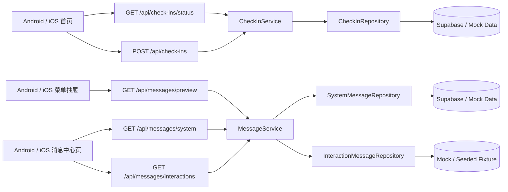

# 技术方案（共享部分）：PRD-10 签到与消息系统

> 创建日期：2026-07-29
> 对应需求：spec.md

## 整体架构



### 架构说明

- 本需求继续沿用当前仓库既有分层：移动端采用 `View / Compose → ViewModel → UseCase / Repository → RemoteDataSource`，Backend 采用 `Route → Middleware → Service → Repository`。
- 签到与消息系统共享同一套“首页 + 菜单 + 独立消息页”承接骨架，不引入 Web 端实现。
- 匿名签到与菜单消息预览都允许匿名访问，但互动消息只对登录态开放，复用现有 canonical auth middleware。
- `X-Installation-Id` 仅服务于匿名签到与安装级本地体验收口，不承担可信身份语义；只在签到相关接口中使用，不扩散到消息接口。
- 消息中心返回行为完全沿用现有 close-menu-then-navigate 机制：从菜单进入消息页前先关闭抽屉，返回时回到首页根上下文且菜单保持关闭。

## API 设计

### 涉及变更

| 类型 | 数量 | 说明 |
|------|------|------|
| 新增接口 | 5 | 2 个签到接口 + 3 个消息接口 |
| 修改接口 | 0 | 不修改现有 dramas / auth / comments / player 接口 |
| 废弃接口 | 0 | 无 |

### 新增接口

#### `GET /api/check-ins/status`

- **功能简介**：查询当前账号或匿名安装在当前服务端业务日下的签到状态，用于首页冷启动弹窗资格判断与签到板展示。
- **认证**：可选登录。
  - 登录态：读取 `Authorization`；可同时带 `X-Installation-Id`，但服务端以账号态优先。
  - 匿名态：必须带 `X-Installation-Id`。
- **Path Parameters**：无

- **Query Parameters**：无

- **Request Headers**：

| 字段 | 类型 | 必填 | 说明 |
|------|------|------|------|
| `Authorization` | string | 否 | `Bearer <token>`，登录态使用 |
| `X-Installation-Id` | string(UUID) | 匿名态必填 | 安装级 UUID，格式对齐播放器 `X-Playback-Session-Id` 的 header 校验方式 |

- **Response**：返回单个 `SignInStatus` 对象。

```json
{
  "server_date": "2026-07-29",
  "should_show_popup": true,
  "today_signed": false,
  "current_streak": 3,
  "reward_copy": "今日签到可领取第 4 天奖励",
  "days": [
    {
      "day": 1,
      "title": "第 1 天",
      "reward_label": "金币 x10",
      "status": "signed"
    }
  ]
}
```

| 字段 | 类型 | 说明 |
|------|------|------|
| `server_date` | string | 服务端业务日，ISO 日期字符串 |
| `should_show_popup` | boolean | 服务端规则下当前业务日是否具备展示资格；客户端仍需叠加冷启动、首页落点、本地关闭态与模态冲突后决定是否真正弹层 |
| `today_signed` | boolean | 当前服务端业务日是否已签到 |
| `current_streak` | number | 当前连续签到进度，范围 0~7 |
| `reward_copy` | string | 浮层辅助文案 |
| `days` | `SignInDay[]` | 固定 7 个元素的签到板状态 |

- **Error Codes**：

| HTTP 状态码 | 错误码 | 说明 |
|-------------|--------|------|
| 200 | — | 成功 |
| 400 | `VALIDATION_ERROR` | 匿名态缺少 `X-Installation-Id` 或 header 非法 |
| 503 | `SERVICE_UNAVAILABLE` | 仓储或数据源不可用 |

#### `POST /api/check-ins`

- **功能简介**：提交当日签到；同一服务端业务日内幂等。
- **认证**：可选登录。
  - 登录态：按 `AuthContext.userId` 记账。
  - 匿名态：按 `X-Installation-Id` 记账。
- **Request Headers**：与 `GET /api/check-ins/status` 相同。
- **Request Body**：无。
- **Response**：返回最新 `SignInStatus` 对象，结构与状态查询接口一致。
- **Error Codes**：

| HTTP 状态码 | 错误码 | 说明 |
|-------------|--------|------|
| 200 | — | 提交成功或同日重复提交的幂等成功 |
| 400 | `VALIDATION_ERROR` | 登录态与安装标识均不可用，或 header 非法 |
| 503 | `SERVICE_UNAVAILABLE` | 仓储或数据库不可用 |

#### `GET /api/messages/preview`

- **功能简介**：返回菜单抽屉使用的最新 1 条系统消息摘要。
- **认证**：匿名可访问。
- **Path Parameters**：无
- **Query Parameters**：首版无；如实现上复用列表能力，服务端内部可固定 `pageSize=1`，但不对客户端暴露新的分页约定。
- **Response**：成功时返回单个 `MessagePreview` 对象；空态统一返回 `204 No Content`，不再返回 `200 + null`。

```json
{
  "title": "系统通知",
  "summary": "你关注的剧集已更新第 12 集。",
  "relative_time": "2小时前"
}
```

- **Error Codes**：

| HTTP 状态码 | 错误码 | 说明 |
|-------------|--------|------|
| 200 | — | 成功返回最新 1 条摘要 |
| 204 | — | 当前无系统消息，客户端渲染“暂无消息” |
| 503 | `SERVICE_UNAVAILABLE` | 数据源不可用，客户端降级为静态文案 |

#### `GET /api/messages/system`

- **功能简介**：分页获取系统消息列表，消息中心页匿名可访问。
- **认证**：匿名可访问。
- **Query Parameters**：

| 字段 | 类型 | 必填 | 默认值 | 说明 |
|------|------|------|--------|------|
| `page` | number | 否 | 1 | 页码，`>=1` |
| `pageSize` | number | 否 | 20 | 每页数量，`1<=pageSize<=20` |

- **Response**：

```json
{
  "data": [
    {
      "id": "550e8400-e29b-41d4-a716-446655440001",
      "title": "系统通知",
      "summary": "你关注的剧集已更新第 12 集。",
      "sent_at": "2026-07-29T08:00:00.000Z"
    }
  ],
  "pagination": {
    "page": 1,
    "page_size": 20,
    "total": 1,
    "total_pages": 1
  }
}
```

- **Error Codes**：

| HTTP 状态码 | 错误码 | 说明 |
|-------------|--------|------|
| 200 | — | 成功 |
| 400 | `VALIDATION_ERROR` | `page/pageSize` 非法 |
| 503 | `SERVICE_UNAVAILABLE` | 数据源不可用 |

#### `GET /api/messages/interactions`

- **功能简介**：分页获取登录用户的互动消息列表。
- **认证**：必须登录。
- **Query Parameters**：与 `GET /api/messages/system` 一致。
- **Response**：

```json
{
  "data": [
    {
      "id": "660e8400-e29b-41d4-a716-446655440010",
      "type": "comment_reply",
      "title": "有人回复了你的评论",
      "summary": "“这集反转真不错” 收到一条新回复。",
      "sent_at": "2026-07-29T09:00:00.000Z"
    }
  ],
  "pagination": {
    "page": 1,
    "page_size": 20,
    "total": 1,
    "total_pages": 1
  }
}
```

- **Error Codes**：

| HTTP 状态码 | 错误码 | 说明 |
|-------------|--------|------|
| 200 | — | 成功 |
| 400 | `VALIDATION_ERROR` | `page/pageSize` 非法 |
| 401 | `AUTH_UNAUTHORIZED` | 未登录或 token 无效 |
| 503 | `SERVICE_UNAVAILABLE` | 数据源不可用 |

## 数据模型

### 新增/变更数据表

| 表名 | 操作 | 说明 |
|------|------|------|
| `check_in_records` | 新建 | 直接以 `(subject_type, subject_id, business_date)` 表达签到主体与幂等约束，不额外拆分 `check_in_subjects` |
| `system_messages` | 新建 | 系统消息数据源，支持列表与 preview |
| `interaction_messages` | 首版不落库 | 登录态互动消息首版由 mock / seeded fixture 仓储提供，保留后续切换 Supabase 的扩展点 |

### Schema 定义

```typescript
const InstallationIdHeaderSchema = z.string().uuid();

const SignInDaySchema = z.object({
  day: z.number().int().min(1).max(7),
  title: z.string().min(1),
  reward_label: z.string().min(1),
  status: z.enum(['signed', 'today', 'locked']),
});

const SignInStatusSchema = z.object({
  server_date: z.string().min(1),
  should_show_popup: z.boolean(),
  today_signed: z.boolean(),
  current_streak: z.number().int().min(0).max(7),
  reward_copy: z.string().min(1),
  days: z.array(SignInDaySchema).length(7),
});

const MessagePreviewSchema = z.object({
  title: z.string().min(1),
  summary: z.string().min(1),
  relative_time: z.string().min(1),
});

const SystemMessageSchema = z.object({
  id: z.string().uuid(),
  title: z.string().min(1),
  summary: z.string().min(1),
  sent_at: z.string(),
});

const InteractionMessageSchema = z.object({
  id: z.string().uuid(),
  type: z.enum(['comment_reply', 'comment_like', 'system_hint']).default('system_hint'),
  title: z.string().min(1),
  summary: z.string().min(1),
  sent_at: z.string(),
});

const SystemMessageListResponseSchema = z.object({
  data: z.array(SystemMessageSchema),
  pagination: PaginationSchema,
});

const InteractionMessageListResponseSchema = z.object({
  data: z.array(InteractionMessageSchema),
  pagination: PaginationSchema,
});
```

## 跨端共享逻辑

| 共享逻辑 | 说明 | 涉及端 |
|---------|------|--------|
| 冷启动才检查签到资格 | 只在真正冷启动进入首页时查询签到状态；从后台恢复、非首页直达不触发强插弹层 | Android / iOS / Backend |
| 服务端业务日权威 | 是否跨天、是否今日已签到，以及服务端规则下是否具备展示资格，全部以 `server_date` 与签到状态为准 | Android / iOS / Backend |
| `should_show_popup` 仅表达服务端资格 | Backend 只返回服务端规则下的展示资格；客户端仍需叠加冷启动、首页落点、本地关闭态与评论/登录模态冲突后决定是否真正展示浮层 | Android / iOS / Backend |
| 账号态优先 | 登录态与 `X-Installation-Id` 同时存在时，签到相关接口只按账号态记账 | Android / iOS / Backend |
| 安装级 UUID 复用既有持久化模式 | Android 复用 DataStore 风格生成安装级 UUID；iOS 复用 Keychain 风格生成安装级 UUID | Android / iOS |
| 菜单预览与消息中心同源 | 菜单预览只展示系统消息的最新 1 条摘要；消息中心系统消息区和 preview 来自同一系统消息数据源 | Android / iOS / Backend |
| 互动消息首版固定 mock 仓储 | backend 首版固定使用 mock / seeded fixture 提供互动消息，不绑定评论事件实时生成，也不提供 Supabase 切换开关 | Android / iOS / Backend |
| 先关菜单再导航 | 点击菜单消息入口后先关抽屉再进消息中心，返回后菜单保持关闭 | Android / iOS |
| 登录承接只影响互动分区 | 匿名用户可继续看系统消息；登录仅用于解锁互动消息分区，不影响系统消息区渲染 | Android / iOS / Backend |
| 分页 contract 统一 | 系统消息与互动消息列表统一 `page/pageSize` 请求、`pagination.page/page_size/total/total_pages` 响应 | Android / iOS / Backend |

## 安全考虑

- **认证与授权**：
  - `GET /api/messages/interactions` 必须通过 `requireAuthContext()`；
  - `GET /api/messages/system` 与 `GET /api/messages/preview` 保持匿名可访问；
  - `GET /api/check-ins/status` / `POST /api/check-ins` 采用“可选登录 + 安装标识兜底”的双通路。
- **数据校验**：
  - `X-Installation-Id` 按 UUID 校验；
  - `page/pageSize` 与 installationId header 的非法输入统一沿用 backend 既有 `ZodError -> VALIDATION_ERROR` 口径；
  - 服务端对签到提交做同一主体、同一服务端业务日的幂等收口。
- **敏感数据处理**：
  - 不返回手机号、token、设备敏感信息；
  - 不在客户端硬编码 API 地址、token、固定环境常量；
  - Android 不新增 Jetpack Security / `EncryptedSharedPreferences` 依赖，继续复用现有 DataStore 模式实现安装级 UUID。

## 边界与错误处理（⚠️ 重点，最易遗漏）

### 错误处理架构

- **全局错误处理策略**：Backend 路由继续由 `withErrorHandler` 统一格式化业务错误；移动端继续把网络错误、业务错误与空态分离建模，不因为签到 / 消息模块导致首页或菜单白屏。
- **错误响应格式**：
  - Backend error 仍为 `{ error: { code, message } }`；
  - 成功响应遵循资源自身 contract：状态型接口返回单对象，列表接口返回 `{ data, pagination }`。
- **错误日志与监控**：
  - backend 对仓储不可用、参数非法、鉴权失败分别记录；
  - 客户端仅记录模块级失败，不弹出打断式全局错误。

### API 错误码定义

| 业务错误码 | HTTP 状态码 | 说明 | 用户提示文案 |
|-----------|------------|------|-------------|
| `VALIDATION_ERROR` | 400 | `page/pageSize` 非法，或匿名签到缺少 / 非法 `X-Installation-Id` | 参数错误，请稍后重试 |
| `AUTH_UNAUTHORIZED` | 401 | 互动消息接口未登录或 token 失效 | 请先登录后查看互动消息 |
| `NOT_FOUND` | 404 | 首版一般不暴露该错误；保留给未来消息详情等扩展 | 内容不存在 |
| `CONFLICT` | 409 | 首版不单独暴露签到冲突，重复签到按幂等成功处理 | — |
| `TOO_MANY_REQUESTS` | 429 | 后续若补充限流，可用于消息列表或签到接口防刷 | 操作过于频繁，请稍后再试 |
| `SERVICE_UNAVAILABLE` | 503 | 仓储、数据库或上游不可用 | 服务暂不可用，请稍后重试 |

### 边界场景处理

| 场景 | 触发条件 | API 行为 | 说明 |
|------|---------|---------|------|
| 匿名态缺少安装标识 | 冷启动前本地存储读取失败 | `GET/POST /api/check-ins*` 返回 400 `VALIDATION_ERROR`；客户端先尝试重新生成一次再请求 | 不允许把缺失标识静默当成功 |
| 登录态与安装标识同时存在 | 用户已登录但 header 仍被带上 | 服务端只按 `AuthContext.userId` 读取和写入签到 | 防止账号与安装态重复累计 |
| 同日重复签到 | 用户重复点击或重试 | `POST /api/check-ins` 返回最新状态且 `today_signed=true` | 按幂等成功处理 |
| 本地时间跨天但服务端未跨天 | 用户改时区或修改本地时钟 | 客户端可重查状态，但最终以 `server_date` 结果为准 | 保持跨端一致性 |
| 菜单预览无数据 | `GET /api/messages/preview` 当前没有系统消息 | Backend 返回 `204 No Content`；客户端渲染“暂无消息” | 与 preview 唯一空态 contract 对齐 |
| 菜单预览加载失败 | `GET /api/messages/preview` 超时或 503 | 客户端降级为静态文案，消息入口仍可点 | 菜单其他区块不受影响 |
| 系统消息成功、互动消息失败 | 已登录用户拉取互动消息异常 | 页面系统消息区继续显示，互动区展示局部错误态 / 重试 | 双分区互不阻塞 |
| 匿名用户进入消息页 | 无 token | 系统消息正常展示；互动区渲染登录门槛，不请求受保护数据 | 降低无效请求与 401 噪音 |
| 首页已有评论容器 | 冷启动命中签到资格，但 comment sheet / bottom sheet 已处于展示中 | 本次冷启动放弃签到浮层，不等待评论关闭后补弹 | 避免首页出现二次模态竞争 |
| 登录后从消息页返回 | 登录成功后结束消息页浏览 | 回到首页根上下文，菜单保持关闭 | 不引入恢复抽屉状态的新复杂度 |
| 第 7 天完成后进入第 8 天 | 进入下一服务端业务日 | 签到板从第 1 天新一轮开始 | 规则已在 spec 定稿 |

## 性能考虑

- **预期 QPS**：当前为站内轻量功能，读请求以首页冷启动与菜单打开为主，写请求仅限当日签到提交；不引入实时长连接。
- **缓存策略**：
  - 客户端可短暂复用最近一次消息 preview 成功结果，避免菜单短时间频繁打开重复刷接口；
  - 首页签到浮层资格不做跨业务日的盲缓存，至少在每次冷启动时重新查询一次状态。
- **数据库优化**：
  - `check_in_records` 需按 `(subject_type, subject_id, business_date)` 建唯一索引支持幂等；
  - 系统消息按 `sent_at desc` 查询时需有排序索引；
  - 互动消息若落库，按 `(user_id, sent_at desc)` 建索引；若首版为 mock repository，则保留 supabase 实现扩展点。

## 参考资料

### 已查阅的 wiki 文档

| 文档 | 相关章节 | 关键信息 |
|------|---------|---------|
| `wiki/features/auth/index.md` | 业务接口鉴权、评论登录恢复 | 移动端已有 canonical auth middleware 基线，互动消息必须复用 `requireAuthContext()` |
| `wiki/features/app-shell/index.md` | 菜单面板与导航承接 | 菜单消息页必须沿用 close-menu-then-navigate 机制 |
| `wiki/features/homepage-feed/index.md` | 首页承接能力 | 首页已有 Feed + comments overlay/sheet 宿主，可继续承载签到浮层 |
| `wiki/features/index.md` | 功能域索引 | 当前尚无独立签到 / 消息 feature 文档，后续完成后需补 wiki |
| `wiki/architecture/overview.md` | 系统总览 | 当前总览未纳入签到与消息，需要后续补充 |

### 已查阅的代码文件

| 文件 | 关键内容 |
|------|---------|
| `backend/src/middleware/auth.ts` | 定义 `resolveOptionalAuthContext()`、`requireAuthContext()`、`getAuth()` 等 canonical auth helper |
| `backend/src/lib/schemas.ts` | 已有 `PaginationSchema`，消息列表需完全对齐其结构 |
| `backend/src/repositories/repository-registry.ts` | 已有 `mock / supabase` registry 模式，可复用于签到与系统消息仓储；互动消息首版固定走 mock seeded fixture |
| `backend/src/services/comment/comment.service.ts` | Service 层先校验资源，再 parse repository 返回的既有模式 |
| `android/app/src/main/java/com/djs66256/short_drama/feature/home/ui/HomeScreen.kt` | 首页已有 comments bottom sheet 宿主，可扩展签到浮层宿主 |
| `android/app/src/main/java/com/djs66256/short_drama/feature/menu/viewmodel/MenuPanelViewModel.kt` | 菜单当前仅加载最近在看，消息 preview 需扩展为第二块状态 |
| `android/app/src/main/java/com/djs66256/short_drama/navigation/AppDestination.kt` | 已存在 `menu/messages` route 与 `PendingRoute.MenuMessages` |
| `android/app/src/main/java/com/djs66256/short_drama/core/storage/PlaybackSessionStore.kt` | DataStore 生成安装级 UUID 的现成模式，可类比实现 installationId |
| `android/app/src/main/java/com/djs66256/short_drama/core/network/ApiService.kt` | Retrofit API 新增接口需要按既有声明方式接入 |
| `ios/ShortDrama/Sources/Features/Home/Views/HomeView.swift` | iOS 首页已有 comments sheet 宿主，可继续承载签到浮层 |
| `ios/ShortDrama/Sources/Features/MenuPanel/ViewModels/MenuPanelViewModel.swift` | iOS 菜单面板当前只加载 recently viewed，可扩展消息 preview 状态 |
| `ios/ShortDrama/Sources/Features/MenuPanel/Views/MenuPanelContainerView.swift` | iOS 当前消息入口仍导航到 placeholder，后续需换到真实消息 route |
| `ios/ShortDrama/Sources/App/AppRoute.swift` | 需新增真实消息中心路由替代 `.menuPlaceholder(kind: .messages)` |
| `ios/ShortDrama/Sources/Core/Storage/PlaybackSessionStore.swift` | Keychain 生成安装级 UUID 的现成模式，可类比实现 installationId |
| `ios/ShortDrama/Sources/Data/DataSources/PlayerRemoteDataSource.swift` | 自定义 header endpoint 模式可直接复用于 `X-Installation-Id` |
