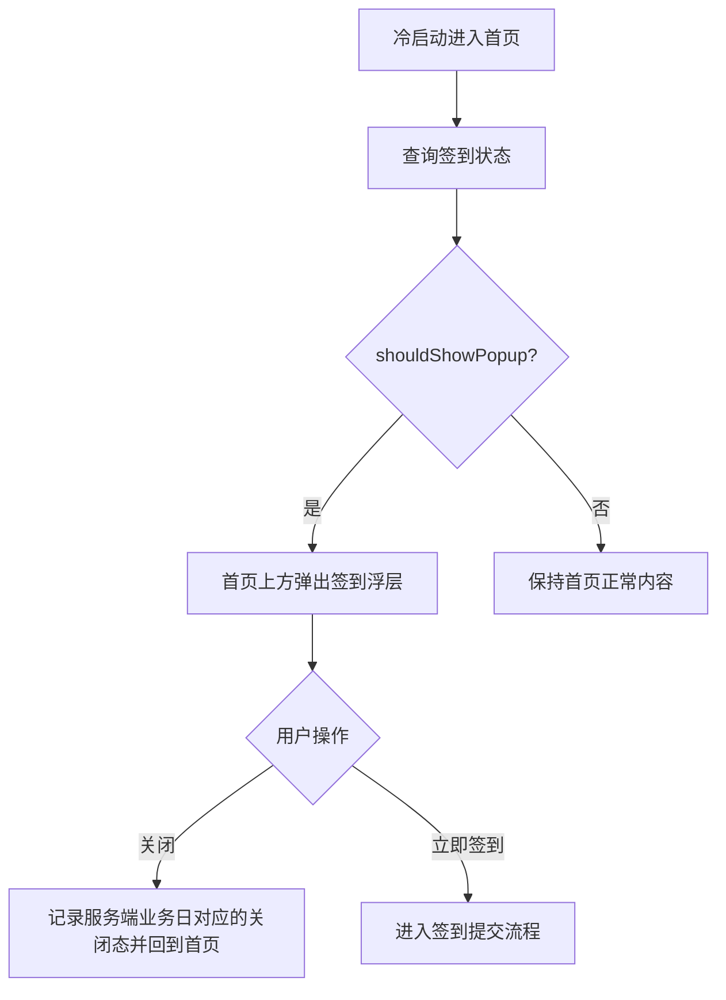
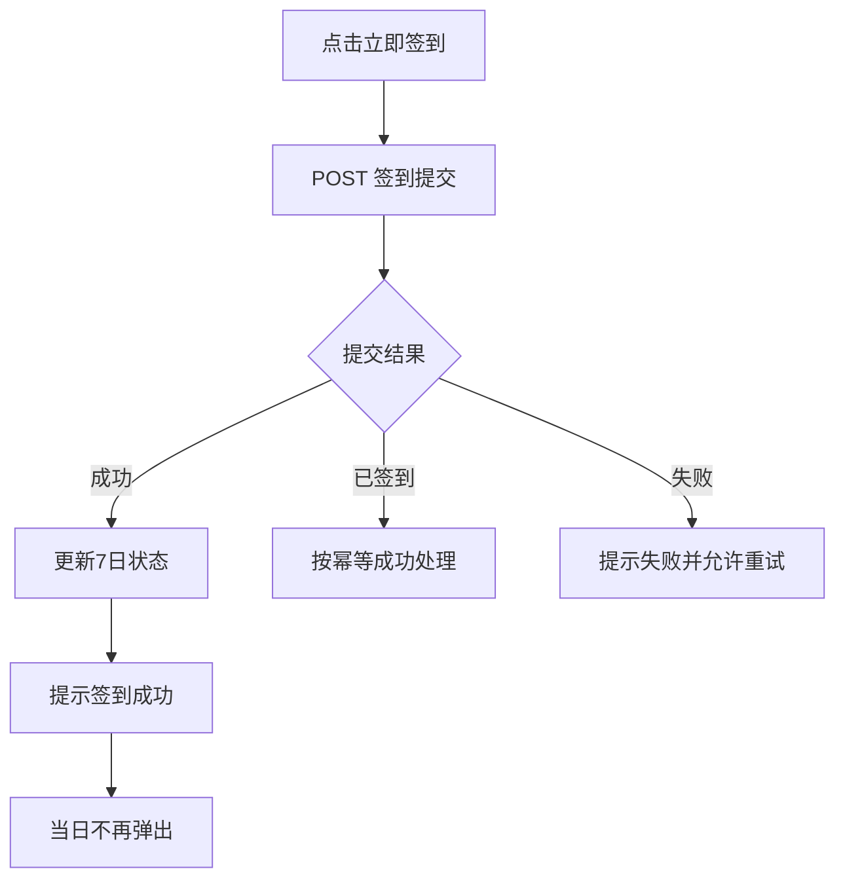
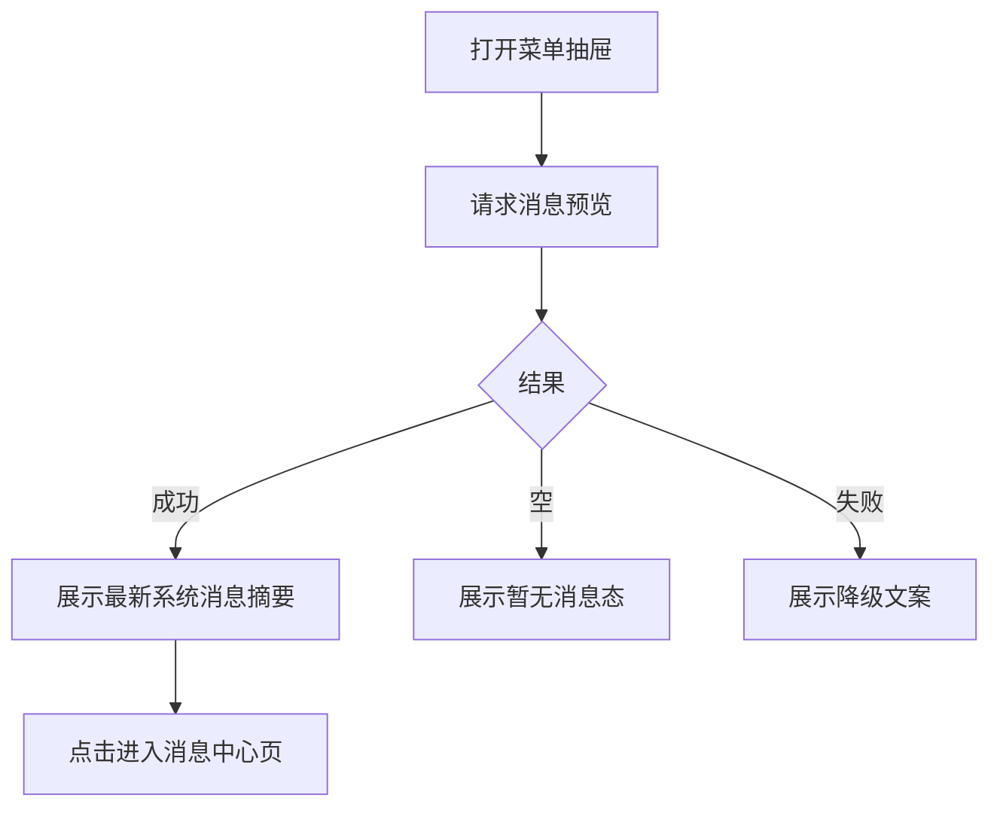
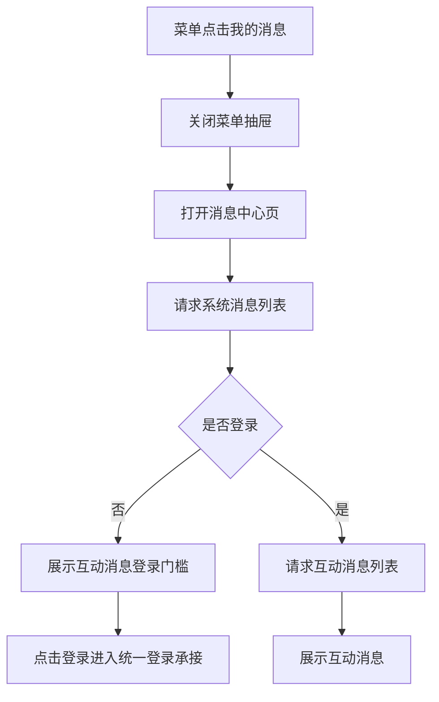
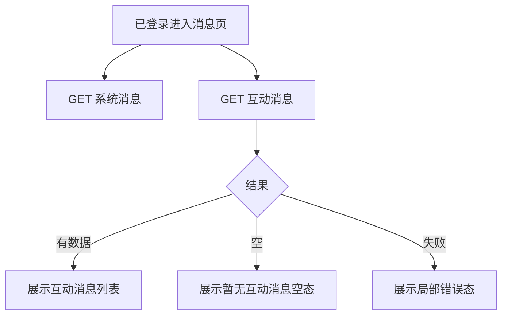

# 需求文档：PRD-10 签到与消息系统

> 创建日期：2026-07-29
> 状态：草稿
> 作者：AI Agent + daniel

---

## 1. 需求背景

### 1.1 问题描述

- **现状**：当前移动端首页已经具备 Feed、左侧菜单抽屉、“我的”登录闭环与评论能力，但还没有真实的签到奖励承接，也没有真实的消息中心。首页冷启动不会弹出签到浮层；菜单里的“我的消息”只有静态预览文案和占位承接页。Backend 侧也还没有签到状态 / 签到提交 / 消息预览 / 消息列表相关 API。
- **痛点**：
  1. 缺少低门槛的日常回访激励，首页冷启动缺少可驱动留存的轻量增长动作；
  2. 菜单抽屉虽然已经预留“我的消息”入口，但用户无法查看真实系统通知，也无法在登录后查看互动消息，导致 PRD-07 菜单与 PRD-08 登录能力之间缺少高频业务闭环；
  3. 当前登录体系、首页容器和菜单承接都已可用，但没有一个同时覆盖匿名触达、登录转化与用户回访的中频功能来复用这些基础能力。

### 1.2 预期目标

- **目标**：在 Android / iOS / Backend 上补齐首版签到与消息系统：
  - 首页冷启动可按规则弹出 7 日签到浮层；
  - 用户可完成当日签到并看到 7 日奖励进度；
  - 菜单抽屉中的“我的消息”模块展示真实最新系统消息预览；
  - 用户可从菜单进入独立消息页，查看系统消息列表；
  - 已登录用户可在消息页查看受保护的互动消息分区，匿名用户则看到明确登录承接；
  - 全链路复用现有 App Shell、菜单、认证与 RESTful API 基线，不新增 Web 端范围。
- **成功指标**（可度量）：
  - 符合触发条件时，首页冷启动后 1 次进入首页即可看到签到浮层；
  - 当日签到提交成功后，签到浮层中的当天卡位在同一次会话内立刻更新为“已签到”；
  - 菜单消息预览能够展示 1 条来自 Backend 的真实摘要，而不是静态占位文案；
  - 独立消息页首屏可在 1 次导航内打开，并展示系统消息列表；
  - 匿名用户进入消息页时，100% 能看到“登录查看互动消息”承接；已登录用户可看到互动消息列表或空态；
  - 消息与签到接口在各自资源内采用统一 contract：状态型接口返回单对象，列表接口返回 `{ data, pagination }`，客户端不需要为本需求引入新的第三方库。

### 1.3 范围定义

| 范围内 | 范围外（明确不做） | 原因 |
|--------|------------------|------|
| 首页冷启动 7 日签到浮层 | 推送通知（APNs / FCM） | 当前 PRD 聚焦站内承接，不做系统级推送 |
| 当日签到提交、签到状态查询、7 日进度展示 | 真正金币余额、提现、收益结算 | 依赖 PRD-14 赚钱中心 |
| 菜单消息预览与独立消息页 | 消息详情页、富文本消息、站外落地页 | 首版先完成消息列表与登录门槛 |
| 系统消息列表（匿名可看） | 后台可配置消息模板、运营发布后台 | 当前仓库不在本 PRD 内新增管理能力 |
| 登录后可见的互动消息分区 | 与评论系统实时联动生成消息流 | 首版允许使用独立 repository / seeded fixture，不要求事件回灌 |
| Android / iOS / Backend 实现 | Web 用户端消息中心 | 当前产品范围仍是 Native 优先 |

> 首版互动消息的产品目标是“形成登录后可浏览的受保护消息分区”，而不是完成评论/点赞事件驱动的通知中台。

---

## 2. 术语表

| 术语 | 定义 | 来源 |
|------|------|------|
| 签到浮层 | 进入首页冷启动后叠加在当前首页内容之上的 7 日签到弹窗，不切换页面路由 | 产品调研 / 本文档 |
| 7 日签到板 | 展示第 1~7 天奖励与完成状态的宫格视图 | 产品调研 / 本文档 |
| 安装标识（installationId） | 客户端安装级 UUID，通过 `X-Installation-Id` 请求头透传，用于匿名用户首版签到状态查询与次数收口；不是可信身份凭证 | 本文档新定义 |
| 消息预览 | 菜单抽屉中“我的消息”模块展示的最新一条系统消息摘要 | 产品调研 / 本文档 |
| 系统消息 | 平台面向全部用户展示的公告、活动提醒、内容更新等消息 | 产品调研 / 本文档 |
| 互动消息 | 登录后可见的受保护消息分区；首版允许由独立 seeded fixture / mock 数据源提供，不承诺已接评论/点赞实时事件 | 本文档新定义 |
| 消息中心页 | 从菜单抽屉进入的独立全屏消息承接页，承载系统消息与互动消息双分区 | 产品调研 / 本文档 |
| 冷启动 | App 被真正拉起进入首页容器的启动场景；从后台回前台不算冷启动 | 现有首页 / 应用壳语义 |
| 服务端业务日 | 由 Backend 统一判定的签到自然日边界；客户端本地日期只用于触发重新查询，不直接决定签到是否成功 | 本文档新定义 |

---

## 3. 涉及平台

| 平台 | 是否涉及 | 变更概要 |
|------|---------|---------|
| Backend | ✅ 涉及 | 新增签到状态 / 提交接口、消息预览 / 系统消息 / 互动消息接口、数据模型、repository / service / 测试 |
| Web | ❌ 不涉及 | Web 用户端维持现状，不实现签到与消息中心 |
| iOS | ✅ 涉及 | 首页冷启动签到浮层、菜单消息预览接真数据、独立消息页、登录门槛承接、状态管理与测试 |
| Android | ✅ 涉及 | 首页冷启动签到浮层、菜单消息预览接真数据、独立消息页、登录门槛承接、状态管理与测试 |

---

## 4. 用户故事

| 编号 | 角色 | 需求 | 验收标准 | 涉及平台 | 优先级 |
|------|------|------|---------|---------|--------|
| US-01 | 所有用户 | 冷启动时查看签到浮层 | 满足触发条件的首页冷启动进入后显示 7 日签到浮层，关闭后仍停留首页 | Backend/iOS/Android | P0 |
| US-02 | 所有用户 | 完成当日签到 | 点击“立即签到”后当天状态更新，浮层反馈成功并在当日不再重复弹出 | Backend/iOS/Android | P0 |
| US-03 | 所有用户 | 在菜单抽屉中查看最新消息预览 | 菜单抽屉中的“我的消息”模块展示来自服务端的最新系统消息摘要，而不是静态占位文案 | Backend/iOS/Android | P0 |
| US-04 | 所有用户 | 进入独立消息页查看系统消息 | 点击菜单中的“更多”或消息预览后进入消息中心页，可浏览系统消息列表并返回首页根上下文 | Backend/iOS/Android | P0 |
| US-05 | 匿名用户 | 进入消息页时被引导登录以查看互动消息 | 匿名用户在消息页可浏览系统消息，但互动消息区展示登录门槛与登录按钮 | iOS/Android | P0 |
| US-06 | 已登录用户 | 查看互动消息列表 | 登录用户进入消息页后可浏览互动消息列表或空态，不再显示匿名门槛文案 | Backend/iOS/Android | P1 |
| US-07 | 登录用户与匿名用户 | 保持签到状态 | 已签到天数与当日是否已签到在重新进入首页后仍能正确恢复；匿名按安装级持久化，登录用户按账号优先 | Backend/iOS/Android | P1 |

---

## 5. 功能详述

### 5.1 US-01：冷启动查看签到浮层

#### 流程描述

1. 用户冷启动进入移动端首页容器。
2. App Shell / 首页宿主在首页首屏数据加载后，异步检查签到浮层资格。
3. 客户端调用签到状态接口：
   - 已登录：带 `Authorization`，可附带 `X-Installation-Id`；
   - 未登录：必须带 `X-Installation-Id`。
4. Backend 返回当前 7 日签到板状态、当天是否已签到、是否应展示弹窗和当前服务端业务日。
5. 若满足展示条件，则在首页当前上下文上方弹出签到浮层；若不满足，则首页正常展示 Feed，不出现浮层。
6. 用户可关闭浮层，关闭后继续停留在首页 Feed，不发生页面跳转。
7. 客户端本地“当日关闭态”必须按服务端返回的业务日记录；本地日期变化只用于触发重新查询，不直接判定是否可再次签到或再次弹出。



#### 前置条件

- [ ] 当前为真正冷启动，而不是从后台恢复
- [ ] 用户已进入首页 Tab / 首页根页
- [ ] 客户端能够读取或生成安装级 UUID，并持久化到本地
- [ ] 网络异常时允许降级为“不弹窗但首页继续可用”

#### 后置条件

- 首页主内容保持可用；
- 若展示浮层，则浮层状态与首页内容解耦，关闭浮层不会重新加载首页；
- 当日关闭态或已签到态会阻止同一服务端业务日内重复弹窗；
- 登录态与安装标识同时存在时，服务端始终以账号态作为签到主体，安装标识只作匿名兼容字段。

#### 涉及的 UI/交互（如有）

| 页面 / 区域 | 交互描述 | 涉及端 |
|------------|---------|--------|
| 首页根页 | 冷启动后在当前内容层之上展示签到浮层 | iOS / Android |
| 签到浮层头部 | 展示标题、连续签到说明、关闭按钮 | iOS / Android |
| 签到浮层主体 | 展示 7 日签到宫格、当天状态与奖励说明 | iOS / Android |
| 浮层底部主按钮 | 未签到时展示“立即签到”；已签到时展示禁用态“今日已签到” | iOS / Android |

#### 边界与异常

**错误处理：**

| 操作步骤 | 错误类型 | 触发条件 | 系统行为 | 用户感知 |
|---------|---------|---------|---------|---------|
| 查询签到状态 | 网络异常 | 超时 / 断网 | 不阻塞首页；本次不弹浮层 | 首页照常可用，无强错误打断 |
| 查询签到状态 | 服务端错误 | 500 / 502 / 503 | 记录失败并降级不展示 | 无需额外弹错，避免打断首页 |
| 查询签到状态 | 数据解析失败 | 返回结构异常 | 视为降级不展示 | 首页照常可用 |
| 查询签到状态 | 参数缺失 | 匿名态缺少 `X-Installation-Id` | 尝试重新生成一次安装标识并重试；仍失败则降级不展示 | 最多无浮层，不白屏 |
| 关闭浮层 | 本地写入失败 | 无法记录服务端业务日对应的关闭态 | 允许关闭成功，但当日可能再次弹出 | 关闭动作仍即时生效 |

**边界场景：**

| 场景 | 触发条件 | 预期行为 |
|------|---------|---------|
| 当日已签到 | 当前服务端业务日已完成签到 | 不再弹出签到浮层 |
| 当日已关闭 | 用户此前关闭过浮层但未签到 | 同一服务端业务日不再弹出 |
| 从后台返回前台 | App 未被杀死，仅切后台再回来 | 不触发签到浮层 |
| 非首页启动落点 | 通过 Deeplink 或其他方式直接进入非首页页 | 不强插签到浮层，避免跨页面打断 |
| 本地时间跨天 | 设备日期进入下一天 | 允许重新发起状态查询，但最终是否展示由服务端业务日决定 |

### 5.2 US-02：完成当日签到

#### 流程描述

1. 用户在签到浮层中点击“立即签到”。
2. 客户端发起签到提交请求：
   - 已登录：按账号记账；
   - 未登录：按 `X-Installation-Id` 记账。
3. Backend 按服务端业务日校验“今日是否已签到”，若未签到则写入今日签到记录并计算新的 7 日状态。
4. 服务端返回最新签到板数据、当天奖励展示文案、当前服务端业务日和今日完成态。
5. 客户端更新当前浮层 UI：当天卡位高亮、按钮置为“今日已签到”，并给出轻量成功提示。
6. 无论用户是否登录，当日都不再重复弹出。
7. 7 日周期规则首版定稿为：**第 8 天重新从第 1 天开始新一轮 7 日签到**。



#### 前置条件

- [ ] 签到浮层已展示
- [ ] 当前服务端业务日尚未签到，或接口允许幂等重试
- [ ] 客户端持有登录态或安装标识

#### 后置条件

- 当日签到状态已落到服务端；
- 客户端本地当日弹窗屏蔽态按服务端业务日同步更新；
- 重新进入首页时能正确恢复当天已签到结果；
- 达到第 7 天后，下一服务端业务日自动按新一轮 7 日板返回。

#### 涉及的 UI/交互（如有）

| 页面 / 区域 | 交互描述 | 涉及端 |
|------------|---------|--------|
| 签到浮层主按钮 | 发起当日签到，提交中禁止重复点击 | iOS / Android |
| 7 日签到板 | 提交成功后刷新当天格子视觉状态 | iOS / Android |
| 轻量反馈 | 签到成功后展示 toast / inline success | iOS / Android |

#### 边界与异常

**错误处理：**

| 操作步骤 | 错误类型 | 触发条件 | 系统行为 | 用户感知 |
|---------|---------|---------|---------|---------|
| 提交签到 | 网络异常 | 超时 / 断网 | 保持浮层打开，按钮恢复可点击 | 看到“签到失败，请重试” |
| 提交签到 | 服务端错误 | 500 / 503 | 不清空当前状态，允许重试 | 看到失败提示 |
| 提交签到 | 重复提交 | 用户快速连点 | 按钮 loading + disabled；服务端幂等 | 不会重复累计 |
| 提交签到 | 参数缺失 | 登录态和安装标识都缺失 | 返回 400，客户端提示失败 | 提示稍后重试 |
| 提交签到 | 当日已签到 | 重复发起 | 按成功态返回当前最新状态 | 用户看到“今日已签到” |

**边界场景：**

| 场景 | 触发条件 | 预期行为 |
|------|---------|---------|
| 匿名后登录 | 匿名用户签到后再登录 | 首版不要求自动迁移匿名历史到账号，只保证当前安装上的状态一致 |
| 登录后换设备 | 同一账号在新设备打开 App | 账号态优先读取服务端签到记录 |
| 7 日周期完成 | 连续签到达到第 7 天 | 第 8 天自动从第 1 天开启新一轮 7 日板 |
| 首版无真钱/金币体系 | 奖励仅做视觉表达 | 不产生资产余额写入，不依赖 PRD-14 |

### 5.3 US-03：菜单抽屉查看最新消息预览

#### 流程描述

1. 用户在首页点击左上角汉堡按钮打开菜单抽屉。
2. 菜单面板加载时请求消息预览数据，或在打开抽屉时触发刷新。
3. Backend 返回最新 1 条系统消息摘要与相对时间。
4. 菜单中的“我的消息”模块用真实数据替换当前静态占位文案。
5. 用户点击预览模块或“更多”后进入消息中心页。



#### 前置条件

- [ ] 用户位于首页并可打开菜单抽屉
- [ ] 菜单面板可发起网络请求

#### 后置条件

- 菜单中“我的消息”模块呈现真实摘要或明确空态；
- 抽屉其余区域继续可用，不因消息请求失败阻塞最近在看、常用功能等区块。

#### 涉及的 UI/交互（如有）

| 页面 / 区域 | 交互描述 | 涉及端 |
|------------|---------|--------|
| 菜单抽屉消息模块 | 标题、最新系统消息摘要、时间、“更多”入口 | iOS / Android |
| 菜单抽屉消息模块点击 | 关闭抽屉并导航到独立消息页 | iOS / Android |

#### 边界与异常

**错误处理：**

| 操作步骤 | 错误类型 | 触发条件 | 系统行为 | 用户感知 |
|---------|---------|---------|---------|---------|
| 加载预览 | 网络异常 | 超时 / 断网 | 回退到静态降级文案，但入口仍可点 | 菜单不白屏 |
| 加载预览 | 空数据 | 系统消息为 0 条 | 显示“暂无消息”摘要 | 可继续进入消息页 |
| 进入消息页 | 抽屉关闭时序问题 | 关闭动画未完成即导航 | 仍按现有“先关菜单再导航”机制处理 | 不出现双层页面 |

**边界场景：**

| 场景 | 触发条件 | 预期行为 |
|------|---------|---------|
| 首次打开菜单 | 本地无缓存 | 允许显示 loading 骨架或降级文案 |
| 反复开关抽屉 | 短时间多次进入菜单 | 不重复堆叠多个请求，优先复用最近一次成功结果 |
| 匿名用户 | 未登录 | 仍可看到系统消息预览 |

### 5.4 US-04 / US-05：进入消息中心页查看系统消息与登录门槛

#### 流程描述

1. 用户在菜单抽屉点击“我的消息”模块。
2. 客户端沿用当前菜单导航机制：先关闭抽屉，再进入独立消息中心页。
3. 消息中心页首屏请求系统消息列表；若用户已登录，则同时请求互动消息列表；若未登录，则互动分区直接展示登录门槛。
4. 页面上半区展示系统消息列表；匿名用户下半区展示“登录查看互动消息”文案与登录按钮。
5. 用户点击返回后，**回到首页根上下文，菜单保持关闭**；用户可再次手动打开菜单，但不会自动重开抽屉。



#### 前置条件

- [ ] 用户从首页菜单进入消息页
- [ ] 系统消息接口可匿名访问
- [ ] 登录按钮复用 PRD-08 统一登录能力

#### 后置条件

- 用户可浏览系统消息列表；
- 匿名用户看到明确登录门槛；
- 返回后回到首页根上下文，沿用现有 close-then-navigate 语义。

#### 涉及的 UI/交互（如有）

| 页面 / 区域 | 交互描述 | 涉及端 |
|------------|---------|--------|
| 消息中心页导航栏 | 标题“我的消息” + 返回按钮 | iOS / Android |
| 系统消息列表 | 消息项展示标题、摘要、时间 | iOS / Android |
| 互动消息门槛区 | 匿名时展示插画/说明/登录按钮 | iOS / Android |
| 登录按钮 | 进入统一登录承接，成功后回到消息中心页 | iOS / Android |

#### 边界与异常

**错误处理：**

| 操作步骤 | 错误类型 | 触发条件 | 系统行为 | 用户感知 |
|---------|---------|---------|---------|---------|
| 加载系统消息 | 网络异常 | 超时 / 断网 | 展示错误态 + 重试 | 系统消息区可重试 |
| 加载系统消息 | 空数据 | 系统消息为 0 条 | 展示空态“暂无消息” | 页面仍可用 |
| 打开登录 | 登录接口不可用 | 认证链路失败 | 按 PRD-08 既有错误提示处理 | 用户看到登录失败反馈 |
| 返回消息页 | 导航回退异常 | 关闭抽屉后的返回链路未保留 | 必须回到首页根上下文，不允许回退黑洞 | 用户仍能回首页继续打开菜单 |

**边界场景：**

| 场景 | 触发条件 | 预期行为 |
|------|---------|---------|
| 匿名进入消息页 | 未登录 | 系统消息可看，互动区只展示登录门槛 |
| 从消息页触发登录并成功 | 点击登录按钮完成认证 | 回到消息页本身，不丢失当前上下文 |
| 从消息页触发登录并取消 | 用户取消登录 | 保持在消息页匿名态 |
| 系统消息很多 | 列表较长 | 使用 `page/pageSize` 分页，避免一次拉全量 |

### 5.5 US-06：登录用户查看互动消息列表

#### 流程描述

1. 已登录用户进入消息中心页。
2. 客户端在加载系统消息的同时，发起互动消息列表请求。
3. Backend 基于当前 `AuthContext.userId` 返回当前用户的受保护互动消息分区数据；首版允许来自独立 repository / seeded fixture，不要求与评论/点赞事件实时联动。
4. 页面渲染互动消息分区，不再显示匿名登录门槛。
5. 首版互动消息支持列表浏览、分页、空态和局部错误态；不要求消息详情页、已读回写或未读红点闭环。



#### 前置条件

- [ ] 用户已登录
- [ ] 消息中心页已打开
- [ ] Backend 能识别当前用户认证上下文

#### 后置条件

- 已登录用户可看到互动消息列表或空态；
- 互动消息分区与系统消息分区互不阻塞；
- 退出登录后再次进入消息页将退回匿名门槛态。

#### 涉及的 UI/交互（如有）

| 页面 / 区域 | 交互描述 | 涉及端 |
|------------|---------|--------|
| 互动消息分区 | 展示消息标题、摘要、相对时间、来源类型 | iOS / Android |
| 空态 / 错误态 | 已登录但无互动消息时展示空态；请求失败时支持重试 | iOS / Android |

#### 边界与异常

**错误处理：**

| 操作步骤 | 错误类型 | 触发条件 | 系统行为 | 用户感知 |
|---------|---------|---------|---------|---------|
| 加载互动消息 | 未授权 | token 过期 / 登录态失效 | 退回匿名门槛或触发会话恢复 | 不显示脏数据 |
| 加载互动消息 | 网络异常 | 超时 / 断网 | 局部错误态，不影响系统消息区 | 互动区支持重试 |
| 加载互动消息 | 空数据 | 当前用户暂无消息 | 展示“暂无互动消息”空态 | 页面仍完整 |

**边界场景：**

| 场景 | 触发条件 | 预期行为 |
|------|---------|---------|
| 登录失效 | 进入消息页时 token 已过期 | 复用 PRD-08 恢复逻辑，失败则降级为匿名门槛 |
| 尚无真实互动事件源 | 首版没有评论通知联动 | 允许 Backend 返回 seeded fixture / mock 列表，只要登录门槛与列表 contract 成立 |

---

## 6. 数据概览

| 数据实体 | 说明 | 关键字段 | 来源 |
|---------|------|---------|------|
| SignInStatus | 当前用户 / 安装的签到总状态 | `server_date`、`should_show_popup`、`today_signed`、`current_streak`、`days[]`、`reward_copy` | 系统生成 |
| SignInDay | 7 日签到板中的单日状态 | `day`、`title`、`reward_label`、`status` | 系统生成 |
| MessagePreview | 菜单中的消息摘要 | `title`、`summary`、`relative_time` | 系统生成 |
| SystemMessage | 面向所有用户的系统通知 | `id`、`title`、`summary`、`sent_at` | 服务端数据 |
| InteractionMessage | 面向登录用户的受保护消息 | `id`、`type`、`title`、`summary`、`sent_at` | 服务端数据 |

### 数据关系

```text
[账号 user] ──1:N──▶ [签到记录 sign-in record]
      │
      ├──1:N──▶ [互动消息 interaction message]
      │
[安装 installation] ──1:N──▶ [匿名签到记录 sign-in record]

[系统消息 system message] 独立于用户存在，对匿名与登录用户都可见
```

### 首版 API 约束（定稿）

> 本节用于收敛 spec 阶段的接口边界；具体 schema 命名与错误码在 design 阶段展开，但资源拆分与分页语义不再开放。

| 接口 | 认证 | 关键输入 | 响应约束 |
|------|------|---------|---------|
| `GET /api/check-ins/status` | 可选登录 | 匿名态必须带 `X-Installation-Id: <uuid>`；登录态可同时带 header | 返回单个 `SignInStatus` 对象，包含 `server_date` / `should_show_popup` / `today_signed` / `current_streak` / `days` |
| `POST /api/check-ins` | 可选登录 | 匿名态必须带 `X-Installation-Id: <uuid>`；登录态优先按 `AuthContext.userId` 记账 | 返回最新 `SignInStatus` 对象；同一服务端业务日幂等 |
| `GET /api/messages/preview` | 匿名可访问 | 无分页；可按需要带 `pageSize=1` 但首版固定返回最新 1 条摘要 | 返回单个 `MessagePreview` 或空态 |
| `GET /api/messages/system?page&pageSize` | 匿名可访问 | `page>=1`、`1<=pageSize<=20` | 返回 `{ data, pagination }`，`pagination` 固定为 `page / page_size / total / total_pages` |
| `GET /api/messages/interactions?page&pageSize` | 必须登录 | `page>=1`、`1<=pageSize<=20` | 返回 `{ data, pagination }`，结构与系统消息列表一致 |

补充约束：
- 所有列表接口统一使用 `page/pageSize` 请求参数与 `pagination` 响应结构，不使用 `next_cursor`；
- 登录态与 `X-Installation-Id` 同时存在时，签到相关接口始终以账号态为主；
- `X-Installation-Id` 仅用于低风险签到激励，不视为强身份或资产归属凭据。

---

## 7. 现有功能影响

| 现有功能 | 影响类型 | 说明 | 是否需要迁移 |
|---------|---------|------|------------|
| 首页信息流 | 修改行为 | 首页需要新增冷启动签到浮层宿主，但不能影响既有 Feed / 评论抽屉逻辑 | 否 |
| 应用壳 / 菜单面板 | 修改行为 | 菜单消息模块从静态文案升级为真实预览，并新增消息中心页导航；返回语义仍沿用现有 close-then-navigate 机制 | 否 |
| 认证体系 | 新增关联 | 消息页登录按钮、互动消息接口、登录后回到消息页都要复用 PRD-08 登录链路 | 否 |
| Backend API | 新增关联 | 增加签到与消息接口，不应破坏现有 dramas / auth / comments API | 否 |
| 评论能力 | 新增关联 | 首版互动消息不强依赖评论实时事件，但后续可复用评论相关事件来源 | 否 |

### 兼容性说明

- 本需求不要求迁移既有用户数据；
- 匿名签到以安装级数据为首版边界，允许在卸载 / 清缓存 / 换设备后丢失匿名历史；
- 登录用户的签到进度以账号态优先，后续设备登录时应能恢复；
- 消息中心是新增页面，不应改变首页、菜单、登录、评论既有主路径的契约。

---

## 8. 非功能性需求

### 8.1 性能

| 指标 | 目标值 | 测量方式 |
|------|--------|---------|
| 首页签到资格检查 | 不额外阻塞首页首屏；请求慢时允许不弹浮层 | 代码路径 + QA 记录 |
| 消息预览加载 | 菜单打开后 1 次请求内完成，可回退降级文案 | 自动化测试 + 手工验证 |
| 消息中心首屏加载 | 系统消息区首屏可在 2 秒量级内展示首批内容 | QA 记录 |
| 签到提交响应 | 用户点击后在 1 次接口往返内看到状态更新 | 自动化测试 + QA 记录 |

### 8.2 安全

| 关注点 | 要求 |
|--------|------|
| 认证与授权 | 系统消息可匿名访问；互动消息必须要求登录；签到状态 / 提交支持“登录用户 + 匿名安装”双路径，但不能把一个用户的互动消息暴露给匿名态 |
| 数据校验 | 客户端和服务端都要校验 `page/pageSize`、`X-Installation-Id`、认证上下文；签到接口必须保证幂等 |
| 敏感数据 | 消息与签到不涉及高敏资产信息；不得在客户端硬编码 token、环境地址或服务端开关 |
| 防滥用 | 签到提交需按“同一用户 / 安装同一服务端业务日最多成功一次”收口；消息列表接口应保留分页 / 限流空间 |

### 8.3 兼容性

| 维度 | 要求 |
|------|------|
| 设备兼容 | 延续现有 Android / iOS 最低支持策略，不新增平台级外部依赖 |
| 数据兼容 | 旧客户端未接入本需求时，不影响既有首页、菜单和登录能力 |
| 向后兼容 | 新增 API 不破坏现有接口；菜单预览在请求失败时必须可降级到静态文案 |

---

## 9. 依赖

| 依赖项 | 类型 | 说明 | 状态 | 阻塞 |
|--------|------|------|------|------|
| PRD-07 菜单面板 | 内部能力 | 消息预览入口和消息中心页从首页菜单进入 | ✅ 已就绪 | 否 |
| PRD-08 认证体系 | 内部能力 | 登录按钮、互动消息鉴权、登录后回流消息页 | ✅ 已就绪 | 否 |
| 首页 Feed 宿主 | 内部能力 | 签到浮层需要挂载在首页上下文中 | ✅ 已就绪 | 否 |
| Backend RESTful API 基线 | 内部能力 | 新增签到与消息接口沿用 Route Handler + schema + service 模式 | ✅ 已就绪 | 否 |
| PRD-14 赚钱中心 | 内部能力 | 真实金币 / 资产闭环后续可接入签到奖励 | 📅 规划中 | 否 |
| 评论实时通知生成 | 内部能力 | 互动消息未来可接评论 / 点赞事件 | 📅 规划中 | 否 |

---

## 10. 待澄清问题

当前无阻塞待澄清问题。本轮已在正文中定稿以下关键决策：

- 匿名签到统一使用 `X-Installation-Id` header，格式为安装级 UUID；
- 签到是否跨天、是否可再次弹出、是否可再次提交，统一以服务端业务日为准；
- 从消息中心返回后回到首页根上下文，菜单保持关闭，不自动重开；
- 互动消息首版允许使用独立 seeded fixture / mock 数据源；
- 7 日签到完成后的下一服务端业务日从第 1 天重新开始新一轮签到板。

---

## 11. 参考资料

### 已查阅的 wiki 文档

| 文档 | 相关章节 | 关键信息 |
|------|---------|---------|
| `wiki/features/auth/index.md` | 功能概述、入口与路由、业务接口鉴权 | 登录闭环已完成，消息页登录按钮与互动消息鉴权应复用现有 auth 基线 |
| `wiki/features/homepage-feed/index.md` | 功能概述、流程：移动端首页首屏加载 | 首页当前已是 Feed 宿主，评论已以内嵌 sheet / bottom sheet 方式挂载，可继续承载签到浮层 |
| `wiki/features/app-shell/index.md` | 功能概述、菜单面板与路由承载 | 菜单面板已存在真实导航容器，消息预览当前仍是占位承接 |
| `wiki/architecture/overview.md` | 当前版本、当前首页发现与账号承载结构 | 当前系统总览尚未包含签到 / 消息，需要在功能完成后补入 |

### 已查阅的代码文件

| 文件 | 关键内容 |
|------|---------|
| `android/app/src/main/java/com/djs66256/short_drama/feature/home/ui/HomeScreen.kt` | 首页当前承载 Feed 与评论抽屉，尚无签到浮层宿主 |
| `ios/ShortDrama/Sources/Features/Home/Views/HomeView.swift` | iOS 首页当前承载 Feed 与 comments sheet，尚无签到浮层宿主 |
| `android/app/src/main/java/com/djs66256/short_drama/feature/menu/ui/MenuPanelScreen.kt` | Android 菜单已有消息预览区块接线，但仍使用静态数据 |
| `android/app/src/main/java/com/djs66256/short_drama/feature/menu/model/MenuPanelStaticEntries.kt` | Android 当前“我的消息”文案与路由为占位实现 |
| `android/app/src/main/java/com/djs66256/short_drama/navigation/NavGraph.kt` | Android `menu/messages` 当前为 Native 占位页 |
| `ios/ShortDrama/Sources/Features/MenuPanel/Views/Components/MenuMessagePreviewView.swift` | iOS 当前消息预览仍是静态系统通知文案 |
| `ios/ShortDrama/Sources/Features/MenuPanel/Views/MenuPanelContainerView.swift` | iOS 消息入口当前导航到 placeholder 页面 |
| `ios/ShortDrama/Sources/Domain/Entities/MenuPlaceholderKind.swift` | iOS `messages` 仍被定义为占位承接 |
| `docs/product_research/mobile/homepage-feed/signin-popup/signin-popup.md` | 竞品冷启动签到浮层参考 |
| `docs/product_research/mobile/homepage-feed/menu-panel/my-messages/my-messages.md` | 菜单消息预览 + 独立消息页参考 |
| `docs/product_manager/prd/2026-07-25-signin-messages/prd.md` | 原始产品需求草稿，提供签到与消息功能方向 |

---

## 12. 变更历史

| 日期 | 变更内容 | 变更原因 |
|------|---------|---------|
| 2026-07-29 | 初始版本 | 进入 PRD-10 spec-writing 阶段，基于现有 wiki、代码与产品调研补齐需求文档 |
| 2026-07-29 | 收敛匿名签到 contract、服务端业务日、消息返回语义、互动消息首版范围与消息接口分页规则 | 响应 spec-review 第 1 轮问题，消除 design / coding 阶段歧义 |
