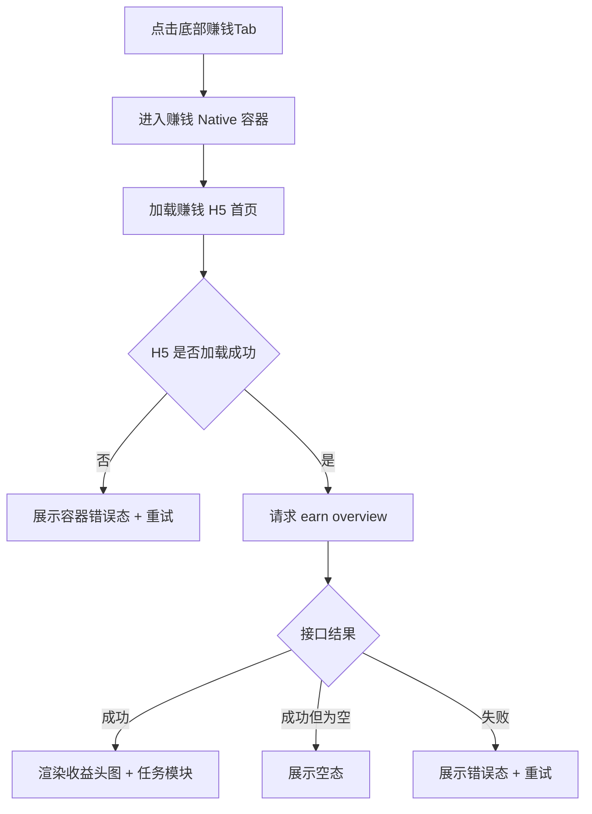
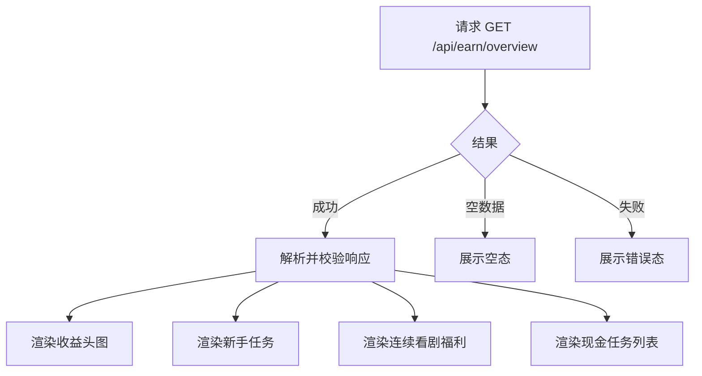
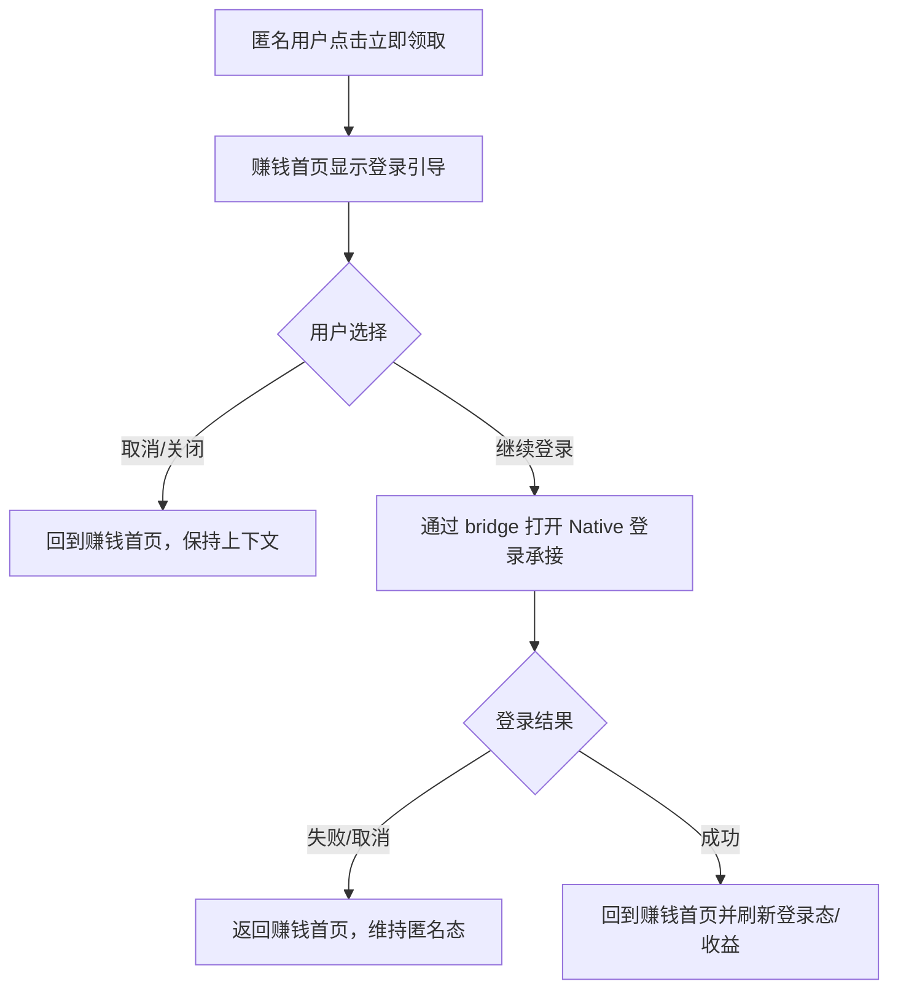
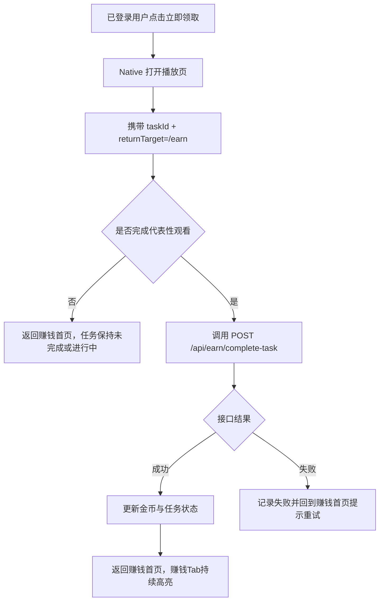

# 需求文档：PRD-14 赚钱中心

> 创建日期：2026-07-29
> 状态：草稿
> 作者：AI Agent + daniel

---

## 1. 需求背景

### 1.1 问题描述

- **现状**：移动端底部导航已经具备 `home / theater / mall / earn / profile` 五个一级频道，但当前 Android 的 `earn` graph 仍展示 `PlaceholderScreen`，iOS 的 `earn` tab 仍复用 `PlaceholderTabView`，Web 端也还没有 `/earn` H5 路由，Backend 尚无任何赚钱中心相关 API。用户点击「赚钱」后只能看到占位说明，无法查看收益、浏览任务、触发奖励链路或形成商业化激励闭环。
- **痛点**：
  - `PRODUCT.md` 已明确商城（mall）与赚钱（earn）频道应采用 **H5 页面承载 + Native 容器接入**，但当前 earn 仍停留在壳层占位，产品策略与代码现状存在明确断层。
  - 竞品红果的赚钱中心不是单纯钱包页，而是「收益展示 + 任务分发 + 内容消费转化」的核心频道；当前产品完全缺失这一留存与激励入口。
  - 产品经理已有 `earn-center` PRD、子任务拆分和竞品研究，但工程侧尚未把这些业务范围转换成当前仓库可实现的 Web H5 页面、Native 容器接入和 Backend 最小 contract。
  - 奖励型任务的代表性路径不是停留在赚钱首页，而是从赚钱中心点击「立即领取」后直接进入播放页，再在完成观看后返回赚钱中心；当前仓库没有任何 earn 域内的跳转、回传和上下文恢复语义。
  - PRD-10 的签到奖励未来需要并入赚钱中心货币体系，但当前赚钱中心本身尚未落地，导致签到、奖励和收益展示之间没有承接宿主。

### 1.2 预期目标

- **目标**：将移动端一级频道中的「赚钱」Tab 从占位页演进为真实赚钱中心入口，并遵循 `PRODUCT.md` 的承载策略：**赚钱中心首页由 Web H5 提供，Android / iOS 通过 Native 容器接入，Backend 提供首版收益总览与任务完成接口；首版以虚拟金币与受控 seed 数据打通主链路，不实现真实提现或完整账本体系。**
- **成功指标**（可度量）：
  - Android / iOS 点击底部「赚钱」Tab 后，默认进入赚钱中心 H5 首页，底部赚钱 tab 持续高亮，不再展示占位页。
  - H5 首页首版完整展示以下四个核心区块：收益头图、新手任务卡、连续看剧福利、现金任务列表。
  - Backend 提供 `GET /api/earn/overview`；首页默认成功加载收益与任务 seed 数据；空态、错误态和重试路径清晰可见。
  - 匿名用户点击需要登录的任务入口时，先在赚钱中心 H5 页内看到登录引导；点击继续后通过 **earn 专属 H5 ↔ Native bridge 协议** 请求宿主打开登录承接适配层。宿主适配层底层可复用现有 Native 登录能力，但当前 H5 发起链路与返回语义需要为 earn 新增，不直接假设 mall 链路可无改动复用。
  - 已登录用户点击代表性「立即领取」任务后，进入 Native 播放承接链路；首版任务完成以 **earn 任务回调** 为准，不依赖现有播放器 `progress / stop` contract 即可先打通最小闭环。返回赚钱中心后，收益头图中的金币数可按首版规则更新。
  - Web 提供可被 Native 容器加载的 `/earn` 页面资产；本地开发模式下，H5 页面也可在浏览器直接访问与调试，但浏览器模式仅覆盖 H5 UI 与接口调试，不要求真实打开 Native 登录或播放器。

### 1.3 范围定义

| 范围内 | 范围外（明确不做） | 原因 |
|--------|------------------|------|
| Android / iOS 将 `earn` 一级频道从 placeholder 替换为赚钱中心 H5 容器页 | 继续用 Native 重写赚钱首页 UI | `PRODUCT.md` 已明确 earn 应由 H5 承载 |
| Web 提供赚钱中心 H5 首页 `/earn` | Web 桌面站独立赚钱导航壳或 PC 专属布局适配 | 本期目标是给 Native 容器提供 H5 页面资产 |
| Backend 新增 `GET /api/earn/overview` 与 `POST /api/earn/complete-task` | 完整金币账本、提现流水、真实现金结算 | 首版只打通最小演示链路 |
| 收益头图、新手任务卡、连续看剧福利、现金任务列表 | 广告任务、邀请拉新、微信提现/支付宝提现 | 远期迭代 |
| 首版统一使用“金币”作为虚拟货币单位并展示受控 seed 数据 | 真实金币增减规则、防刷、风控、清结算 | 需要单独业务与风控设计 |
| 代表性「立即领取」任务跳转播放页并在回到赚钱中心后展示奖励更新 | 复杂任务进度累计、多任务并发、跨天补领 | 首版仅打通一个代表性任务闭环，并新增 earn 任务上下文与回传能力 |
| 匿名态登录引导与登录后回到赚钱中心上下文 | 重写 PRD-08 登录体系 | 复用的是现有 Native 登录能力；earn 仍需新增自己的 H5 bridge、Native 承接适配与返回语义 |
| 浏览器模式下的 `/earn` 开发调试能力 | 浏览器内真实打开 Native 登录或播放器 | 浏览器缺少 Native bridge，本期仅要求 H5 UI 与接口可调试 |
| 首版连续看剧福利 7 宫格状态展示 | 连签真实发奖、与 PRD-10 签到体系打通 | PRD-10 当前定义为后续并入 |

> 本期重点是先打通「赚钱一级频道 → H5 首页 → 任务浏览 / 登录引导 / 播放承接 / 返回收益更新」主链路，而不是一次性补齐完整收益系统。

---

## 2. 术语表

| 术语 | 定义 | 来源 |
|------|------|------|
| 赚钱频道 | 底部导航中的一级频道 `earn`，是赚钱中心的唯一一级入口 | `PRODUCT.md` / 本文档收敛 |
| 赚钱中心 H5 首页 | 由 Web 提供、在 Native 容器内加载的赚钱首页，展示收益头图与任务模块 | `PRODUCT.md` / 本文档收敛 |
| 赚钱 Native 容器 | Android / iOS 中承载赚钱 H5 页面的 WebView/WKWebView 容器页，负责加载、错误恢复与桥接；可参考 mall 的设计模式，但实现上需要 earn 自己的 route、配置、bridge 与 host sync | 本文档新定义 |
| 收益头图 | 赚钱首页顶部收益概览区，展示金币数与匿名态登录入口 | 产品经理 PRD / 竞品研究 |
| 新手任务 | 首页首屏代表性任务卡，例如「新人7天保底6元」，带「立即领取」按钮 | 产品经理 PRD / 竞品研究 |
| 连续看剧福利 | 首页中的 7 宫格连续奖励区，首版展示 UI 状态，不实现真实签到/发奖 | 产品经理 PRD / PRD-10 |
| 现金任务 | 首页下方的任务列表，例如「看剧领现金」等任务卡 | 产品经理 PRD / 竞品研究 |
| 金币 | 本期首版统一使用的虚拟货币单位，纯展示占位，不与真实现金直接挂钩 | 产品经理 PRD / PRD review |
| 任务上下文 | 从赚钱首页跳转到播放页时透传的最小任务信息，至少包括 `taskId`、来源频道 `earn` 与返回目标 `/earn`；这是 earn 首版需要新增的上下文能力，当前播放器链路并不天然具备 | 本文档新定义 |
| 返回赚钱上下文 | 指底部赚钱 tab 高亮、赚钱首页滚动位置、已加载 overview 数据和本轮任务回传结果 | 本文档新定义 |
| 浏览器模式 | 指直接在浏览器访问 `/earn` 进行页面调试；此模式不具备 Native bridge，因此仅覆盖 H5 UI、接口、空态/错误态与按钮降级反馈 | 本文档新定义 |
| 受控 seed 数据 | 首版用于验证结构和交互的固定收益/任务数据，必须集中在 Backend 或 H5 配置层维护，不散落硬编码在端侧页面组件中 | 根目录 `CLAUDE.md` / 本文档收敛 |

### 2.1 首版任务类型清单

| 类型 | 首版展示 | 首版行为 | 说明 |
|------|---------|---------|------|
| 新手任务 | 单张高优先级卡片 | 点击后进入代表性奖励链路 | 是首屏重点任务 |
| 连续看剧福利 | 7 宫格奖励卡片 | 仅展示状态，不直接发奖 | 先做 UI 承接 |
| 现金任务 | 列表任务卡 | 支持展示，代表性任务可进入播放链路 | 非所有任务都要首版真正可完成 |

---

## 3. 涉及平台

| 平台 | 是否涉及 | 变更概要 |
|------|---------|---------|
| Backend | ✅ 涉及 | 新增赚钱中心 overview / complete-task 接口、schema、service、repository 与首版 seed 数据 |
| Web | ✅ 涉及 | 将 `/earn` 从不存在的路由补齐为可供 Native 容器加载的赚钱中心 H5 首页，并新增 earn config、API 封装、状态管理与 bridge 协议 |
| iOS | ✅ 涉及 | 将 `earn` tab 从 `PlaceholderTabView` 替换为赚钱 Native 容器，新增 earn URL 配置、容器 ViewModel、bridge 监听、登录/播放承接适配与返回处理 |
| Android | ✅ 涉及 | 将 `earn` graph 从 `PlaceholderScreen` 替换为赚钱 Native 容器，新增 earn URL 配置、容器状态、bridge、登录/播放承接适配与返回处理 |

---

## 4. 用户故事

| 编号 | 角色 | 需求 | 验收标准 | 涉及平台 | 优先级 |
|------|------|------|---------|---------|--------|
| US-01 | 所有用户 | 我希望点击赚钱 tab 后立即看到真实赚钱首页，而不是占位页 | Android / iOS 进入 `earn` tab 后加载赚钱中心 H5 首页；页面展示收益头图、新手任务、连续看剧福利、现金任务列表 | Web / iOS / Android | P0 |
| US-02 | 所有用户 | 我希望在赚钱首页看到明确的收益与任务结构 | `GET /api/earn/overview` 成功后渲染收益总览与任务模块；接口为空或失败时有清晰空态/错误态 | Backend / Web / iOS / Android | P0 |
| US-03 | 匿名用户 | 我点击需要登录的任务时，应先得到登录引导，而不是无反馈失败 | 匿名点击代表性任务时，在赚钱上下文内触发登录引导并可打开统一 Native 登录承接；返回后仍停留赚钱中心 | Web / iOS / Android | P0 |
| US-04 | 已登录用户 | 我点击代表性「立即领取」任务后，希望直接进入播放页完成任务 | 已登录点击代表性任务后进入现有 Native 播放页并携带任务上下文；完成代表性观看后回到赚钱中心，收益数值更新 | Backend / Web / iOS / Android | P0 |
| US-05 | 所有用户 | 我希望能浏览连续看剧福利和现金任务，即使部分能力尚未真正开放 | 连续看剧福利 7 宫格与现金任务列表完整展示；未开放能力给出明确占位说明，不离开赚钱上下文 | Web / iOS / Android | P1 |

---

## 5. 功能详述

### 5.1 US-01：进入赚钱频道并加载 H5 首页

#### 流程描述

1. 用户点击底部导航中的「赚钱」Tab。
2. Android / iOS 不再展示占位页，而是进入赚钱 Native 容器页。
3. Native 容器读取 **新增的 earn 首页配置** 并开始加载。当前代码中 Android `AppConfig` 与 iOS `AppConfig` 仅暴露 mall URL 能力，因此 earn 需要补充自己的配置项与 home URL 组装逻辑，而不是直接挪用 mall 常量。
4. H5 首页成功加载后，按固定顺序展示以下区块：
   - 顶部收益头图
   - 新手任务卡
   - 连续看剧福利 7 宫格
   - 现金任务列表
5. H5 首页首次进入时请求：`GET /api/earn/overview`。
6. 接口成功返回后，页面渲染收益与任务；为空时展示空态；失败时展示错误态与重试入口。
7. 底部赚钱 tab 在整个浏览过程中保持高亮。



#### 前置条件

- [x] 移动端已存在 `earn` 一级频道入口。
- [ ] Android / iOS 已具备赚钱 Native 容器接入能力。
- [ ] Web 已提供可加载的赚钱 H5 首页路由。
- [ ] Backend 已提供 `GET /api/earn/overview`。

#### 后置条件

- 用户位于赚钱首页上下文中，底部赚钱 tab 保持高亮。
- 首屏成功后可继续触发登录引导、任务点击与播放承接。
- H5 页面与 Native 容器均处于可重试状态，失败不会退回占位页。

#### 涉及的 UI/交互（如有）

| 页面 / 区域 | 交互描述 | 涉及端 |
|------------|---------|--------|
| 底部赚钱 Tab | 点击后进入赚钱容器，不再展示占位说明 | iOS / Android |
| Native 容器 loading 态 | H5 首次加载期间展示统一 loading 骨架 | iOS / Android |
| Native 容器错误态 | H5 首页加载失败时展示错误说明与重试按钮 | iOS / Android |
| 赚钱 H5 首页 | 按固定模块顺序渲染，不因局部状态打乱页面骨架 | Web |
| 首屏收益区 | 展示金币数与匿名态登录入口 | Web |

#### 边界与异常

**错误处理：**

| 操作步骤 | 错误类型 | 触发条件 | 系统行为 | 用户感知 |
|---------|---------|---------|---------|---------|
| 加载赚钱首页 | H5 加载失败 | URL 不可达 / 网络异常 / 页面崩溃 | Native 容器展示错误态，可重试 | 错误说明 + 重试按钮 |
| 拉取 overview | 网络异常 | 超时 / 断网 | 页面保留骨架，主体区进入错误态 | 错误态 + 重试 |
| 拉取 overview | 服务端错误 | 500 / 502 / 503 | 不渲染脏数据，不回退占位页 | 错误态 + 重试 |
| 拉取 overview | 数据校验失败 | 字段缺失 / 类型错误 | 当前结果视为失败并展示错误态 | 错误提示 |
| 容器反复加载失败 | 多次重试仍失败 | 地址错误或持续网络异常 | 保持统一错误态，不死循环刷新 | 明确失败反馈 |

**边界场景：**

| 场景 | 触发条件 | 预期行为 |
|------|---------|---------|
| 首屏无任务 | 接口返回空任务列表 | 展示空态，但保留收益头图与基本说明 |
| 用户切后台再返回 | 已加载或加载中 | 尽量保留赚钱上下文；必要时可局部重试，但不退回占位页 |
| 反复切换 tab | 在多个一级 tab 间来回切换 | 返回赚钱时尽量复用已有容器与页面状态，避免每次冷启动 |

### 5.2 US-02：展示收益总览与任务模块

#### 流程描述

1. 赚钱 H5 首页在首屏请求 `GET /api/earn/overview`。
2. 响应中至少包含以下结构：
   - `coins`
   - `new_user_task`
   - `daily_rewards`
   - `cash_tasks`
3. H5 将 `coins` 渲染到收益头图；匿名态时同时显示登录入口文案。
4. 新手任务卡优先展示在收益区下方，作为首屏代表性任务入口。
5. 连续看剧福利以 7 宫格渲染每日奖励卡片，并区分可领取、已领取、未到达三种状态；首版允许全部使用受控 seed 状态展示。
6. 现金任务区以列表卡片展示任务标题、奖励金币、说明和操作按钮。



#### 前置条件

- [x] 赚钱 H5 首页已成功加载。
- [ ] `GET /api/earn/overview` 已可用。
- [ ] Web 端已具备对 earn response 的 schema 校验。

#### 后置条件

- 收益和任务展示状态与响应数据一致。
- 同一页面中的不同任务区块不会因为单个字段异常而展示互相矛盾的状态。
- 空态、错误态和正常态之间切换明确。

#### 涉及的 UI/交互（如有）

| 页面 / 区域 | 交互描述 | 涉及端 |
|------------|---------|--------|
| 收益头图 | 展示金币数、收益说明、匿名态登录入口 | Web |
| 新手任务卡 | 展示任务标题、奖励值、按钮 | Web |
| 连续看剧福利 | 7 宫格卡片展示 7 天奖励状态 | Web |
| 现金任务区 | 列表卡片展示任务信息 | Web |

#### 边界与异常

**错误处理：**

| 操作步骤 | 错误类型 | 触发条件 | 系统行为 | 用户感知 |
|---------|---------|---------|---------|---------|
| 解析 overview | 数据校验失败 | `coins` 非数字、任务字段缺失 | 不渲染错误数据，进入整体错误态 | 错误提示 |
| 渲染连续福利 | 列表长度异常 | 少于或多于 7 项 | 首版允许降级展示已有项，但在文档中标记为异常输入 | 模块展示受限但页面不崩溃 |
| 渲染现金任务 | 空列表 | 暂无现金任务 | 展示空态说明，不隐藏整个页面 | 空态说明 |

**边界场景：**

| 场景 | 触发条件 | 预期行为 |
|------|---------|---------|
| 金币数为 0 | 新用户首次进入 | 正常展示 `0 金币`，不视为异常 |
| 奖励值较大 | 任务奖励数值较大 | 按统一格式展示，不出现溢出换行 |
| 匿名态与已登录态切换 | 登录成功返回页面 | 页面可重新拉取或更新收益展示 |

### 5.3 US-03：匿名用户点击任务时触发登录引导

#### 流程描述

1. 匿名用户在赚钱首页点击需要登录才能完成的任务按钮，例如新手任务「立即领取」。
2. H5 不直接静默失败，也不直接跳浏览器式登录页，而是在赚钱上下文内显示登录引导状态。
3. 用户点击继续登录后，H5 通过 **earn 专属 bridge message** 请求宿主打开登录承接适配层。
4. 登录页承接底层仍复用 PRD-08 的统一 Native 登录能力，但 earn 需要新增自己的 `requestLogin / syncAuthState / restoreContext` 语义、路由参数与宿主回传处理，不假设 mall 的 H5 发起链路可以直接复用。
5. 用户取消或关闭登录后，返回赚钱首页，保持赚钱 tab 高亮和首页上下文。
6. 用户登录成功后，返回赚钱首页并刷新登录态与收益展示。



#### 前置条件

- [x] 统一登录承接已由 PRD-08 落地。
- [ ] 赚钱 H5 与 Native 容器之间已建立最小 bridge 协议。
- [ ] 赚钱页已能识别当前登录态或登录回传结果。

#### 后置条件

- 匿名用户不会因为点击任务而离开赚钱上下文后失去返回路径。
- 登录取消和登录成功都能回到赚钱首页。
- 登录成功后页面进入可继续完成任务的状态。

#### 涉及的 UI/交互（如有）

| 页面 / 区域 | 交互描述 | 涉及端 |
|------------|---------|--------|
| 登录引导层 / 卡片提示 | 解释该任务需要登录并提供继续按钮 | Web |
| 统一登录承接 | 复用现有 Native 登录页，不新增 earn 专属 UI | iOS / Android |
| 返回后首页刷新 | 登录成功后重新展示收益和任务状态 | Web / iOS / Android |

#### 边界与异常

**错误处理：**

| 操作步骤 | 错误类型 | 触发条件 | 系统行为 | 用户感知 |
|---------|---------|---------|---------|---------|
| 打开登录承接 | bridge 不可用 | 浏览器模式 / 宿主能力缺失 | H5 使用本地开发降级路径或展示说明 | 不白屏，有明确提示 |
| 登录回传 | 状态未同步 | 登录成功但 H5 未收到结果 | 允许页面重新拉取 overview 兜底 | 轻微刷新感知但能恢复 |
| 用户取消登录 | 主动关闭登录页 | 保持匿名态与赚钱上下文 | 回到首页继续浏览 |

**边界场景：**

| 场景 | 触发条件 | 预期行为 |
|------|---------|---------|
| 多次点击立即领取 | 用户快速重复点击 | 同一时刻只允许一个登录承接流程在途 |
| 登录页关闭后容器被重建 | App 回收 WebView / WKWebView | 重新回到赚钱首页并尽量恢复基本上下文 |

### 5.4 US-04：已登录用户点击代表性任务后进入播放页并返回赚钱中心

#### 流程描述

1. 已登录用户在赚钱首页点击代表性「立即领取」任务。
2. H5 通过 bridge 请求宿主打开 Native 播放承接链路，而不是在 H5 内自行实现播放承接页。
3. 宿主打开播放页前，需要为 earn 新增最小任务上下文透传能力：至少包含 `taskId`、来源频道 `earn`、返回目标 `/earn`。当前 Android `play/{videoId}` 与 iOS `AppRoute.player(videoId:)` 都不带这些字段，因此这部分属于新能力建设。
4. 首版代表性任务的完成判定默认采用 **earn 独立回调语义**：只有当 Native 播放承接层显式触发完成任务回调时，才调用 `POST /api/earn/complete-task`；仅进入播放页或沿用现有 player `progress / stop` contract 都不直接视为任务完成。
5. Backend 返回本次获得金币与累计金币。
6. 用户返回赚钱中心后，赚钱首页展示新的金币数，并将对应任务更新为已完成或已领取状态。



#### 前置条件

- [x] 现有 Native 播放页已存在。
- [ ] 赚钱任务到播放页的 bridge / 路由承接已可用。
- [ ] `POST /api/earn/complete-task` 已可用。

#### 后置条件

- 用户可从赚钱中心进入播放承接并返回赚钱中心，而不是落回首页或剧场。
- 代表性任务完成后，收益头图金额与任务状态同步更新。
- 任务完成失败不会导致首页崩溃或收益展示异常。

#### 涉及的 UI/交互（如有）

| 页面 / 区域 | 交互描述 | 涉及端 |
|------------|---------|--------|
| 任务按钮 | 触发打开 Native 播放页 | Web / iOS / Android |
| 播放页完成提示 | 可选提示任务已完成或奖励已到账 | iOS / Android |
| 返回赚钱页 | 保持赚钱上下文，展示更新后的金币数 | Web / iOS / Android |

#### 边界与异常

**错误处理：**

| 操作步骤 | 错误类型 | 触发条件 | 系统行为 | 用户感知 |
|---------|---------|---------|---------|---------|
| 打开播放页 | bridge / route 参数非法 | taskId 丢失、目标页无法打开 | 不离开赚钱页，展示失败提示 | Toast / 内联提示 |
| 完成任务 | 服务端错误 | `complete-task` 失败 | 不伪造到账结果，保留原收益并提示稍后重试 | 提示重试 |
| 返回赚钱页 | 回传缺失 | 用户从播放页返回但无完成结果 | 回到赚钱页，任务保持原状态 | 状态不乱跳 |

**边界场景：**

| 场景 | 触发条件 | 预期行为 |
|------|---------|---------|
| 用户未完成播放就退出 | 中途返回赚钱页 | 任务保持未完成或进行中，不增加金币 |
| 重复完成同一任务 | 多次上报同一 `taskId` | 首版接口应幂等或返回已完成语义，前端不重复累加 |
| 从播放页返回时赚钱页被销毁 | 宿主重建容器 | 重新拉取 overview，至少确保收益与任务状态一致 |

### 5.5 US-05：浏览连续看剧福利与现金任务

#### 流程描述

1. 用户进入赚钱首页后，可继续向下浏览连续看剧福利与现金任务模块。
2. 连续看剧福利以 7 宫格形式展示每日奖励卡片，至少包含：天数、金币数、状态。
3. 卡片状态区分为：可领取、已领取、未到达；首版允许全部由 seed 数据控制，不要求真实签到联动。
4. 现金任务以列表卡片展示任务标题、说明、奖励金币与按钮。
5. 对于本期未真正开放的任务，按钮可展示为不可用、开发中或仅反馈提示，但应留在赚钱上下文内。

#### 前置条件

- [ ] overview 接口已返回对应字段。
- [ ] H5 页面已实现福利宫格和任务列表组件。

#### 后置条件

- 用户可以完整浏览各类任务模块，不会因为未开放能力而离开赚钱上下文。
- 首版未开放任务的反馈语义清晰，不造成误导性到账承诺。

#### 涉及的 UI/交互（如有）

| 页面 / 区域 | 交互描述 | 涉及端 |
|------------|---------|--------|
| 连续看剧福利 | 展示 7 宫格奖励状态 | Web |
| 现金任务列表 | 展示任务标题、说明、奖励金币和按钮 | Web |
| 未开放任务反馈 | 显示开发中/暂未开放，不跳转错误页面 | Web |

#### 边界与异常

**错误处理：**

| 操作步骤 | 错误类型 | 触发条件 | 系统行为 | 用户感知 |
|---------|---------|---------|---------|---------|
| 渲染福利宫格 | 状态字段非法 | status 不在预期枚举中 | 使用安全降级状态，不崩溃 | 轻微样式降级 |
| 点击未开放任务 | 未接真实链路 | 暂未开放 | 保持在当前页并给出提示 | Toast / 按钮置灰 |

**边界场景：**

| 场景 | 触发条件 | 预期行为 |
|------|---------|---------|
| 福利奖励数值为空 | seed 数据不完整 | 使用默认占位或隐藏无效字段 |
| 现金任务很多 | 任务列表过长 | 页面允许滚动浏览，不阻断上方模块 |

---

## 6. 数据概览

| 数据实体 | 说明 | 关键字段 | 来源 |
|---------|------|---------|------|
| EarnOverview | 赚钱首页整体数据聚合 | `coins`、`newUserTask`、`dailyRewards`、`cashTasks` | Backend `GET /api/earn/overview` |
| EarnTask | 可领取或可展示的任务实体 | `id`、`title`、`rewardCoins`、`description`、`status`、`actionType` | Backend seed / 任务逻辑 |
| DailyReward | 连续看剧福利中的单日奖励 | `day`、`coins`、`status/claimed` | Backend seed |
| EarnCompleteTaskResult | 完成任务后的回包 | `success`、`coinsEarned`、`totalCoins` | Backend `POST /api/earn/complete-task` |
| EarnTaskContext | 从赚钱首页进入播放页时的最小任务上下文 | `taskId`、`source`、`returnTarget` | H5 → Native bridge / 路由参数 |

### 数据关系

```text
[EarnOverview] ──1:1──▶ [newUserTask: EarnTask]
      │
      ├──1:N──▶ [dailyRewards: DailyReward]
      │
      └──1:N──▶ [cashTasks: EarnTask]

[EarnTask] ──完成后──▶ [EarnCompleteTaskResult]
```

---

## 7. 现有功能影响

| 现有功能 | 影响类型 | 说明 | 是否需要迁移 |
|---------|---------|------|------------|
| App Shell | 修改行为 | `earn` tab 从 placeholder 演进为真实 H5 容器 | 否 |
| 登录体系（PRD-08） | 新增关联 | 赚钱任务登录引导底层复用统一 Native 登录能力，但 earn 需要新增自己的 H5 发起链路与回传适配 | 否 |
| 播放器主链路 | 新增关联 | 代表性奖励任务从赚钱中心跳转到现有 Native 播放页，但需新增 earn 任务上下文、返回目标与完成回调 | 否 |
| 签到体系（PRD-10） | 未来关联 | 连续看剧福利与签到奖励未来都要并入赚钱中心货币体系，但首版不互通 | 否 |
| 商城 H5 容器（PRD-13） | 复用架构 | 赚钱中心可复用 mall 的设计模式与分层经验，但现有 mall 容器、bridge、host sync 仍是 mall-specific，earn 需要独立实现 | 否 |
| Deeplink 体系 | 新增能力 | 如后续需要 `djsdrama://earn`，需补充统一解析；首版不作为必须项 | 否 |

### 兼容性说明

- 本期不要求修改现有 home / theater / mall / profile 的业务语义。
- 赚钱中心落地后，唯一发生实质变化的是 `earn` 一级频道从占位切换为真实入口。
- 首版仍允许部分任务为展示态或受控开关态，但不得误导为真实提现已可用。

---

## 8. 非功能性需求

### 8.1 性能

| 指标 | 目标值 | 测量方式 |
|------|--------|---------|
| 赚钱首页容器首屏可交互时间 | < 3 秒（开发环境外的常规网络条件下） | 人工观察 + 页面日志 |
| `GET /api/earn/overview` 响应时间（P95） | < 500 ms（mock/seed 数据路径） | 后端日志/测试 |
| H5 首屏渲染稳定性 | 页面无明显白屏抖动 | 手工验证 + 单测 |
| 任务点击重复触发保护 | 同一任务点击不产生并发重复流程 | 前端状态机 / 单测 |

### 8.2 安全

| 关注点 | 要求 |
|--------|------|
| 认证与授权 | `complete-task` 至少要求可识别任务完成的调用来源；涉及登录任务时必须走统一登录承接 |
| 数据校验 | Web 与 Backend 均对 earn response / request 进行 schema 校验 |
| 敏感数据 | 首版不处理真实提现账号、真实货币余额等敏感信息 |
| 防滥用 | 首版为 seed/mock 方案，不做完整防刷，但接口应预留幂等/重复完成保护语义 |

### 8.3 兼容性

| 维度 | 要求 |
|------|------|
| 设备兼容 | 继续遵循现有 Android / iOS 容器能力与 Web H5 页面兼容范围 |
| 数据兼容 | 旧客户端若未包含 earn 容器能力，仍可继续展示 placeholder，不影响其他频道 |
| 向后兼容 | 不破坏现有登录、播放、商城和底部导航 contract |

---

## 9. 依赖

| 依赖项 | 类型 | 说明 | 状态 | 阻塞 |
|--------|------|------|------|------|
| 底部导航壳 | 内部能力 | `earn` 一级频道已存在 | ✅ 已就绪 | 否 |
| 统一登录承接 | 内部能力 | Native 登录能力已存在，但 earn 侧 H5 bridge、路由参数、登录结果回传仍待补齐 | 🟡 部分就绪 | 是 |
| 播放器主链路 | 内部能力 | 现有 Native 播放页已存在，但缺少 earn `taskId/source/returnTarget` 上下文与完成回调 | 🟡 部分就绪 | 是 |
| 商城 H5 容器模式 | 内部能力 | PRD-13 已提供容器/bridge 设计参考，但实现仍 mall-specific | ✅ 设计经验已就绪 | 否 |
| 赚钱端配置层 | 内部能力 | Android `AppConfig`、iOS `AppConfig`、Web `config.ts` 当前都缺少 earn URL / route 配置 | 🚧 待开发 | 是 |
| 赚钱 API | 内部能力 | `GET /api/earn/overview`、`POST /api/earn/complete-task`，以及对应 schema/service/repository/registry | 🚧 待开发 | 是 |
| 赚钱 H5 页面 | 内部能力 | `/earn` 页面、API 封装、状态管理、bridge 与浏览器降级 | 🚧 待开发 | 是 |
| 签到体系 | 内部能力 | 连续福利未来并入赚钱中心，但首版不互通 | 🚧 待未来整合 | 否 |

---

## 10. 待澄清问题

| 编号 | 问题 | 当前默认值 / 结论 | 阻塞 |
|------|------|------------------|------|
| Q-01 | 首版代表性任务完成条件如何定义？ | 默认采用 **earn 独立完成回调**：仅当 Native 播放承接层显式触发任务完成时才调用 `complete-task`；进入播放页本身不算完成，也不依赖现有 player `progress / stop` contract | 否 |
| Q-02 | 匿名态收益头图默认展示什么？ | 固定展示 `0 金币` + 登录提示，避免匿名态文案与已登录态结构分叉 | 否 |
| Q-03 | 连续看剧福利与 PRD-10 签到弹窗首版是否需要共享状态文案？ | 首版仅统一“金币”术语，不共享状态、奖励或发放逻辑 | 否 |
| Q-04 | 首版是否需要 `djsdrama://earn` deeplink？ | 不需要，留作后续增强能力 | 否 |
| Q-05 | 现金任务中哪些按钮首版允许真实进入播放链路，哪些仅展示占位？ | 仅保留 **一个代表性任务** 真实进入播放链路，其余任务展示为开发中/暂未开放反馈 | 否 |

---

## 11. 参考资料

### 已查阅的 wiki 文档

| 文档 | 相关章节 | 关键信息 |
|------|---------|---------|
| `wiki/index.md` | 索引 | 用于定位功能与架构文档 |
| `wiki/features/app-shell/index.md` | 功能概述、入口与路由、已知限制 | 当前只有 earn 一级频道仍保持占位；mall 已完成 H5 容器落地 |
| `wiki/architecture/overview.md` | 概述、整体架构、设计决策、已知限制 | mall / earn 继续按 H5 承载；当前 earn 尚未接入真实容器 |

### 已查阅的代码文件

| 文件 | 关键内容 |
|------|---------|
| `android/app/src/main/java/com/djs66256/short_drama/navigation/AppDestination.kt` | Android 已存在 `earn` 顶层 tab / graph / route 常量 |
| `android/app/src/main/java/com/djs66256/short_drama/navigation/NavGraph.kt` | Android 的 `earn` graph 仍渲染 `PlaceholderScreen` |
| `android/app/src/main/java/com/djs66256/short_drama/navigation/AppDestination.kt` | Android 当前只有 `play/{videoId}` 与 `mall/login` 等 route，没有 earn 登录/任务上下文 route |
| `android/app/src/main/java/com/djs66256/short_drama/core/config/AppConfig.kt` | 当前仅暴露 `mallBaseUrl`，没有 earn URL 配置 |
| `android/app/src/main/java/com/djs66256/short_drama/feature/mall/ui/MallScreen.kt` | mall 容器与 host message dispatcher 是 mall-specific 实现，earn 只能参考结构而非直接复用 |
| `android/app/src/main/java/com/djs66256/short_drama/feature/common/ui/PlaceholderScreen.kt` | Android 占位页通用实现 |
| `ios/ShortDrama/Sources/App/AppTab.swift` | iOS 已存在 `.earn` 一级 tab |
| `ios/ShortDrama/Sources/App/TabNavigationHostView.swift` | iOS 的 `earn` tab 仍渲染 `PlaceholderTabView` |
| `ios/ShortDrama/Sources/App/AppRoute.swift` | iOS 当前没有 earn 专属 route，仅有 mall 登录等路由，player route 也不带 earn 任务上下文 |
| `ios/ShortDrama/Sources/Core/Config/AppConfig.swift` | 当前仅暴露 mallBaseURL / mallHomeURL，没有 earn URL 配置 |
| `ios/ShortDrama/Sources/Features/Mall/Views/MallContainerView.swift` | mall 容器是 mall-specific 实现，earn 只能参考其容器组织方式 |
| `ios/ShortDrama/Sources/Features/Mall/Views/MallLoginPlaceholderView.swift` | 当前 H5 登录承接示例是 mall 专属占位实现，不是通用 H5 登录适配层 |
| `ios/ShortDrama/Sources/Features/Shell/Views/PlaceholderTabView.swift` | iOS 占位 tab 通用实现 |
| `web/src/lib/config.ts` | 当前只有 mall 配置，没有 earn 配置 |
| `web/src/lib/schemas.ts` | 当前只有 mall 相关 bridge / host sync schema，没有 earn 数据与消息 schema |
| `web/src/features/mall/bridge/mall-bridge.ts` | 现有 H5→Native bridge 是 mall-specific，不是 earn 可直接复用的通用桥接层 |
| `web/src/features/mall/bridge/mall-host-sync.ts` | 现有 host sync 监听与 mall message schema 强绑定，earn 需要独立定义或抽象 |
| `web/src/app/mall/page.tsx` | PRD-13 mall H5 page 作为 earn H5 参考实现 |
| `backend/src/app/api/mall/products/route.ts` | PRD-13 mall API 作为 earn route/service/repository 分层参考 |
| `backend/src/repositories/repository-registry.ts` | 当前 registry 中没有 earn repository，需要新增注册与默认实现 |
| `docs/product_manager/prd/2026-07-25-earn-center/prd.md` | 产品经理已有赚钱中心草稿 PRD |
| `docs/product_manager/prd/2026-07-25-earn-center/subtasks.md` | 已有 earn API 草案、任务数据样例与工时拆分 |
| `docs/product_manager/prd/2026-07-25-earn-center/prd-review.md` | 已明确“金币”概念与 complete-task API 方向 |
| `docs/product_research/mobile/earn-center/earn-center.md` | 竞品赚钱首屏结构、任务类型与频道定位 |
| `docs/product_research/mobile/earn-center/claim-reward/claim-reward.md` | 代表性奖励入口会直达播放页并返回赚钱首屏 |
| `docs/product_manager/prd/2026-07-25-signin-messages/prd.md` | PRD-10 签到奖励未来接入 PRD-14 的依赖关系 |
| `docs/specs/2026-07-28-prd-13-mall/spec.md` | PRD-13 mall 规范化 spec 写法与 H5 容器需求表达参考 |

---

## 12. 变更历史

| 日期 | 变更内容 | 变更原因 |
|------|---------|---------|
| 2026-07-29 | 初始版本 | 基于现有 PRD、竞品研究、wiki 与代码现状，将 PRD-14 从产品草稿整理为当前工程可执行的 feature-workflow spec |
