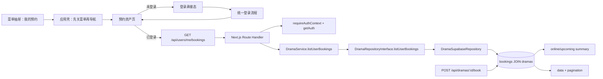

# 技术方案（共享部分）：PRD-11 个人资产管理

> 创建日期：2026-07-30
> 对应需求：spec.md

## 整体架构

本期“个人资产管理”共享方案围绕三条既有能力线收口：

1. **Backend 预约写能力**：当前已存在 `POST /api/dramas/:id/book`，并把预约写入 `bookings`；
2. **应用壳菜单承接能力**：Android 与 iOS 都已具备“先关菜单再导航”的菜单入口时序；
3. **认证拦截能力**：排行预约已具备“未登录先拦截，登录成功后回到业务页语义”的参考模式。

PRD-11 不引入新的一级频道，也不把资产页做成 H5。首版只新增一个受保护的预约资产读取接口 `GET /api/users/me/bookings`，并把移动端菜单中的“我的预约”从 placeholder 升级为真实 Native 页面；“我的下载”继续沿用现有 placeholder 承接。



### 方案总览

- Backend 新增 **1 个接口**：`GET /api/users/me/bookings`
- 不修改现有 `POST /api/dramas/:id/book` 的成功语义，也不新增取消预约接口
- 预约资产接口必须要求登录，继续沿用 canonical auth helper：`requireAuthContext()` + `getAuth(request)`
- 服务端在 repository / service 层新增“预约资产列表”读取 contract，而不是把逻辑散落在 route 内
- 服务端新增 `BookingAsset` / `BookingAssetList` / `BookingAssetSummary` 共享 schema，并复用现有 `PaginationSchema`
- `dramas.status` 只作为底层数据事实参与服务端归类：`announced -> upcoming`、`ongoing/completed -> online`
- 服务端返回统一结构 `{ data, pagination, summary }`，其中 `pagination` 继续使用 snake_case：`page / page_size / total / total_pages`
- Android 与 iOS 都必须把“我的预约”升级为**独立 booking route**，并作为登录成功后的 returnRoute
- “我的下载”继续保留独立占位页，不新增下载接口、不新增下载数据模型

## API 设计

### 涉及变更

| 类型 | 数量 | 说明 |
|------|------|------|
| 新增接口 | 1 | 新增当前登录用户预约资产列表接口 `GET /api/users/me/bookings` |
| 修改接口 | 0 | 不修改 `POST /api/dramas/:id/book`、排行列表、登录接口的既有 contract |
| 废弃接口 | 0 | 无 |

> 兼容性说明：当前 backend 成功响应对列表接口沿用资源体直出风格（如 `{ data, pagination }`），错误响应继续由 `withErrorHandler` 统一输出 `{ error: { code, message } }`，Zod 校验失败继续输出 `VALIDATION_ERROR + details`。PRD-11 不引入新的成功包裹层，只在列表响应中新增 `summary` 字段。

### 新增接口

#### `GET /api/users/me/bookings`

- **功能简介**：返回当前登录用户的预约资产分页列表，并同步返回双 Tab 所需的计数摘要
- **认证要求**：必须登录
- **Path Parameters**：无

- **Query Parameters**：

| 字段 | 类型 | 必填 | 默认值 | 说明 |
|------|------|------|--------|------|
| `status` | `online \| upcoming` | 否 | `online` | 当前请求的资产状态 Tab |
| `page` | number | 否 | `1` | 页码，`int >= 1` |
| `pageSize` | number | 否 | `20` | 每页数量，范围 `1~20` |

- **Request Body**：无

- **Response**：

```json
{
  "data": [
    {
      "drama_id": "550e8400-e29b-41d4-a716-446655440001",
      "title": "逆袭归来后我成了豪门团宠",
      "cover_url": "https://example.com/dramas/001.jpg",
      "episode_count": 68,
      "booked_at": "2026-07-30T03:25:00.000Z",
      "availability_status": "online"
    }
  ],
  "pagination": {
    "page": 1,
    "page_size": 20,
    "total": 8,
    "total_pages": 1
  },
  "summary": {
    "online_count": 8,
    "upcoming_count": 3
  }
}
```

| 字段 | 类型 | 说明 |
|------|------|------|
| `data` | `BookingAsset[]` | 当前 `status` 下的预约资产列表 |
| `data[].drama_id` | string | 列表稳定主键；首版不暴露 `booking.id` |
| `data[].title` | string | 剧名 |
| `data[].cover_url` | string \| null | 封面图 |
| `data[].episode_count` | number | 集数 |
| `data[].booked_at` | string | 服务端返回 ISO 8601 原值，客户端负责本地化展示 |
| `data[].availability_status` | `online \| upcoming` | 服务端归类后的资产状态 |
| `pagination.page` | number | 当前页码 |
| `pagination.page_size` | number | 每页数量，保持 snake_case |
| `pagination.total` | number | 当前状态总条数 |
| `pagination.total_pages` | number | 当前状态总页数 |
| `summary.online_count` | number | 当前用户有效 booking 中已上线数量 |
| `summary.upcoming_count` | number | 当前用户有效 booking 中待上线数量 |

- **Error Codes**：

| HTTP 状态码 | 错误码 | 说明 |
|-------------|--------|------|
| 200 | — | 成功；允许返回空列表 |
| 400 | `VALIDATION_ERROR` | `status/page/pageSize` 非法 |
| 401 | `AUTH_UNAUTHORIZED` / `UNAUTHORIZED` | 未登录或登录态失效 |
| 429 | `TOO_MANY_REQUESTS` / `AUTH_RATE_LIMITED` | 高频切换或频繁重试触发频控 |
| 500 | `INTERNAL_ERROR` | 服务端聚合或映射失败 |
| 503 | `SERVICE_UNAVAILABLE` | 数据源不可用 |

### 共享 Zod Schema 草案

```ts
const BookingAssetAvailabilityStatusSchema = z.enum(['online', 'upcoming']);

const BookingAssetQuerySchema = z.object({
  status: BookingAssetAvailabilityStatusSchema.default('online'),
  page: z.coerce.number().int().min(1).default(1),
  pageSize: z.coerce.number().int().min(1).max(20).default(20),
});

const BookingAssetSchema = z.object({
  drama_id: z.string().uuid(),
  title: z.string().min(1),
  cover_url: z.string().url().nullable().default(null),
  episode_count: z.number().int().min(0),
  booked_at: z.string(),
  availability_status: BookingAssetAvailabilityStatusSchema,
});

const BookingAssetSummarySchema = z.object({
  online_count: z.number().int().min(0),
  upcoming_count: z.number().int().min(0),
});

const BookingAssetListResponseSchema = z.object({
  data: z.array(BookingAssetSchema),
  pagination: PaginationSchema,
  summary: BookingAssetSummarySchema,
});
```

### 契约补充

- 请求 query 继续采用移动端现有习惯：`page/pageSize` 使用 camelCase；响应中的分页元信息固定保持 snake_case
- 列表默认排序固定为 `booked_at DESC`；同一秒内排序不稳定时，可用 `drama_id DESC` 作为次排序保证确定性
- `summary` 必须与当前 `data` 使用同一用户口径，并且只统计**可成功联查到 `dramas` 的有效 booking**
- 超大页码允许返回 `200 + data=[]`，但 `summary` 与 `pagination.total` 仍要正确
- 当前 PRD 不新增取消预约 / 编辑接口，因此资产页不依赖额外写操作 contract
- 当前 PRD 不为“我的下载”新增任何 API

## 数据模型

### 新增/变更数据表

| 表名 | 操作 | 说明 |
|------|------|------|
| `bookings` | 不变（逻辑复用） | 继续作为预约资产的主数据源 |
| `dramas` | 不变（读取扩展） | 继续提供标题、封面、集数，并在 repository 内额外读取底层 `status` 参与归类 |
| `BookingAsset*`（共享 schema） | 新增（应用层） | 为预约资产页定义跨端共享 contract |

> 本期不要求新增数据库表，也不要求修改现有 `bookings` migration。首版只新增读取 contract、服务端归类逻辑与响应 schema。

### 共享实体设计

| 实体 | 字段 | 说明 |
|------|------|------|
| `BookingAssetAvailabilityStatus` | `online / upcoming` | 预约资产归类状态 |
| `BookingAssetQuery` | `status / page / pageSize` | 预约资产页查询条件 |
| `BookingAsset` | `drama_id / title / cover_url / episode_count / booked_at / availability_status` | 单条预约资产 |
| `BookingAssetSummary` | `online_count / upcoming_count` | 双 Tab 计数摘要 |
| `BookingAssetListResponse` | `data[] / pagination / summary` | 列表响应 |

### 数据映射关系

| 来源字段 | 目标字段 | 说明 |
|---------|---------|------|
| `bookings.drama_id` | `BookingAsset.drama_id` | 列表稳定主键 |
| `bookings.created_at`（或业务定义的预约时间） | `BookingAsset.booked_at` | 用于排序和展示预约时间 |
| `dramas.title` | `BookingAsset.title` | 剧名 |
| `dramas.cover_url` | `BookingAsset.cover_url` | 封面 |
| `dramas.episode_count` | `BookingAsset.episode_count` | 集数 |
| `dramas.status=announced` | `availability_status=upcoming` | 待上线映射 |
| `dramas.status in (ongoing, completed)` | `availability_status=online` | 已上线映射 |

### 服务端读取策略

| 场景 | 数据来源 | 说明 |
|------|---------|------|
| 当前用户预约列表 | `bookings` JOIN `dramas` | 只读取当前用户记录 |
| `summary` 统计 | 同一用户有效 booking 记录 | 不依赖客户端本地聚合 |
| 历史脏 booking | JOIN 失败记录过滤 | 过滤后不进入列表，也不计入 `summary` |
| 未知 `dramas.status` | 服务端过滤并记录 warning | 不返回给客户端，也不计入 `summary`，避免跨端口径漂移 |

## 跨端共享逻辑

| 共享逻辑 | 说明 | 涉及端 |
|---------|------|--------|
| 菜单关闭后导航 | 点击“我的预约 / 我的下载”都先关闭菜单，再进入目标页 | iOS / Android |
| booking 独立 route | Android 与 iOS 都必须使用独立 booking route 承接资产页 | iOS / Android |
| 登录承接目标 | 匿名用户点击“我的预约”后进入 booking route 的登录承接态；登录成功后返回同一路由 | iOS / Android |
| 默认 Tab | 首次进入预约页默认请求 `status=online&page=1&pageSize=20` | Backend / iOS / Android |
| `summary` 口径 | 双端都只使用服务端返回的 `online_count / upcoming_count`，不在本地重算 | Backend / iOS / Android |
| 请求防乱序 | 快速切换 Tab 时，旧请求晚返回不得覆盖当前状态 | iOS / Android |
| 追加分页 | 仅当前 Tab 支持向后翻页；加载失败只影响当前 Tab，不清空已展示内容 | iOS / Android |
| 未授权恢复 | token 失效时，页面退回登录承接态，不展示旧用户资产 | Backend / iOS / Android |
| 下载占位延续 | “我的下载”继续使用占位页，不增加登录前置和数据请求 | iOS / Android |

### 状态机约定

```text
点击菜单“我的预约”
→ close menu
→ push booking route
→ 判断登录态

未登录：
loginGate
→ 点击登录
→ 统一登录流程
→ success 后回到 booking route
→ load(status=online, page=1)

已登录：
loading(first page)
→ content | empty | error

切换 Tab：
keep current route
→ request(status=online|upcoming, page=1)
→ content | empty | error(current tab only)

加载更多：
appending(next page)
→ append success | append error(keep existing items)
```

### 共享交互约束

| 场景 | 约束 |
|------|------|
| 匿名用户进入预约页 | 不直接请求受保护接口，先展示登录承接态 |
| 登录成功 | 不得跳回无关页面；必须继续停留在 booking route |
| 登录取消 | 留在 booking route 的登录承接态，允许返回首页 |
| Tab 一侧为空 | 不自动替用户切换到另一侧 |
| 首屏 400/429 | 展示友好失败提示，不暴露原始错误码 |
| App 后台恢复 | 允许保留当前列表快照，必要时首屏重拉，但不重复入栈 |

## 安全考虑

- **认证与授权**：
  - `GET /api/users/me/bookings` 必须要求登录，服务端只能读取 `getAuth(request).userId` 对应的预约资产
  - 不允许通过 query/path 指定任意用户 ID；资源路径固定为 `/users/me/`，避免越权读取

- **数据校验**：
  - 后端使用 Zod 校验 `status/page/pageSize`
  - 客户端只允许固定枚举 `online/upcoming` 进入请求层，不接受任意字符串
  - 服务端必须对 `dramas.status` 做受控映射，不把底层原值直接暴露给客户端

- **敏感数据处理**：
  - 列表响应只返回资产展示所需字段，不返回其它用户信息、不返回 booking 内部主键
  - 客户端不得硬编码 token、用户 ID 或环境地址

- **频控与滥用防护**：
  - 接口保留 429 频控能力；快速切换、反复重试应被视为可限流场景
  - 客户端需做 in-flight 去重 / 防连点，降低无意义重复请求

## 边界与错误处理（⚠️ 重点）

### 错误处理架构

- **全局错误处理策略**：继续沿用 backend `withErrorHandler`，业务错误抛 `AppError`，参数错误由 Zod 统一转成 `VALIDATION_ERROR`
- **错误响应格式**：继续沿用当前 backend 真实格式 `{ error: { code, message } }`
- **客户端处理原则**：
  - 首屏失败：进入整页错误态，可重试
  - 追加失败：保留已加载内容，仅展示局部失败提示
  - 未登录/登录态失效：切回登录承接态
  - 429：优先保留当前内容，并提示稍后再试

### API 错误码定义

| 业务错误码 | HTTP 状态码 | 说明 | 用户提示文案 |
|-----------|------------|------|-------------|
| `VALIDATION_ERROR` | 400 | `status/page/pageSize` 参数非法 | 加载失败，请重试 |
| `AUTH_UNAUTHORIZED` / `UNAUTHORIZED` | 401 | 未登录或登录态失效 | 请先登录后查看预约 |
| `NOT_FOUND` | 404 | 当前接口理论上不作为空列表使用；空列表仍返回 200 | — |
| `TOO_MANY_REQUESTS` / `AUTH_RATE_LIMITED` | 429 | 高频切换 / 重试触发频控 | 操作过于频繁，请稍后再试 |
| `INTERNAL_ERROR` | 500 | 服务端聚合、映射或 repository 异常 | 加载失败，请稍后重试 |
| `SERVICE_UNAVAILABLE` | 503 | 数据源不可用 | 服务暂不可用，请稍后重试 |

### 边界场景处理

| 场景 | 触发条件 | API 行为 | 说明 |
|------|---------|---------|------|
| 默认 Tab 无数据 | 用户没有任何已上线预约 | 返回 `200 + data=[] + summary` | 页面显示 `online` 空态，用户可手动切换到 `upcoming` |
| 另一侧有数据 | `online=0`、`upcoming>0` 等 | 当前状态仍按空态返回 | 不自动跳转 Tab，避免破坏用户预期 |
| 超大页码 | `page` 超过总页数 | 返回 `200 + data=[]`，保留正确分页元信息 | 对齐现有列表接口习惯 |
| 非法参数 | `status=foo`、`page=0`、`pageSize=999` | 返回 400 `VALIDATION_ERROR` | 客户端统一展示友好失败提示 |
| 高频切换 | 短时间内重复切换 Tab / 重试 | 允许返回 429 | 客户端保留当前内容，不清页 |
| 历史脏 booking | booking 无法联查到 drama | 服务端过滤记录 | `summary` 与列表同时过滤，避免计数不一致 |
| 登录态失效 | access token 失效 | 返回 401 | 页面回到登录承接态 |
| 旧请求晚返回 | 用户快速切换 `online/upcoming` | 客户端丢弃过期响应 | 避免串页 |
| 下载入口点击 | 用户点击“我的下载” | 不发起任何后端请求 | 继续进入 placeholder 页面 |

## 性能考虑

- **预期 QPS**：预约资产页是个人中心低频入口，单用户访问频率显著低于 Feed / 排行；首版按低到中等 QPS 设计即可
- **查询策略**：
  - 列表按 `user_id + availability_status + booked_at DESC` 的逻辑访问模式组织
  - `summary` 尽量与列表查询复用同一批有效 booking 数据，避免双份全量扫描
- **分页策略**：首版固定 `pageSize <= 20`，限制单次返回体积，减少移动端首屏负担
- **客户端状态复用**：
  - 切换 Tab 时仅刷新当前 Tab 数据
  - 追加分页失败不清空已加载列表
  - 登录成功后直接在当前 booking route 内刷新，不重复多次入栈
- **缓存策略**：首版不引入额外持久化缓存；页面级内存态即可。若后续要做离线资产缓存，应在独立 PRD 中扩展

## 参考资料

### 已查阅的 wiki 文档

| 文档 | 相关章节 | 关键信息 |
|------|---------|---------|
| `wiki/features/app-shell/index.md` | 功能概述、Android/iOS 承载、已知限制 | 菜单抽屉由应用壳统一承载，当前 booking/downloads 仍有部分 Native 占位 |
| `wiki/features/ranking/index.md` | 功能概述、预约与登录拦截、状态管理 | 当前已有 `POST /api/dramas/:id/book` 与登录拦截参考模式 |
| `wiki/api/dramas.md` | dramas 列表 / 搜索 / 剧场 / 排行接口 | 现有 backend 列表接口统一使用 `{ data, pagination }`，分页元信息为 snake_case |

### 已查阅的代码文件

| 文件 | 关键内容 |
|------|---------|
| `backend/src/app/api/dramas/[id]/book/route.ts` | 当前预约写接口已使用 `requireAuthContext()` + `getAuth(request)`，并直接走 `DramaSupabaseRepository` |
| `backend/src/app/api/dramas/rankings/route.ts` | 当前列表 query 解析与 route 组织方式，可作为新增列表接口参考 |
| `backend/src/services/drama/drama.service.ts` | 当前 service 已承载 dramas/rankings/book 等能力，PRD-11 可继续扩展同域 service |
| `backend/src/repositories/interfaces/drama.repository.interface.ts` | 当前 repository contract 只有预约写能力，没有用户预约列表读取契约 |
| `backend/src/repositories/supabase/drama.supabase.repository.ts` | 当前已接通 Supabase drama 读取与 booking 写入，适合扩展 bookings join 查询 |
| `backend/src/lib/schemas.ts` | 现有 `DramaSchema`、`PaginationSchema`、`RankingQuerySchema` 等共享 schema 基线 |
| `backend/src/middleware/auth.ts` | 现有 canonical auth helper，可直接复用到受保护列表接口 |
| `backend/src/middleware/error-handler.ts` | 当前 Zod/AppError 错误响应格式的真实基线 |
| `backend/src/lib/errors.ts` | 当前错误码与 HTTP 状态映射基线 |
| `android/app/src/main/java/com/djs66256/short_drama/navigation/AppDestination.kt` | Android 已具备 `menu/booking` 与 `menu/downloads` canonical route |
| `android/app/src/main/java/com/djs66256/short_drama/navigation/NavGraph.kt` | Android 当前 booking/downloads 仍通过 placeholder 承接，但路由骨架已存在 |
| `android/app/src/main/java/com/djs66256/short_drama/feature/ranking/viewmodel/RankingViewModel.kt` | Android 已有请求防乱序、分页追加、登录拦截 effect 模式可复用 |
| `android/app/src/main/java/com/djs66256/short_drama/data/dto/PaginationDto.kt` | Android 已明确按 `@SerialName` 处理 snake_case 分页字段 |
| `ios/ShortDrama/Sources/App/AppRoute.swift` | iOS 当前还没有真实 booking route，仅有 `menuPlaceholder` |
| `ios/ShortDrama/Sources/App/NavigationRouter.swift` | iOS 已有菜单关闭后导航与登录回流基础能力 |
| `ios/ShortDrama/Sources/Features/MenuPanel/Views/MenuPanelContainerView.swift` | iOS 当前 booking/downloads 入口仍指向 placeholder |
| `ios/ShortDrama/Sources/Features/Ranking/RankingRouteBuilder.swift` | iOS 当前登录回流 builder 只回 `.rankingHome`，PRD-11 需要新增 booking route 方案 |
| `ios/ShortDrama/Sources/Features/Ranking/ViewModels/RankingViewModel.swift` | iOS 已有请求 token 防乱序与登录 routeEffect 模式可复用 |
| `ios/ShortDrama/Sources/Data/DTOs/PaginationDTO.swift` | iOS 当前分页 DTO 为 camelCase 属性，依赖 snake_case JSON 解码映射 |
| `ios/ShortDrama/Sources/Data/DataSources/DramaRemoteDataSource.swift` | iOS 现有 dramas/rankings endpoint 组织方式，可扩展 booking assets endpoint |
| `docs/specs/2026-07-30-prd-11-user-assets/spec.md` | 本期需求范围、交互约束、错误场景与 API 定稿 |
| `docs/specs/2026-07-30-prd-11-user-assets/spec-review.md` | 本期 spec review 对 `dramas.status`、分页命名、回流与 summary 口径的定稿要求 |

