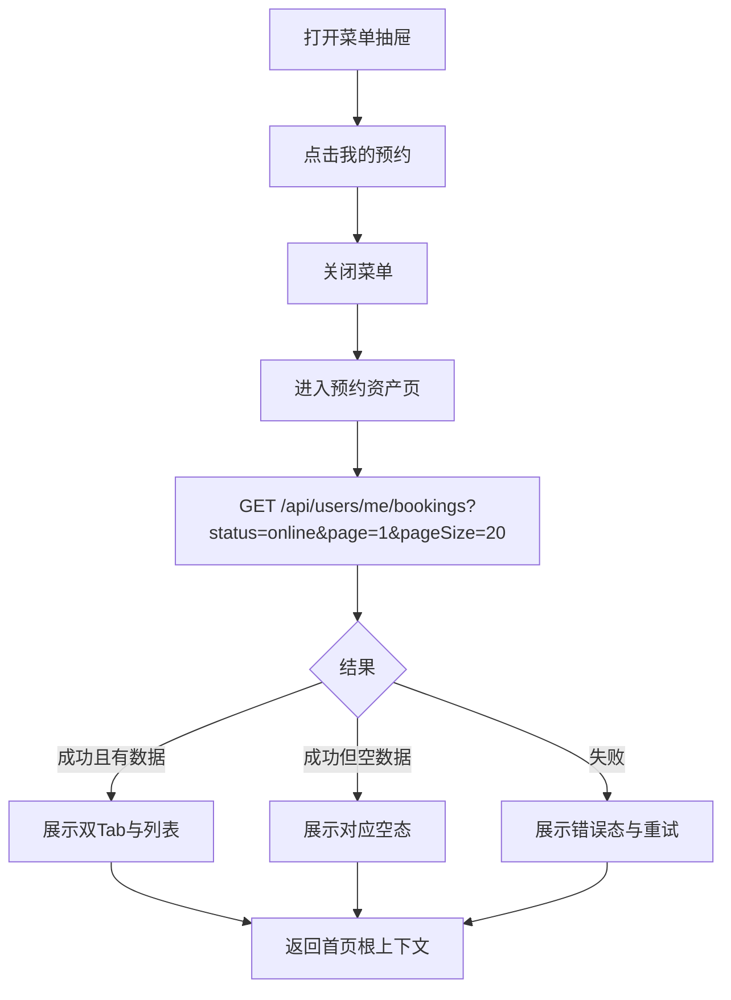
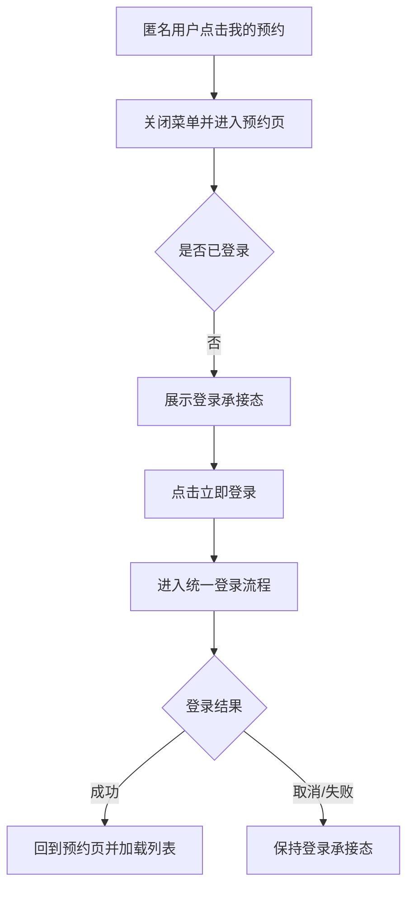
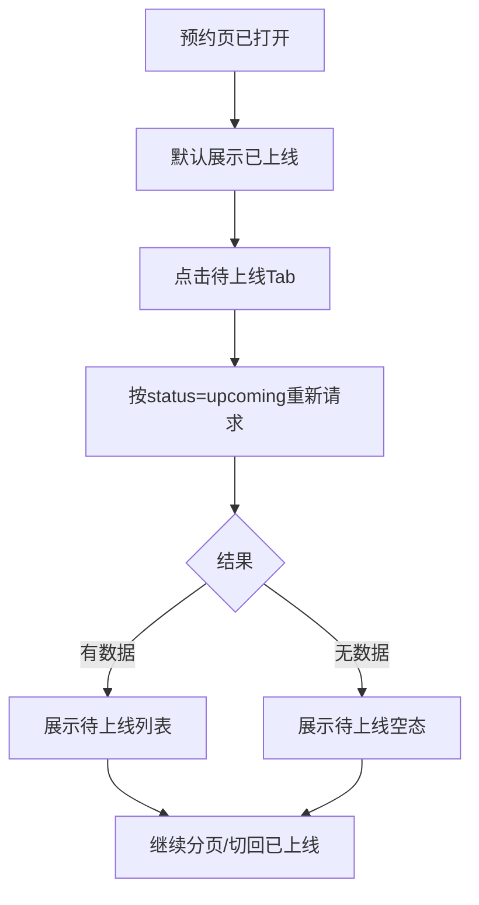
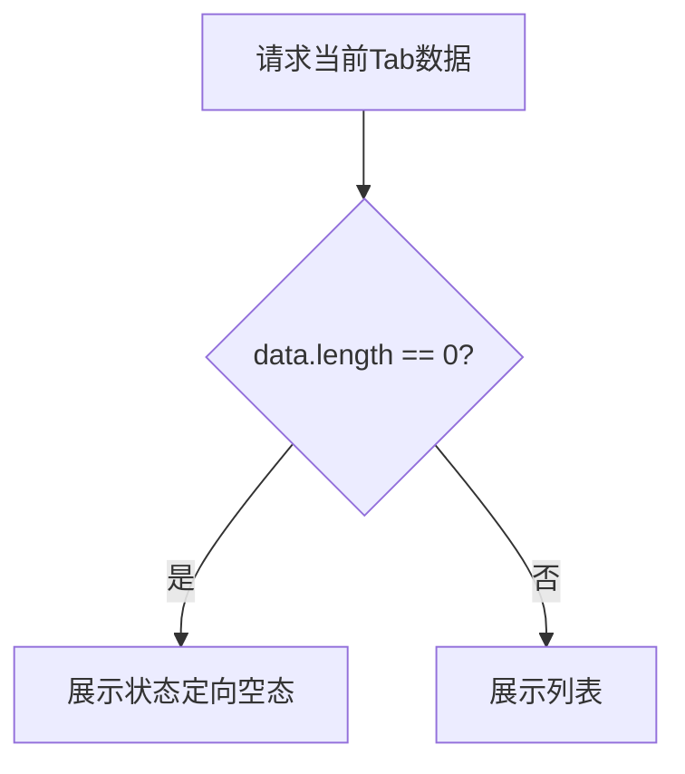
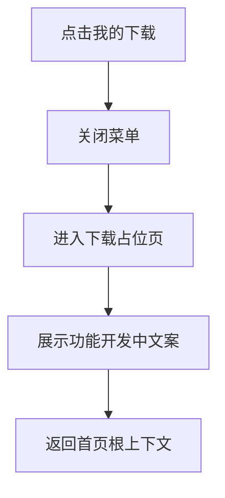

# 需求文档：PRD-11 个人资产管理

> 创建日期：2026-07-30
> 状态：草稿
> 作者：AI Agent + daniel

---

## 1. 需求背景

### 1.1 问题描述

- **现状**：当前仓库已经具备“预约”写入能力，但只停留在排行页内的单点动作。Backend 已有 `bookings` 表与 `POST /api/dramas/:id/book` 预约接口；Android 与 iOS 的菜单抽屉里也都已经放入“我的预约”“我的下载”两个常用功能入口，但它们仍然只是占位承接页，用户无法查看自己已经预约的内容资产，也无法区分哪些内容已经上线、哪些仍待上线。
- **痛点**：
  1. 用户在排行页或其它入口完成预约后，没有统一的“个人资产”承接页回看自己的预约结果，预约动作缺少闭环；
  2. 菜单中的“我的预约”“我的下载”虽然已经占位，但没有真实资产语义，PRD-07 菜单面板与 PRD-05 预约能力、PRD-08 登录能力之间仍缺少串联；
  3. 当前预约数据已经按账号写入后端，但没有任何列表能力复用 `bookings` 数据，用户无法感知“我已订阅 / 我待追更”的内容集合；
  4. “我的下载”尚未进入真实离线能力开发阶段，但入口已经存在，需要收口成明确、稳定的占位策略，而不是继续保留模糊承接页。

### 1.2 预期目标

- **目标**：在 Backend、iOS、Android 上补齐首版“个人资产管理”闭环：
  - 菜单中的“我的预约”从占位入口升级为真实资产页；
  - 已登录用户可以查看自己的预约列表，并按“已上线 / 待上线”切换；
  - 未登录用户进入“我的预约”时可以看到明确登录承接，并在登录成功后停留在预约页上下文；
  - “我的下载”继续保留为占位能力，但占位文案和承接路径收口为统一策略；
  - 全链路复用现有登录体系、菜单关闭后导航、排行预约写入结果与 RESTful API 约束，不引入 Web 端范围。
- **成功指标**（可度量）：
  - 已登录用户从菜单进入“我的预约”后，1 次导航内可打开资产页并看到列表、空态或错误态；
  - 预约页双 Tab 能稳定区分“已上线 / 待上线”，且标签计数与当前用户的真实预约集合一致；
  - 匿名用户进入预约页时，100% 看到明确登录承接；登录成功后可回到预约页并自动加载列表；
  - 预约列表接口遵循统一列表 contract：请求使用 `page/pageSize`，响应 `pagination` 固定返回 `page / page_size / total / total_pages`，并额外返回 Tab 所需 `summary` 摘要；客户端按各端 DTO 自行完成字段映射；
  - “我的下载”入口在两端都呈现一致的占位语义，不误导为已可用的下载资产功能。

### 1.3 范围定义

| 范围内 | 范围外（明确不做） | 原因 |
|--------|------------------|------|
| 菜单“我的预约”真实承接页 | 离线下载、缓存管理、下载任务状态 | 下载能力尚未进入实现阶段 |
| 登录后可见的预约资产列表 | Web 用户端资产页 | 当前产品范围仍为 Native 优先 |
| “已上线 / 待上线”双 Tab、分页、空态、错误态 | 批量编辑、批量删除、拖拽排序 | 首版优先完成资产可见性与状态切换 |
| 匿名态登录承接与登录后回到预约页 | 预约提醒 Push、短信 / 站外通知 | 不在本 PRD 首版范围 |
| “我的下载”占位策略收口 | 下载页真实内容、下载列表、播放离线包 | 依赖后续独立 PRD |
| 预约资产状态服务端归类 | 新增一套内容发布时间后台 | 首版新增 backend 读取与归类能力，基于底层 `dramas.status` 字段推导上线状态 |

> 首版定稿：**本轮不实现“编辑 / 取消预约”能力**。现有后端只有单向预约写接口，PRD-11 首版聚焦“资产列表可见 + 登录承接 + 占位策略统一”，编辑管理留待后续迭代。
>
> 额外定稿：`dramas.status` 当前仅存在于数据库底层事实中，还不是现成的列表 contract。PRD-11 需要在 backend 新增读取字段、服务端归类与响应 schema，不能视为“零成本复用”。

---

## 2. 术语表

| 术语 | 定义 | 来源 |
|------|------|------|
| 个人资产管理 | 指当前用户在内容消费链路中可再次访问、可被统一管理的私有内容集合；本期仅包含“我的预约”与“我的下载”入口策略 | 本文档新定义 |
| 预约资产页 | 从菜单“我的预约”进入的独立页面，用于展示当前账号的预约内容列表 | 本文档新定义 |
| 已上线 | 服务端根据内容状态判定为已可消费的预约内容；首版需要在 backend 新增读取与归类能力，把底层 `dramas.status in ('ongoing', 'completed')` 映射为 `online` | 本文档新定义 |
| 待上线 | 服务端根据内容状态判定为尚未上线的预约内容；首版需要在 backend 新增读取与归类能力，把底层 `dramas.status = 'announced'` 映射为 `upcoming` | 本文档新定义 |
| 菜单关闭后导航 | 首页菜单中的功能入口点击后，先关闭抽屉 / overlay，再进入目标页面；返回时回到首页根上下文且菜单保持关闭 | wiki / 现有代码 |
| 登录承接上下文 | 匿名用户在受保护页面点击登录后，登录成功仍回到原页面，而不是丢失来源上下文 | wiki / 现有代码 |
| 我的下载占位页 | 对尚未实现的下载能力做统一的功能开发中承接，不提供真实资产数据 | 本文档新定义 |

---

## 3. 涉及平台

| 平台 | 是否涉及 | 变更概要 |
|------|---------|---------|
| Backend | ✅ 涉及 | 新增“当前用户预约列表”查询接口、预约资产数据模型、上线状态归类与测试 |
| Web | ❌ 不涉及 | Web 用户端不实现个人资产管理页面 |
| iOS | ✅ 涉及 | 将“我的预约”从 menu placeholder 升级为真实页面，接通登录承接、Tab 切换、列表 / 空态 / 错误态；统一“我的下载”占位文案 |
| Android | ✅ 涉及 | 将 `menu/booking` 从 placeholder 升级为真实页面，接通登录承接、Tab 切换、列表 / 空态 / 错误态；统一 `menu/downloads` 占位文案 |

---

## 4. 用户故事

| 编号 | 角色 | 需求 | 验收标准 | 涉及平台 | 优先级 |
|------|------|------|---------|---------|--------|
| US-01 | 已登录用户 | 从菜单进入我的预约并查看资产列表 | 进入页面后可看到“已上线 / 待上线”双 Tab、列表或空态 | Backend/iOS/Android | P0 |
| US-02 | 匿名用户 | 进入我的预约时被引导登录 | 页面展示明确登录承接；登录成功后仍停留在预约页并自动加载资产 | iOS/Android | P0 |
| US-03 | 已登录用户 | 按资产状态切换预约内容 | 切换 Tab 后列表更新，标签计数稳定，分页语义不混乱 | Backend/iOS/Android | P0 |
| US-04 | 已登录用户 | 在无预约内容时理解当前状态 | 空态根据当前 Tab 呈现差异化文案，不出现空白页或报错页误导 | Backend/iOS/Android | P1 |
| US-05 | 所有用户 | 从菜单进入我的下载时看到统一占位策略 | “我的下载”不再误导为真实功能，两端占位文案与返回语义一致 | iOS/Android | P1 |

---

## 5. 功能详述

### 5.1 US-01：已登录用户查看我的预约资产列表

#### 流程描述

1. 已登录用户打开首页菜单面板。
2. 点击“我的预约”入口。
3. 应用壳沿用现有语义：先关闭菜单，再进入预约资产页。
4. 预约页首屏按默认 Tab `online` 发起列表请求，并在同次响应中拿到 `online/upcoming` 两个状态的计数摘要。
5. Backend 基于当前用户在 `bookings` 表中的预约记录，联查 `dramas` 内容信息，按最新预约时间倒序返回首屏数据。
6. 页面展示导航栏标题“我的预约”、双 Tab（`已上线(N)` / `待上线(N)`）以及当前 Tab 的资产卡片列表。
7. 点击返回后，回到首页根上下文，菜单保持关闭，不自动重开抽屉。



#### 前置条件

- [ ] 用户已登录并持有有效会话
- [ ] 用户能从首页菜单面板进入个人工具入口
- [ ] `bookings` 表与内容主表存在可查询的关联数据

#### 后置条件

- 当前用户的预约资产可被浏览；
- Tab 计数与列表数据来自同一服务端口径；
- 返回后仍处于首页上下文，菜单不自动重开；
- 页面本身不改变已有排行预约写接口语义。

#### 涉及的 UI/交互（如有）

| 页面 / 区域 | 交互描述 | 涉及端 |
|------------|---------|--------|
| 菜单抽屉“我的预约”入口 | 点击后关闭菜单并进入预约资产页 | iOS / Android |
| 预约资产页导航栏 | 显示标题“我的预约”和返回按钮 | iOS / Android |
| 顶部状态 Tab | 显示 `已上线(N)` / `待上线(N)`，点击可切换 | iOS / Android |
| 资产列表项 | 展示封面、标题、集数、预约时间、状态标签 | iOS / Android |

#### 边界与异常

**错误处理：**

| 操作步骤 | 错误类型 | 触发条件 | 系统行为 | 用户感知 |
|---------|---------|---------|---------|---------|
| 首屏加载列表 | 网络异常 | 超时 / 断网 | 展示可重试错误态，不白屏 | 看到“加载失败，请重试” |
| 首屏加载列表 | 服务端错误 | 500 / 502 / 503 | 展示错误态，保留返回能力 | 看到失败提示与重试按钮 |
| 首屏加载列表 | 未授权 | token 失效 / 缺失 | 退回登录承接态 | 看到登录引导而非脏数据 |
| 列表解析 | 数据结构异常 | 响应字段不合法 | 视为加载失败 | 可重试，不崩溃 |
| 返回首页 | 导航状态异常 | 菜单关闭后路径处理错误 | 必须回到首页根上下文 | 用户不会卡在空栈 |

**边界场景：**

| 场景 | 触发条件 | 预期行为 |
|------|---------|---------|
| 用户无任何预约 | 两个状态都为 0 | 默认 Tab 显示空态，另一 Tab 仍可切换 |
| 仅有待上线预约 | `online=0`、`upcoming>0` | 默认 `已上线` 空态，切到 `待上线` 可见列表 |
| 仅有已上线预约 | `online>0`、`upcoming=0` | 默认看到列表，`待上线` 显示空态 |
| 记录很多 | 单用户预约数 > 20 | 使用分页加载，不一次拉全量 |
| 历史脏 booking | 极少数历史数据无法成功联查 `dramas` | 服务端过滤无效 booking；列表与 `summary` 统计都只基于可成功联查到剧集的有效记录，避免标签计数与列表不一致 |
| App 后台恢复 | 页面停留在预约页后切后台再回来 | 允许保留当前列表；必要时重新拉首屏，不重复入栈 |

### 5.2 US-02：匿名用户进入我的预约时被引导登录

#### 流程描述

1. 匿名用户从菜单点击“我的预约”。
2. 应用仍先关闭菜单，再进入预约资产页，而不是停留在抽屉内。
3. 页面发现当前无登录态，不直接请求受保护列表接口，而是展示登录承接态。
4. 用户点击“立即登录”后，复用现有统一登录能力。
5. 登录成功后回到预约资产页本身，并自动发起首屏列表加载。
6. 若用户取消登录，则继续停留在预约页登录承接态。



#### 前置条件

- [ ] 菜单入口可达
- [ ] 现有认证体系已可支持登录后返回来源页
- [ ] 预约页支持在匿名态下展示登录承接 UI

#### 后置条件

- 匿名用户不会直接命中 401 白屏或空白列表；
- 登录成功后停留在预约页上下文，不丢失来源；
- 取消登录后页面仍可返回首页。

#### 涉及的 UI/交互（如有）

| 页面 / 区域 | 交互描述 | 涉及端 |
|------------|---------|--------|
| 预约页登录承接态 | 展示说明文案、插画 / 占位与登录按钮 | iOS / Android |
| 登录按钮 | 进入统一登录承接；Android 与 iOS 首版登录成功后都直接回到独立 booking route，保证继续停留在预约页上下文 | iOS / Android |

#### 边界与异常

**错误处理：**

| 操作步骤 | 错误类型 | 触发条件 | 系统行为 | 用户感知 |
|---------|---------|---------|---------|---------|
| 打开预约页 | 会话状态未知 | 启动恢复中 | 先显示 loading，再决定是列表还是登录态 | 不闪烁错误态 |
| 登录承接 | 登录失败 | OTP/网络失败 | 复用 PRD-08 既有错误提示 | 用户看到登录失败信息 |
| 登录后回流 | 回流目标丢失 | returnRoute 写错 | Android 与 iOS 都必须优先回到独立 booking route，不得回到无关页面 | 用户不会被带到与预约无关的页面 |
| 首屏列表请求 | 参数校验失败 | `status` 非法、`page/pageSize` 越界 | 服务端返回 400 校验错误；客户端展示通用加载失败提示并回退到可重试状态，不展示原始错误码 | 用户看到友好错误提示，可重新进入或重试 |
| 首屏列表请求 | 频控限制 | 高频切换 Tab、频繁重试导致 429 | 客户端提示“操作过于频繁，请稍后再试”，保留当前页面与返回能力 | 用户知道需稍后重试，而不是误以为页面坏掉 |

**边界场景：**

| 场景 | 触发条件 | 预期行为 |
|------|---------|---------|
| 匿名进入后直接返回 | 不点击登录 | 正常回到首页根上下文 |
| 登录成功但暂无预约 | 首次登录用户无资产 | 直接展示空态，不继续停留在登录承接页 |
| 登录态失效 | 预约页停留期间 token 过期 | 退回登录承接态或触发恢复逻辑，不能展示旧用户资产 |

### 5.3 US-03：已登录用户按状态切换预约内容

#### 流程描述

1. 用户进入预约资产页后，默认选中 `已上线` Tab。
2. 页面读取服务端返回的计数摘要，展示 `已上线(N)` 与 `待上线(N)`。
3. 用户点击另一状态 Tab 时，页面按新的 `status` 条件发起请求。
4. 服务端继续返回该状态下的分页列表，并复用同一组计数摘要。
5. 页面更新当前 Tab 列表、分页状态与空态，不重置导航或登录上下文。



#### 前置条件

- [ ] 用户已登录
- [ ] 后端接口支持 `status` 过滤与分页
- [ ] 页面能维护当前选中状态与分页状态

#### 后置条件

- 状态切换不会污染另一个 Tab 的列表语义；
- Tab 计数在整个页面生命周期内保持同一统计口径；
- 当前 Tab 的空态 / 错误态与另一 Tab 解耦。

#### 涉及的 UI/交互（如有）

| 页面 / 区域 | 交互描述 | 涉及端 |
|------------|---------|--------|
| 顶部状态 Tab | 点击切换 `online/upcoming` | iOS / Android |
| 列表分页加载 | 滚动到底部时加载下一页 | iOS / Android |
| 空态 / 错误态 | 根据当前 Tab 定向展示 | iOS / Android |

#### 边界与异常

**错误处理：**

| 操作步骤 | 错误类型 | 触发条件 | 系统行为 | 用户感知 |
|---------|---------|---------|---------|---------|
| 切换 Tab | 网络异常 | 新 Tab 请求失败 | 只影响当前 Tab，已显示的另一 Tab 不丢失 | 当前 Tab 显示错误态 |
| 切换 Tab | 参数校验失败 | 客户端状态异常导致非法 `status/page/pageSize` | 回退到当前 Tab 的可重试错误态，并记录为客户端/contract 异常 | 用户看到通用失败提示，不暴露技术细节 |
| 切换 Tab | 频控限制 | 高频点击导致 429 | 保留当前已展示内容或壳页，提示稍后再试 | 用户知道是频率受限，不误判为无数据 |
| 加载更多 | 追加失败 | 下一页请求异常 | 保留已加载内容，展示局部重试入口 | 列表不被整页清空 |
| 切换过快 | 旧请求晚返回 | 连续快速切换 | 仅消费最后一次有效请求结果 | 列表不串页 |

**边界场景：**

| 场景 | 触发条件 | 预期行为 |
|------|---------|---------|
| 两个 Tab 计数都为 0 | 无任何预约 | 两个标签都显示 0，默认空态可见 |
| 当前 Tab 没数据、另一 Tab 有数据 | 单侧为空 | 不自动帮用户跳 Tab，由用户自己切换 |
| 最后一页不足 pageSize | 尾页数据不足 | 正常结束分页，不继续请求 |
| 状态归类变化 | 某内容从待上线变为已上线 | 下次刷新后应落入新状态 Tab |

### 5.4 US-04：空态表达当前资产状态

#### 流程描述

1. 用户进入预约页或切换 Tab。
2. 当前 Tab 返回空列表。
3. 页面根据当前状态展示对应空态：
   - `已上线`：强调“暂无已上线预约”；
   - `待上线`：强调“暂无待上线预约”。
4. 空态继续保留 Tab 切换、返回能力和必要引导文案。



#### 前置条件

- [ ] 页面已拿到合法空列表响应
- [ ] 当前 Tab 状态明确

#### 后置条件

- 空数据不再被误识别为错误态；
- 空态与登录承接态、错误态三者边界清晰；
- 用户仍可切换 Tab 或返回首页。

#### 涉及的 UI/交互（如有）

| 页面 / 区域 | 交互描述 | 涉及端 |
|------------|---------|--------|
| 空态插画 / 占位区 | 展示状态化文案与补充说明 | iOS / Android |
| 状态 Tab | 空态下仍可切换 | iOS / Android |

#### 边界与异常

**错误处理：**

| 操作步骤 | 错误类型 | 触发条件 | 系统行为 | 用户感知 |
|---------|---------|---------|---------|---------|
| 空态渲染 | 文案缺失 | 本地配置错误 | 降级展示通用空态文案 | 页面仍可用 |

**边界场景：**

| 场景 | 触发条件 | 预期行为 |
|------|---------|---------|
| 用户刚完成首次登录 | 当前无预约 | 直接展示默认 Tab 空态 |
| 某个状态首次为空 | 切换后返回空 | 不展示错误 toast |

### 5.5 US-05：我的下载保持统一占位策略

#### 流程描述

1. 用户在菜单点击“我的下载”。
2. 应用沿用当前菜单关闭后导航机制。
3. 进入统一占位承接页，明确说明下载能力尚在开发中。
4. 用户返回后回到首页根上下文，菜单保持关闭。



#### 前置条件

- [ ] 菜单常用功能区域存在“我的下载”入口
- [ ] 两端已有 placeholder 承接能力

#### 后置条件

- 下载入口语义清晰，不再被误认为真实资产页；
- 返回语义与其它菜单页面保持一致；
- 不新增下载数据请求。

#### 涉及的 UI/交互（如有）

| 页面 / 区域 | 交互描述 | 涉及端 |
|------------|---------|--------|
| 菜单“我的下载”入口 | 点击进入占位页 | iOS / Android |
| 下载占位页 | 标题、图标、功能开发中说明 | iOS / Android |

#### 边界与异常

**错误处理：**

| 操作步骤 | 错误类型 | 触发条件 | 系统行为 | 用户感知 |
|---------|---------|---------|---------|---------|
| 打开下载占位页 | 导航异常 | 路由缺失 | 降级停留首页并提示 | 不进入无效空页 |

**边界场景：**

| 场景 | 触发条件 | 预期行为 |
|------|---------|---------|
| 匿名用户点击下载 | 无登录态 | 仍允许进入占位页，因为当前不涉及私有真实数据 |
| 从占位页返回 | 用户完成查看后返回 | 回到首页根上下文，菜单保持关闭 |

---

## 6. 数据概览

| 数据实体 | 说明 | 关键字段 | 来源 |
|---------|------|---------|------|
| BookingAsset | 预约资产页单条内容 | `drama_id`（列表稳定主键）、`title`、`cover_url`、`episode_count`、`booked_at`（服务端返回 ISO 8601，客户端负责本地化展示）、`availability_status` | 服务端聚合生成 |
| BookingAssetList | 当前状态 Tab 下的预约资产分页列表 | `data[]`、`pagination`、`summary` | 服务端生成 |
| BookingAssetSummary | 双 Tab 计数摘要 | `online_count`、`upcoming_count`；仅统计可成功联查 `dramas` 的有效 booking 记录 | 服务端生成 |
| BookingAssetStatus | 预约资产归类状态 | `online`、`upcoming` | 本文档新定义 |
| BookingSubject | 预约资产所属主体 | 当前登录用户 `userId` | 认证上下文 |

### 数据关系

```text
[auth.users user] ──1:N──▶ [bookings]
                         │
                         └──N:1──▶ [dramas]

[dramas.status] ──服务端归类──▶ [BookingAssetStatus: online | upcoming]
```

### 首版 API 约束（定稿）

> 本节用于收敛 spec 阶段的 contract 边界；具体 schema 命名在 design 阶段展开，但资源路径与鉴权口径不再开放。

| 接口 | 认证 | 关键输入 | 响应约束 |
|------|------|---------|---------|
| `GET /api/users/me/bookings` | 必须登录 | `status=online|upcoming`（可选，默认 `online`）、`page>=1`、`1<=pageSize<=20` | 返回 `{ data, pagination, summary }`；其中 `pagination` 固定使用 `page / page_size / total / total_pages`，`summary` 至少包含 `online_count` 与 `upcoming_count` |

补充约束：
- 列表默认按 `booked_at DESC` 排序；
- `summary` 与当前页数据必须来自同一用户口径，且只统计可成功联查 `dramas` 的有效 booking；
- `availability_status` 的首版归类规则固定为：服务端新增读取与归类逻辑，把底层 `dramas.status` 中的 `announced -> upcoming`、`ongoing/completed -> online`；
- `BookingAsset` 首版以 `drama_id` 作为列表稳定主键，不额外暴露 `booking.id` 给客户端；
- `booked_at` 由服务端返回 ISO 8601 原值，客户端负责本地化显示；
- 非法 `status/page/pageSize` 必须返回 400 校验错误；
- 高频切换、频繁重试等触发频控时允许返回 429；
- 空列表必须返回 `200 + data: []`，而不是 `404`；
- 当前 PRD 不新增取消预约接口。

---

## 7. 现有功能影响

| 现有功能 | 影响类型 | 说明 | 是否需要迁移 |
|---------|---------|------|------------|
| 排行体系 | 新增关联 | 排行页已有预约写接口，PRD-11 复用其写入结果形成资产读取闭环 | 否 |
| 菜单面板 | 修改行为 | “我的预约”从 placeholder 升级为真实页面；“我的下载”保留占位但统一文案 | 否 |
| 认证体系 | 新增关联 | 匿名进入预约页要展示登录承接，登录成功后回到预约页 | 否 |
| 应用壳 / 路由 | 修改行为 | 仍沿用“先关菜单再导航”，新增真实 booking 页面承接 | 否 |
| Backend drama 数据 | 新增关联 | 需要从 `bookings` 联查 `dramas` 并推导上线状态 | 否 |

### 兼容性说明

- 本需求不需要迁移已有预约写数据；
- `bookings` 仍沿用现有排行预约写路径产生的数据，PRD-11 只新增读取视角；
- 现有“我的下载”入口继续存在，但只收口占位语义，不影响后续真实下载 PRD；
- 返回路径继续保持首页根上下文 + 菜单关闭，不引入“返回自动重开菜单”的新壳层行为。

---

## 8. 非功能性需求

### 8.1 性能

| 指标 | 目标值 | 测量方式 |
|------|--------|---------|
| 预约页首屏接口 | P95 < 800ms（本地开发 / mock 口径可放宽，但不应阻塞页面结构展示） | 自动化测试 + 手工验证 |
| 预约页首屏可见时间 | 进入页面后 1 次请求内可见列表 / 空态 / 登录态 | QA 记录 |
| 分页加载 | 单次追加只加载下一页，不重复请求已完成页 | 单元测试 + 手工验证 |
| Tab 切换稳定性 | 连续切换不出现旧请求覆盖新状态 | ViewModel / state 测试 |

### 8.2 安全

| 关注点 | 要求 |
|--------|------|
| 认证与授权 | 预约资产列表必须要求登录，严格按当前认证上下文读取当前用户资产 |
| 数据校验 | 服务端校验 `status/page/pageSize`；客户端校验 Tab 枚举与分页边界 |
| 敏感数据 | 不返回其它用户预约数据，不在客户端硬编码 token 或用户标识 |
| 防滥用 | 列表接口保留分页与限流空间；不允许通过篡改 query 读取其它主体资产 |

### 8.3 兼容性

| 维度 | 要求 |
|------|------|
| 设备兼容 | 延续当前 Android / iOS 最低支持策略，不引入新的第三方依赖 |
| 数据兼容 | 旧客户端不接入预约页时，不影响原有排行预约写接口 |
| 向后兼容 | 新增接口不破坏现有 `/api/dramas/:id/book` contract；“我的下载”入口继续可达 |

---

## 9. 依赖

| 依赖项 | 类型 | 说明 | 状态 | 阻塞 |
|--------|------|------|------|------|
| PRD-05 排行体系 | 内部能力 | 当前已有预约写接口与 `bookings` 数据来源 | ✅ 已就绪 | 否 |
| PRD-07 菜单面板 | 内部能力 | “我的预约 / 我的下载”入口与关闭后导航机制来自菜单面板 | ✅ 已就绪 | 否 |
| PRD-08 认证体系 | 内部能力 | 预约页匿名登录承接与登录后回流依赖现有登录能力 | ✅ 已就绪 | 否 |
| Backend `bookings` 表 | 内部能力 | 预约资产列表的数据主来源 | ✅ 已就绪 | 否 |
| 下载真实能力 | 内部能力 | 仅影响未来迭代；当前只做占位 | 📅 规划中 | 否 |

---

## 10. 待澄清问题

当前无阻塞待澄清问题。本轮已定稿以下关键决策：

- 预约资产列表接口路径统一采用 `GET /api/users/me/bookings`，不沿用产品草稿中的 `GET /api/user/bookings`；
- 预约页默认展示 `已上线` Tab，并通过同次响应返回两个状态的计数摘要；
- Android 与 iOS 的匿名用户登录成功后，都恢复到独立 booking route，保持预约页上下文；
- 返回路径固定为“首页根上下文 + 菜单关闭”，不恢复打开的菜单抽屉；
- 首版不实现“编辑 / 取消预约”能力；
- `我的下载` 继续保留独立占位承接页，而不是 Toast 或真实下载列表；
- 上线状态由后端新增读取与归类逻辑，依据底层 `dramas.status` 推导：`announced -> upcoming`，`ongoing/completed -> online`；
- 分页响应继续沿用现有 backend contract：`page / page_size / total / total_pages`。

---

## 11. 参考资料

### 已查阅的 wiki 文档

| 文档 | 相关章节 | 关键信息 |
|------|---------|---------|
| `wiki/features/app-shell/index.md` | 功能概述、入口与路由、依赖关系 | 菜单功能入口已存在，且全局遵循“先关菜单再导航” |
| `wiki/features/auth/index.md` | 功能概述、流程：业务接口鉴权 | 个人资产页可复用现有登录承接与登录后返回语义 |
| `wiki/features/ranking/index.md` | 功能概述、流程：预约榜中的预约与登录拦截 | 当前预约写能力已存在，`bookings` 可作为 PRD-11 的资产来源 |
| `wiki/architecture/overview.md` | 当前首页与账号承载结构 | 当前系统已有菜单、登录、排行与预约基础能力，可支撑资产页闭环 |

### 已查阅的代码文件

| 文件 | 关键内容 |
|------|---------|
| `backend/src/app/api/dramas/[id]/book/route.ts` | 当前预约写接口已要求登录，并把写入落到 `DramaSupabaseRepository` |
| `backend/src/services/drama/drama.service.ts` | 已有 `bookDrama()` 服务层，可作为新增预约列表接口的同域服务基础 |
| `backend/src/repositories/interfaces/drama.repository.interface.ts` | 当前仓储接口已含预约写能力，但还没有预约资产列表读取契约 |
| `backend/src/repositories/supabase/drama.supabase.repository.ts` | 已接通 `dramas` Supabase 读取与预约写入模式，可扩展联查 `bookings` |
| `backend/supabase/migrations/20260727000100_add_ranking_fields_and_bookings.sql` | 已存在 `bookings` 表，可直接作为资产列表数据源 |
| `backend/src/lib/schemas.ts` | 当前已有分页 schema 与预约响应 schema，可复用列表 contract 设计 |
| `android/app/src/main/java/com/djs66256/short_drama/feature/menu/model/MenuPanelStaticEntries.kt` | Android 菜单已存在“我的预约 / 我的下载”静态入口 |
| `android/app/src/main/java/com/djs66256/short_drama/navigation/AppDestination.kt` | Android 已定义 `menu/booking` 与 `menu/downloads` 路由 |
| `android/app/src/main/java/com/djs66256/short_drama/navigation/NavGraph.kt` | Android 当前 booking/downloads 仍是 placeholder 承接，可替换为真实 booking 页面 |
| `android/app/src/main/java/com/djs66256/short_drama/feature/common/ui/PlaceholderScreen.kt` | Android 已有通用占位页，可继续承接“我的下载” |
| `android/app/src/main/java/com/djs66256/short_drama/feature/ranking/ui/RankingScreen.kt` | Android 已有 Tab、分页、列表与局部 loading/error 模式可复用 |
| `ios/ShortDrama/Sources/Domain/Entities/MenuPlaceholderKind.swift` | iOS 当前把 booking/downloads 都定义为菜单占位类型 |
| `ios/ShortDrama/Sources/Features/MenuPanel/Views/MenuPanelContainerView.swift` | iOS 菜单点击 booking/downloads 仍导航到 placeholder |
| `ios/ShortDrama/Sources/App/AppRoute.swift` | iOS 当前通过 `menuPlaceholder` 承接菜单页面，可替换其中的 booking 路由 |
| `ios/ShortDrama/Sources/App/NavigationRouter.swift` | iOS 已有菜单关闭后导航与登录回流模式，可复用到预约页 |
| `ios/ShortDrama/Sources/Features/MenuPanel/Views/MenuPlaceholderView.swift` | iOS 已有通用占位页，可继续承接“我的下载” |
| `ios/ShortDrama/Sources/Features/Ranking/Views/RankingHomeView.swift` | iOS 已有 Tab 与状态页组织模式，可参考预约资产页结构 |
| `docs/product_manager/prd/2026-07-25-user-assets/prd.md` | 原始产品草稿定义了“我的预约 / 我的下载”方向 |
| `docs/product_manager/prd/2026-07-25-user-assets/subtasks.md` | 原始子任务给出了列表能力和状态 Tab 的方向 |
| `docs/product_research/mobile/homepage-feed/menu-panel/common-functions/my-bookings/my-bookings.md` | 竞品展示了“我的预约 / 我的下载”作为菜单常用功能入口的产品形态 |

---

## 12. 变更历史

| 日期 | 变更内容 | 变更原因 |
|------|---------|---------|
| 2026-07-30 | 初始版本 | 进入 PRD-11 spec-writing 阶段，基于现有代码、wiki、产品草稿与竞品调研补齐需求文档 |
| 2026-07-30 | 收敛首版范围为“预约资产列表 + 登录承接 + 下载占位策略统一”，明确不做取消预约 | 对齐当前 master 代码事实、RESTful 约束与现有 Sprint 规模 |
